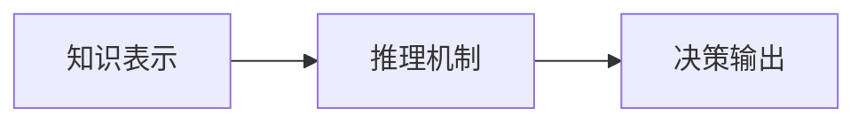
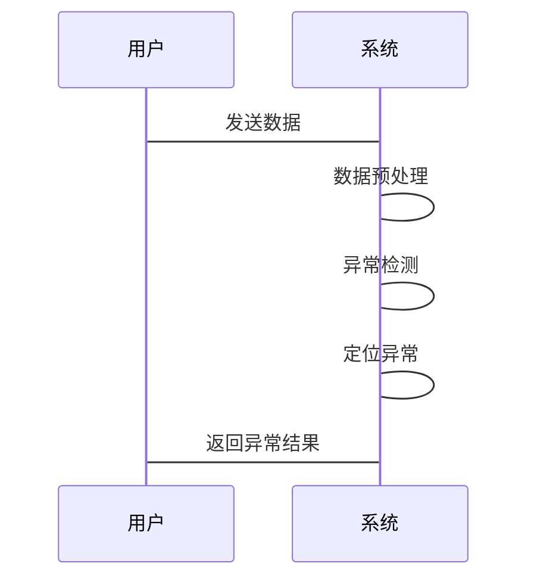
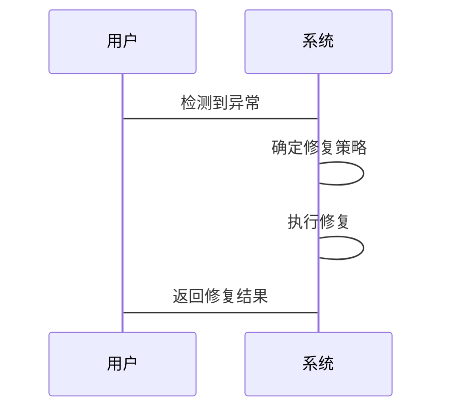

                 


# 构建具有自我诊断与修复能力的AI Agent

## 关键词：AI Agent，自我诊断，修复能力，异常检测，强化学习，系统架构

## 摘要：本文详细探讨了构建具有自我诊断与修复能力的AI Agent的技术细节。从基本概念到核心算法，从系统架构到项目实战，全面解析了如何设计和实现一个能够自我诊断问题并自动修复的AI Agent。通过本文，读者可以掌握AI Agent的核心原理、实现算法、系统设计和实际应用。

---

# 第一部分: 自我诊断与修复AI Agent的背景与概念

## 第1章: 自我诊断与修复AI Agent概述

### 1.1 AI Agent的基本概念
#### 1.1.1 AI Agent的定义与分类
AI Agent（人工智能代理）是指能够感知环境、自主决策并执行任务的智能体。根据功能不同，AI Agent可以分为任务型代理和反应型代理。

| 分类 | 定义 | 特点 |
|------|------|------|
| 任务型代理 | 基于目标和任务执行的代理 | 具备明确的目标，能够规划和执行复杂任务 |
| 反应型代理 | 基于实时感知和响应的代理 | 更注重实时反馈和动态环境中的适应能力 |

#### 1.1.2 自我诊断与修复能力的定义
自我诊断与修复能力是指AI Agent在运行过程中，能够主动识别自身或外部环境中的异常或故障，并采取相应措施进行修复的能力。

#### 1.1.3 自我诊断与修复AI Agent的必要性
在动态变化的环境中，AI Agent需要能够自我诊断问题并修复，以确保其长期稳定运行和高效性能。

### 1.2 自我诊断与修复AI Agent的核心要素
#### 1.2.1 知识表示与推理机制
知识表示是AI Agent理解世界的基础，推理机制则是基于知识进行决策的能力。



#### 1.2.2 异常检测与识别算法
异常检测是AI Agent自我诊断的关键步骤，能够识别系统中的异常行为或数据。

| 异常检测算法 | 优缺点 |
|--------------|--------|
| 基于统计的方法 | 简单，适合小规模数据，但对复杂场景不够敏感 |
| 基于机器学习的方法 | 高精度，适用于大规模数据，但需要大量训练数据 |

#### 1.2.3 自动修复策略与执行机制
自动修复策略是AI Agent在诊断出问题后，采取相应措施修复的能力。

### 1.3 自我诊断与修复AI Agent的应用场景
#### 1.3.1 智能助手与个人任务管理
AI Agent可以帮助用户管理日程、处理邮件等任务，并在出现问题时自动修复。

#### 1.3.2 自动化运维与系统监控
在运维和监控领域，AI Agent可以自动检测系统故障并修复，提升系统的稳定性。

#### 1.3.3 智慧城市与工业自动化
在智慧城市和工业自动化中，AI Agent可以实时监控设备状态，发现异常后自动修复。

### 1.4 自我诊断与修复能力的实现挑战
#### 1.4.1 异常检测的准确性问题
如何准确识别异常是AI Agent自我诊断的核心挑战。

#### 1.4.2 自动修复策略的可靠性问题
修复策略的可靠性直接影响AI Agent的稳定性和安全性。

#### 1.4.3 系统安全与隐私保护问题
自我诊断与修复过程中，如何确保系统安全和隐私保护是另一个重要问题。

### 1.5 本章小结
本章介绍了AI Agent的基本概念、自我诊断与修复能力的必要性，以及其实现的核心要素和应用场景。同时，也指出了实现过程中的主要挑战。

---

# 第二部分: 自我诊断与修复AI Agent的核心算法与实现

## 第2章: 自我诊断与修复机制的核心算法

### 2.1 基于强化学习的自适应优化算法
#### 2.1.1 强化学习的基本原理
强化学习是一种通过试错和奖励机制来优化决策的算法。

#### 2.1.2 自适应优化算法的数学模型
$$ V(s) = \max_a Q(s,a) $$

#### 2.1.3 算法实现步骤与代码示例
```python
class Agent:
    def __init__(self, state_space, action_space):
        self.state_space = state_space
        self.action_space = action_space
        self.Q = {}  # Q-learning table

    def act(self, state):
        # 选择动作
        if state not in self.Q:
            self.Q[state] = 0
        max_action = max(self.Q, key=lambda x: self.Q[x])
        return max_action

    def learn(self, state, action, reward, next_state):
        # 更新Q值
        self.Q[action] = self.Q.get(action, 0) + reward
```

### 2.2 基于异常检测的故障定位算法
#### 2.2.1 异常检测算法的分类
异常检测算法主要分为基于统计、基于机器学习和基于深度学习的三种方法。

#### 2.2.2 基于深度学习的异常检测模型
使用循环神经网络（RNN）进行异常检测。


#### 2.2.3 故障定位的实现流程
故障定位包括数据采集、异常检测、故障定位和修复策略生成四个步骤。

### 2.3 自动修复策略的实现算法
#### 2.3.1 基于规则的修复策略
根据预定义的规则进行修复。

#### 2.3.2 基于经验的修复策略
基于历史经验进行修复。

#### 2.3.3 基于预测的修复策略
根据预测结果进行修复。

### 2.4 算法的数学模型与公式
#### 2.4.1 强化学习的数学模型
$$ Q(s,a) = Q(s,a) + \alpha (r + \max Q(s',a') - Q(s,a)) $$

#### 2.4.2 异常检测的数学公式
$$ P(x|y) = \frac{P(y|x)P(x)}{P(y)} $$

### 2.5 算法的实现与优化
#### 2.5.1 算法实现的代码示例
```python
def anomaly_detection(data):
    # 数据预处理
    normalized_data = normalize(data)
    # 异常检测模型训练
    model = IsolationForest().fit(normalized_data)
    # 预测异常
    prediction = model.predict(normalized_data)
    return prediction
```

#### 2.5.2 算法优化的策略与技巧
优化策略包括数据预处理、模型调参和算法融合等。

### 2.6 本章小结
本章详细介绍了自我诊断与修复AI Agent的核心算法，包括强化学习和异常检测算法，并提供了实现步骤和代码示例。

---

# 第三部分: 自我诊断与修复AI Agent的系统架构与设计

## 第3章: 自我诊断与修复AI Agent的系统架构

### 3.1 系统整体架构设计
#### 3.1.1 模块划分与功能分配
系统分为知识表示与推理模块、异常检测模块和自动修复模块。

#### 3.1.2 系统架构的层次结构


#### 3.1.3 系统架构的可扩展性设计
系统架构设计注重模块化和可扩展性，便于后续功能的添加和优化。

### 3.2 系统功能设计
#### 3.2.1 知识表示与推理模块
知识表示采用本体论（Ontology）形式，推理基于逻辑推理和概率推理。

#### 3.2.2 异常检测与定位模块
异常检测基于深度学习模型，定位基于知识图谱。

#### 3.2.3 自动修复策略执行模块
修复策略基于规则和历史经验，执行基于远程调用或API。

### 3.3 系统架构的Mermaid图


### 3.4 系统接口设计
系统接口采用RESTful API设计，支持HTTP协议。

### 3.5 系统交互流程
#### 3.5.1 异常检测与定位流程


#### 3.5.2 自动修复流程


### 3.6 本章小结
本章详细介绍了自我诊断与修复AI Agent的系统架构设计，包括模块划分、功能设计和系统接口设计。

---

# 第四部分: 项目实战

## 第4章: 项目实战与案例分析

### 4.1 项目环境安装
安装必要的依赖库，如Python的scikit-learn、TensorFlow等。

### 4.2 系统核心实现
#### 4.2.1 知识表示与推理模块实现
基于知识图谱构建知识库，并实现推理功能。

#### 4.2.2 异常检测与定位模块实现
基于深度学习模型实现异常检测，并结合知识图谱进行定位。

#### 4.2.3 自动修复策略执行模块实现
实现基于规则和历史经验的修复策略，并通过API接口调用修复函数。

### 4.3 代码实现与解读
#### 4.3.1 异常检测代码示例
```python
import numpy as np
from sklearn.ensemble import IsolationForest

def anomaly_detection(data):
    model = IsolationForest(n_estimators=100, random_state=42)
    model.fit(data)
    prediction = model.predict(data)
    return prediction
```

#### 4.3.2 自动修复策略代码示例
```python
def auto_fix(data):
    fix_rules = {
        'rule1': '执行操作A',
        'rule2': '执行操作B'
    }
    prediction = anomaly_detection(data)
    if prediction == -1:
        for rule in fix_rules:
            if check_rule(rule, data):
                execute_fix(rule)
                break
```

### 4.4 实际案例分析
#### 4.4.1 案例背景介绍
假设一个智能助手系统，需要实现自我诊断与修复能力。

#### 4.4.2 系统实现与应用效果
通过实现自我诊断与修复功能，智能助手能够自动检测并修复运行中的异常问题。

#### 4.4.3 案例分析与经验总结
案例分析表明，自我诊断与修复能力能够显著提升系统的稳定性和用户体验。

### 4.5 本章小结
本章通过一个实际案例，详细介绍了自我诊断与修复AI Agent的实现过程和应用效果。

---

# 第五部分: 最佳实践与总结

## 第5章: 最佳实践与总结

### 5.1 最佳实践
#### 5.1.1 系统设计的注意事项
注重模块化设计和系统的可扩展性。

#### 5.1.2 算法实现的优化技巧
选择合适的算法和优化模型参数。

#### 5.1.3 系统安全与隐私保护
确保系统在自我诊断与修复过程中，数据的安全和隐私保护。

### 5.2 小结
构建具有自我诊断与修复能力的AI Agent是一个复杂但非常有价值的工作，需要结合多种技术手段，如知识表示、异常检测和自动修复策略。

### 5.3 注意事项
在实际应用中，需要注意系统的实时性和修复策略的可靠性。

### 5.4 拓展阅读
推荐阅读相关领域的书籍和论文，深入学习AI Agent和异常检测技术。

### 5.5 本章小结
本章总结了构建自我诊断与修复AI Agent的最佳实践，并提出了未来的研究方向。

---

# 附录

## 附录A: 术语表
列出本文中涉及的专业术语及其定义。

## 附录B: 参考文献
列出本文中引用的文献和资料。

---

# 结束语

通过本文的详细讲解，读者可以系统地了解构建具有自我诊断与修复能力的AI Agent的技术细节和实现方法。希望本文能为相关领域的研究和实践提供有价值的参考。

