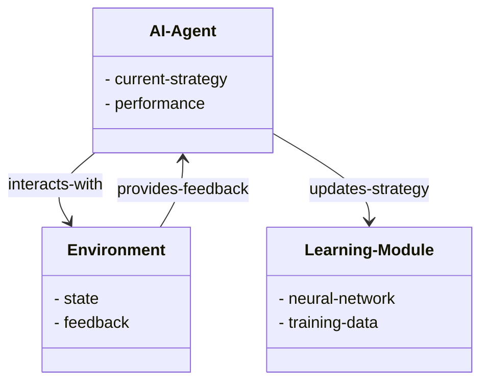
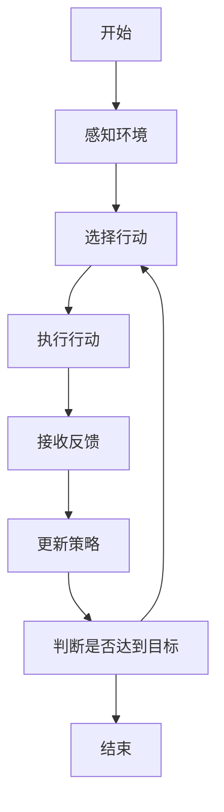

                 


# 构建具有自我进化能力的AI Agent

## 关键词：AI Agent，自我进化，机器学习，强化学习，系统架构，算法设计

## 摘要：  
随着人工智能技术的快速发展，构建具有自我进化能力的AI Agent已成为研究和应用的热点。本文将从背景、核心概念、算法原理、系统架构、项目实战到未来展望，详细探讨如何构建这样一个智能体。通过理论与实践结合，深入分析其技术实现和应用潜力，为读者提供全面的技术指导。

---

## 目录

# 构建具有自我进化能力的AI Agent

## 第1章：AI Agent概述

### 1.1 问题背景

#### 1.1.1 传统AI的局限性  
传统的AI系统（如基于规则的专家系统或简单的机器学习模型）在特定任务上表现出色，但缺乏灵活性和适应性。当环境或任务发生变化时，这些系统往往需要人工干预或重新训练，难以实现自主进化。

#### 1.1.2 自我进化能力的重要性  
自我进化能力使AI Agent能够在动态环境中自主适应和优化行为，无需外部干预。这种能力在复杂场景中尤为重要，例如实时策略调整、多变的市场需求或不可预测的环境变化。

#### 1.1.3 解决方法  
通过结合强化学习、进化算法和自适应控制理论，可以设计出一种能够自我优化的AI Agent，使其在与环境交互的过程中不断提升性能。

#### 1.1.4 边界与外延  
本文主要关注AI Agent的自我进化能力，不涉及其感知和决策的其他方面。同时，本文假设环境是动态但可预测的。

#### 1.1.5 概念结构与核心要素  
- **AI Agent**：能够感知环境并采取行动的智能体。  
- **自我进化**：通过与环境交互，优化自身行为的能力。  
- **动态适应**：在变化的环境中保持高性能的能力。  

### 1.2 核心概念

#### 1.2.1 AI Agent的定义  
AI Agent是一种能够感知环境、采取行动并优化行为的智能系统，其目标是在特定任务中实现最优或近似最优的表现。

#### 1.2.2 自我进化机制  
自我进化机制是指AI Agent通过与环境的交互，不断调整自身策略以提高性能的过程。

#### 1.2.3 核心特征对比

| 特征                | 基于规则的传统AI | 基于强化学习的AI Agent | 基于自我进化的AI Agent |
|---------------------|-------------------|-------------------------|--------------------------|
| 自主性              | 低               | 中                     | 高                       |
| 环境适应能力        | 低               | 高                     | 极高                    |
| 策略优化能力        | 无               | 有                     | 强                     |

#### 1.2.4 ER实体关系图  
以下是AI Agent与环境的实体关系图：

```mermaid
erDiagram
    class AI-Agent {
        id
        current-strategy
        performance
    }
    class Environment {
        id
        state
        feedback
    }
    AI-Agent --> Environment: interacts-with
    AI-Agent --> Environment: receives-feedback
```

---

## 第2章：核心概念与理论基础

### 2.1 自我进化机制

#### 2.1.1 监督学习  
监督学习是一种通过标注数据训练模型的方法，常用于分类和回归任务。然而，它在动态环境中缺乏适应性。

#### 2.1.2 强化学习  
强化学习通过智能体与环境的交互，学习最优策略。它是实现自我进化的重要工具。

#### 2.1.3 进化算法  
进化算法（如遗传算法）通过模拟生物进化过程，寻找问题的最优解。它可以与强化学习结合，形成更强大的优化能力。

### 2.2 算法模型

#### 2.2.1 基于神经网络的模型  
神经网络是实现自我进化AI Agent的核心工具。常用的模型包括深度强化学习（DRL）和进化策略（Evolution Strategies）。

#### 2.2.2 进化算法  
进化算法通过变异、选择和交叉操作，不断优化策略参数。例如，遗传算法（GA）和进化策略（ES）。

### 2.3 学习方法

#### 2.3.1 监督学习与强化学习的结合  
通过将监督学习作为初始训练阶段，强化学习作为优化阶段，可以提高AI Agent的效率。

#### 2.3.2 迁移学习的应用  
迁移学习允许AI Agent将已掌握的任务经验迁移到新任务中，从而加速进化过程。

---

## 第3章：系统架构设计

### 3.1 系统模块设计

#### 3.1.1 感知模块  
感知模块负责收集环境信息，例如传感器数据或用户输入。

#### 3.1.2 决策模块  
决策模块基于感知信息，选择最优行动。

### 3.2 接口设计

#### 3.2.1 输入输出接口  
定义AI Agent与环境交互的接口，例如API或消息队列。

#### 3.2.2 跨平台支持  
设计跨平台的接口，以便AI Agent在不同环境中运行。

### 3.3 系统架构图



---

## 第4章：算法原理

### 4.1 算法流程图



### 4.2 数学模型

#### 4.2.1 强化学习目标函数  
$$ J = E_{\tau \sim \pi} [R(\tau)] $$  
其中，$\tau$是轨迹，$R(\tau)$是轨迹的回报。

#### 4.2.2 进化策略更新  
$$ \theta_{t+1} = \theta_t + \sigma \cdot \nabla J $$  
其中，$\theta$是参数，$\sigma$是步长。

### 4.3 代码实现

```python
import numpy as np

class AI-Agent:
    def __init__(self, parameters):
        self.parameters = parameters
        self.strategy = self.initialize_strategy()

    def perceive_environment(self, environment):
        # 返回环境感知结果
        pass

    def choose_action(self, perception):
        # 基于感知选择行动
        pass

    def update_strategy(self, feedback):
        # 更新策略参数
        pass

def main():
    agent = AI-Agent(initial_parameters)
    environment = Environment()
    while True:
        perception = agent.perceive_environment(environment)
        action = agent.choose_action(perception)
        feedback = environment.provide_feedback(action)
        agent.update_strategy(feedback)

if __name__ == "__main__":
    main()
```

---

## 第5章：系统实现与测试

### 5.1 环境安装

#### 5.1.1 安装Python
```bash
python --version
pip install --upgrade pip
```

#### 5.1.2 安装依赖库
```bash
pip install numpy matplotlib
```

### 5.2 核心代码实现

#### 5.2.1 感知模块代码
```python
def perceive_environment(environment):
    # 返回环境感知结果
    return environment.state
```

#### 5.2.2 决策模块代码
```python
def choose_action(perception):
    # 基于感知选择行动
    return np.random.choice([0, 1], p=[0.5, 0.5])
```

### 5.3 系统测试

#### 5.3.1 功能测试
验证AI Agent是否能根据环境反馈调整策略。

#### 5.3.2 性能测试
评估AI Agent在不同环境下的表现。

---

## 第6章：高级主题与未来展望

### 6.1 技术挑战

#### 6.1.1 模型的泛化能力  
如何在不同环境中保持高性能。

#### 6.1.2 计算资源需求  
高计算需求可能限制AI Agent的应用场景。

### 6.2 未来发展方向

#### 6.2.1 更高效的算法  
研究更高效的强化学习和进化算法。

#### 6.2.2 更广泛的应用场景  
将AI Agent应用于更多领域，如自动驾驶和医疗诊断。

### 6.3 对社会的影响

#### 6.3.1 正面影响  
提高效率，改善生活质量。

#### 6.3.2 潜在风险  
可能引发伦理和隐私问题。

---

## 总结

构建具有自我进化能力的AI Agent是一项复杂的系统工程，涉及算法设计、系统架构和项目实现等多个方面。通过本文的详细讲解，读者可以掌握构建此类AI Agent的核心技术和方法，为未来的实践打下坚实基础。

