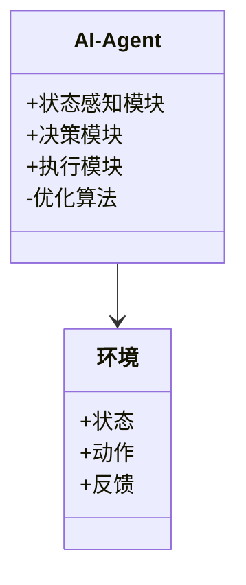
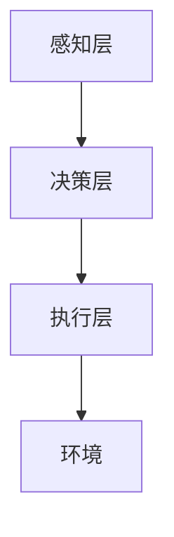

                 


# 构建具有自我进化能力的AI Agent系统

## 关键词：AI Agent，自我进化，强化学习，自适应系统，系统架构

## 摘要：本文详细探讨了构建具有自我进化能力的AI Agent系统的各个方面，从基本概念到算法原理，再到系统架构和实际案例分析，旨在帮助读者全面理解并掌握构建此类系统的技能。

---

## 第一部分: 构建具有自我进化能力的AI Agent系统概述

### 第1章: AI Agent与自我进化能力概述

#### 1.1 AI Agent的基本概念

##### 1.1.1 AI Agent的定义与特点

AI Agent（人工智能代理）是指能够感知环境、自主决策并执行任务的智能实体。AI Agent可以是软件程序、机器人或其他智能系统，其核心目标是通过感知和行动来优化特定目标的实现。

**特点：**
- **自主性**：能够在没有外部干预的情况下自主运行。
- **反应性**：能够实时感知环境并做出反应。
- **目标导向**：所有行为都以实现特定目标为导向。
- **学习能力**：能够通过经验改进性能。

##### 1.1.2 自我进化能力的定义

自我进化能力是指AI Agent能够通过不断学习和适应，持续优化自身性能和行为的能力。这种能力使AI Agent能够在动态变化的环境中保持高效运作。

**核心特征：**
- **自主学习**：无需外部指导，自主进行学习和优化。
- **动态适应**：能够根据环境变化调整策略和行为。
- **持续改进**：通过反馈不断优化自身性能。

##### 1.1.3 自我进化AI Agent的应用场景

自我进化AI Agent广泛应用于多个领域，如自动驾驶、智能助手、机器人控制、金融交易等。例如，在金融领域，AI Agent可以通过自我学习和优化，提升交易策略的盈利能力。

---

#### 1.2 自我进化AI Agent的核心价值

##### 1.2.1 提高系统适应性

自我进化能力使AI Agent能够快速适应环境变化，确保系统在不同条件下的高效运作。

##### 1.2.2 实现自主学习与优化

通过自主学习，AI Agent能够不断优化自身的算法和策略，提升整体性能。

##### 1.2.3 降低人工干预成本

自我进化能力减少了对人工干预的需求，降低了维护和管理成本。

---

#### 1.3 本章小结

本章介绍了AI Agent的基本概念及其自我进化能力的定义和应用场景。通过理解这些内容，读者可以明确自我进化AI Agent的核心价值和重要性。

---

## 第二部分: 自我进化AI Agent的核心概念与原理

### 第2章: 自我进化机制的原理与实现

#### 2.1 自我进化机制的核心原理

##### 2.1.1 基于强化学习的进化算法

强化学习是一种通过试错机制来优化决策模型的算法。AI Agent通过与环境交互，不断尝试不同的动作，并根据反馈（奖励或惩罚）来调整策略。

**数学模型：**
强化学习的目标是最大化累积奖励，数学表达式为：
$$ Q(s, a) = r + \gamma \max_{a'} Q(s', a') $$
其中，\( Q(s, a) \) 表示在状态 \( s \) 下执行动作 \( a \) 的价值，\( r \) 是即时奖励，\( \gamma \) 是折扣因子。

##### 2.1.2 基于反馈的自适应优化

自适应优化通过实时反馈调整模型参数，使AI Agent能够快速适应环境变化。这种机制通常采用梯度下降等优化算法。

**数学模型：**
自适应优化的数学模型可以表示为：
$$ \theta_{t+1} = \theta_t + \alpha \nabla_{\theta} J(\theta) $$
其中，\( \alpha \) 是学习率，\( \nabla_{\theta} J(\theta) \) 是目标函数 \( J \) 对参数 \( \theta \) 的梯度。

##### 2.1.3 基于知识表示的学习机制

知识表示是AI Agent理解和推理的基础。通过将知识表示为符号、图结构或其他形式，AI Agent能够进行逻辑推理和决策。

**示例：**
将知识表示为图结构，节点代表实体，边代表关系，例如：
- 节点：城市、道路
- 边：城市之间的交通连接

---

#### 2.2 自我进化机制的实现步骤

##### 2.2.1 状态感知与目标设定

AI Agent首先需要感知当前状态，并明确目标。例如，在自动驾驶中，AI Agent需要感知当前车辆的位置、速度、周围车辆等状态，并设定目标如“安全到达目的地”。

##### 2.2.2 动作选择与策略优化

基于感知的状态，AI Agent选择最优动作，并通过策略优化算法（如Q-learning）不断改进策略。

##### 2.2.3 反馈收集与模型更新

AI Agent根据执行动作后的反馈（奖励或惩罚）调整模型参数，优化未来决策。

---

#### 2.3 自我进化机制的数学模型

##### 2.3.1 强化学习的数学公式

强化学习的目标是找到最优策略 \( \pi \)，使得累积奖励最大化：
$$ J(\pi) = \mathbb{E}\left[\sum_{t=0}^{\infty} \gamma^t r_t \right] $$
其中，\( J(\pi) \) 是目标函数，\( \gamma \) 是折扣因子，\( r_t \) 是第 \( t \) 步的奖励。

##### 2.3.2 自适应优化的数学模型

自适应优化通过调整参数 \( \theta \) 来优化目标函数 \( J(\theta) \)，例如：
$$ \theta_{t+1} = \theta_t - \alpha \nabla_{\theta} J(\theta) $$
其中，\( \alpha \) 是学习率，\( \nabla_{\theta} J(\theta) \) 是目标函数的梯度。

---

#### 2.4 本章小结

本章详细讲解了自我进化机制的核心原理，包括强化学习、自适应优化和知识表示。通过数学公式和实例分析，读者可以理解这些机制如何共同作用，使AI Agent具备自我进化能力。

---

## 第三部分: 自我进化AI Agent的系统架构与设计

### 第3章: 自我进化AI Agent的系统架构

#### 3.1 系统架构的设计原则

##### 3.1.1 模块化设计

系统架构通常分为感知层、决策层和执行层，每个层包含不同的功能模块，如传感器、决策模块和执行器。

##### 3.1.2 高可用性设计

确保系统在部分模块故障时仍能正常运行，例如通过冗余设计或故障切换机制。

##### 3.1.3 可扩展性设计

系统架构应支持功能扩展和性能提升，例如通过增加新的传感器或优化算法。

---

#### 3.2 系统功能设计

##### 3.2.1 领域模型设计

领域模型是系统功能设计的基础，通常用类图表示。例如：



##### 3.2.2 系统架构设计

系统架构通常采用分层设计，例如：



---

#### 3.3 接口设计与交互流程

##### 3.3.1 系统接口设计

系统接口通常包括输入接口（感知环境）和输出接口（执行动作），例如：

- 输入接口：接收传感器数据
- 输出接口：发送控制命令

##### 3.3.2 交互流程设计

交互流程通常包括以下步骤：
1. 感知环境状态
2. 确定目标和动作
3. 执行动作并收集反馈
4. 优化策略

---

#### 3.4 本章小结

本章介绍了自我进化AI Agent的系统架构设计，包括模块化设计、领域模型和接口设计。通过mermaid图和流程图，读者可以清晰理解系统的结构和交互流程。

---

## 第四部分: 项目实战

### 第4章: 自我进化AI Agent的实现与案例分析

#### 4.1 项目介绍

本项目旨在实现一个具有自我进化能力的AI Agent，以智能交易系统为例。

#### 4.2 环境配置

##### 4.2.1 环境安装

需要安装以下工具和库：
- Python 3.8+
- TensorFlow 2.0+
- gym库
- matplotlib

##### 4.2.2 环境配置代码

```python
import gym
import numpy as np
import matplotlib.pyplot as plt

# 创建环境
env = gym.make('CartPole-v1')
env.seed(42)
```

---

#### 4.3 核心代码实现

##### 4.3.1 强化学习算法实现

```python
class AI-Agent:
    def __init__(self, state_space, action_space):
        self.state_space = state_space
        self.action_space = action_space
        # 初始化Q表
        self.q_table = np.zeros([state_space, action_space])
        self.learning_rate = 0.1
        self.discount_factor = 0.9

    def choose_action(self, state):
        if np.random.random() < 0.9:
            return np.argmax(self.q_table[state])
        else:
            return np.random.randint(self.action_space)

    def update_q_table(self, current_state, action, reward, next_state):
        self.q_table[current_state][action] += self.learning_rate * (reward + self.discount_factor * np.max(self.q_table[next_state]) - self.q_table[current_state][action])

# 初始化AI-Agent
agent = AI-Agent(env.observation_space.shape[0], env.action_space.n)

# 训练过程
for episode in range(1000):
    state = env.reset()
    total_reward = 0
    while True:
        action = agent.choose_action(state)
        next_state, reward, done, _ = env.step(action)
        agent.update_q_table(state, action, reward, next_state)
        total_reward += reward
        state = next_state
        if done:
            break
    print(f"Episode {episode}, Total Reward: {total_reward}")
```

##### 4.3.2 系统功能解读

上述代码实现了Q-learning算法，AI-Agent通过与环境交互，不断更新Q表，优化策略。

---

#### 4.4 实际案例分析

##### 4.4.1 案例介绍

以智能交易系统为例，AI-Agent通过自我进化，优化交易策略，提高盈利能力。

##### 4.4.2 案例分析

在智能交易系统中，AI-Agent需要感知市场数据，选择最优交易动作，并根据反馈优化策略。

---

#### 4.5 本章小结

本章通过实际案例分析，展示了自我进化AI Agent的实现过程和应用场景，帮助读者更好地理解理论知识。

---

## 第五部分: 最佳实践与总结

### 第5章: 自我进化AI Agent的优化与扩展

#### 5.1 优化策略

##### 5.1.1 算法优化

通过改进算法（如使用更深的神经网络）提高性能。

##### 5.1.2 参数调优

根据实际场景调整学习率、折扣因子等参数。

##### 5.1.3 并行计算

利用并行计算加速训练过程。

---

#### 5.2 注意事项

##### 5.2.1 系统安全性

确保系统具备安全防护机制，防止被攻击或滥用。

##### 5.2.2 数据隐私

保护用户数据隐私，遵守相关法律法规。

##### 5.2.3 系统监控

实时监控系统运行状态，及时发现并解决问题。

---

#### 5.3 未来发展趋势

##### 5.3.1 多智能体协作

未来的AI Agent将更加注重多智能体协作，提升整体系统性能。

##### 5.3.2 更强的自适应能力

通过更先进的算法，如元学习和迁移学习，提升AI Agent的自适应能力。

##### 5.3.3 跨领域应用

AI Agent将在更多领域（如医疗、教育等）发挥重要作用。

---

#### 5.4 拓展阅读

建议读者进一步阅读以下书籍和论文：
- 《强化学习入门：基于Python的算法实现》
- "Deep Reinforcement Learning: An Overview" by DeepMind

---

### 第6章: 总结与展望

#### 6.1 本章总结

本文详细探讨了构建具有自我进化能力的AI Agent系统的各个方面，从基本概念到算法实现，再到系统架构和实际案例分析，帮助读者全面理解并掌握相关知识。

#### 6.2 未来展望

随着人工智能技术的不断发展，自我进化AI Agent将在更多领域得到广泛应用，为人类社会带来更大的价值。

---

## 结语

通过本文的学习，读者可以深入了解自我进化AI Agent的核心概念、算法原理和系统架构，并通过实际案例分析掌握其实现方法。希望本文能为读者在构建自我进化AI Agent系统的过程中提供有价值的指导和启发。

