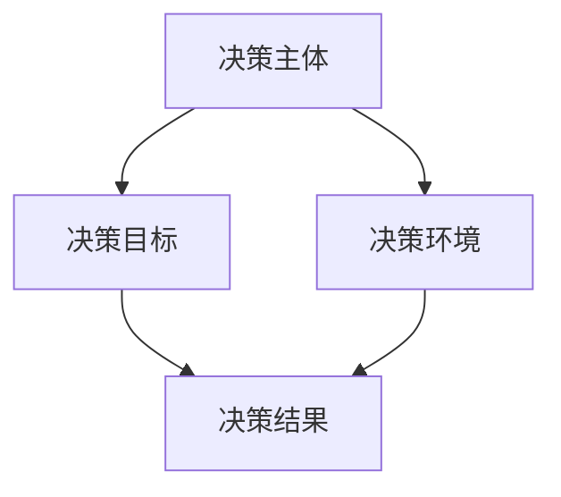
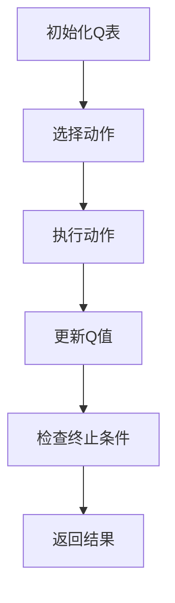
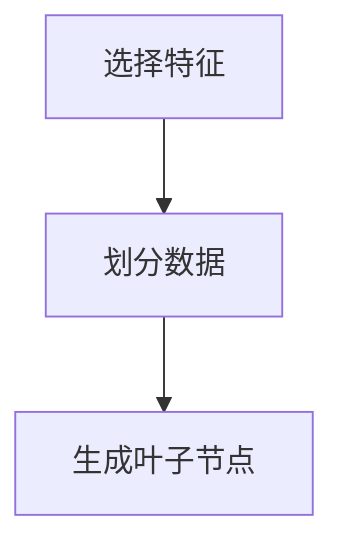
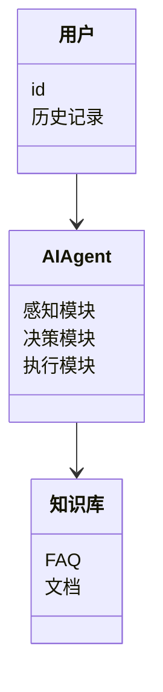
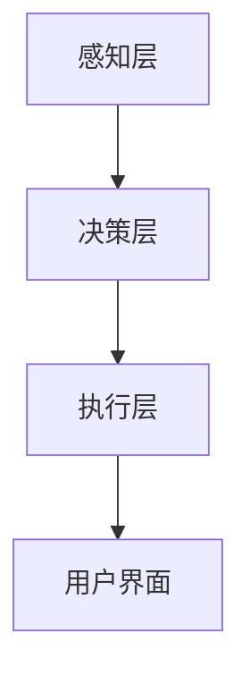
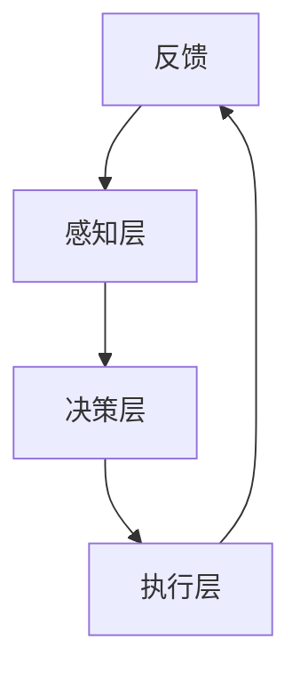

                 


# 《构建具有自适应决策能力的AI Agent》

---

## 关键词：
- AI Agent
- 自适应决策
- 强化学习
- 系统架构
- 决策算法
- 实践案例

---

## 摘要：
本文将详细探讨如何构建一个具有自适应决策能力的AI Agent。首先，我们将介绍AI Agent的基本概念和自适应决策的重要性，分析当前技术面临的挑战。接着，我们将深入讲解自适应决策的核心算法和数学模型，包括强化学习和决策树的实现原理。然后，通过系统架构设计和项目实战，展示如何将理论应用于实际场景中。最后，我们将总结最佳实践经验和未来的发展方向，为读者提供全面的指导和启示。

---

# 第1章: 自适应决策AI Agent的背景与概念

## 1.1 问题背景与挑战
### 1.1.1 AI Agent的基本概念
AI Agent是一种智能代理，能够感知环境并采取行动以实现目标。自适应决策能力使其能够根据环境变化调整行为，提高决策效率和准确性。

### 1.1.2 自适应决策的重要性
在动态复杂的环境中，自适应决策能力使AI Agent能够实时调整策略，适应新情况，从而提高系统的鲁棒性和灵活性。

### 1.1.3 当前技术的局限性与挑战
尽管AI Agent在许多领域取得了成功，但自适应决策仍面临数据不足、计算资源限制和环境不确定性等挑战。

## 1.2 问题描述与目标
### 1.2.1 自适应决策的核心问题
自适应决策的核心问题是如何在动态环境中实时调整决策策略，以最大化目标函数。

### 1.2.2 AI Agent的目标与功能
AI Agent的目标是通过感知环境、分析信息、制定策略和执行行动，实现预设目标。自适应决策是其实现智能的核心能力。

### 1.2.3 问题解决的边界与外延
自适应决策的边界包括环境变化的范围、决策的时间约束和资源限制。外延则涉及与其他AI技术的结合，如自然语言处理和计算机视觉。

## 1.3 核心概念与系统架构
### 1.3.1 AI Agent的组成要素
AI Agent通常由感知模块、推理模块、决策模块和执行模块组成，各模块协同工作以实现自适应决策。

### 1.3.2 自适应决策的实现机制
自适应决策通过实时感知环境变化，调整决策模型和策略，确保在不同环境下都能做出最优选择。

### 1.3.3 系统架构的初步设计
初步设计包括感知层、决策层和执行层，各层之间通过接口进行数据交互和控制。

## 1.4 本章小结
本章介绍了AI Agent的基本概念，分析了自适应决策的重要性，并讨论了当前技术的挑战和问题解决的边界。通过初步系统架构设计，为后续章节奠定了基础。

---

# 第2章: 自适应决策AI Agent的核心概念与联系

## 2.1 核心概念原理
### 2.1.1 自适应决策的数学模型
自适应决策的数学模型通常基于强化学习，通过状态、动作和奖励函数来优化策略。例如，Q-learning算法通过更新Q值函数来学习最优策略。

### 2.1.2 AI Agent的行为决策机制
AI Agent的行为决策机制包括感知环境、构建决策模型、选择行动和执行决策。强化学习是常用的决策机制之一。

### 2.1.3 知识表示与推理方法
知识表示通常采用语义网络或决策树，推理方法包括逻辑推理和概率推理，用于支持自适应决策。

## 2.2 核心概念属性特征对比
### 2.2.1 决策模型的特征对比
| 决策模型 | 强化学习 | 决策树 |
|----------|----------|--------|
| 输入     | 状态     | 特征   |
| 输出     | 动作     | 叶子节点 |
| 优缺点   | 高灵活性 | �易解释 |

### 2.2.2 不同算法的性能对比
| 算法     | 强化学习 | Q-learning | A/B测试 |
|----------|----------|------------|----------|
| 适用场景 | 动态环境 | 离散状态 | 离散选择 |

### 2.2.3 系统架构的优缺点分析
分层架构的优点是模块化和可扩展性，但可能导致通信开销增加。扁平架构的优点是响应速度快，但可能在复杂环境中难以管理。

## 2.3 ER实体关系图架构


## 2.4 本章小结
本章详细讲解了自适应决策的核心概念和实现机制，分析了不同算法和系统架构的优缺点，并通过表格和图表展示了核心概念之间的关系。

---

# 第3章: 自适应决策算法原理与数学模型

## 3.1 算法原理讲解
### 3.1.1 基于强化学习的决策算法
强化学习通过与环境互动，学习最优策略。Q-learning算法通过更新Q值函数来实现。

### 3.1.2 基于决策树的自适应算法
决策树通过特征选择构建树结构，支持快速决策。ID3算法基于信息增益进行特征选择。

## 3.2 数学模型与公式
### 3.2.1 强化学习的数学模型
状态价值函数：
$$ V(s) = \max_a Q(s,a) $$
Q值更新公式：
$$ Q(s,a) = Q(s,a) + \alpha [r + \max_{a'} Q(s',a') - Q(s,a)] $$

### 3.2.2 决策树的构建公式
信息增益计算：
$$ \text{GiniIndex} = \sum_{i=1}^{n} p_i(1-p_i) $$

## 3.3 算法实现与流程图
### 3.3.1 强化学习算法流程


### 3.3.2 决策树构建流程


## 3.4 本章小结
本章详细讲解了强化学习和决策树的算法原理，通过数学公式和流程图展示了算法实现过程。

---

# 第4章: 系统分析与架构设计

## 4.1 系统分析
### 4.1.1 项目场景介绍
假设我们正在开发一个智能客服系统，AI Agent需要根据用户问题实时调整回答策略。

### 4.1.2 系统功能设计
系统功能包括用户意图识别、知识库查询、自适应回答生成和用户反馈收集。

### 4.1.3 系统架构设计
分层架构包括感知层、决策层和执行层，各层之间通过API进行交互。

## 4.2 系统架构设计
### 4.2.1 领域模型设计


### 4.2.2 系统架构图


### 4.2.3 系统接口设计
接口包括用户输入接口、知识库查询接口和反馈收集接口。

### 4.2.4 系统交互流程图


## 4.3 本章小结
本章通过系统分析和架构设计，展示了如何将自适应决策AI Agent应用于实际场景，并通过类图和流程图详细描述了系统架构。

---

# 第5章: 项目实战

## 5.1 环境安装与配置
### 5.1.1 安装Python和必要的库
安装Python 3.8及以上版本，安装库如TensorFlow、scikit-learn和matplotlib。

### 5.1.2 安装开发环境
安装Jupyter Notebook或PyCharm作为开发环境。

## 5.2 核心代码实现
### 5.2.1 强化学习实现
```python
import numpy as np

class AI-Agent:
    def __init__(self, state_space, action_space):
        self.q_table = np.zeros((state_space, action_space))
    
    def choose_action(self, state):
        # 探索与利用策略
        if np.random.random() < 0.1:
            return np.random.randint(action_space)
        else:
            return np.argmax(self.q_table[state])
    
    def update_q_table(self, state, action, reward):
        self.q_table[state, action] += 0.1 * (reward + np.max(self.q_table[state]) - self.q_table[state, action])
```

### 5.2.2 决策树实现
```python
from sklearn.tree import DecisionTreeClassifier

class DecisionTreeAgent:
    def __init__(self):
        self.tree = DecisionTreeClassifier()
    
    def fit(self, X, y):
        self.tree.fit(X, y)
    
    def predict(self, X):
        return self.tree.predict(X)
```

## 5.3 案例分析与详细讲解
### 5.3.1 案例分析
以智能客服系统为例，AI Agent通过强化学习优化回答策略，提高用户满意度。

### 5.3.2 实际应用中的问题与解决
在实际应用中，数据不足时，可以采用迁移学习或生成对抗网络进行数据增强。

## 5.4 本章小结
本章通过项目实战，展示了如何在实际场景中实现自适应决策AI Agent，并提供了核心代码和案例分析。

---

# 第6章: 最佳实践与未来展望

## 6.1 最佳实践
### 6.1.1 开发经验总结
在开发过程中，建议使用分层架构，确保各模块的独立性和可扩展性。

### 6.1.2 注意事项
在实际应用中，需注意数据质量、算法选择和系统性能的优化。

### 6.1.3 经验技巧
定期更新模型，根据反馈调整策略，以保持系统的自适应能力。

## 6.2 未来展望
### 6.2.1 技术发展趋势
未来，自适应决策AI Agent将结合边缘计算和物联网技术，实现更高效的实时决策。

### 6.2.2 可能的研究方向
研究方向包括更高效的强化学习算法、多智能体协作和人机协作决策。

## 6.3 本章小结
本章总结了开发经验，提出了注意事项和经验技巧，并展望了未来的技术发展趋势。

---

# 结语
通过本文的详细讲解，读者可以全面了解自适应决策AI Agent的构建过程，从理论到实践，从算法到系统架构，为实际应用提供了宝贵的指导。未来，随着技术的发展，自适应决策AI Agent将在更多领域发挥重要作用。

--- 

# 参考文献
[此处列出相关的书籍、论文和技术文档]

