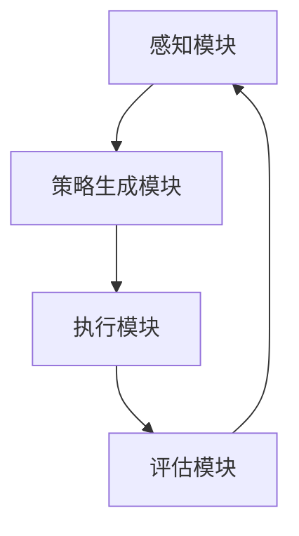
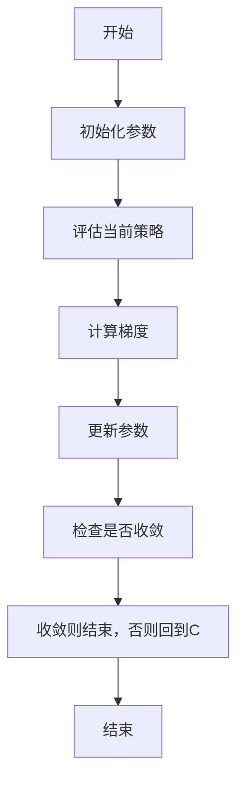
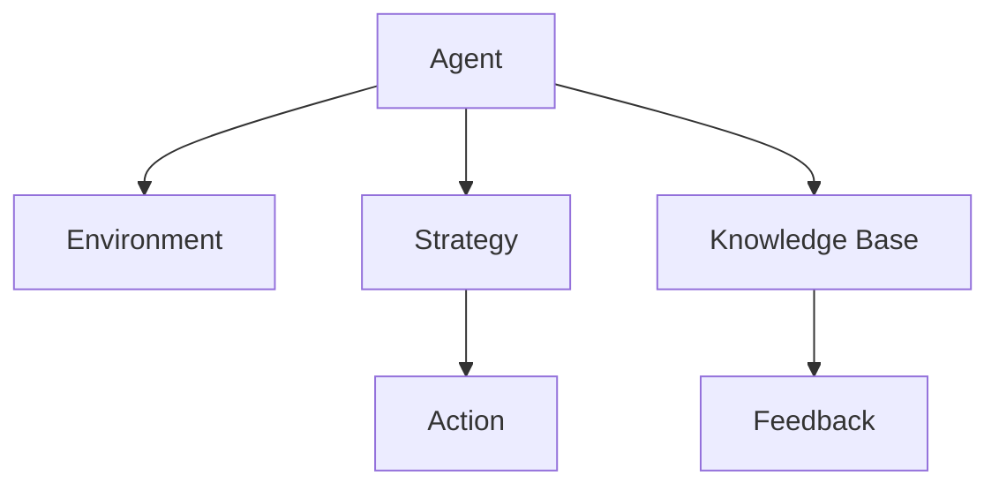
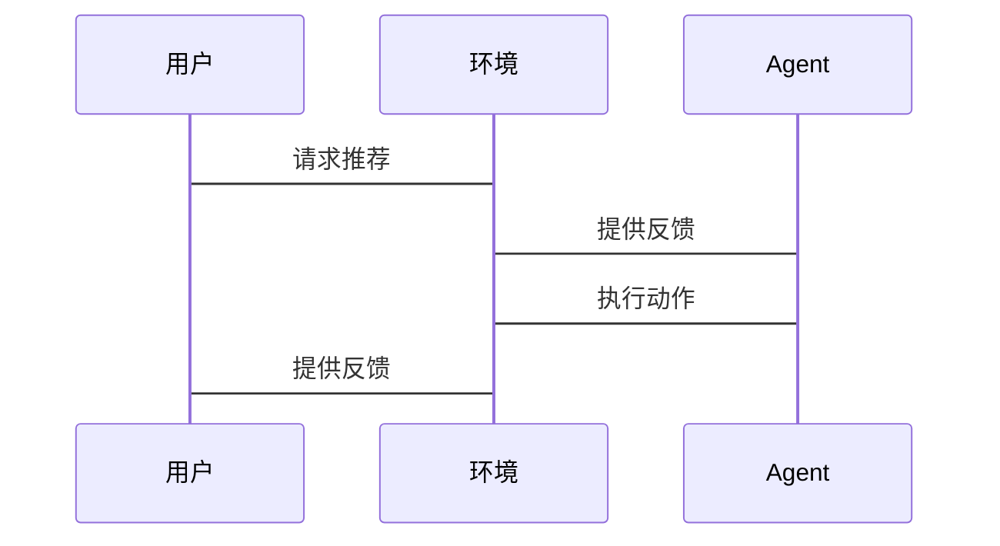

                 


# 构建具有自适应学习策略的AI Agent

> 关键词：AI Agent, 自适应学习策略, 算法原理, 系统架构, 项目实战

> 摘要：本文深入探讨了构建具有自适应学习策略的AI Agent的各个方面，从基本概念到算法实现，再到系统架构设计和实际项目案例分析。文章详细讲解了自适应学习策略的核心原理、系统架构、数学模型，并通过实际项目展示了如何实现和应用这些概念。通过本文，读者将能够系统地掌握构建自适应学习策略AI Agent的知识和技能。

---

## 第1章：自适应学习策略AI Agent的背景与概念

### 1.1 问题背景

#### 1.1.1 当前AI Agent的发展现状
AI Agent（人工智能代理）是一种能够感知环境并采取行动以实现目标的智能实体。随着机器学习和深度学习技术的快速发展，AI Agent的应用场景不断扩大，如自动驾驶、智能推荐系统、智能助手等。然而，现有的AI Agent在面对动态变化的环境时，往往缺乏灵活性和适应性，难以应对复杂多变的任务需求。

#### 1.1.2 自适应学习策略的需求与挑战
在实际应用中，AI Agent需要能够根据环境反馈和任务目标的变化，动态调整其学习策略。这种自适应能力不仅可以提高AI Agent的效率，还能增强其在复杂场景中的表现。然而，实现自适应学习策略面临以下挑战：
- **动态环境适应**：环境的变化可能导致原始策略失效，需要快速调整。
- **多目标优化**：在复杂任务中，可能存在多个目标，需要权衡和协调。
- **高效计算资源**：自适应学习需要实时处理大量数据，对计算资源提出了更高要求。

#### 1.1.3 自适应学习策略的核心问题描述
自适应学习策略的核心问题在于如何在动态环境中，根据反馈信息优化现有策略或生成新的策略。这需要结合强化学习、元学习（Meta-Learning）和在线学习等技术，构建一个灵活且高效的自适应学习框架。

---

### 1.2 问题解决

#### 1.2.1 自适应学习策略的定义
自适应学习策略是指AI Agent能够在动态环境中，根据反馈信息和任务目标的变化，动态调整其学习策略的能力。这种策略不仅能够适应环境的变化，还能通过反馈不断优化自身的决策过程。

#### 1.2.2 自适应学习策略的关键特征
自适应学习策略具有以下关键特征：
1. **动态调整**：能够根据环境反馈实时调整策略。
2. **目标导向**：策略调整以实现任务目标为导向。
3. **高效计算**：能够在有限的时间和资源内完成策略调整。
4. **多样性**：能够生成多样化的策略以应对不同的环境变化。

#### 1.2.3 自适应学习策略与传统策略的区别
与传统策略相比，自适应学习策略具有以下区别：

| 特性             | 传统策略             | 自适应学习策略       |
|------------------|----------------------|----------------------|
| 策略调整          | 静态或周期性调整       | 动态实时调整           |
| 环境适应能力      | 较低                 | 较高                 |
| 计算资源消耗      | 较低                 | 较高                 |
| 任务灵活性        | 较低                 | 较高                 |

---

### 1.3 概念结构与核心要素

#### 1.3.1 自适应学习策略的组成要素
自适应学习策略的构建涉及以下几个核心要素：
1. **感知模块**：负责收集环境中的反馈信息。
2. **策略生成模块**：根据反馈信息生成或调整策略。
3. **执行模块**：将生成的策略转化为具体行动。
4. **评估模块**：评估策略的执行效果，为后续调整提供依据。

#### 1.3.2 各要素之间的关系
上述各要素之间的关系可以通过以下流程图表示：



#### 1.3.3 自适应学习策略的边界与外延
自适应学习策略的核心在于动态调整能力，其外延可以扩展到强化学习、在线学习、元学习等领域。通过与其他学习方法的结合，可以进一步提升AI Agent的自适应能力。

---

## 第2章：自适应学习策略的核心原理

### 2.1 核心概念原理

#### 2.1.1 自适应学习策略的基本原理
自适应学习策略的基本原理是基于强化学习和在线学习的思想，通过实时收集反馈信息，动态调整策略参数。具体来说，AI Agent在执行当前策略时，会收集环境反馈，并利用这些反馈信息更新策略参数，以优化未来行动。

#### 2.1.2 自适应学习策略的核心算法
自适应学习策略的核心算法可以是基于梯度的优化算法，如Adam优化器。通过梯度下降方法，AI Agent能够根据反馈信息实时更新策略参数。

#### 2.1.3 自适应学习策略的实现机制
自适应学习策略的实现机制可以分为以下步骤：
1. **初始化**：设定初始策略参数。
2. **感知环境**：收集环境反馈。
3. **策略评估**：评估当前策略的效果。
4. **策略更新**：根据评估结果更新策略参数。
5. **执行行动**：根据更新后的策略执行行动。

---

### 2.2 核心概念属性特征对比

| 特性             | 策略评估             | 策略更新             |
|------------------|----------------------|----------------------|
| 输入             | 反馈信息             | 反馈信息             |
| 输出             | 策略评估结果         | 策略更新参数         |
| 实现方法         | 基于强化学习的评估    | 基于梯度优化的更新    |

---

### 2.3 ER实体关系图

```mermaid
er
actor: 用户
agent: AI Agent
strategy: 学习策略
environment: 环境
goal: 目标
knowledge: 知识库
action: 行动
feedback: 反馈
```

---

## 第3章：自适应学习策略的算法实现

### 3.1 算法原理

#### 3.1.1 策略评估与更新的数学模型
策略评估的目标是计算当前策略的期望值，而策略更新的目标是根据评估结果调整策略参数。数学模型可以表示为：

$$
Q(s, a) = r + \gamma \max_{a'} Q(s', a')
$$

其中，\( Q(s, a) \) 表示状态 \( s \) 下动作 \( a \) 的期望值，\( r \) 是奖励，\( \gamma \) 是折扣因子。

#### 3.1.2 策略选择与优化的算法流程
策略选择与优化的算法流程可以通过以下流程图表示：



---

### 3.2 算法实现

#### 3.2.1 算法代码示例
以下是基于Python的自适应学习策略实现示例代码：

```python
import numpy as np

class AdaptiveLearningAgent:
    def __init__(self, state_space, action_space, learning_rate=0.01):
        self.state_space = state_space
        self.action_space = action_space
        self.learning_rate = learning_rate
        self.parameters = np.random.randn(state_space, action_space)

    def感知环境(self, state):
        return self.parameters[state]

    def 评估策略(self, state, action, reward, next_state):
        current_value = self.parameters[state][action]
        next_value = np.max(self.parameters[next_state])
        td_error = reward + 0.99 * next_value - current_value
        self.parameters[state][action] += self.learning_rate * td_error
        return current_value, next_value

    def 执行行动(self, state):
        return np.argmax(self.parameters[state])
```

---

### 3.3 数学模型与公式

#### 3.3.1 策略评估的数学模型
策略评估的数学模型可以表示为：

$$
Q_{\text{new}}(s, a) = Q_{\text{old}}(s, a) + \alpha (r + \gamma Q_{\text{old}}(s', a') - Q_{\text{old}}(s, a))
$$

其中，\( \alpha \) 是学习率，\( \gamma \) 是折扣因子。

---

## 第4章：系统分析与架构设计

### 4.1 系统分析

#### 4.1.1 项目场景介绍
本项目旨在构建一个能够在动态环境中自适应调整策略的AI Agent，应用于智能推荐系统中。通过实时收集用户反馈，AI Agent能够动态调整推荐策略，提高推荐的准确性和用户的满意度。

---

### 4.2 系统功能设计

#### 4.2.1 领域模型类图
以下是领域模型的类图：

```mermaid
classDiagram
    class Agent:
        - state_space: 状态空间
        - action_space: 动作空间
        + perceive(state): 感知环境
        + evaluate(state, action, reward, next_state): 评估策略
        + execute(state): 执行动作

    class Environment:
        + get_feedback(action): 获取反馈
```

---

### 4.3 系统架构设计

#### 4.3.1 系统架构图
以下是系统架构图：



---

### 4.4 系统接口设计

#### 4.4.1 系统接口设计
以下是系统接口设计：

```plaintext
+-----------------------------------+
|           Agent                   |
|-----------------------------------|
| 输入：状态                          |
| 输出：动作                          |
|-----------------------------------|
+-----------------------------------+
```

---

### 4.5 系统交互流程

#### 4.5.1 系统交互流程图
以下是系统交互流程图：



---

## 第5章：项目实战

### 5.1 环境安装

#### 5.1.1 环境要求
- Python 3.6+
- NumPy
- Mermaid

---

### 5.2 系统核心实现

#### 5.2.1 核心代码实现
以下是自适应学习策略的核心代码实现：

```python
import numpy as np

class Agent:
    def __init__(self, state_space, action_space, learning_rate=0.01):
        self.state_space = state_space
        self.action_space = action_space
        self.learning_rate = learning_rate
        self.parameters = np.random.randn(state_space, action_space)

    def perceive(self, state):
        return self.parameters[state]

    def evaluate(self, state, action, reward, next_state):
        current_value = self.parameters[state][action]
        next_value = np.max(self.parameters[next_state])
        td_error = reward + 0.99 * next_value - current_value
        self.parameters[state][action] += self.learning_rate * td_error
        return current_value, next_value

    def execute(self, state):
        return np.argmax(self.parameters[state])
```

---

### 5.3 项目案例分析

#### 5.3.1 应用场景分析
以智能推荐系统为例，假设用户对推荐内容的反馈为1（喜欢）或0（不喜欢）。AI Agent需要根据用户的反馈动态调整推荐策略，以提高推荐的准确性和用户的满意度。

#### 5.3.2 项目实现分析
通过上述代码实现，AI Agent能够根据用户的反馈实时调整推荐策略，从而提高推荐系统的性能。

---

## 第6章：最佳实践与未来展望

### 6.1 最佳实践 tips
1. 在实际应用中，建议结合具体业务需求，对自适应学习策略进行调整和优化。
2. 在实现过程中，需要注意计算资源的合理分配，以确保实时性要求。
3. 可以尝试结合其他技术，如强化学习和在线学习，进一步提升自适应能力。

---

### 6.2 小结
本文详细讲解了构建具有自适应学习策略的AI Agent的各个方面，从基本概念到算法实现，再到系统架构设计和实际项目案例分析。通过本文的学习，读者可以系统地掌握构建自适应学习策略AI Agent的知识和技能。

---

### 6.3 注意事项
- 在实际应用中，需要注意计算资源的合理分配，以确保实时性要求。
- 需要结合具体业务需求，对自适应学习策略进行调整和优化。

---

### 6.4 拓展阅读
- 《Reinforcement Learning: Theory and Algorithms》
- 《Meta-Learning: A Survey》

---

## 结语
通过本文的系统讲解，读者可以全面了解构建具有自适应学习策略的AI Agent的核心原理和实现方法。未来，随着技术的不断发展，自适应学习策略的应用场景将更加广泛，AI Agent的能力也将不断提升，为人类社会的发展带来更多可能性。

