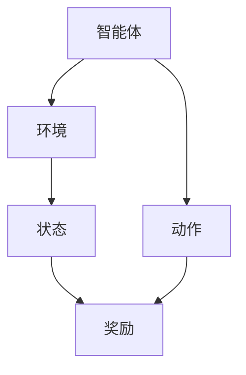
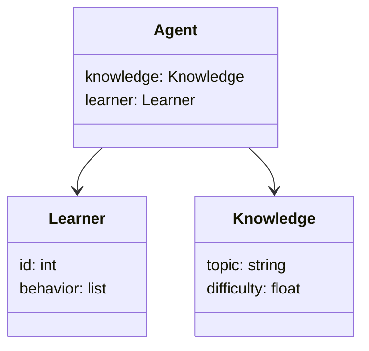
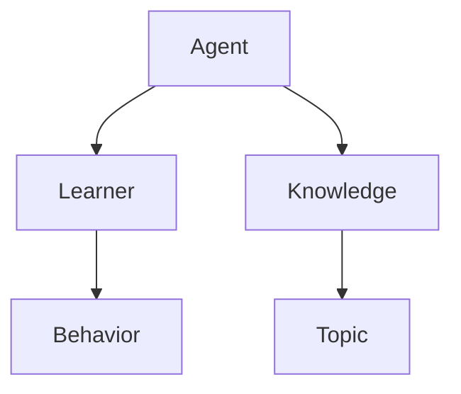

                 


# 构建具有自适应学习能力的AI Agent

## 关键词：AI Agent, 自适应学习, 机器学习, 强化学习, 系统架构, 技术博客

## 摘要：  
本文详细探讨了构建具有自适应学习能力的AI Agent的理论基础、算法原理、系统架构以及实际应用。通过背景介绍、核心概念解析、算法流程图展示、系统架构设计和项目实战分析，帮助读者全面理解如何设计和实现一个能够根据环境变化和用户需求动态调整的自适应学习AI Agent。文章内容涵盖从基础概念到实际应用的全过程，结合具体案例和代码实现，为技术开发者和研究人员提供了有价值的参考。

---

# 第一部分: 自适应学习与AI Agent的背景与概念

## 第1章: 自适应学习与AI Agent概述

### 1.1 自适应学习的基本概念

自适应学习是一种基于数据驱动的动态学习方法，其核心在于能够根据学习者的个体特征、行为模式和环境变化，实时调整学习策略、内容和节奏。与传统的静态教学方法不同，自适应学习强调个性化和动态优化，旨在最大化学习效果和效率。

#### 1.1.1 自适应学习的定义  
自适应学习是一种通过分析学习者的行为、偏好和学习成果，动态调整学习内容、进度和教学策略的方法。它利用机器学习算法，实时优化学习路径，以满足不同学习者的需求。

#### 1.1.2 自适应学习的核心特征  
- **个性化**：根据学习者的个体特征（如学习风格、兴趣爱好）提供定制化内容。
- **动态调整**：实时监控学习过程，根据反馈动态优化学习计划。
- **数据驱动**：依赖于大量的学习数据和行为数据，通过算法进行分析和预测。

#### 1.1.3 自适应学习与传统学习方式的对比  

| 特性             | 传统学习           | 自适应学习         |
|------------------|------------------|------------------|
| 学习内容         | 固定              | 动态调整           |
| 学习节奏         | 统一              | 根据学习者情况调整 |
| 学习效果评估     | 事后评估          | 实时反馈           |
| 技术支持         | 人工              | 人工智能与大数据   |

---

### 1.2 AI Agent的基本概念

AI Agent（智能体）是指能够感知环境、做出决策并执行行动的智能系统。它广泛应用于教育、医疗、金融等领域，能够帮助用户完成复杂任务或提供决策支持。

#### 1.2.1 AI Agent的定义  
AI Agent是一种能够感知环境、理解用户需求，并通过智能决策和行动来实现目标的计算机系统。

#### 1.2.2 AI Agent的核心功能  
- **感知环境**：通过传感器或数据输入获取环境信息。
- **理解需求**：通过自然语言处理或数据分析，识别用户意图。
- **智能决策**：基于数据和算法，生成最优决策方案。
- **执行行动**：根据决策结果，执行具体操作或输出结果。

#### 1.2.3 AI Agent的分类与应用场景  

| 类型             | 描述                           | 应用场景                 |
|------------------|----------------------------|--------------------------|
| 简单反应型       | 基于当前输入做出即时反应       | 自动门、温度调节器         |
| 基于模型型       | 使用内部模型预测结果           | 交通控制系统             |
| 目标驱动型       | 根据目标选择最优行动           | 机器人导航、游戏AI         |
| 强化学习型       | 通过试错优化行为               | 游戏AI、自动驾驶           |

---

### 1.3 自适应学习与AI Agent的结合

自适应学习AI Agent是一种能够根据用户行为、环境变化和学习目标，动态调整学习策略和内容的智能系统。它结合了自适应学习的动态优化能力和AI Agent的智能决策能力，能够为用户提供个性化的学习体验。

#### 1.3.1 自适应学习在AI Agent中的作用  
自适应学习为AI Agent提供了动态调整的能力，使其能够根据用户反馈和环境变化优化决策过程。

#### 1.3.2 AI Agent实现自适应学习的必要性  
传统AI Agent的决策过程通常是静态的，无法根据动态变化的环境和用户需求进行调整。引入自适应学习能力后，AI Agent能够更好地应对复杂场景。

#### 1.3.3 自适应学习AI Agent的潜在价值  
- **提高学习效率**：通过动态调整学习内容和节奏，帮助学习者更快达到目标。
- **增强用户体验**：提供个性化服务，提升用户满意度和参与度。
- **扩展应用范围**：适用于教育、医疗、金融等多个领域。

---

## 第2章: 自适应学习与AI Agent的核心概念与联系

### 2.1 自适应学习的原理

自适应学习的实现依赖于数据驱动的动态调整机制。通过收集和分析学习者的行为数据，系统能够识别学习者的知识盲点和学习偏好，从而动态优化学习路径。

#### 2.1.1 数据驱动的自适应机制  
自适应学习系统通过收集学习者的行为数据（如点击次数、停留时间、答题正确率等），利用机器学习算法分析数据，生成个性化学习建议。

#### 2.1.2 知识表示与推理  
知识表示是自适应学习的核心技术之一。通过将知识转化为可计算的形式（如知识图谱），系统能够进行推理和关联分析，为学习者提供相关的内容推荐。

#### 2.1.3 动态调整策略  
动态调整策略是自适应学习的核心，通过实时反馈和预测模型，系统能够不断优化学习计划。

---

### 2.2 AI Agent的智能决策过程

AI Agent的智能决策过程包括状态感知、信息处理、行为选择和环境交互四个阶段。

#### 2.2.1 状态感知与信息处理  
AI Agent通过传感器或数据接口获取环境信息，并利用自然语言处理、计算机视觉等技术进行信息处理。

#### 2.2.2 行为选择与策略优化  
基于处理后的信息，AI Agent利用强化学习、决策树等算法选择最优行为，并动态优化策略。

#### 2.2.3 环境交互与反馈机制  
AI Agent执行选择的行为，并通过反馈机制不断优化决策模型。

---

### 2.3 自适应学习与AI Agent的系统架构

自适应学习AI Agent的系统架构包括数据采集模块、知识表示模块、决策模块和执行模块。

#### 2.3.1 系统组件构成  
- 数据采集模块：负责收集学习者的行为数据。
- 知识表示模块：将知识转化为可计算的形式。
- 决策模块：利用算法生成决策方案。
- 执行模块：根据决策结果执行具体操作。

#### 2.3.2 各组件之间的关系  
数据采集模块提供输入，知识表示模块进行知识建模，决策模块基于模型生成决策，执行模块负责执行决策并输出结果。

#### 2.3.3 系统的动态调整能力  
系统能够根据实时反馈动态调整决策策略，确保学习者的学习效果最大化。

---

## 第3章: 自适应学习AI Agent的算法原理

### 3.1 强化学习算法

强化学习是一种通过试错优化行为的算法，适用于动态环境下的决策问题。

#### 3.1.1 强化学习的定义  
强化学习是一种机器学习方法，通过智能体与环境的交互，逐步优化行为策略，以最大化累积奖励。

#### 3.1.2 强化学习的核心要素  
- **状态（State）**：环境的当前情况。
- **动作（Action）**：智能体的决策行为。
- **奖励（Reward）**：对智能体行为的反馈。
- **策略（Policy）**：决定智能体在状态下的动作选择。

#### 3.1.3 强化学习的流程图  



#### 3.1.4 强化学习的数学模型  

强化学习的目标是通过优化策略函数 $\pi(a|s)$，最大化累积奖励：

$$ \text{目标} = \max_{\pi} \mathbb{E}[R] $$

其中，$R$ 是累积奖励，$\pi(a|s)$ 是策略函数，表示在状态 $s$ 下选择动作 $a$ 的概率。

---

### 3.2 自适应算法

自适应算法是一种能够根据数据动态调整模型参数的算法，适用于在线学习场景。

#### 3.2.1 自适应算法的定义  
自适应算法是一种能够根据输入数据动态调整模型参数的算法，适用于数据分布随时间变化的场景。

#### 3.2.2 自适应算法的核心步骤  
1. 初始化模型参数。
2. 输入训练数据。
3. 计算损失函数。
4. 更新模型参数。
5. 重复步骤2-4，直到收敛。

#### 3.2.3 自适应算法的Python实现  

```python
def adaptive_algorithm(X, y, learning_rate=0.1):
    # 初始化模型参数
    w = np.random.randn(X.shape[1])
    for epoch in range(epochs):
        # 前向传播
        y_pred = sigmoid(np.dot(X, w))
        # 计算损失
        loss = np.mean(-y * np.log(y_pred) - (1 - y) * np.log(1 - y_pred))
        # 反向传播
        dw = np.dot(X.T, (y_pred - y)) / X.shape[0]
        # 更新参数
        w -= learning_rate * dw
    return w
```

---

### 3.3 在线学习算法

在线学习是一种能够实时处理数据的算法，适用于动态环境下的自适应学习。

#### 3.3.1 在线学习的定义  
在线学习是一种实时处理数据的算法，能够在数据流的情况下动态调整模型。

#### 3.3.2 在线学习的核心优势  
- 实时性：能够快速响应数据变化。
- 自适应性：能够根据新数据动态优化模型。

#### 3.3.3 在线学习的Python实现  

```python
def online_learning(X, y, model):
    for x, label in zip(X, y):
        # 前向传播
        y_pred = model.predict(x)
        # 反向传播
        model.update_weights(x, label, y_pred)
```

---

## 第4章: 自适应学习AI Agent的系统架构设计

### 4.1 问题场景介绍

本节将介绍一个自适应学习AI Agent的实际应用场景：在线教育平台。

#### 4.1.1 问题描述  
在线教育平台需要根据学习者的行为数据，动态调整学习内容和节奏，以提高学习效果。

#### 4.1.2 问题解决  
通过自适应学习AI Agent，系统能够实时分析学习者的行为数据，动态优化学习路径。

---

### 4.2 系统功能设计

系统功能设计包括数据采集、知识表示、决策优化和结果输出四个模块。

#### 4.2.1 领域模型类图  



#### 4.2.2 系统架构图  



---

### 4.3 系统接口设计

系统接口设计包括数据接口、算法接口和用户接口。

#### 4.3.1 数据接口  
- 数据采集模块：负责收集学习者的行为数据。
- 数据处理模块：对数据进行清洗和预处理。

#### 4.3.2 算法接口  
- 知识表示模块：将知识转化为可计算的形式。
- 决策模块：利用算法生成决策方案。

#### 4.3.3 用户接口  
- 用户界面：展示学习内容和学习建议。
- 反馈机制：收集用户反馈并优化系统。

---

## 第5章: 自适应学习AI Agent的项目实战

### 5.1 环境安装

本项目需要安装以下依赖：

- Python 3.8+
- NumPy
- Pandas
- scikit-learn
- Mermaid

安装命令：

```bash
pip install numpy pandas scikit-learn
```

---

### 5.2 核心代码实现

#### 5.2.1 数据预处理  

```python
import pandas as pd

# 读取数据
data = pd.read_csv('data.csv')

# 数据清洗
data.dropna(inplace=True)
```

#### 5.2.2 知识表示  

```python
from sklearn.feature_extraction.text import TfidfVectorizer

vectorizer = TfidfVectorizer()
X = vectorizer.fit_transform(data['content'])
```

#### 5.2.3 决策模块  

```python
from sklearn.naive_bayes import GaussianNB

model = GaussianNB()
model.fit(X.toarray(), data['label'])
```

---

### 5.3 代码解读与分析

#### 5.3.1 数据预处理  
数据预处理是自适应学习系统的基础，通过清洗和转换数据，确保模型能够正确处理输入。

#### 5.3.2 知识表示  
知识表示是自适应学习的核心技术，通过将知识转化为向量形式，系统能够进行推理和关联分析。

#### 5.3.3 决策模块  
决策模块是自适应学习AI Agent的核心，通过训练模型，系统能够根据输入数据生成决策方案。

---

### 5.4 实际案例分析

#### 5.4.1 案例描述  
假设我们有一个在线教育平台，需要根据学习者的行为数据，动态调整学习内容。

#### 5.4.2 案例分析  
通过分析学习者的行为数据，系统能够识别学习者的知识盲点，并动态优化学习路径。

---

## 第6章: 最佳实践与总结

### 6.1 小结

本文详细探讨了自适应学习AI Agent的理论基础、算法原理和系统架构，并通过实际案例分析展示了其应用价值。

---

### 6.2 注意事项

- 数据隐私：在处理用户数据时，必须遵守相关法律法规，保护用户隐私。
- 系统稳定性：确保系统的稳定性和容错性，避免因数据错误导致决策失误。
- 模型优化：定期更新和优化模型，确保系统的自适应能力。

---

### 6.3 拓展阅读

- 《强化学习入门》：深入理解强化学习的核心概念和算法。
- 《自适应学习系统设计》：学习如何设计和实现自适应学习系统。

---

通过本文的详细讲解，读者可以全面理解自适应学习AI Agent的核心技术，并能够将其应用于实际场景中。

