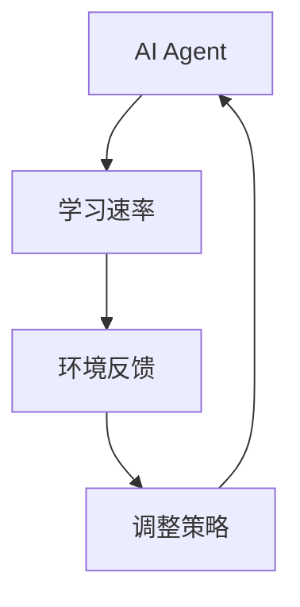
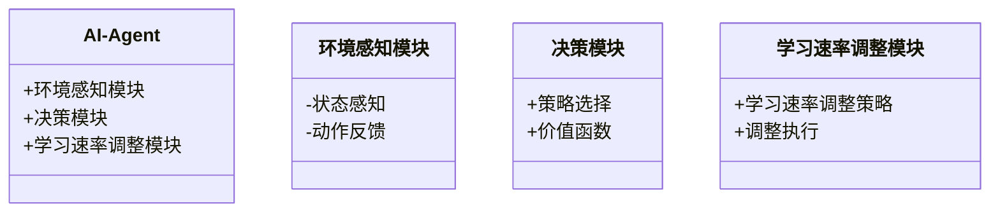
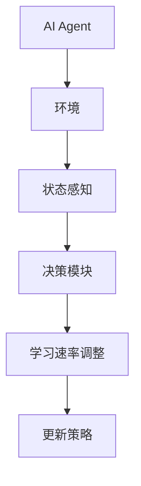
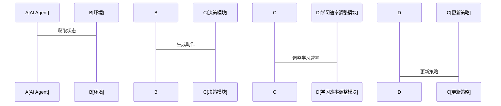

                 


# 构建具有自适应学习速率的AI Agent

> 关键词：AI Agent, 自适应学习速率, 强化学习, 动态规划, 系统架构

> 摘要：本文将详细探讨如何构建一个具有自适应学习速率的AI Agent。通过分析AI Agent的核心概念、自适应学习速率的实现原理、系统架构设计、项目实战以及最佳实践，为读者提供一个全面的构建指南。从理论到实践，逐步解析自适应学习速率AI Agent的实现细节，帮助读者深入理解并掌握相关技术。

---

# 第一部分: 自适应学习速率AI Agent的背景与概念

## 第1章: 自适应学习速率AI Agent的背景介绍

### 1.1 问题背景与问题描述

#### 1.1.1 传统AI Agent的局限性
传统的AI Agent通常采用固定的或预设的学习速率，这在某些场景下可能会导致收敛速度慢、训练不稳定或无法适应复杂动态环境的问题。例如，在强化学习中，固定学习速率可能导致在复杂任务中无法有效调整策略，从而影响性能。

#### 1.1.2 自适应学习速率的核心问题
自适应学习速率的核心问题在于如何动态调整学习速率，使其在不同阶段能够适应环境的变化，从而在训练过程中更快收敛并提高稳定性。这需要结合环境反馈和任务需求，设计合理的调整策略。

#### 1.1.3 问题解决的必要性与目标
解决自适应学习速率问题的必要性在于提高AI Agent的通用性和适应性，使其能够应对复杂的现实场景。目标是设计一种动态调整学习速率的机制，能够在不同环境下实现快速收敛和稳定训练。

### 1.2 问题的边界与外延

#### 1.2.1 自适应学习速率的定义域
自适应学习速率主要应用于强化学习和在线学习场景，适用于动态变化的环境和非静态任务目标。

#### 1.2.2 相关概念的对比与区分
- **固定学习速率**：适用于简单任务，但难以应对复杂场景。
- **自适应学习速率**：能够动态调整，适用于复杂动态环境。
- **元学习**：用于快速适应新任务，但与学习速率调整有所不同。

#### 1.2.3 问题的适用场景与限制
- 适用场景：动态环境、复杂任务、在线学习。
- 限制：需要额外的计算资源和设计复杂的调整策略。

### 1.3 核心概念与要素组成

#### 1.3.1 AI Agent的基本构成
AI Agent通常由感知层、决策层和执行层组成，其中决策层负责策略选择和优化。

#### 1.3.2 自适应学习速率的实现机制
自适应学习速率依赖于环境反馈，通过设计合理的调整策略动态更新学习速率。

#### 1.3.3 相关技术的关联性分析
- **强化学习**：提供动态调整的场景。
- **动态规划**：提供状态转移和价值函数的基础。
- **自适应算法**：提供动态调整的数学工具。

---

## 第2章: 自适应学习速率的核心概念与联系

### 2.1 核心概念原理

#### 2.1.1 自适应学习速率的基本原理
自适应学习速率通过动态调整学习速率，使得AI Agent能够在不同阶段更高效地优化策略。

#### 2.1.2 相关算法的比较与选择
- **Adam优化器**：结合动量和自适应学习速率，适合复杂任务。
- **Adagrad**：适用于稀疏数据，但可能收敛较慢。
- **RMSprop**：适合深度神经网络，但调整机制较简单。

### 2.2 核心概念属性特征对比表

| 特性                | 自适应学习速率         | 固定学习速率         |
|---------------------|-----------------------|----------------------|
| 调整机制            | 动态调整               | 静态固定             |
| 收敛速度            | 更快                   | 较慢                 |
| 稳定性              | 较高                   | 较低                 |
| 适用场景            | 动态环境、复杂任务     | 简单任务             |

### 2.3 ER实体关系图



---

# 第二部分: 自适应学习速率的算法原理

## 第3章: 自适应学习速率算法的数学模型与实现

### 3.1 算法原理

#### 3.1.1 自适应学习速率的核心公式
自适应学习速率的实现通常基于以下公式：
$$ \alpha_{t+1} = \alpha_t \cdot \frac{1}{1 + e^{-t}} $$

其中，$\alpha_t$ 表示第 $t$ 步的学习速率，$t$ 是时间步数。

#### 3.1.2 算法实现步骤
1. 初始化学习速率 $\alpha_0$ 和衰减系数。
2. 在每一步更新时，根据环境反馈调整学习速率。
3. 使用调整后的新学习速率更新模型参数。
4. 重复步骤2和3，直到达到终止条件。

### 3.2 数学模型与公式

#### 基本公式
$$ \text{学习速率} = \frac{1}{1 + e^{-t}} $$

#### 调整公式
$$ \alpha_{t+1} = \alpha_t \cdot \frac{1}{1 + e^{-t}} $$

### 3.3 代码实现

```python
import numpy as np

def adaptive_learning_rate(t, alpha_initial=0.1):
    return alpha_initial / (1 + np.exp(-t))

# 示例用法
alpha = adaptive_learning_rate(100)
print(alpha)
```

### 3.4 详细解释与举例说明

#### 3.4.1 代码实现的解释
- `adaptive_learning_rate` 函数根据时间步数 $t$ 动态调整学习速率，初始学习速率为 $\alpha_{\text{initial}}$。
- 输出结果为当前时间步的学习速率。

#### 3.4.2 示例
```python
print(adaptive_learning_rate(10))  # 输出较小值
print(adaptive_learning_rate(100))  # 输出接近初始值
```

---

## 第4章: 自适应学习速率的系统分析与架构设计

### 4.1 问题场景介绍

#### 4.1.1 AI Agent的场景描述
AI Agent需要在动态环境中进行实时决策，例如智能交易系统或自动驾驶。

### 4.2 系统功能设计

#### 4.2.1 系统组件与类图



### 4.3 系统架构设计

#### 4.3.1 系统架构图



### 4.4 接口设计与交互序列图

#### 4.4.1 接口设计

| 接口名称 | 输入 | 输出 |
|----------|------|------|
| update_parameters | 学习速率、梯度 | 更新后的参数 |

#### 4.4.2 交互序列图



---

## 第5章: 项目实战

### 5.1 环境安装与配置

#### 5.1.1 环境需求
- Python 3.8+
- NumPy
- Matplotlib
- Gym库

### 5.2 核心代码实现

#### 5.2.1 AI Agent实现

```python
class AI-Agent:
    def __init__(self, env):
        self.env = env
        self.learning_rate = initial_alpha
        self.t = 0

    def update_learning_rate(self):
        self.learning_rate = adaptive_learning_rate(self.t)

    def take_action(self):
        # 根据当前策略选择动作
        pass

    def update_policy(self):
        # 根据梯度更新策略
        pass
```

### 5.3 案例分析与实现解读

#### 5.3.1 实际案例：智能交易系统

```python
from gym import envs

env = envs.make('StockTrading-v0')
agent = AI-Agent(env)
agent.train()
```

### 5.4 项目小结

#### 5.4.1 项目总结
- 实现了一个具有自适应学习速率的AI Agent。
- 通过动态调整学习速率，提高了在动态环境中的适应能力。

---

## 第6章: 最佳实践、小结与展望

### 6.1 最佳实践 tips

#### 6.1.1 参数调整建议
- 初始学习速率建议根据任务特点进行调整。
- 衰减系数需要根据环境变化进行动态调整。

### 6.2 小结

#### 6.2.1 核心内容回顾
- 自适应学习速率的核心概念。
- 实现算法的数学模型和代码。
- 系统架构设计与项目实战经验。

### 6.3 注意事项

#### 6.3.1 实际应用中的注意事项
- 避免过度调整导致的振荡。
- 确保环境反馈的实时性和准确性。

### 6.4 拓展阅读

#### 6.4.1 相关领域推荐读物
- 《Reinforcement Learning: Theory and Algorithms》
- 《Adaptive Learning in Dynamic Environments》

---

# 结语

通过本文的详细讲解，读者可以系统地了解自适应学习速率AI Agent的构建过程，从理论到实践，逐步掌握相关技术。希望本文能够为读者在构建智能系统时提供有价值的参考和指导。

