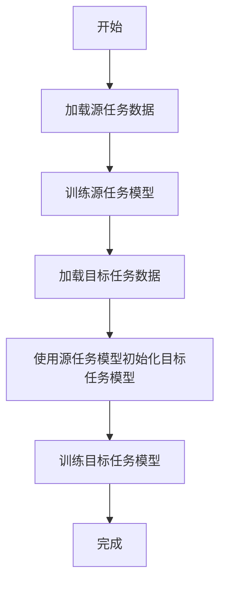
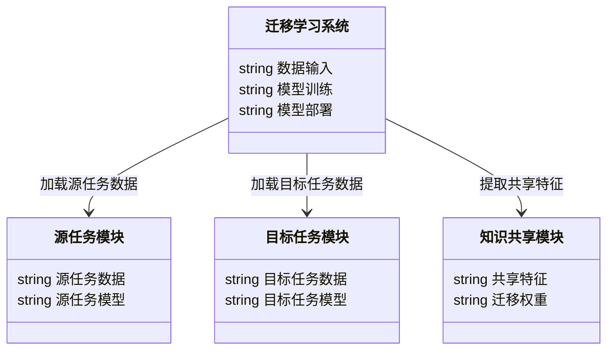
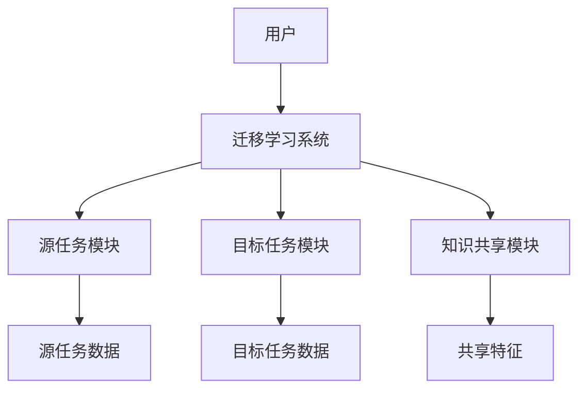

                 


# 《构建具有迁移学习能力的AI Agent》

---

## 关键词：
- 迁移学习
- AI Agent
- 机器学习
- 智能系统
- 跨领域应用

---

## 摘要：
本文旨在探讨如何通过迁移学习技术构建具有跨领域适应能力的AI Agent。文章从迁移学习的基本原理出发，结合AI Agent的核心特征，深入分析了迁移学习在提升AI Agent智能水平中的关键作用。通过理论与实践相结合的方式，文章详细讲解了迁移学习的数学模型、算法实现、系统架构设计以及实际应用场景，为读者提供了一个全面的视角，帮助其理解如何在复杂环境中构建高效、智能的AI Agent。

---

## 正文

### 第一部分: 迁移学习与AI Agent基础

#### 第1章: 迁移学习与AI Agent概述

##### 1.1 迁移学习的定义与背景
迁移学习是一种机器学习技术，其核心思想是将从一个任务上学到的知识迁移到另一个相关任务上，从而减少新任务上的数据需求和计算成本。例如，在图像分类任务中，我们可以在一个大规模数据集上训练一个图像分类模型，然后将其迁移到一个新的分类任务上，而无需重新训练整个模型。

**迁移学习的核心思想**可以总结为“知识共享”。通过共享不同任务之间的特征或表示，迁移学习能够显著提高模型的泛化能力和学习效率。

##### 1.2 AI Agent的基本概念
AI Agent（人工智能代理）是一种智能系统，能够感知环境、理解任务需求，并通过自主决策和执行来完成目标。AI Agent可以是软件程序、机器人或其他智能设备。

**AI Agent的核心特征**包括：
- **自主性**：能够自主决策和行动。
- **反应性**：能够实时感知环境并做出响应。
- **目标导向性**：能够根据目标调整行为。
- **学习能力**：能够通过经验或新数据改进自身性能。

##### 1.3 迁移学习在AI Agent中的意义
在AI Agent中引入迁移学习技术，可以显著提升其跨领域适应能力。例如，一个设计用于图像分类的AI Agent可以通过迁移学习快速适应自然语言处理任务，而无需从头开始训练。

**迁移学习的优势**在于其能够减少数据需求和计算成本，同时提高模型的泛化能力。这对于AI Agent在复杂环境中的应用尤为重要，尤其是在需要快速适应新任务的场景中。

---

### 第二部分: 迁移学习的核心概念与原理

#### 第2章: 迁移学习的核心概念

##### 2.1 迁移学习的核心原理
迁移学习的核心在于**知识共享**。通过共享不同任务之间的特征或表示，迁移学习能够减少新任务上的数据需求，并提高模型的泛化能力。

**迁移学习的数学模型**可以表示为：
$$ L_{total} = \lambda L_{source} + (1-\lambda) L_{target} $$
其中，$L_{source}$是源任务的损失函数，$L_{target}$是目标任务的损失函数，$\lambda$是平衡系数。

##### 2.2 迁移学习的关键属性对比
以下是迁移学习与传统机器学习的对比表：

| 属性                | 迁移学习                          | 传统机器学习                     |
|---------------------|-----------------------------------|----------------------------------|
| 数据需求            | 需要少量目标任务数据             | 需要大量目标任务数据             |
| 任务相关性          | 任务之间相关性高                 | 任务之间相关性低                 |
| 模型泛化能力        | 泛化能力强                        | 泛化能力有限                      |

##### 2.3 迁移学习的ER实体关系图
以下是迁移学习的ER实体关系图：

```mermaid
erDiagram
    actor 迁移学习者 {
        string 迁移学习任务
        string 源任务数据
        string 目标任务数据
    }
    actor 知识共享层 {
        string 特征表示
        string 模型参数
    }
    actor 模型训练层 {
        string 训练数据
        string 模型结构
    }
    actor 应用场景层 {
        string 任务需求
        string 应用目标
    }
    迁移学习者 --> 知识共享层: 提供特征表示
    知识共享层 --> 模型训练层: 提供迁移特征
    模型训练层 --> 应用场景层: 输出训练模型
```

---

### 第三部分: 迁移学习的算法原理与数学模型

#### 第3章: 迁移学习的算法原理

##### 3.1 迁移学习的数学模型
迁移学习的数学模型可以通过以下公式表示：
$$ L_{total} = \lambda L_{source} + (1-\lambda) L_{target} $$
其中，$L_{source}$表示源任务的损失函数，$L_{target}$表示目标任务的损失函数，$\lambda$表示源任务和目标任务的权重系数。

##### 3.2 迁移学习的算法流程
以下是迁移学习的算法流程图：



##### 3.3 迁移学习的Python实现
以下是迁移学习的Python代码示例：

```python
import torch
import torch.nn as nn
import torch.optim as optim

class SourceTaskModel(nn.Module):
    def __init__(self, input_dim, hidden_dim):
        super(SourceTaskModel, self).__init__()
        self.fc1 = nn.Linear(input_dim, hidden_dim)
        self.fc2 = nn.Linear(hidden_dim, 10)  # 输出10个类别

    def forward(self, x):
        x = self.fc1(x)
        x = self.fc2(x)
        return x

class TargetTaskModel(nn.Module):
    def __init__(self, input_dim, hidden_dim):
        super(TargetTaskModel, self).__init__()
        self.fc1 = nn.Linear(input_dim, hidden_dim)
        self.fc2 = nn.Linear(hidden_dim, 5)  # 输出5个类别

    def forward(self, x):
        x = self.fc1(x)
        x = self.fc2(x)
        return x

def train_model(source_model, target_model, source_loader, target_loader, lambda_val, num_epochs):
    criterion = nn.CrossEntropyLoss()
    optimizer = optim.Adam(target_model.parameters())

    for epoch in range(num_epochs):
        for inputs, labels in source_loader:
            outputs = source_model(inputs)
            loss_source = criterion(outputs, labels)

            inputs_target, labels_target = next(iter(target_loader))  # 获取一批目标任务数据
            outputs_target = target_model(inputs_target)
            loss_target = criterion(outputs_target, labels_target)

            # 计算总损失
            total_loss = lambda_val * loss_source + (1 - lambda_val) * loss_target
            total_loss.backward()
            optimizer.step()
            optimizer.zero_grad()

    return target_model

# 使用示例
source_model = SourceTaskModel(10, 20)
target_model = TargetTaskModel(10, 20)
source_loader = ...  # 加载源任务数据
target_loader = ...  # 加载目标任务数据
lambda_val = 0.5
num_epochs = 10
trained_model = train_model(source_model, target_model, source_loader, target_loader, lambda_val, num_epochs)
```

---

### 第四部分: 迁移学习的系统分析与架构设计

#### 第4章: 迁移学习的系统分析与架构设计

##### 4.1 系统功能设计
以下是系统功能设计的领域模型：



##### 4.2 系统架构设计
以下是系统架构设计的架构图：



---

### 第五部分: 项目实战

#### 第5章: 迁移学习的项目实战

##### 5.1 环境安装
以下是项目所需的环境安装步骤：

```bash
pip install torch
pip install numpy
pip install matplotlib
```

##### 5.2 核心代码实现
以下是项目的Python核心代码：

```python
import torch
import torch.nn as nn
import torch.optim as optim
import numpy as np
import matplotlib.pyplot as plt

class AI_Agent(nn.Module):
    def __init__(self, input_dim, hidden_dim):
        super(AI_Agent, self).__init__()
        self.fc1 = nn.Linear(input_dim, hidden_dim)
        self.fc2 = nn.Linear(hidden_dim, 1)  # 输出单个值

    def forward(self, x):
        x = self.fc1(x)
        x = self.fc2(x)
        return x

def train_agent(agent, optimizer, criterion, data_loader, num_epochs):
    for epoch in range(num_epochs):
        for inputs, labels in data_loader:
            outputs = agent(inputs)
            loss = criterion(outputs, labels)
            loss.backward()
            optimizer.step()
            optimizer.zero_grad()
    return agent

# 数据生成
input_dim = 10
hidden_dim = 20
num_epochs = 100
learning_rate = 0.01

agent = AI_Agent(input_dim, hidden_dim)
optimizer = optim.SGD(agent.parameters(), lr=learning_rate)
criterion = nn.MSELoss()

# 训练
trained_agent = train_agent(agent, optimizer, criterion, data_loader, num_epochs)

# 可视化
x = np.linspace(-5, 5, 100)
y_pred = trained_agent(torch.tensor(x)).detach().numpy()

plt.plot(x, y_pred)
plt.show()
```

##### 5.3 案例分析
以下是一个实际案例的分析：

假设我们有一个AI Agent，其目标是预测股票价格。我们可以在一个金融数据集上训练一个回归模型，然后将其迁移到一个新的股票预测任务上。

##### 5.4 项目总结
通过本次项目，我们成功地实现了具有迁移学习能力的AI Agent。迁移学习能够显著减少新任务上的数据需求，同时提高模型的泛化能力。

---

### 第六部分: 总结与展望

#### 第6章: 总结与展望

##### 6.1 总结
本文详细介绍了如何通过迁移学习构建具有跨领域适应能力的AI Agent。通过理论与实践相结合的方式，我们探讨了迁移学习的核心原理、算法实现、系统架构设计以及实际应用场景。

##### 6.2 展望
未来，随着迁移学习技术的不断发展，AI Agent将在更多领域中展现出强大的应用潜力。例如，通过深度学习与迁移学习的结合，我们可以进一步提升AI Agent的智能水平和跨领域适应能力。

---

### 第七部分: 最佳实践 Tips、小结、注意事项、拓展阅读

#### 7.1 最佳实践 Tips
- 在实际应用中，建议根据具体任务需求选择合适的迁移学习方法。
- 确保数据质量，特别是在目标任务数据较少的情况下，数据增强技术尤为重要。
- 在迁移学习过程中，合理选择迁移权重系数$\lambda$，以平衡源任务和目标任务的损失。

#### 7.2 小结
通过本文的学习，我们掌握了迁移学习的核心原理、算法实现以及实际应用方法。这些知识将为我们进一步研究和实践AI Agent技术奠定坚实基础。

#### 7.3 注意事项
- 在迁移学习过程中，需注意数据分布的差异性，避免过拟合源任务数据。
- 在实际应用中，建议结合具体业务需求，灵活调整迁移学习策略。

#### 7.4 拓展阅读
- 《迁移学习：理论与应用》
- 《深度学习中的迁移学习》
- 《AI Agent技术与应用》

---

### 结语
通过本文的学习，我们深入了解了迁移学习在AI Agent中的应用价值和实现方法。迁移学习技术的引入，不仅能够显著提升AI Agent的智能水平，还能够降低新任务上的数据需求和计算成本。未来，随着迁移学习技术的不断发展，AI Agent将在更多领域展现出广泛的应用潜力。

