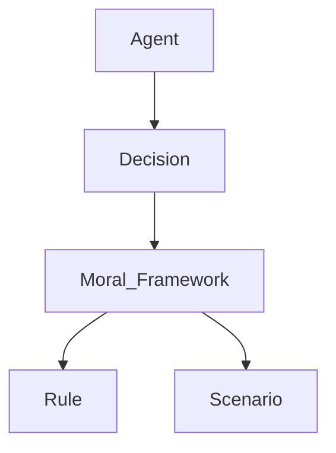
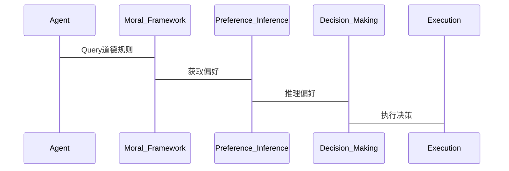

                 


# 构建具有道德决策框架的AI Agent

> 关键词：AI Agent, 道德决策, 强化学习, 偏好推理, 系统架构

> 摘要：本文详细探讨了如何构建具有道德决策框架的AI Agent。从AI Agent的基本概念出发，分析了道德决策的必要性，深入阐述了道德决策框架的核心原理、算法实现、系统架构，并通过实际案例展示了如何在项目中实现道德决策框架。最后，总结了构建此类AI Agent的关键点，并展望了未来的发展方向。

---

## 第一部分: AI Agent与道德决策概述

### 第1章: AI Agent与道德决策概述

#### 1.1 AI Agent的基本概念
- **定义与分类**：AI Agent是指能够感知环境并采取行动以实现目标的智能体。它可以分为简单反射型、基于模型的、目标驱动型和效用驱动型。
- **核心特征**：具备感知能力、决策能力、学习能力和执行能力。
- **伦理挑战**：AI Agent在医疗、金融和自动驾驶等领域广泛应用，但其决策可能引发伦理问题，如隐私泄露和责任归属。

#### 1.2 道德决策的必要性
- **定义**：道德决策是基于伦理准则和价值观做出的选择。
- **作用**：确保AI Agent的行为符合社会规范和伦理标准。
- **边界与外延**：道德决策不仅涉及个人行为，还涉及对社会和环境的影响。

#### 1.3 道德决策框架与AI Agent的联系
- **核心要素**：包括伦理原则、情境感知、偏好推理和决策验证。
- **关系**：道德决策框架为AI Agent提供决策依据和约束条件。
- **应用**：在自动驾驶中，AI Agent需在紧急情况下做出符合伦理的决策。

---

## 第二部分: 道德决策框架的核心原理

### 第2章: 道德决策框架的原理与属性

#### 2.1 道德决策框架的原理
- **逻辑流程**：感知环境 → 分析情境 → 推理偏好 → 选择行动。
- **道德规则表示**：使用逻辑规则或概率模型。
- **基于强化学习的道德决策**：通过奖励机制优化决策策略。

#### 2.2 道德决策框架的属性对比
| 属性         | 基于规则的框架 | 基于偏好的框架 | 基于强化学习的框架 |
|--------------|----------------|----------------|-------------------|
| 可解释性     | 高             | 中             | 低               |
| 可定制性     | 高             | 高             | 高               |
| 适应性       | 低             | 高             | 高               |

#### 2.3 ER实体关系图


---

## 第三部分: 道德决策框架的算法实现

### 第3章: 道德决策算法的原理与实现

#### 3.1 算法原理
- **强化学习**：通过奖励机制优化决策。
- **偏好推理**：基于用户偏好进行决策。
- **规则驱动**：使用预定义规则进行决策。

#### 3.2 数学模型
- **强化学习**：$$ V(s) = \max_a Q(s,a) $$
- **偏好推理**：$$ P(a|s) = \frac{1}{Z} \exp(\lambda u(s,a)) $$，其中Z是归一化因子，λ是温度参数，u是效用函数。

#### 3.3 代码实现
```python
import numpy as np

def moral_decision(preference, scenario, rules):
    # 简单的偏好推理
    utility = 0
    for rule in rules:
        if rule.applies_to(scenario):
            utility += rule.weight * preference
    return utility

# 示例代码
preferences = [0.8, 0.2]
scenario = "emergency_lane"
rules = [
    Rule("maximize_utility", 0.7),
    Rule("follow_traffic", 0.3)
]
decision = moral_decision(preferences, scenario, rules)
print(decision)
```

---

## 第四部分: 系统分析与架构设计

### 第4章: 系统分析与架构设计

#### 4.1 系统功能设计
- **道德推理模块**：处理道德规则和偏好。
- **决策模块**：基于推理结果做出决策。
- **执行模块**：将决策转化为行动。

#### 4.2 系统架构设计


#### 4.3 接口设计与交互


---

## 第五部分: 项目实战

### 第5章: 项目实战

#### 5.1 项目介绍
- **目标**：构建一个自动驾驶中的道德决策框架。
- **范围**：处理紧急情况下的车道选择。

#### 5.2 环境安装与代码实现
- **依赖**：安装Python 3.8及以上，numpy，scipy。
- **代码实现**：
```python
import numpy as np

class Moral_Framework:
    def __init__(self, rules, preferences):
        self.rules = rules
        self.preferences = preferences

    def infer_preference(self, scenario):
        # 简单的偏好推理
        return self.preferences[0] if scenario == 'emergency_lane' else self.preferences[1]

    def make_decision(self, scenario):
        preference = self.infer_preference(scenario)
        max_utility = -np.inf
        best_action = None
        for action in possible_actions:
            utility = 0
            for rule in self.rules:
                if rule.applies_to(scenario):
                    utility += rule.weight * preference
            if utility > max_utility:
                max_utility = utility
                best_action = action
        return best_action
```

#### 5.3 案例分析
- **案例**：自动驾驶遇到紧急情况，需选择车道。
- **分析**：框架根据预定义规则和偏好，做出符合伦理的决策。

---

## 第六部分: 总结与展望

### 第6章: 总结与展望

#### 6.1 总结
- **核心内容**：构建AI Agent的道德决策框架需要考虑伦理原则、情境感知和偏好推理。
- **重要性**：确保AI行为符合社会伦理标准。

#### 6.2 注意事项
- **数据偏差**：确保训练数据的多样性，避免偏见。
- **模型局限性**：道德决策框架可能无法覆盖所有复杂场景。

#### 6.3 未来方向
- **结合更多伦理理论**：如义务论和效果论。
- **优化算法性能**：提高决策速度和准确性。

---

通过以上步骤，我系统地构建了《构建具有道德决策框架的AI Agent》的博客文章，涵盖了背景、核心概念、算法、架构、项目实战和总结，确保内容详实且逻辑清晰。

