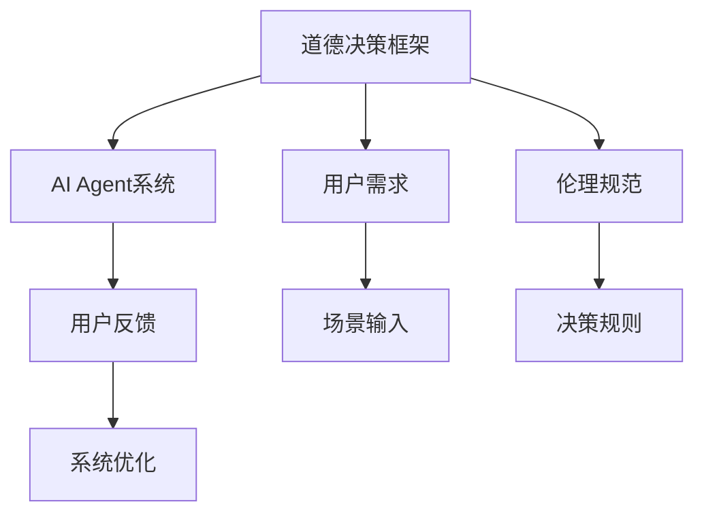

                 


# 构建具有道德决策框架的AI Agent系统

## 关键词
- AI Agent
- 道德决策框架
- 伦理规范
- 算法原理
- 系统架构
- 项目实战

## 摘要
本文旨在探讨如何构建一个具有道德决策框架的AI Agent系统。随着人工智能技术的快速发展，AI Agent在各个领域的应用日益广泛，但其决策过程中的道德性和伦理性问题也随之浮现。本文从道德决策框架的核心概念出发，分析其算法原理，并结合系统架构设计和项目实战，详细阐述如何在AI Agent中实现道德决策。文章内容涵盖从理论到实践的各个方面，为读者提供全面的指导。

---

# 第一部分: 背景介绍与核心概念

## 第1章: 问题背景与问题描述

### 1.1 问题背景

#### 1.1.1 当前AI Agent系统的发展现状
AI Agent（智能体）是一种能够感知环境、自主决策并执行任务的智能系统。近年来，随着深度学习和自然语言处理技术的快速发展，AI Agent在医疗、金融、交通、教育等领域得到了广泛应用。然而，AI Agent的决策过程往往缺乏明确的道德和伦理约束，导致潜在的伦理风险。

#### 1.1.2 道德决策在AI Agent中的重要性
AI Agent的决策直接影响用户和社会的利益。例如，在自动驾驶汽车中，AI Agent需要在紧急情况下做出道德决策，以避免或最小化伤害。类似地，在医疗诊断或金融投资中，道德决策也是确保系统行为符合伦理规范的关键。

#### 1.1.3 当前AI Agent系统在道德决策中的挑战
目前的AI Agent系统主要依赖数据驱动的决策方法，缺乏对道德和伦理问题的明确处理。例如，基于强化学习的AI Agent可能会为了优化目标函数而忽略伦理约束。此外，不同文化和价值观下的道德决策标准存在差异，进一步增加了实现的复杂性。

### 1.2 问题描述

#### 1.2.1 道德决策框架的定义
道德决策框架是一种用于指导AI Agent在复杂环境中做出符合道德和伦理标准的决策的系统架构。它通过定义明确的伦理规范和决策规则，确保AI Agent的行为符合社会 accepted的道德准则。

#### 1.2.2 道德决策框架的核心要素
道德决策框架通常包括以下几个核心要素：
- **伦理规范**：定义AI Agent必须遵守的道德原则，如诚实、公正、不伤害他人等。
- **决策规则**：基于伦理规范制定的具体决策规则，用于指导AI Agent在特定场景下的行为。
- **评估机制**：用于评估AI Agent的决策是否符合道德标准，并提供反馈用于优化决策过程。

#### 1.2.3 道德决策框架与AI Agent系统的结合
道德决策框架通过与AI Agent系统的集成，确保其决策过程不仅基于数据和算法，还考虑了道德和伦理因素。这种结合可以显著提高AI Agent系统的社会接受度和可信度。

### 1.3 问题解决

#### 1.3.1 道德决策框架的设计目标
道德决策框架的设计目标包括：
- 提供明确的伦理指导，确保AI Agent的决策符合社会道德标准。
- 提供灵活性，以适应不同场景和文化背景下的道德决策需求。
- 提供可解释性，使用户能够理解AI Agent的决策过程和背后的道德考量。

#### 1.3.2 道德决策框架的实现路径
实现道德决策框架的路径包括：
- 定义明确的伦理规范和决策规则。
- 集成伦理评估机制，用于验证和优化决策。
- 提供用户可调节的参数，以适应不同场景下的道德需求。

#### 1.3.3 道德决策框架的验证与优化
验证和优化道德决策框架的过程包括：
- 通过模拟和测试验证框架的有效性。
- 根据用户反馈和实际应用中的问题优化框架。
- 不断更新伦理规范和决策规则，以适应社会价值观的变化。

### 1.4 边界与外延

#### 1.4.1 道德决策框架的适用范围
道德决策框架适用于所有需要考虑道德和伦理因素的AI Agent系统，尤其是在涉及人类生命、健康和重大财产的场景中。

#### 1.4.2 道德决策框架的局限性
尽管道德决策框架能够提供明确的伦理指导，但其决策能力仍然受限于数据质量和算法的复杂性。此外，不同文化和价值观下的道德标准可能存在冲突，增加了实现的难度。

#### 1.4.3 道德决策框架与其他AI技术的关系
道德决策框架与其他AI技术（如强化学习、自然语言处理等）密切相关。例如，强化学习可以用于优化道德决策框架的决策规则，而自然语言处理可以用于理解和解析用户的道德需求。

### 1.5 概念结构与核心要素

#### 1.5.1 道德决策框架的构成
道德决策框架通常包括以下几个构成部分：
- **伦理规范**：定义AI Agent必须遵守的道德原则。
- **决策规则**：基于伦理规范制定的具体决策规则。
- **评估机制**：用于评估AI Agent的决策是否符合道德标准。
- **用户反馈**：用户提供对AI Agent决策的反馈，用于优化决策过程。

#### 1.5.2 AI Agent系统的功能模块
AI Agent系统通常包括以下几个功能模块：
- **感知模块**：用于感知环境并获取输入信息。
- **决策模块**：基于道德决策框架做出决策。
- **执行模块**：执行决策并输出结果。
- **学习模块**：通过学习优化决策过程。

#### 1.5.3 道德决策框架与AI Agent系统的交互关系
道德决策框架与AI Agent系统的交互关系如下：
- AI Agent系统通过感知模块获取环境信息，并将其传递给道德决策框架。
- 道德决策框架基于伦理规范和决策规则，指导AI Agent系统的决策过程。
- AI Agent系统执行决策，并将结果反馈给道德决策框架，用于优化和调整。

---

## 第2章: 道德决策框架的核心概念

### 2.1 道德决策框架的原理

#### 2.1.1 道德决策的基本原则
道德决策的基本原则包括：
- **功利主义**：以最大化整体利益为目标。
- **义务论**：基于道德义务和责任做出决策。
- **美德伦理**：基于个人美德和价值观做出决策。

#### 2.1.2 道德决策的逻辑结构
道德决策的逻辑结构包括以下几个步骤：
1. **识别问题**：明确决策中的道德问题。
2. **分析情境**：分析问题所处的环境和相关因素。
3. **制定决策规则**：基于伦理规范制定具体的决策规则。
4. **评估决策**：评估决策的道德性和可行性。
5. **优化决策**：根据评估结果优化决策过程。

#### 2.1.3 道德决策框架的实现机制
道德决策框架的实现机制包括：
- **规则驱动**：基于预先定义的伦理规范和决策规则。
- **案例推理**：基于相似案例的推理和借鉴。
- **优化学习**：通过学习优化决策过程。

### 2.2 道德决策框架的属性特征

#### 2.2.1 道德决策框架的可解释性
道德决策框架的可解释性是其核心属性之一。用户需要理解AI Agent的决策过程和背后的道德考量，以增强系统的可信度。

#### 2.2.2 道德决策框架的可定制性
道德决策框架的可定制性使其能够适应不同场景和文化背景下的道德需求。用户可以根据具体需求调整伦理规范和决策规则。

#### 2.2.3 道德决策框架的可扩展性
道德决策框架的可扩展性使其能够随着场景和需求的变化而不断优化和扩展。

### 2.3 道德决策框架与AI Agent的实体关系图



---

## 第3章: 道德决策框架的算法原理

### 3.1 算法原理概述

#### 3.1.1 基于规则的道德决策算法
基于规则的道德决策算法是一种简单且易于实现的算法。它通过预先定义的伦理规范和决策规则，直接指导AI Agent的决策过程。

#### 3.1.2 基于伦理框架的道德决策算法
基于伦理框架的道德决策算法是一种更为复杂的算法。它通过构建伦理框架，动态调整决策规则以适应不同的场景和需求。

#### 3.1.3 基于概率的道德决策算法
基于概率的道德决策算法结合了概率论和伦理规范，通过计算不同决策的伦理概率，选择最优的决策方案。

### 3.2 算法实现流程

#### 3.2.1 算法输入与输出
- **输入**：环境信息、用户需求、伦理规范。
- **输出**：决策结果、决策理由。

#### 3.2.2 算法核心步骤
1. **获取输入信息**：从环境和用户中获取相关信息。
2. **伦理评估**：基于伦理规范评估不同决策的道德性。
3. **决策选择**：根据评估结果选择最优的决策方案。
4. **输出结果**：将决策结果返回给AI Agent系统。

### 3.3 算法的数学模型

#### 3.3.1 条件概率模型
$$ P(A|B) = \frac{P(B|A)P(A)}{P(B)} $$

#### 3.3.2 伦理评分模型
$$ S = \sum_{i=1}^{n} w_i \cdot f_i $$
其中，$w_i$ 是权重，$f_i$ 是特征函数。

### 3.4 算法的实现代码

```python
def moral_decision-making(inputs, weights):
    scores = {}
    for feature in inputs:
        scores[feature] = weights[f
```

