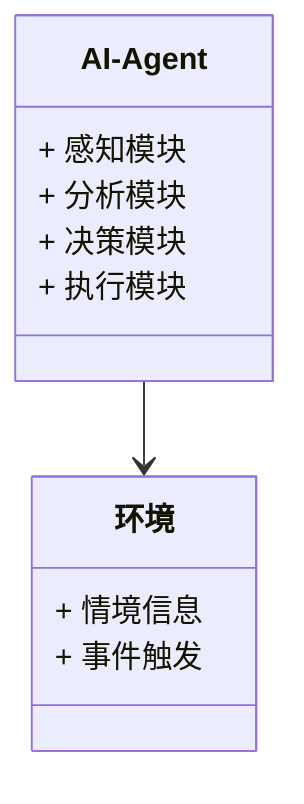
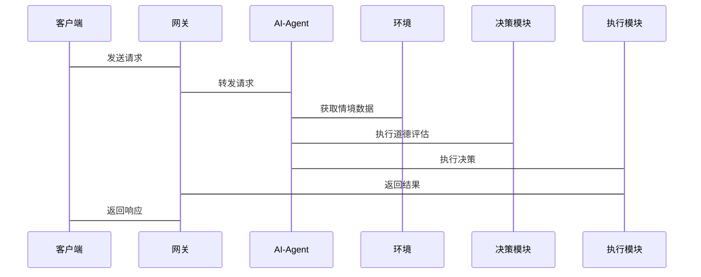

                 


# 构建具有道德决策能力的AI Agent

> **关键词**：AI Agent, 道德决策, 伦理框架, 算法实现, 系统架构
> 
> **摘要**：本文系统地探讨了如何构建具备道德决策能力的AI Agent。从基本概念出发，分析了道德决策的重要性，详细介绍了道德决策模型与算法，设计了系统的架构，并通过具体案例展示了实现过程。最后，提供了最佳实践建议，确保AI Agent在复杂情境中的道德决策能力。

---

## 第一部分: 构建具有道德决策能力的AI Agent背景介绍

### 第1章: AI Agent的基本概念

#### 1.1 AI Agent的定义与特点
##### 1.1.1 AI Agent的定义
AI Agent是一种智能体，能够感知环境并采取行动以实现特定目标。它具备自主性、反应性、目标导向和情境适应性。

##### 1.1.2 AI Agent的核心特点
- **自主性**：能够在没有外部干预的情况下自主决策。
- **反应性**：能够根据环境变化实时调整行为。
- **目标导向**：所有行动均以实现预设目标为导向。
- **情境适应性**：能够根据不同情境调整策略。

##### 1.1.3 AI Agent与传统程序的区别
AI Agent具备学习和自适应能力，能够处理不确定性，而传统程序通常遵循固定的逻辑步骤。

#### 1.2 道德决策的重要性
##### 1.2.1 道德决策的定义
道德决策是基于伦理准则进行的决策，旨在实现利益最大化和道德规范的遵守。

##### 1.2.2 道德决策在AI Agent中的作用
- 确保AI行为符合伦理规范。
- 提高AI在复杂情境下的决策质量。
- 建立用户对AI的信任。

##### 1.2.3 道德决策的挑战与复杂性
- **伦理准则的多样性**：不同文化背景下道德标准不同。
- **情境的复杂性**：决策往往涉及多方利益的权衡。
- **算法的可解释性**：确保决策过程透明且易于理解。

---

### 第2章: 构建具有道德决策能力的AI Agent的背景

#### 2.1 当前AI技术的发展现状
##### 2.1.1 AI技术的快速发展
AI技术在自然语言处理、计算机视觉等领域取得了显著进展。

##### 2.1.2 AI在各个领域的应用情况
AI已广泛应用于医疗、金融、交通等领域，显著提升了效率和准确性。

##### 2.1.3 当前AI Agent在道德决策方面的不足
大多数AI系统缺乏对道德问题的处理能力，导致在复杂情境中可能做出不道德的决策。

#### 2.2 道德决策在AI Agent中的必要性
##### 2.2.1 道德决策的定义与重要性
道德决策是确保AI行为符合伦理规范的关键。

##### 2.2.2 道德决策在AI Agent中的应用场景
- 医疗诊断：确保患者隐私和伦理合规。
- 金融投资：避免利益冲突和不道德交易。
- 自动驾驶：处理紧急情况下的伦理决策。

#### 2.3 本书的目标与范围
##### 2.3.1 本书的目标
系统地讲解如何构建具备道德决策能力的AI Agent，涵盖理论、算法、系统设计和实际应用。

##### 2.3.2 本书的范围与限制
- 范围：从理论到实践，涵盖设计、实现、测试和部署。
- 限制：聚焦于道德决策，不涉及AI的其他技术细节。

##### 2.3.3 本书的结构安排
- 结构清晰，逐步深入，从背景到实现，再到应用和总结。

---

## 第二部分: 道德决策模型与算法

### 第3章: 道德决策的核心概念与联系

#### 3.1 道德决策的核心概念
##### 3.1.1 道德框架
道德框架是AI Agent进行决策的基础，包括义务论、功利主义和美德伦理等。

##### 3.1.2 道德准则
具体的道德准则，如诚实、公正和不伤害他人。

##### 3.1.3 道德情境
具体的决策情境，涉及利益相关者和可能的后果。

#### 3.2 道德决策模型的属性特征对比
##### 3.2.1 不同道德决策模型的特征对比
| 模型 | 基于 | 输出 | 优点 | 缺点 |
|------|------|------|------|------|
| 功利主义 | 利益最大化 | 最大化整体幸福 | 效果显著 | 忽略个体权益 |
| 义务论 | 道德义务 | 遵守义务 | 强调责任 | 灵活性差 |
| 美德伦理 | 品德 | 最优化 | 综合考虑 | 难以量化 |

#### 3.3 ER实体关系图架构
##### 3.3.1 实体关系图的定义
ER图用于展示系统中的实体及其关系，帮助理解数据结构。

##### 3.3.2 实体关系图在道德决策中的应用
- **实体**：决策者、情境、利益相关者、道德准则。
- **关系**：决策者根据情境和利益相关者，应用道德准则进行决策。

##### 3.3.3 实体关系图的绘制方法
使用mermaid绘制：

```mermaid
erd
    actor 决策者
    actor 利益相关者
    entity 情境
    entity 道德准则
    决策者 --> 情境
    利益相关者 --> 情境
    道德准则 --> 决策者
```

---

### 第4章: 道德决策算法的原理与实现

#### 4.1 道德决策算法的原理
##### 4.1.1 道德决策算法的基本原理
基于预设的道德框架和准则，结合情境信息进行决策。

##### 4.1.2 道德决策算法的核心步骤
1. 分析情境。
2. 识别相关利益相关者。
3. 应用道德准则评估选项。
4. 选择最优决策。

##### 4.1.3 道德决策算法的数学模型
目标函数：
$$ \text{最大化} \quad \sum_{i=1}^{n} w_i \cdot u_i $$
其中，\( w_i \) 是准则的重要性权重，\( u_i \) 是准则的满足度。

#### 4.2 道德决策算法的实现
##### 4.2.1 算法实现的步骤
1. 定义道德框架和准则。
2. 收集情境信息。
3. 评估每个选项的道德得分。
4. 选择得分最高的选项。

##### 4.2.2 算法实现的代码示例
```python
def moral_decision(moral_framework, situation, stakeholders):
    max_score = -float('inf')
    best_option = None
    for option in possible_options:
        score = evaluate_option(option, situation, stakeholders, moral_framework)
        if score > max_score:
            max_score = score
            best_option = option
    return best_option
```

##### 4.2.3 算法实现的优化建议
- 使用动态权重调整，适应不同情境。
- 集成机器学习模型，提高决策准确性。

#### 4.3 道德决策算法的数学模型与公式
##### 4.3.1 数学模型的定义
构建一个基于伦理准则的评估函数，量化每个选项的道德价值。

##### 4.3.2 数学公式的推导
$$ \text{道德评分} = \sum_{i=1}^{n} (w_i \cdot s_i) $$
其中，\( w_i \) 是准则权重，\( s_i \) 是准则满足度。

##### 4.3.3 数学公式的应用实例
假设在自动驾驶中，刹车的道德评分为0.8，转向的评分为0.6，则选择刹车。

---

### 第5章: 道德决策的系统分析与架构设计方案

#### 5.1 系统设计背景与目标
##### 5.1.1 系统设计背景
AI Agent需要在复杂环境中做出道德决策。

##### 5.1.2 系统设计目标
实现一个能够感知环境、分析情境并做出道德决策的AI Agent。

#### 5.2 系统功能设计
##### 5.2.1 领域模型
使用mermaid类图展示系统模块：



##### 5.2.2 系统架构设计
整体架构：


##### 5.2.3 系统接口设计
- 输入接口：接收环境数据和用户请求。
- 输出接口：发送决策结果和执行指令。

##### 5.2.4 系统交互设计
使用mermaid序列图展示交互流程：



---

### 第6章: 项目实战

#### 6.1 环境配置与开发工具
##### 6.1.1 环境安装
安装Python、TensorFlow和Keras等工具。

##### 6.1.2 开发工具配置
配置IDE，如PyCharm，安装必要的插件。

#### 6.2 系统核心实现
##### 6.2.1 核心算法实现
实现道德评分计算函数：

```python
def calculate_moral_score(option, situation, stakeholders):
    scores = {}
    for criterion in moral_framework:
        scores[criterion] = calculate_score(option, criterion, situation, stakeholders)
    return scores
```

##### 6.2.2 代码实现与解读
详细解读每部分代码的功能和逻辑。

#### 6.3 项目测试与优化
##### 6.3.1 测试用例设计
设计覆盖不同情境的测试用例，验证决策的正确性。

##### 6.3.2 系统优化
优化算法性能，减少计算时间，提高决策效率。

#### 6.4 案例分析与解读
##### 6.4.1 应用场景分析
以医疗诊断为例，展示AI Agent如何进行道德决策。

##### 6.4.2 详细案例分析
分析一个具体案例，展示决策过程和结果。

---

## 第三部分: 最佳实践与总结

### 第7章: 最佳实践 tips

#### 7.1 道德决策的编写规范
- 明确道德框架和准则。
- 确保算法的透明性和可解释性。

#### 7.2 算法实现的注意事项
- 考虑不同情境下的权重调整。
- 集成反馈机制，持续优化决策模型。

#### 7.3 系统测试与部署
- 制定全面的测试策略。
- 确保系统的安全性和稳定性。

### 第8章: 总结与展望

#### 8.1 全书总结
系统地介绍了构建具备道德决策能力的AI Agent的各个方面，从理论到实践，提供了详尽的指导。

#### 8.2 未来展望
探讨AI Agent在道德决策领域的未来发展方向，如动态伦理框架和多Agent协作。

---

## 参考文献
1. Russell, S. (2019). Human Compatible: AI Systems That Truly Put People First.
2. Floridi, L., et al. (2018). AI4People—An ethical framework for a good AI society: Opportunities, risks, principles, and recommendations.

---

通过以上详细的目录和内容规划，读者可以系统地学习如何构建具备道德决策能力的AI Agent，从理论到实践，逐步掌握相关技术和方法。

