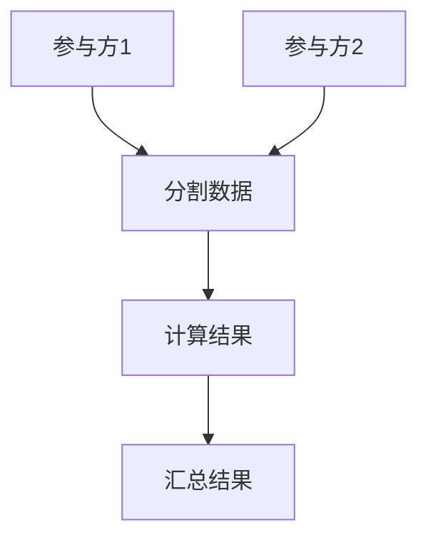
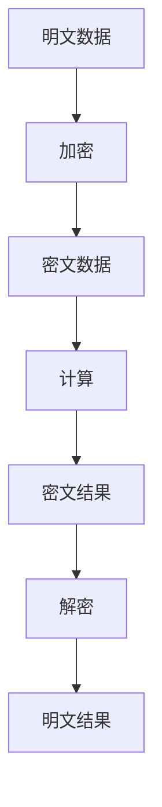
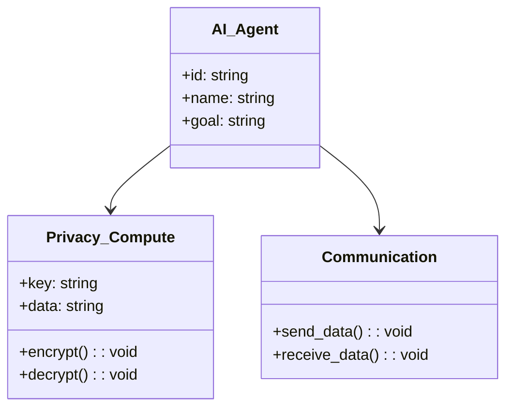
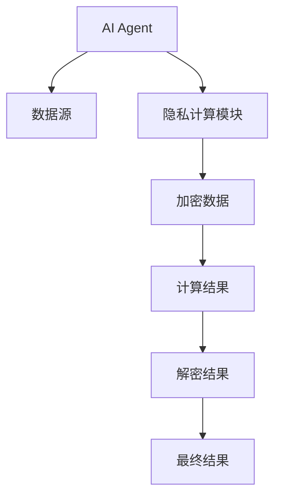

                 


# 构建具有隐私计算能力的AI Agent

> **关键词**：AI Agent，隐私计算，联邦学习，同态加密，安全多方计算，隐私保护

> **摘要**：  
本文将深入探讨如何在AI Agent中实现隐私计算能力。通过结合隐私计算的核心技术（如联邦学习、同态加密等），本文将逐步分析如何在确保数据隐私的前提下，构建高效且安全的AI Agent系统。文章从理论基础到实际应用，详细阐述了隐私计算的实现方法、算法原理、系统架构设计以及实际案例分析，为读者提供一套完整的构建指南。

---

## 第一部分：AI Agent与隐私计算的背景介绍

### 第1章：AI Agent的定义与核心概念

#### 1.1 AI Agent的定义与特点
AI Agent（人工智能代理）是一种能够感知环境、自主决策并执行任务的智能实体。它具备以下核心特点：
- **自主性**：能够在没有外部干预的情况下自主运行。
- **反应性**：能够感知环境并实时调整行为。
- **目标导向**：通过目标驱动来优化决策。
- **学习能力**：能够通过数据和经验不断优化自身能力。

AI Agent的应用场景广泛，包括智能助手、推荐系统、自动驾驶等。

#### 1.2 隐私计算的定义与重要性
隐私计算是一种在保护数据隐私的前提下，对数据进行计算的技术。其核心目标是在不泄露原始数据的情况下，完成数据的分析和计算。隐私计算的重要性体现在以下几点：
- **数据安全**：防止敏感数据被泄露。
- **合规性**：满足数据隐私保护的法律法规要求。
- **信任构建**：增强用户对数据处理过程的信任。

#### 1.3 AI Agent与隐私计算的结合
AI Agent在实际应用中往往需要处理大量敏感数据，例如用户的地理位置、行为习惯等。如何在不泄露这些数据的前提下，完成AI Agent的任务需求，是隐私计算的核心问题。

**问题背景与挑战**：
- 数据隐私泄露的风险。
- 如何在不共享原始数据的情况下，实现数据的联合分析。

**解决方法**：
- 使用隐私计算技术（如联邦学习、同态加密）来保护数据隐私。
- 在AI Agent中嵌入隐私保护机制，确保数据处理过程的安全性。

---

### 第2章：隐私计算的核心技术

#### 2.1 隔离计算（Secure Multi-Party Computation）
隔离计算是一种在多个参与方之间进行计算的技术，确保各方在不泄露自身数据的前提下，共同完成计算任务。

**核心原理**：
- **秘密分享**：将数据分割成多个密钥，每个参与方持有部分密钥。
- **联合计算**：通过数学协议，将各参与方的数据部分进行计算，最终得到结果。

**数学模型**：
$$ y = f(x_1, x_2, \ldots, x_n) $$
其中，$x_i$是第$i$个参与方的数据，$f$是需要计算的函数。

**实现方式**：
- **基于秘密共享**：将数据分割成$k$个部分，每个部分通过秘密共享协议分发给不同的参与方。
- **协议计算**：参与方通过通信协议，将各自的部分数据进行计算，最终得到结果。

#### 2.2 同态加密（Homomorphic Encryption）
同态加密是一种允许在密文上进行计算的技术，且计算结果对应的明文与直接在明文上进行的计算结果相同。

**核心原理**：
- **加密与解密**：数据加密后，仍能进行计算，解密后得到正确的结果。
- **密钥管理**：需要严格管理加密和解密密钥，确保数据的安全性。

**数学模型**：
$$ E(x) = \text{加密}(x, key) $$
$$ D(E(x)) = \text{解密}(E(x), key) $$

**实现方式**：
- **全同态加密**：支持多种运算（加法、乘法）的加密方式。
- **部分同态加密**：仅支持特定运算的加密方式。

---

## 第三部分：隐私计算的算法原理

### 第3章：隐私计算的算法实现

#### 3.1 隔离计算的算法流程
**步骤**：
1. 数据分割：将数据分割成多个部分，每个参与方持有部分数据。
2. 协议通信：参与方通过通信协议，将各自的数据部分进行计算。
3. 结果汇总：将各参与方的计算结果汇总，得到最终结果。

**流程图**：


#### 3.2 同态加密的算法流程
**步骤**：
1. 数据加密：对明文数据进行加密，生成密文。
2. 密文计算：在密文上进行计算，得到密文结果。
3. 解密结果：对密文结果进行解密，得到明文结果。

**流程图**：


---

## 第四部分：系统分析与架构设计

### 第4章：系统分析与架构设计

#### 4.1 领域模型类图


#### 4.2 系统架构图


---

## 第五部分：项目实战

### 第5章：项目实战

#### 5.1 环境安装
- **Python环境**：安装Python 3.8以上版本。
- **依赖库安装**：安装必要的库，例如`pycryptod`用于同态加密。

#### 5.2 核心代码实现

**联邦学习实现示例**：
```python
import numpy as np

def federated_learning():
    # 数据分割
    data_part1 = np.array([1, 2, 3])
    data_part2 = np.array([4, 5, 6])
    
    # 数据聚合
    result = data_part1 + data_part2
    print("聚合结果：", result)

federated_learning()
```

**同态加密实现示例**：
```python
from pycryptod import AES

def encrypt_decrypt():
    key = b'secretkey123'
    plaintext = b'Hello World'
    
    cipher = AES.new(key, AES.MODE_ECB)
    ciphertext = cipher.encrypt(plaintext)
    
    decrypted = cipher.decrypt(ciphertext)
    print("解密结果：", decrypted.decode())

encrypt_decrypt()
```

#### 5.3 案例分析
假设我们需要在两个参与方之间进行数据聚合计算，使用联邦学习技术完成。

**步骤**：
1. 数据分割：每个参与方持有部分数据。
2. 数据聚合：通过联邦学习协议，将数据聚合计算。
3. 结果输出：得到最终的计算结果。

---

## 第六部分：最佳实践

### 第6章：总结与展望

#### 6.1 总结
本文详细探讨了如何在AI Agent中实现隐私计算能力，涵盖了隐私计算的核心技术、算法原理、系统架构设计以及实际案例分析。通过结合联邦学习和同态加密等技术，可以在保护数据隐私的前提下，实现高效的安全计算。

#### 6.2 注意事项
- 数据隐私保护需要严格遵循相关法律法规。
- 隐私计算技术的选择需要根据具体场景和需求进行评估。
- 系统设计时，需考虑性能和安全性的平衡。

#### 6.3 未来展望
随着隐私保护需求的增加，隐私计算技术将在AI Agent中发挥越来越重要的作用。未来的研究方向包括：
- 更高效的隐私计算算法。
- 更便捷的隐私计算工具和框架。
- 更广泛的应用场景探索。

---

**致谢**：感谢读者的耐心阅读，希望本文能为构建具有隐私计算能力的AI Agent提供有价值的参考。

