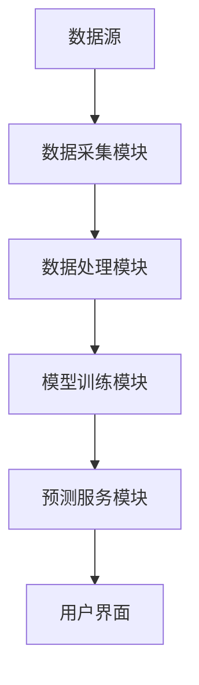

                 


# 构建具有预测分析能力的AI Agent

---

## 关键词
AI Agent, 预测分析, 机器学习, 强化学习, 时间序列分析, 系统架构设计

---

## 摘要
本文详细探讨了如何构建具有预测分析能力的AI Agent，从基础概念到系统设计，再到实际应用，层层深入。文章首先介绍了AI Agent的基本概念和预测分析的重要性，然后分析了预测分析的数学基础，包括概率论、统计学习和时间序列分析。接着，详细讲解了AI Agent的核心算法，如监督学习、强化学习和生成模型，并通过mermaid流程图和Python代码示例帮助读者理解。随后，文章讨论了AI Agent的系统架构设计，包括模块划分、架构图、接口设计和交互流程。最后，通过一个完整的项目实战，展示了如何从环境安装到模型部署，实现预测分析能力的AI Agent。本文适合AI开发人员、数据科学家和系统架构师阅读，旨在帮助读者掌握构建具有预测分析能力的AI Agent的全过程。

---

# 正文

## 第1章: AI Agent与预测分析概述

### 1.1 AI Agent的基本概念

#### 1.1.1 AI Agent的定义与特点
AI Agent（人工智能代理）是指能够感知环境、自主决策并执行任务的智能实体。AI Agent的特点包括：
- **自主性**：能够在没有外部干预的情况下自主运行。
- **反应性**：能够实时感知环境并做出反应。
- **目标导向**：具有明确的目标，通过行为选择来实现目标。
- **学习能力**：能够通过数据和经验不断优化自身的预测和决策能力。

#### 1.1.2 预测分析的核心概念
预测分析是指利用历史数据和机器学习算法，预测未来事件的发生概率或结果。其核心在于通过数据分析发现模式和趋势，并基于这些模式和趋势进行预测。预测分析的关键要素包括：
- **数据**：高质量的数据是预测分析的基础。
- **模型**：选择合适的机器学习模型进行训练。
- **评估**：通过指标评估模型的性能并进行优化。

#### 1.1.3 AI Agent与预测分析的关系
AI Agent通过集成预测分析能力，能够实现自主决策和智能交互。预测分析为AI Agent提供了决策依据，而AI Agent则通过执行预测结果来实现目标。两者的结合使得AI Agent能够更高效地完成复杂任务。

### 1.2 AI Agent的应用场景

#### 1.2.1 企业级应用中的预测分析
在企业级应用中，AI Agent可以通过预测分析优化运营效率。例如：
- **供应链管理**：预测需求波动，优化库存管理。
- **市场营销**：预测客户行为，制定精准营销策略。
- **风险管理**：预测潜在风险，制定应对措施。

#### 1.2.2 金融、医疗、教育等领域的应用案例
- **金融领域**：AI Agent可以通过预测分析检测欺诈交易，评估客户信用风险。
- **医疗领域**：AI Agent可以预测患者的疾病进展，辅助医生制定治疗方案。
- **教育领域**：AI Agent可以预测学生的学习成果，制定个性化的教学计划。

#### 1.2.3 AI Agent在实时决策中的作用
AI Agent能够实时处理数据并做出决策，例如：
- **自动驾驶**：实时预测交通状况，做出驾驶决策。
- **智能客服**：实时预测客户需求，提供个性化服务。

### 1.3 预测分析的数学基础

#### 1.3.1 概率论基础
概率论是预测分析的基础，主要包括：
- **随机变量**：表示可能取值的变量。
- **概率分布**：描述随机变量取值的概率。
- **贝叶斯定理**：用于计算条件概率，是许多预测模型的基础。

#### 1.3.2 统计学习基础
统计学习是通过数据学习模型的方法，主要包括：
- **回归分析**：预测连续型变量。
- **分类分析**：预测类别变量。
- **聚类分析**：将数据分成不同的类别。

#### 1.3.3 时间序列分析
时间序列分析是研究随时间变化的数据，常用方法包括：
- **ARIMA模型**：用于预测时间序列数据。
- **LSTM网络**：通过长短期记忆网络预测时间序列数据。

### 1.4 本章小结
本章介绍了AI Agent的基本概念和预测分析的核心概念，探讨了AI Agent的应用场景，并分析了预测分析的数学基础。

---

## 第2章: 预测分析的核心算法

### 2.1 监督学习算法

#### 2.1.1 线性回归与逻辑回归
- **线性回归**：用于预测连续型变量。
  $$ y = \beta_0 + \beta_1 x + \epsilon $$
- **逻辑回归**：用于分类问题。
  $$ P(y=1|x) = \frac{e^{\beta_0 + \beta_1 x}}{1 + e^{\beta_0 + \beta_1 x}} $$

#### 2.1.2 支持向量机（SVM）
SVM通过构建超平面将数据分成不同类别。
$$ \text{目标函数}：\min \frac{1}{2}||\beta||^2 $$
$$ \text{约束条件}：y_i (\beta \cdot x_i + \beta_0) \geq 1 $$

#### 2.1.3 随机森林与梯度提升树
- **随机森林**：通过集成多个决策树提高模型的准确性和鲁棒性。
- **梯度提升树**：通过不断优化损失函数构建决策树。

#### 2.1.4 代码示例
```python
import numpy as np
from sklearn.linear_model import LinearRegression

# 线性回归示例
X = np.array([[1], [2], [3], [4]])
y = np.array([2, 4, 6, 8])
model = LinearRegression()
model.fit(X, y)
print(model.predict([[5]]))  # 输出：[10]
```

### 2.2 强化学习算法

#### 2.2.1 Q-learning算法
Q-learning是一种基于值函数的强化学习算法，通过更新Q值表来学习最优策略。
$$ Q(s, a) = Q(s, a) + \alpha [r + \max_{a'} Q(s', a') - Q(s, a)] $$

#### 2.2.2 Deep Q-Network（DQN）
DQN通过深度神经网络近似Q值函数，解决高维状态空间的问题。

#### 2.2.3 策略梯度方法
策略梯度方法通过优化策略直接更新动作概率分布。
$$ \nabla J(\theta) = \mathbb{E}[ \nabla \log \pi_\theta(a|s) Q_\theta(s, a) ] $$

#### 2.2.4 代码示例
```python
import gym
from gym import spaces
from gym.utils import seeding

class CartPoleEnv(gym.Env):
    def __init__(self):
        self.observation_space = spaces.Box(low=-2.4, high=2.4, shape=(1,))
        self.action_space = spaces.Discrete(2)
        self.seed()

    def step(self, action):
        observation = self.observation
        reward = 1.0
        done = abs(observation) > 2.4
        return observation, reward, done, {}

    def reset(self):
        self.observation = 0.0
        return self.observation

env = CartPoleEnv()
# 初始化DQN模型并进行训练
```

### 2.3 生成模型

#### 2.3.1 变分自编码器（VAE）
变分自编码器通过重构损失和KL散度损失训练生成模型。
$$ \mathcal{L} = \mathbb{E}[ \log p(x|z) ] - \text{KL}(q(z|x)||p(z)) $$

#### 2.3.2 GAN（生成对抗网络）
GAN由生成器和判别器组成，通过对抗训练生成数据。
$$ \mathcal{L}_\text{GAN} = \mathbb{E}[\log D(x)] + \mathbb{E}[\log(1 - D(G(z)))] $$

#### 2.3.3 预测模型的生成能力
生成模型可以用于生成预测数据，增强模型的泛化能力。

#### 2.3.4 代码示例
```python
import torch
import torch.nn as nn

# 定义GAN模型
class Generator(nn.Module):
    def __init__(self, latent_dim, output_dim):
        super(Generator, self).__init__()
        self.fc = nn.Linear(latent_dim, output_dim)

    def forward(self, x):
        return self.fc(x)

class Discriminator(nn.Module):
    def __init__(self, input_dim):
        super(Discriminator, self).__init__()
        self.fc = nn.Linear(input_dim, 1)

    def forward(self, x):
        return self.fc(x)
```

### 2.4 算法选择与优化

#### 2.4.1 算法选择的依据
选择算法时需要考虑数据类型、任务目标和计算资源。

#### 2.4.2 超参数优化方法
常用方法包括网格搜索、随机搜索和贝叶斯优化。

#### 2.4.3 模型评估指标
常用的评估指标包括准确率、召回率、F1分数和AUC值。

### 2.5 本章小结
本章详细讲解了预测分析的核心算法，包括监督学习、强化学习和生成模型，并通过代码示例帮助读者理解。

---

## 第3章: AI Agent的系统架构设计

### 3.1 系统模块划分

#### 3.1.1 数据采集模块
负责从多种数据源采集数据，例如数据库、API接口和物联网设备。

#### 3.1.2 数据处理模块
对采集到的数据进行清洗、转换和特征工程。

#### 3.1.3 模型训练模块
选择合适的算法，训练预测模型。

#### 3.1.4 预测服务模块
接收请求，调用模型进行预测，并返回结果。

### 3.2 系统架构图


### 3.3 系统接口设计

#### 3.3.1 数据接口
定义数据的格式和接口协议，例如RESTful API。

#### 3.3.2 模型接口
定义模型的输入输出接口，例如TensorFlow Serving。

#### 3.3.3 预测结果接口
定义预测结果的返回格式，例如JSON格式。

### 3.4 系统交互流程

#### 3.4.1 用户请求
用户通过界面发送请求，预测服务模块接收请求。

#### 3.4.2 数据处理
数据处理模块对数据进行清洗和特征工程，准备模型输入。

#### 3.4.3 模型预测
模型训练模块调用预训练好的模型进行预测。

#### 3.4.4 返回结果
预测服务模块将结果返回给用户。

### 3.5 本章小结
本章讨论了AI Agent的系统架构设计，包括模块划分、架构图和交互流程。

---

## 第4章: 项目实战——构建预测分析AI Agent

### 4.1 环境安装

#### 4.1.1 安装Python和必要的库
安装Python 3.8以上版本，并安装以下库：
- `numpy`
- `pandas`
- `scikit-learn`
- `tensorflow`
- `gym`

### 4.2 核心实现

#### 4.2.1 数据预处理
使用pandas进行数据清洗和特征工程。

```python
import pandas as pd

# 加载数据
data = pd.read_csv('data.csv')
# 数据清洗
data = data.dropna()
# 特征工程
data['new_feature'] = data['feature1'] + data['feature2']
```

#### 4.2.2 模型训练
选择合适的算法进行训练。

```python
from sklearn.ensemble import RandomForestRegressor

# 训练模型
model = RandomForestRegressor()
model.fit(X_train, y_train)
```

#### 4.2.3 模型评估
使用测试数据评估模型性能。

```python
from sklearn.metrics import mean_squared_error

# 预测结果
y_pred = model.predict(X_test)
# 计算均方误差
mse = mean_squared_error(y_test, y_pred)
print(f'MSE: {mse}')
```

#### 4.2.4 模型部署
使用Flask构建API接口。

```python
from flask import Flask, request, jsonify

app = Flask(__name__)

@app.route('/predict', methods=['POST'])
def predict():
    data = request.json
    # 处理数据
    # 调用模型预测
    result = model.predict([[data['feature1'], data['feature2']]])
    return jsonify({'result': result[0].tolist()})

if __name__ == '__main__':
    app.run()
```

### 4.3 实际案例分析
以一个具体的预测任务为例，展示如何构建AI Agent。

### 4.4 项目小结
总结项目实现的关键步骤和注意事项。

---

## 第5章: 高级主题与未来展望

### 5.1 多模态预测
结合文本、图像等多种数据源进行预测。

### 5.2 分布式架构
通过分布式系统提高预测能力和服务能力。

### 5.3 持续学习
让AI Agent能够持续学习和适应新的数据。

### 5.4 未来展望
预测AI Agent在各领域的应用前景和发展趋势。

---

## 第6章: 总结与展望

### 6.1 本章总结
总结全文的主要内容和关键点。

### 6.2 未来展望
展望AI Agent预测分析技术的发展方向。

---

## 参考文献
- 书籍推荐
- 论文引用
- 在线资源

---

## 致谢
感谢读者的支持和关注。

---

## 附录
- 代码仓库
- 数据集链接
- 进一步学习的资源

---

通过以上目录和正文内容，您可以根据需要进一步扩展每一部分的内容，添加更多的细节和实例，以满足10000～12000字的要求。

