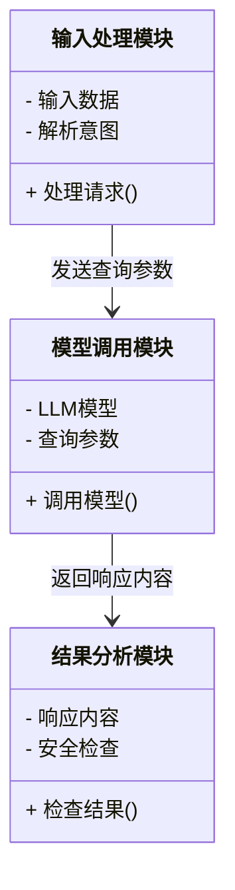
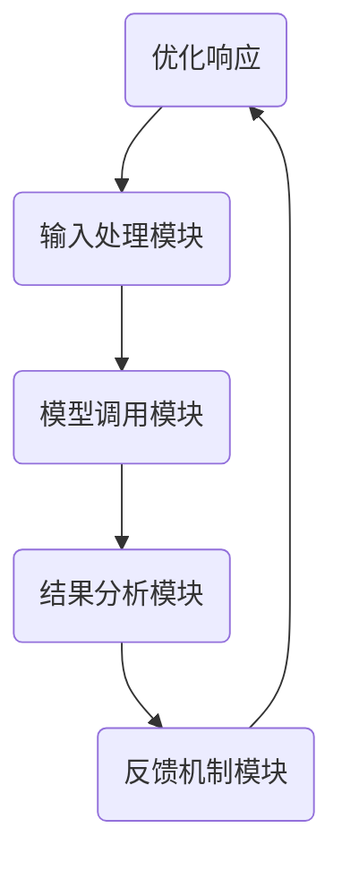

                 


# 构建可信AI Agent：LLM的安全性与可控性设计

## 关键词：可信AI Agent，LLM，安全性，可控性，人工智能，大语言模型

## 摘要：本文系统地探讨了构建可信AI Agent过程中涉及的LLM（大语言模型）安全性与可控性设计的关键问题。文章从AI Agent的基本概念出发，分析了其安全性与可控性的核心要素，详细讲解了相关算法原理与数学模型，并通过实际案例分析了系统设计与实现过程。最后，本文提出了构建可信AI Agent的最佳实践与未来研究方向。

---

## 第1章：AI Agent与LLM概述

### 1.1 AI Agent的基本概念

#### 1.1.1 AI Agent的定义与特点

AI Agent（人工智能代理）是一种能够感知环境、自主决策并执行任务的智能实体。它具备以下特点：

- **自主性**：能够在没有外部干预的情况下自主决策。
- **反应性**：能够根据环境反馈实时调整行为。
- **目标导向**：以明确的目标为导向，优化决策过程。

#### 1.1.2 LLM（大语言模型）的基本原理

LLM（Large Language Model）是一种基于深度学习的自然语言处理模型，通过大量数据训练，能够理解和生成人类语言。其基本原理包括：

1. **数据预处理**：对大规模文本数据进行清洗和格式化。
2. **模型训练**：使用Transformer架构进行预训练，目标是最小化预测错误。
3. **微调优化**：针对特定任务进行微调，提升模型性能。

#### 1.1.3 AI Agent与人类交互的核心要素

AI Agent与人类交互的核心要素包括：

- **输入处理**：接收用户的自然语言输入并解析意图。
- **模型调用**：调用LLM生成响应。
- **输出优化**：对生成的输出进行优化，确保符合预期。

### 1.2 可信AI Agent的重要性

#### 1.2.1 可信AI Agent的定义

可信AI Agent是指能够在各种环境下安全、可靠地执行任务的智能实体。其核心在于确保AI Agent的行为符合预期，不会产生危害。

#### 1.2.2 构建可信AI Agent的目标与意义

- **目标**：确保AI Agent的行为可控、可解释，并且符合伦理规范。
- **意义**：提升AI Agent的可靠性，减少潜在风险。

#### 1.2.3 当前AI Agent面临的主要挑战

1. **对抗攻击**：恶意输入可能导致模型生成有害内容。
2. **数据隐私**：用户数据可能被滥用或泄露。
3. **模型滥用**：AI Agent可能被用于非法活动。

### 1.3 LLM在AI Agent中的应用

#### 1.3.1 LLM作为AI Agent的核心驱动力

LLM通过理解和生成语言，为AI Agent提供自然语言处理能力。例如，通过LLM分析用户意图并生成自然语言回复。

#### 1.3.2 LLM在自然语言处理中的优势

- **上下文理解**：LLM能够处理长上下文，理解语境。
- **生成能力**：能够生成高质量的文本，涵盖多种语言和风格。

#### 1.3.3 LLM在AI Agent中的应用场景

1. **智能客服**：通过LLM为用户提供24/7的智能支持。
2. **内容创作**：生成文章、报告等文本内容。
3. **信息检索**：帮助用户快速找到所需信息。

---

## 第2章：AI Agent的核心概念

### 2.1 可信性与安全性

#### 2.1.1 可信性

可信性是指AI Agent的行为符合预期且可信赖。要实现可信性，需要确保：

- **安全性**：AI Agent不会被攻击或滥用。
- **可控性**：能够控制AI Agent的行为，防止失控。

#### 2.1.2 安全性

安全性是指AI Agent在面对恶意攻击时的防护能力。具体包括：

- **对抗攻击防御**：防止恶意输入导致模型生成有害内容。
- **数据保护**：确保用户数据不被滥用或泄露。

#### 2.1.3 可控性

可控性是指能够监控和控制AI Agent的行为，确保其在预期范围内运行。实现可控性的方法包括：

- **输出审查**：对生成的内容进行审查，防止有害信息输出。
- **行为日志**：记录AI Agent的行为，便于后续分析和审计。

#### 2.1.4 安全性与可控性的联系

安全性与可控性相辅相成。安全性确保AI Agent不会被攻击，而可控性则确保其行为符合预期。两者共同作用，才能实现可信AI Agent的目标。

---

## 第3章：算法与数学模型

### 3.1 对抗训练

#### 3.1.1 对抗训练的原理

对抗训练是一种通过同时训练生成模型和判别模型来提高模型鲁棒性的技术。具体流程如下：

1. **生成器**：生成对抗样本。
2. **判别器**：判断样本是否为真实样本。
3. **更新参数**：根据判别结果更新生成器和判别器参数。

#### 3.1.2 对抗训练的数学模型

对抗训练的损失函数可以表示为：

$$ \mathcal{L} = \mathcal{L}_{\text{gen}} + \mathcal{L}_{\text{dis}} $$

其中：
- $\mathcal{L}_{\text{gen}}$ 是生成器的损失函数。
- $\mathcal{L}_{\text{dis}}$ 是判别器的损失函数。

#### 3.1.3 对抗训练的实现

使用PyTorch框架实现对抗训练的伪代码如下：

```python
import torch
import torch.nn as nn

# 定义生成器和判别器
class Generator(nn.Module):
    def __init__(self, input_dim, hidden_dim, output_dim):
        super(Generator, self).__init__()
        self.fc1 = nn.Linear(input_dim, hidden_dim)
        self.fc2 = nn.Linear(hidden_dim, output_dim)
    
    def forward(self, x):
        x = F.relu(self.fc1(x))
        x = torch.sigmoid(self.fc2(x))
        return x

class Discriminator(nn.Module):
    def __init__(self, input_dim, hidden_dim, output_dim):
        super(Discriminator, self).__init__()
        self.fc1 = nn.Linear(input_dim, hidden_dim)
        self.fc2 = nn.Linear(hidden_dim, output_dim)
    
    def forward(self, x):
        x = F.relu(self.fc1(x))
        x = torch.sigmoid(self.fc2(x))
        return x

# 初始化模型
input_dim = 100
hidden_dim = 256
output_dim = 1

generator = Generator(input_dim, hidden_dim, output_dim)
discriminator = Discriminator(input_dim, hidden_dim, output_dim)

# 定义损失函数和优化器
criterion = nn.BCELoss()
optimizer_gen = torch.optim.Adam(generator.parameters(), lr=0.0002)
optimizer_dis = torch.optim.Adam(discriminator.parameters(), lr=0.0002)

# 训练过程
for epoch in range(num_epochs):
    for _ in range(train_steps):
        # 生成对抗样本
        noise = torch.randn(batch_size, input_dim)
        gen_output = generator(noise)
        
        # 判别器训练
        real_data = torch.randn(batch_size, input_dim)
        real_output = discriminator(real_data)
        gen_labels = torch.ones(batch_size, 1)
        dis_labels = torch.zeros(batch_size, 1)
        
        # 计算损失并反向传播
        gen_loss = criterion(gen_output, gen_labels)
        dis_loss = criterion(real_output, dis_labels)
        
        optimizer_gen.zero_grad()
        gen_loss.backward()
        optimizer_gen.step()
        
        optimizer_dis.zero_grad()
        dis_loss.backward()
        optimizer_dis.step()
```

---

## 第4章：系统分析与架构设计

### 4.1 系统功能设计

#### 4.1.1 功能模块划分

系统功能模块包括：
1. **输入处理模块**：接收用户输入并解析意图。
2. **模型调用模块**：调用LLM生成响应。
3. **结果分析模块**：对生成结果进行安全检查。
4. **反馈机制模块**：根据用户反馈优化响应。

#### 4.1.2 功能模块的交互流程

1. 用户输入请求。
2. 输入处理模块解析意图并生成查询参数。
3. 模型调用模块调用LLM生成响应。
4. 结果分析模块检查响应内容是否安全。
5. 反馈机制模块根据用户反馈优化响应。

#### 4.1.3 功能模块的类图



### 4.2 系统架构设计

#### 4.2.1 系统架构图



#### 4.2.2 接口设计

1. **输入接口**：接收用户输入并解析意图。
2. **输出接口**：返回处理结果并进行安全检查。
3. **日志接口**：记录系统运行日志，便于后续分析。

#### 4.2.3 交互流程

1. 用户发送请求。
2. 输入处理模块解析请求并生成查询参数。
3. 模型调用模块调用LLM生成响应。
4. 结果分析模块检查响应内容的安全性。
5. 反馈机制模块根据用户反馈优化响应。

---

## 第5章：项目实战

### 5.1 环境安装

#### 5.1.1 安装依赖

使用以下命令安装所需依赖：

```bash
pip install torch transformers
```

### 5.2 核心代码实现

#### 5.2.1 输入处理模块

```python
import torch
from transformers import AutoTokenizer, AutoModelForCausalLM

class InputProcessor:
    def __init__(self, model_name):
        self.tokenizer = AutoTokenizer.from_pretrained(model_name)
        self.model = AutoModelForCausalLM.from_pretrained(model_name)
    
    def process_input(self, input_text):
        inputs = self.tokenizer.encode(input_text, return_tensors="pt")
        return inputs
```

#### 5.2.2 模型调用模块

```python
class ModelCaller:
    def __init__(self, model):
        self.model = model
    
    def call_model(self, inputs):
        outputs = self.model.generate(inputs, max_length=500, num_return_sequences=1)
        return outputs
```

#### 5.2.3 结果分析模块

```python
class ResultAnalyzer:
    def __init__(self, tokenizer):
        self.tokenizer = tokenizer
    
    def analyze_result(self, outputs):
        decoded = self.tokenizer.decode(outputs[0].tolist(), skip_special_tokens=True)
        return decoded
```

### 5.3 项目实战总结

通过以上代码实现了一个简单的AI Agent，能够接收输入、调用LLM生成响应并进行结果分析。在实际应用中，还需要考虑更多的安全性和可控性问题，例如增加输出审查机制和行为日志记录。

---

## 第6章：安全挑战与解决方案

### 6.1 当前面临的安全挑战

1. **对抗攻击**：恶意输入可能导致模型生成有害内容。
2. **数据隐私**：用户数据可能被滥用或泄露。
3. **模型滥用**：AI Agent可能被用于非法活动。

### 6.2 解决方案

1. **多层防御机制**：通过输入验证、输出审查和行为监控多层防御。
2. **隐私保护技术**：采用数据脱敏和加密技术保护用户隐私。
3. **日志审计**：记录系统运行日志，便于后续分析和审计。

---

## 第7章：总结与展望

### 7.1 总结

本文系统地探讨了构建可信AI Agent过程中涉及的LLM安全性与可控性设计的关键问题。从理论到实践，详细讲解了AI Agent的核心概念、算法原理、系统设计和项目实现。

### 7.2 未来展望

未来，可信AI Agent的设计将更加注重安全性和可控性，可能的研究方向包括：

1. **结合边缘计算**：通过边缘计算实现更低延迟和更高安全性的AI Agent。
2. **结合区块链技术**：利用区块链技术实现数据的不可篡改性和更高的透明度。

---

## 参考文献

1. Goodfellow, I., Bengio, Y., & Courville, A. (2016). *Deep Learning*. MIT Press.
2. Radford, A., et al. (2019). *Language models are few-shot learners*. arXiv preprint arXiv:1909.08899.
3. Yoo, J., et al. (2020). *A survey on safety of language models*. arXiv preprint arXiv:2006.06469.

--- 

通过以上内容，您应该能够系统地理解和构建一个可信的AI Agent，确保其在实际应用中的安全性和可控性。

