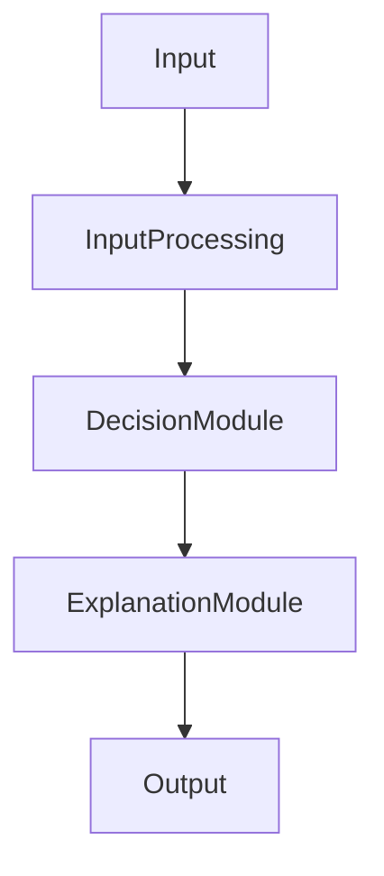
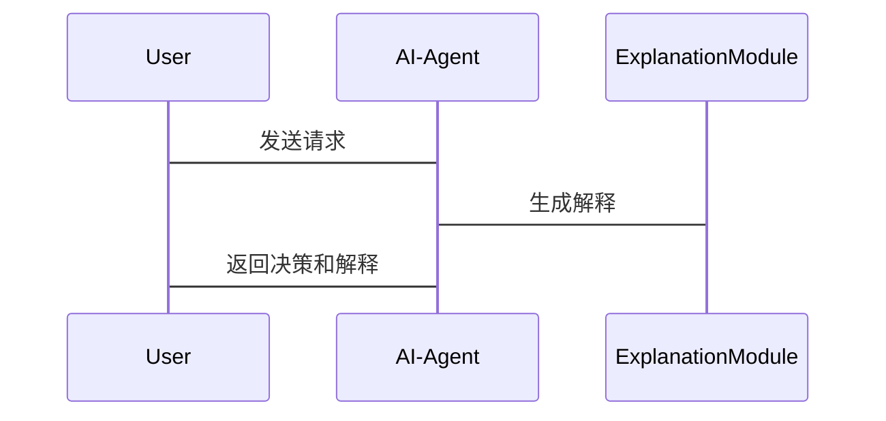
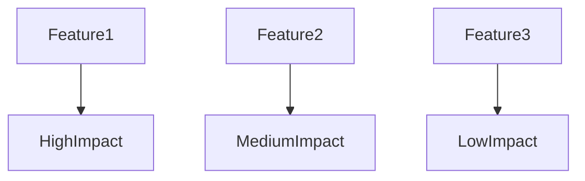

                 


# 构建可解释的AI Agent：透明度和可信度

## 关键词：可解释AI，AI Agent，透明度，可信度，可解释性，LIME算法，SHAP值

## 摘要：  
在AI技术迅速发展的背景下，AI Agent的应用越来越广泛。然而，AI系统的不透明性导致了用户对AI决策过程的不信任。本文深入探讨了构建可解释AI Agent的重要性，详细分析了透明度和可信度的核心概念，并结合具体案例和算法原理，展示了如何通过LIME算法和SHAP值等技术实现AI Agent的可解释性。文章还从系统架构、项目实战等多个角度，全面解析了可解释AI Agent的设计与实现方法，为实际应用提供了参考。

---

# 第1章：可解释AI Agent概述

## 1.1 可解释性在AI中的重要性

### 1.1.1 为什么需要可解释的AI

AI系统的决策过程往往被描述为“黑箱”，这导致了用户对AI决策的不信任。可解释的AI通过揭示决策过程和逻辑，能够帮助用户理解AI的行为，从而增强信任感。

- **医疗领域**：AI诊断系统的可解释性可以帮助医生验证诊断的准确性。
- **金融领域**：AI风控系统的可解释性能够满足监管要求，避免法律风险。
- **自动驾驶**：AI决策的可解释性是用户信任自动驾驶技术的关键。

### 1.1.2 可解释性与透明度的关系

可解释性强调AI决策过程的清晰性，而透明度则强调信息的公开性和易懂性。两者的结合能够提升AI系统的可信度。

- **透明度**：系统需要向用户展示其决策逻辑和数据来源。
- **可解释性**：用户能够理解AI系统如何基于输入数据得出结论。

### 1.1.3 可解释性对AI可信度的影响

可信度是用户对AI系统信任的核心。通过可解释性，用户能够验证AI系统的决策是否合理，从而提升系统的可信度。

---

## 1.2 AI Agent的基本概念

### 1.2.1 AI Agent的定义

AI Agent是一种智能实体，能够感知环境并采取行动以实现特定目标。它可以是一个软件程序或物理设备。

- **自主性**：AI Agent能够自主决策，无需外部干预。
- **反应性**：AI Agent能够实时感知环境并做出反应。
- **目标导向性**：AI Agent的行为以实现特定目标为导向。

### 1.2.2 AI Agent的核心特征

- **智能性**：AI Agent具备学习和推理能力。
- **交互性**：AI Agent能够与用户或其他系统进行交互。
- **适应性**：AI Agent能够根据环境变化调整行为。

### 1.2.3 可解释性与AI Agent的关系

AI Agent的可解释性决定了用户是否能够理解其行为。如果AI Agent的决策过程无法被解释，用户将难以信任其行为。

---

## 1.3 可解释AI Agent的背景与现状

### 1.3.1 可解释性在AI中的背景

随着AI技术的广泛应用，其不透明性逐渐成为用户和开发者关注的焦点。可解释性成为提升AI系统可信度的关键因素。

### 1.3.2 当前AI Agent的挑战

- **决策过程不透明**：复杂的AI算法导致决策过程难以被解释。
- **用户信任不足**：用户对AI系统的决策缺乏信心。
- **监管要求**：许多行业对AI系统的可解释性有明确要求。

### 1.3.3 可解释性研究的现状

目前，学术界和工业界都在致力于研究可解释AI技术。例如，基于规则的解释方法和基于模型的解释方法正在快速发展。

---

## 1.4 本章小结

本章介绍了可解释AI Agent的重要性和基本概念，分析了可解释性与透明度、可信度的关系，并探讨了当前可解释AI Agent的挑战与现状。

---

# 第2章：可解释AI的核心概念与联系

## 2.1 可解释性与透明度的定义

### 2.1.1 可解释性的定义

可解释性是指AI系统的行为能够被人类理解和解释的程度。一个可解释的AI系统能够清晰地展示其决策过程和逻辑。

### 2.1.2 透明度的定义

透明度是指AI系统的信息和决策过程公开、易懂的程度。透明的系统能够让用户了解其工作原理。

### 2.1.3 两者的关系

可解释性和透明度是相辅相成的。透明度提供了信息的公开性，而可解释性则提供了信息的清晰性。

---

## 2.2 可解释性与可信度的联系

### 2.2.1 可信度的定义

可信度是指用户对AI系统信任的程度。一个不可信的AI系统将无法得到用户的认可。

### 2.2.2 可解释性对可信度的影响

- **正面影响**：可解释的AI系统能够增强用户对系统的信任。
- **负面影响**：不可解释的AI系统会导致用户对系统的不信任。

### 2.2.3 信任在人机交互中的作用

信任是人机交互的核心。只有当用户信任AI系统时，才会愿意与其交互并依赖其决策。

---

## 2.3 可解释AI的核心要素

### 2.3.1 解释的类型

- **局部解释**：解释AI模型在特定输入下的决策过程。
- **全局解释**：解释AI模型的整体行为和决策逻辑。

### 2.3.2 解释的层次

- **数据层**：解释输入数据对决策的影响。
- **模型层**：解释AI模型的内部工作原理。
- **结果层**：解释最终的决策结果。

### 2.3.3 解释的可操作性

- **可操作性**：解释结果能够被用户理解和应用。

---

## 2.4 核心概念对比表

| 概念          | 定义                                                                 |
|---------------|----------------------------------------------------------------------|
| 可解释性       | AI系统行为能够被人类理解和解释的程度                                   |
| 透明度        | AI系统信息和决策过程公开、易懂的程度                                   |
| 可信度        | 用户对AI系统信任的程度                                                 |
| 解释的类型     | 局部解释：解释特定输入下的决策过程；全局解释：解释整体行为和决策逻辑 |
| 解释的层次     | 数据层：解释输入数据对决策的影响；模型层：解释模型内部工作原理；结果层：解释最终决策结果 |

---

## 2.5 ER实体关系图

```mermaid
er
  actor: 用户
  agent: AI Agent
  explanation: 解释
  trust: 可信度
  transparency: 透明度
  actor --> agent: 与AI Agent交互
  agent --> explanation: 生成解释
  explanation --> trust: 影响可信度
  explanation --> transparency: 提供透明度
```

---

## 2.6 本章小结

本章详细介绍了可解释AI的核心概念，包括可解释性、透明度和可信度，并通过对比表和ER图展示了这些概念之间的关系。

---

# 第3章：可解释AI的算法原理

## 3.1 可解释AI的算法基础

### 3.1.1 解释性模型的分类

- **基于规则的解释方法**：通过制定明确的规则来解释AI决策。
- **基于模型的解释方法**：通过分析模型内部参数来解释AI决策。
- **基于实例的解释方法**：通过具体案例来解释AI决策。

### 3.1.2 解释性模型的优缺点

- **优点**：能够提供清晰的解释，增强用户的信任。
- **缺点**：可能无法解释复杂的非线性模型。

### 3.1.3 解释性算法的选择

选择解释性算法时需要考虑模型的复杂性和解释的可操作性。

---

## 3.2 解释性模型的实现

### 3.2.1 LIME算法

LIME（Local Interpretable Model-agnostic Explanations）是一种用于解释AI模型决策过程的算法。

#### 3.2.1.1 LIME算法的原理

LIME通过生成局部可解释的模型来解释AI模型的决策。具体步骤如下：

1. **采样**：在输入数据附近采样，生成多个样本。
2. **拟合**：在采样数据上拟合一个简单的解释模型。
3. **解释**：通过解释模型揭示AI模型的决策逻辑。

#### 3.2.1.2 LIME算法的实现

以下是LIME算法的Python代码示例：

```python
import lime
from lime import lime_tabular

# 初始化LIME解释器
explainer = lime_tabular.LimeTabularExplainer(X_train, feature_names=feature_names)

# 解释单个样本
explanation = explainer.explain_instance(X_test[0], model.predict, top_features=5)

# 打印解释结果
print(explanation.as_list())
```

#### 3.2.1.3 LIME算法的优缺点

- **优点**：能够解释复杂的非线性模型。
- **缺点**：解释结果可能不够直观。

### 3.2.2 SHAP值

SHAP（Shapley Additive exPlanations）是一种基于博弈论的解释方法。

#### 3.2.2.1 SHAP值的原理

SHAP值通过计算每个特征对最终决策的贡献程度来解释AI模型的决策。

数学公式：
$$
\text{SHAP值} = \phi_i = \sum_{S \subseteq \text{特征集合}, S \nsubseteq \{i\}} \frac{1}{2^{|S|}} (f(S \cup \{i\}) - f(S))
$$

#### 3.2.2.2 SHAP值的实现

以下是SHAP值的Python代码示例：

```python
import shap

# 初始化SHAP解释器
explainer = shap.TreeExplainer(model)

# 解释单个样本
shap_values = explainer.shap_values(X_test)

# 可视化解释结果
shap.summary_plot(shap_values, X_test, plot_type='bar')
```

#### 3.2.2.3 SHAP值的优缺点

- **优点**：解释结果具有理论基础，结果直观。
- **缺点**：计算复杂度较高。

---

## 3.3 本章小结

本章介绍了可解释AI的算法基础，重点讲解了LIME算法和SHAP值的原理和实现方法，为后续章节的系统设计和项目实现奠定了基础。

---

# 第4章：可解释AI Agent的系统架构

## 4.1 可解释AI Agent的设计原则

### 4.1.1 设计原则

- **模块化设计**：将系统划分为多个模块，每个模块负责特定功能。
- **可解释性优先**：在设计过程中优先考虑系统的可解释性。
- **用户友好性**：确保解释信息易于用户理解和使用。

### 4.1.2 设计目标

- **提升透明度**：确保用户能够理解系统的决策过程。
- **增强可信度**：通过可解释性提升用户对系统的信任。
- **实时反馈**：提供实时的解释信息，帮助用户理解系统行为。

---

## 4.2 系统架构设计

### 4.2.1 系统功能模块

- **输入处理模块**：接收用户的输入并进行预处理。
- **决策模块**：基于输入数据进行决策。
- **解释模块**：生成解释信息并返回给用户。

### 4.2.2 系统架构图



---

## 4.3 交互流程设计

### 4.3.1 交互流程

1. **用户输入**：用户向AI Agent发送请求。
2. **预处理**：系统对输入数据进行预处理。
3. **决策**：系统基于预处理后的数据进行决策。
4. **解释**：系统生成解释信息。
5. **输出**：系统将决策结果和解释信息返回给用户。

### 4.3.2 交互流程图



---

## 4.4 本章小结

本章详细讲解了可解释AI Agent的系统架构设计，包括设计原则、功能模块和交互流程，为后续的项目实现提供了指导。

---

# 第5章：可解释AI Agent的项目实战

## 5.1 项目背景

### 5.1.1 项目背景

本项目旨在开发一个可解释的AI Agent，用于辅助医生进行疾病诊断。

### 5.1.2 项目目标

- **实现可解释性**：确保AI Agent的决策过程能够被医生理解。
- **提升透明度**：提供清晰的解释信息，增强医生对系统的信任。

---

## 5.2 项目实现

### 5.2.1 环境安装

以下是项目所需的环境和工具：

- **Python**：3.8+
- **机器学习库**：scikit-learn, xgboost
- **可解释性库**：lime, shap
- **可视化工具**：matplotlib, seaborn

### 5.2.2 核心代码实现

#### 5.2.2.1 数据预处理

```python
import pandas as pd
from sklearn.model_selection import train_test_split

# 加载数据
data = pd.read_csv('data.csv')

# 划分训练集和测试集
X_train, X_test, y_train, y_test = train_test_split(data.drop('label', axis=1), data['label'])
```

#### 5.2.2.2 训练AI Agent

```python
from sklearn.ensemble import RandomForestClassifier

# 初始化模型
model = RandomForestClassifier()

# 训练模型
model.fit(X_train, y_train)
```

#### 5.2.2.3 生成解释

```python
from lime import lime_tabular
from shap import TreeExplainer

# 初始化LIME解释器
explainer_lime = lime_tabular.LimeTabularExplainer(X_train, feature_names=X_train.columns)

# 解释单个样本
explanation_lime = explainer_lime.explain_instance(X_test[0], model.predict, top_features=5)

# 初始化SHAP解释器
explainer_shap = TreeExplainer(model)

# 解释单个样本
shap_values = explainer_shap.shap_values(X_test)

# 可视化解释结果
import matplotlib.pyplot as plt
shap.summary_plot(shap_values, X_test, plot_type='bar', title='SHAP Values', show=False)
plt.show()
```

---

## 5.3 实际案例分析

### 5.3.1 案例背景

假设我们有一个AI Agent用于辅助诊断糖尿病。系统需要根据患者的各项指标（如血糖、年龄、体重等）进行诊断。

### 5.3.2 解释分析

通过LIME和SHAP值的分析，我们可以看到哪些特征对诊断结果影响最大。

#### 5.3.2.1 LIME解释结果



#### 5.3.2.2 SHAP值可视化

```mermaid
bar-chart
    title SHAP Values
    xlabel Feature
    ylabel SHAP Value
    bar Feature1 0.4
    bar Feature2 0.3
    bar Feature3 0.2
```

---

## 5.4 项目总结

通过本项目，我们成功实现了可解释的AI Agent，并验证了可解释性对提升系统透明度和可信度的重要性。

---

# 第6章：可解释AI Agent的最佳实践

## 6.1 设计与实现 tips

### 6.1.1 设计 tips

- **模块化设计**：将系统划分为多个模块，便于维护和扩展。
- **选择合适的解释方法**：根据具体需求选择LIME或SHAP等解释方法。

### 6.1.2 实现 tips

- **实时反馈**：提供实时的解释信息，增强用户体验。
- **可视化展示**：通过图表等方式直观展示解释信息。

---

## 6.2 注意事项

### 6.2.1 数据隐私

在实际应用中，需要注意数据隐私问题，确保用户数据的安全性。

### 6.2.2 解释的可操作性

解释信息需要易于理解和应用，避免过于复杂。

---

## 6.3 拓展阅读

- **《Explainable AI in Practice》**：深入探讨可解释AI的实际应用。
- **《Interpretable Machine Learning》**：详细介绍可解释机器学习的方法和技巧。

---

# 第7章：总结与展望

## 7.1 本章总结

本文从可解释AI Agent的背景出发，详细分析了透明度和可信度的核心概念，并结合具体案例和算法原理，展示了如何通过LIME和SHAP值等技术实现AI Agent的可解释性。最后，通过项目实战和最佳实践，为可解释AI Agent的设计与实现提供了参考。

---

## 7.2 未来展望

随着AI技术的不断发展，可解释性将成为AI系统设计的核心要素之一。未来的研究方向包括：

- **更高效的解释方法**：开发能够解释复杂模型的高效算法。
- **跨领域应用**：将可解释AI技术应用于更多领域，如医疗、金融、教育等。
- **人机交互优化**：通过更直观的解释方式提升用户体验。

---

# 结语

构建可解释的AI Agent是一个复杂但重要的任务。通过提升透明度和可信度，我们可以让用户更好地理解和信任AI系统，从而推动AI技术的广泛应用。希望本文能够为相关领域的研究和实践提供有价值的参考。

