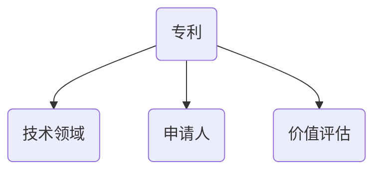
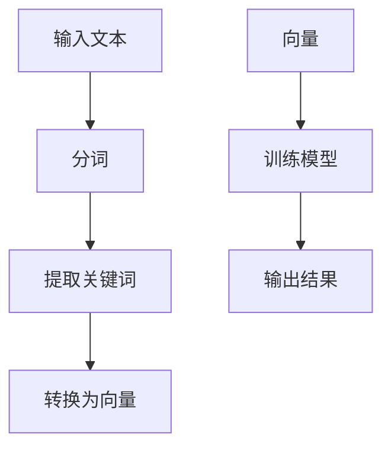
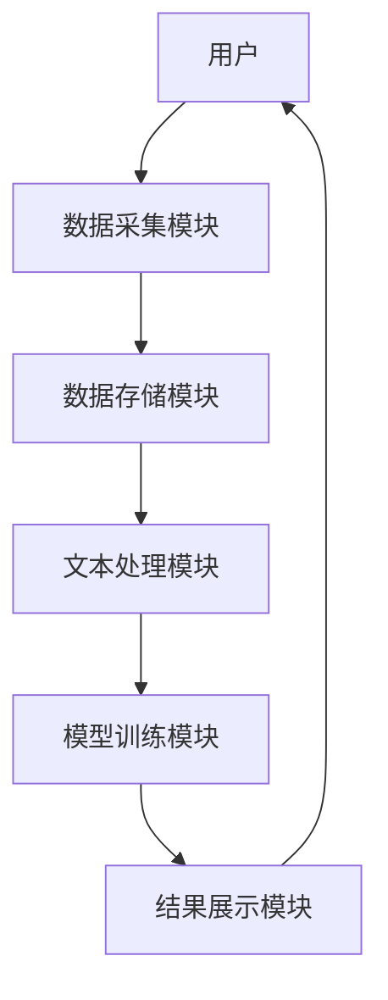

                 


# 《构建基于NLP的金融专利价值动态评估系统》

## 关键词：NLP, 金融专利, 价值评估, 文本挖掘, 机器学习

## 摘要：本文介绍了一种基于自然语言处理技术的金融专利价值动态评估系统。通过分析专利文本，利用NLP技术提取关键信息，构建机器学习模型，实现对专利技术价值的动态评估。文章详细探讨了系统设计、算法实现和项目实战，为金融专利评估提供了新思路。

---

# 第1章: 金融专利价值动态评估系统背景与需求

## 1.1 问题背景与目标

### 1.1.1 问题背景
金融领域的专利评估是衡量技术创新和市场价值的重要指标。传统的专利评估方法依赖于人工分析，效率低且主观性强。随着NLP技术的发展，通过自动分析专利文本，可以实现对专利价值的动态、客观评估。

### 1.1.2 系统目标
构建一个基于NLP的金融专利价值动态评估系统，能够自动提取专利文本中的关键信息，分析技术领域、申请人信息、技术成熟度等维度，预测专利的经济价值。

### 1.1.3 系统价值
- 提高专利评估的效率和准确性。
- 为企业和技术转移提供数据支持。
- 为金融投资提供决策参考。

---

## 1.2 金融专利数据的特点

### 1.2.1 数据结构化
专利数据包括专利号、申请人、申请日期、技术领域、摘要、权利要求等结构化信息。

### 1.2.2 数据多样性
专利涉及的技术领域广泛，包括金融、法律、技术等多个方面。

### 1.2.3 数据复杂性
专利文本包含大量专业术语和法律条款，需要深度语义分析。

---

## 1.3 系统需求分析

### 1.3.1 功能需求
- 数据采集与预处理。
- 文本挖掘与特征提取。
- 价值评估模型构建。
- 结果可视化。

### 1.3.2 性能需求
- 高效处理大量专利数据。
- 高精度的评估结果。

### 1.3.3 用户需求
- 专利申请人：评估自身专利价值。
- 投资者：寻找高价值专利进行投资。
- 企业：监控竞争对手的技术动态。

---

## 1.4 本章小结
本章介绍了金融专利评估的重要性和系统目标，分析了专利数据的特点和系统需求，为后续系统设计奠定了基础。

---

# 第2章: 基于NLP的金融专利价值评估核心概念

## 2.1 NLP在金融领域的应用

### 2.1.1 文本分类
- 专利分类：根据专利内容将其分为不同技术领域。
- 情感分析：分析专利文本中的情感倾向，评估技术成熟度。

### 2.1.2 实体识别
- 识别专利中的关键实体，如申请人、发明人、技术领域等。

### 2.1.3 关系抽取
- 分析专利之间的引用关系，构建技术网络。

---

## 2.2 金融专利价值评估的关键维度

### 2.2.1 技术创新性
- 专利的创新程度。
- 技术领域的前沿性。

### 2.2.2 技术成熟度
- 专利的实施难度。
- 技术的可行性。

### 2.2.3 市场需求
- 技术的市场潜力。
- 专利的经济价值。

---

## 2.3 系统核心概念与ER架构

### 2.3.1 实体关系图


### 2.3.2 关系分析
- 专利与技术领域的多对多关系。
- 专利与申请人的多对一关系。

---

## 2.4 本章小结
本章介绍了NLP在金融领域的应用，分析了专利价值评估的关键维度，并通过ER图展示了系统的实体关系，为后续系统设计提供了理论基础。

---

# 第3章: 基于NLP的金融专利价值评估算法原理

## 3.1 算法原理概述

### 3.1.1 词嵌入
- 使用Word2Vec或BERT对专利文本进行词嵌入，提取语义信息。

### 3.1.2 文本相似度
- 计算专利文本之间的相似度，用于技术领域聚类。

### 3.1.3 模型训练
- 基于机器学习算法（如SVM、随机森林）训练价值评估模型。

---

## 3.2 算法实现流程

### 3.2.1 数据预处理
- 分词：将专利文本分割为词语。
- 去停用词：去除无意义的词汇。
- 词干提取：将词语还原为词干。

### 3.2.2 特征提取
- 使用TF-IDF提取关键词。
- 词嵌入：将词语转换为向量表示。

### 3.2.3 模型训练
- 将特征向量输入模型，训练价值评估模型。

---

## 3.3 算法流程图



---

## 3.4 数学公式

### 3.4.1 TF-IDF计算公式
$$
\text{TF}(t, d) = \frac{\text{count}(t, d)}{\text{length}(d)}
$$
$$
\text{IDF}(t) = \log\left(\frac{N}{\text{count}(t)}\right)
$$
$$
\text{TF-IDF}(t, d) = \text{TF}(t, d) \times \text{IDF}(t)
$$

### 3.4.2 余弦相似度公式
$$
\text{similarity}(d1, d2) = \frac{\sum d1 \cdot d2}{\sqrt{\sum d1^2} \times \sqrt{\sum d2^2}}
$$

---

## 3.5 本章小结
本章详细介绍了NLP算法在金融专利评估中的应用，包括词嵌入、文本相似度计算和机器学习模型训练的数学公式，为系统实现提供了理论依据。

---

# 第4章: 金融专利价值评估系统架构设计

## 4.1 系统功能模块划分

### 4.1.1 数据采集模块
- 采集专利数据，包括文本和结构化信息。

### 4.1.2 文本处理模块
- 对专利文本进行分词、去停用词等预处理。

### 4.1.3 模型训练模块
- 基于NLP算法训练价值评估模型。

### 4.1.4 结果展示模块
- 可视化展示评估结果。

---

## 4.2 系统功能设计

### 4.2.1 专利数据管理
- 数据存储与检索。
- 数据清洗与预处理。

### 4.2.2 价值评估功能
- 技术领域分析。
- 专利价值预测。

### 4.2.3 结果展示
- 图表展示评估结果。
- 报告生成。

---

## 4.3 系统架构图



---

## 4.4 系统接口设计

### 4.4.1 数据接口
- REST API接口，用于数据交互。

### 4.4.2 模型接口
- 接收文本输入，返回评估结果。

---

## 4.5 本章小结
本章设计了金融专利价值评估系统的架构，包括功能模块划分、系统架构图和接口设计，为后续实现奠定了基础。

---

# 第5章: 项目实战与系统实现

## 5.1 项目环境搭建

### 5.1.1 工具安装
- 安装Python、Jupyter Notebook。
- 安装NLP库：如spaCy、Gensim。

### 5.1.2 数据准备
- 下载专利数据集。
- 数据清洗与预处理。

---

## 5.2 系统核心实现

### 5.2.1 数据预处理代码
```python
import spacy

nlp = spacy.load("en_core_web_sm")

text = "This is a sample text for NLP processing."
doc = nlp(text)

for token in doc:
    print(token.text, token.pos_, token.lemma_)
```

### 5.2.2 词嵌入代码
```python
from gensim.models import Word2Vec

sentences = ["This is a sentence.", "Another sentence."]
model = Word2Vec(sentences, vector_size=100, window=5, min_count=1, workers=2)
```

---

## 5.3 项目实战分析

### 5.3.1 数据分析
- 统计专利数量分布。
- 分析技术领域热度。

### 5.3.2 模型优化
- 调整模型参数，提高评估精度。

### 5.3.3 结果可视化
- 使用图表展示评估结果。

---

## 5.4 本章小结
本章通过项目实战，详细讲解了系统的实现过程，包括环境搭建、核心代码实现和项目分析，帮助读者掌握系统的实际应用。

---

# 第6章: 系统实现与优化

## 6.1 系统实现细节

### 6.1.1 数据预处理
- 分词、去停用词、词干提取。

### 6.1.2 特征提取
- TF-IDF、词嵌入。

### 6.1.3 模型训练
- 使用SVM或随机森林训练分类器。

---

## 6.2 系统优化策略

### 6.2.1 数据优化
- 数据清洗与增强。
- 数据特征选择。

### 6.2.2 模型优化
- 调整模型参数。
- 使用深度学习模型（如BERT）提升性能。

---

## 6.3 系统结果分析

### 6.3.1 评估指标
- 准确率、召回率、F1值。

### 6.3.2 结果可视化
- 使用混淆矩阵展示分类结果。

---

## 6.4 本章小结
本章详细讲解了系统的实现与优化策略，包括数据预处理、模型训练和结果分析，为读者提供了系统的优化方向。

---

# 第7章: 总结与展望

## 7.1 项目总结

### 7.1.1 核心成果
- 成功构建了基于NLP的金融专利价值评估系统。
- 实现了专利文本的自动分析和价值评估。

### 7.1.2 实践经验
- 数据预处理的重要性。
- 模型选择与优化的关键性。

---

## 7.2 项目经验与启示

### 7.2.1 关键点总结
- 数据质量对评估结果的影响。
- 模型选择与调优的重要性。

### 7.2.2 未来展望
- 引入深度学习模型提升性能。
- 扩展更多金融领域的应用。

---

## 7.3 本章小结
本章总结了项目的成果和经验，并展望了未来的发展方向，为读者提供了系统的改进和扩展思路。

---

# 参考文献
（此处列出相关文献和资料）

---

通过以上内容，我们详细介绍了基于NLP的金融专利价值动态评估系统的构建过程，从理论分析到实践实现，为读者提供了全面的技术指导。

