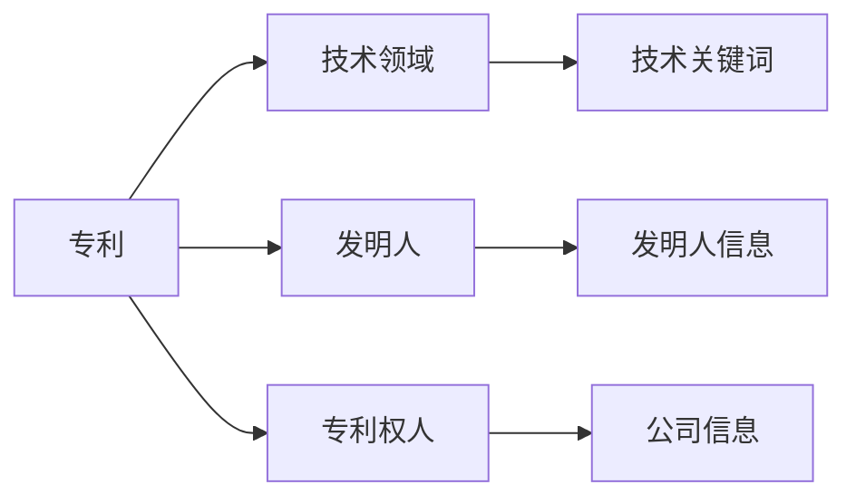

                 


# 构建基于NLP的金融专利价值评估系统

## 关键词：NLP, 金融专利, 价值评估, 机器学习, 信息抽取

## 摘要：本文详细介绍了如何利用自然语言处理（NLP）技术构建一个高效的金融专利价值评估系统。通过分析专利文本中的关键信息，结合机器学习算法，该系统能够自动评估专利的价值，帮助金融机构做出更明智的决策。文章涵盖了系统设计、算法实现、项目实战等部分内容，提供了从理论到实践的全面指导。

---

## 第1章: 金融专利价值评估的背景与挑战

### 1.1 金融专利的基本概念

#### 1.1.1 什么是金融专利
金融专利是指在金融领域（如银行、保险、证券等）的创新技术或方法所获得的专利。这些专利通常涉及新的金融产品、交易机制、风险管理方法等。

#### 1.1.2 金融专利的价值评估意义
专利的价值评估对于金融机构来说至关重要。它可以帮助企业确定专利的市场价值，优化资产配置，提升竞争力。

#### 1.1.3 金融专利与传统专利的区别
与传统专利相比，金融专利具有更强的商业应用性和数据敏感性。金融专利通常涉及复杂的金融模型和商业逻辑，对文本分析的要求更高。

### 1.2 NLP在金融领域的应用

#### 1.2.1 NLP技术的基本概念
自然语言处理（NLP）是一门研究如何让计算机理解和生成人类语言的科学。它涵盖了文本处理、信息抽取、情感分析等多个方面。

#### 1.2.2 NLP在金融信息处理中的作用
在金融领域，NLP主要用于新闻分析、股价预测、风险评估等。通过处理大量文本数据，NLP可以帮助金融机构做出更准确的决策。

#### 1.2.3 NLP与金融专利分析的结合
将NLP应用于金融专利分析，可以提取专利中的技术关键词、发明人信息、专利权人信息等，为价值评估提供数据支持。

### 1.3 金融专利价值评估的挑战

#### 1.3.1 数据获取的难度
金融专利数据分散在不同的专利数据库中，获取难度大且成本高。

#### 1.3.2 专利文本的复杂性
金融专利文本通常包含大量的专业术语和复杂的句式结构，增加了文本处理的难度。

#### 1.3.3 评估指标的多样性
专利的价值评估涉及多个维度，如技术成熟度、市场潜力、法律风险等，如何综合这些指标进行评估是一个挑战。

---

## 第2章: 问题背景与需求分析

### 2.1 问题背景

#### 2.1.1 金融专利价值评估的重要性
准确评估专利价值可以帮助金融机构优化资产配置，提升市场竞争力。

#### 2.1.2 当前评估方法的局限性
传统评估方法依赖人工分析，效率低下且容易受到主观因素的影响。

#### 2.1.3 引入NLP技术的必要性
通过引入NLP技术，可以自动化处理专利文本，提取关键信息，提高评估效率和准确性。

### 2.2 需求分析

#### 2.2.1 系统功能需求
- 数据采集模块：从专利数据库中获取专利信息。
- 文本预处理模块：对专利文本进行清洗和分词。
- 特征提取模块：提取文本中的关键技术特征。
- 评估模型模块：基于特征训练评估模型。
- 结果展示模块：以可视化方式展示评估结果。

#### 2.2.2 系统性能需求
- 高效处理大量专利文本。
- 准确的特征提取和评估结果。
- 可扩展的系统架构。

#### 2.2.3 用户需求分析
- 用户需要快速获取专利评估结果。
- 用户需要直观的结果展示和详细的分析报告。

---

## 第3章: 系统核心概念与联系

### 3.1 核心概念原理

#### 3.1.1 NLP技术在专利分析中的应用
- 信息抽取：提取专利中的关键技术术语。
- 实体识别：识别发明人、专利权人等实体信息。
- 情感分析：分析专利文本的情感倾向。

#### 3.1.2 金融专利的特征提取
- 技术关键词：如“区块链”、“人工智能”等。
- 发明人信息：发明人的背景和声誉。
- 专利权人信息：公司的技术实力和市场地位。

#### 3.1.3 专利价值评估模型的构建
- 基于机器学习的回归模型。
- 输入特征：技术关键词、发明人信息、专利申请时间等。
- 输出结果：专利的市场价值评分。

### 3.2 核心概念属性对比表

| 对比维度 | 传统评估方法 | 基于NLP的评估方法 |
|----------|---------------|-------------------|
| 数据来源 | 依赖人工调研 | 利用专利文本数据 |
| 分析效率 | 低效 | 高效 |
| 结果准确性 | 受主观因素影响大 | 更客观准确 |

### 3.3 实体关系图



---

## 第4章: 系统架构设计

### 4.1 系统总体架构


### 4.2 功能模块划分

#### 4.2.1 数据采集模块
负责从专利数据库中获取专利信息，可能涉及API调用或爬虫技术。

#### 4.2.2 文本预处理模块
对专利文本进行清洗、分词、去除停用词等预处理步骤。

#### 4.2.3 特征提取模块
使用TF-IDF或词嵌入技术提取文本特征。

#### 4.2.4 评估模型模块
基于机器学习算法训练评估模型，预测专利的价值。

#### 4.2.5 结果展示模块
以图表形式展示评估结果，方便用户理解和决策。

---

## 第5章: 系统设计与实现

### 5.1 数据采集模块

#### 5.1.1 数据来源
- 专利数据库：如USPTO、WIPO等。
- 网络爬虫：从公开专利数据库中抓取数据。

#### 5.1.2 数据清洗
- 去除重复数据。
- 处理缺失值。

### 5.2 文本预处理模块

#### 5.2.1 分词
使用NLTK库对专利文本进行分词。

#### 5.2.2 去除停用词
移除常见的停用词，如“the”、“and”等。

#### 5.2.3 词干提取
将单词转换为其基本形式，如“computing”转换为“compute”。

### 5.3 特征提取模块

#### 5.3.1 TF-IDF特征提取
计算文本中各词项的TF-IDF值，作为特征向量。

#### 5.3.2 词嵌入技术
使用Word2Vec或BERT模型生成词向量。

### 5.4 评估模型模块

#### 5.4.1 回归模型
使用线性回归或神经网络模型，基于特征向量预测专利价值。

#### 5.4.2 模型训练
将特征向量输入模型，训练出最佳参数。

### 5.5 结果展示模块

#### 5.5.1 可视化
使用Matplotlib或Seaborn库生成图表，展示评估结果。

#### 5.5.2 报告生成
生成详细的评估报告，包括专利列表、评估结果等。

---

## 第6章: 项目实战

### 6.1 环境安装

```bash
pip install numpy
pip install pandas
pip install nltk
pip install scikit-learn
pip install matplotlib
```

### 6.2 核心代码实现

#### 6.2.1 数据采集

```python
import requests
from bs4 import BeautifulSoup

def fetch_patent_data(url):
    response = requests.get(url)
    soup = BeautifulSoup(response.text, 'html.parser')
    patents = []
    for item in soup.find_all('item'):
        title = item.find('title').text
        abstract = item.find('abstract').text
        patents.append({'title': title, 'abstract': abstract})
    return patents
```

#### 6.2.2 文本预处理

```python
import nltk

def preprocess(text):
    tokens = nltk.word_tokenize(text)
    tokens = [token.lower() for token in tokens if token.isalpha()]
    return tokens
```

#### 6.2.3 特征提取

```python
from sklearn.feature_extraction.text import TfidfVectorizer

vectorizer = TfidfVectorizer(max_features=1000)
X = vectorizer.fit_transform(documents)
```

#### 6.2.4 模型训练

```python
from sklearn.linear_model import LinearRegression

model = LinearRegression()
model.fit(X, y)
```

### 6.3 实际案例分析

假设我们有一个专利数据库，包含以下字段：
- 专利标题
- 专利摘要
- 申请日期
- 发明人信息

我们可以通过上述代码提取这些文本信息，生成TF-IDF特征向量，并使用回归模型预测专利的价值。

---

## 第7章: 最佳实践与小结

### 7.1 小结
本文详细介绍了如何利用NLP技术构建一个金融专利价值评估系统。通过数据采集、文本预处理、特征提取、模型训练和结果展示五个模块，我们可以高效、准确地评估专利的价值。

### 7.2 注意事项
- 数据隐私问题：确保专利数据的合法使用。
- 模型可解释性：选择合适的模型，确保评估结果的可解释性。
- 持续优化：定期更新模型，以应对新的专利类型和技术变化。

### 7.3 未来展望
随着NLP技术的不断发展，金融专利价值评估系统将更加智能化和精准化。未来可以考虑引入更复杂的模型，如深度学习模型，进一步提高评估的准确性。

---

通过本文的指导，读者可以深入了解如何利用NLP技术构建金融专利价值评估系统，并实际应用到自己的项目中。希望本文对读者有所帮助！

