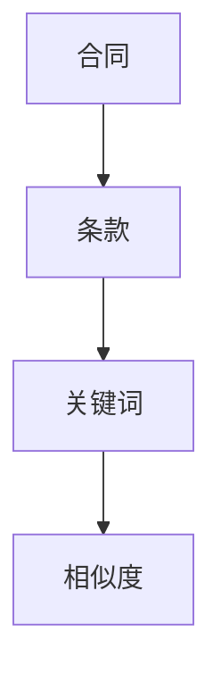
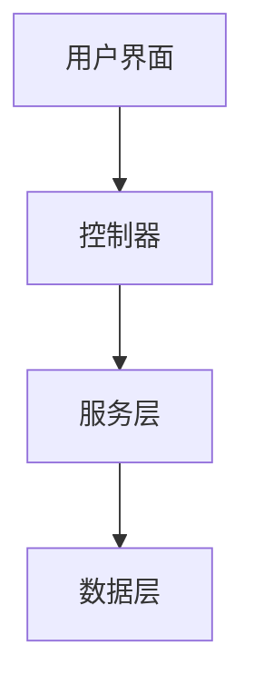

                 


# 构建基于NLP的金融合同条款比较系统

## 关键词：自然语言处理，合同比较，金融法律，文本挖掘，相似度计算

## 摘要：本文将详细介绍如何利用自然语言处理技术构建一个高效的金融合同条款比较系统。通过分析合同文本的结构和内容，结合文本挖掘和相似度计算，系统能够自动识别和比较合同中的关键条款，提高金融交易的效率和准确性。

---

## 第一部分：问题背景与需求分析

### 第1章：问题背景介绍

#### 1.1 金融合同的基本概念与特点

金融合同是金融交易中的法律文件，通常包含复杂的条款和条件。这些合同涉及贷款、投资、担保等金融行为，具有法律效力和专业性。

- **特点**：
  - **法律约束力**：合同中的条款具有法律效力，必须准确无误。
  - **专业术语多**：涉及金融领域的专业术语，如“年利率”、“违约金”等。
  - **结构复杂**：合同通常分为多个章节，条款繁多，内容详细。

#### 1.2 合同条款比较的必要性与挑战

在金融交易中，比较不同合同的条款是常见的需求，例如比较贷款合同的利率条款、担保条款等。传统的比较方法依赖人工阅读和分析，效率低且容易出错。

- **挑战**：
  - **信息量大**：合同条款数量多，手动比较耗时耗力。
  - **术语一致性**：不同合同可能使用不同的术语，增加了比较的难度。
  - **法律风险**：误读条款可能导致法律纠纷，风险较高。

#### 1.3 NLP技术在合同比较中的应用潜力

自然语言处理（NLP）技术能够自动提取和分析文本信息，为合同比较提供高效解决方案。通过NLP，系统可以自动识别关键条款，计算相似度，生成比较报告。

---

### 第2章：问题描述与目标

#### 2.1 问题描述

本系统的目标是构建一个基于NLP的金融合同条款比较系统，能够自动识别合同中的关键条款，并比较其相似度。

- **核心问题**：
  - 如何准确提取合同中的关键条款？
  - 如何计算条款之间的相似度？
  - 如何生成清晰的比较报告？

#### 2.2 系统目标与功能定位

系统的功能包括：

- **文本预处理**：对合同文本进行清洗和分词。
- **特征提取**：提取关键术语和句子。
- **相似度计算**：使用NLP模型计算条款相似度。
- **结果展示**：生成比较报告，突出显示差异。

#### 2.3 边界与外延

系统不处理合同的法律咨询和解释，仅提供比较和差异分析。

---

### 第3章：核心概念与联系

#### 3.1 NLP技术的核心原理

NLP通过处理文本数据，提取有用信息。常用技术包括分词、词性标注、实体识别等。

- **分词**：将文本分割成词语或短语。
- **词性标注**：识别词语的词性，如名词、动词。
- **实体识别**：识别文本中的实体，如人名、组织名。

#### 3.2 合同条款比较的实体关系图

通过ER图展示合同、条款、关键词之间的关系。



---

## 第二部分：NLP与合同比较的核心概念

### 第4章：NLP技术原理

#### 4.1 文本预处理流程

预处理是NLP的关键步骤，包括分词、去停用词、词干提取等。

- **分词**：使用分词工具将文本分割成词语。
- **去停用词**：去除无意义的词语，如“的”、“了”。
- **词干提取**：将词语转换为词干，如“competing”转换为“compete”。

#### 4.2 语义理解模型

使用词嵌入模型（如Word2Vec）生成词语的向量表示，捕捉词语的语义信息。

- **Word2Vec**：
  - 输入：词语。
  - 输出：词语的向量表示。

---

## 第三部分：算法原理

### 第5章：合同比较算法

#### 5.1 特征提取方法

- **TF-IDF**：计算词语的重要性，常用于文本特征提取。
  - TF（Term Frequency）：词语在文档中的频率。
  - IDF（Inverse Document Frequency）：词语的逆文档频率。

#### 5.2 相似度计算公式

- **余弦相似度**：
  $$ \text{similarity} = \frac{\vec{A} \cdot \vec{B}}{|\vec{A}| |\vec{B}|} $$

---

## 第四部分：系统架构与设计方案

### 第6章：系统架构设计

#### 6.1 功能模块划分

- **文本输入模块**：接收合同文本。
- **处理核心模块**：执行文本预处理和特征提取。
- **结果展示模块**：生成并显示比较结果。

#### 6.2 系统架构图



---

## 第五部分：项目实战

### 第7章：环境安装与代码实现

#### 7.1 环境安装

- **Python**：安装Python 3.x。
- **依赖库**：安装nltk、scikit-learn等库。

#### 7.2 核心代码实现

```python
import nltk
from sklearn.feature_extraction.text import TfidfVectorizer

# 示例文本
text1 = "贷款利率为年利率5%，按月付息。"
text2 = "贷款利息按年利率5%计算，每月支付一次。"

# 分词
tokens1 = nltk.word_tokenize(text1)
tokens2 = nltk.word_tokenize(text2)

# TF-IDF特征提取
vectorizer = TfidfVectorizer()
tfidf_matrix = vectorizer.fit_transform([text1, text2])

# 计算余弦相似度
similarity = (tfidf_matrix * tfidf_matrix.T).A[0,1]
print(f"相似度：{similarity}")
```

---

## 第六部分：总结与扩展

### 第8章：系统总结

#### 8.1 系统优缺点

- **优点**：
  - 高效：自动化处理，节省时间。
  - 准确：减少人为错误。
- **缺点**：
  - 依赖数据质量：需要高质量的合同文本。
  - 复杂性：处理专业术语和法律术语较难。

#### 8.2 未来研究方向

- 提高模型的准确性。
- 处理多语言合同。
- 结合法律知识库，提供更专业的比较结果。

---

通过以上步骤，我们详细介绍了如何构建基于NLP的金融合同条款比较系统。从背景分析到系统设计，再到项目实战，每一步都进行了深入的探讨和实现。希望这篇技术博客能为读者提供有价值的参考和启发。

