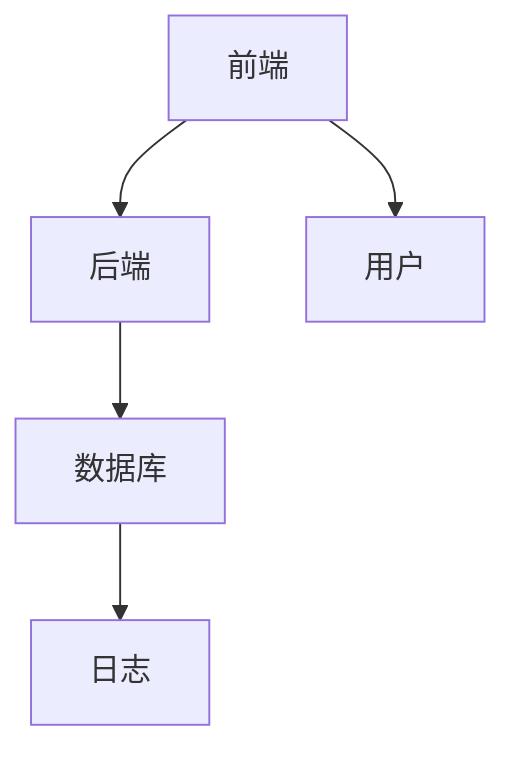

                 


# 构建基于NLP的金融合同条款自动化比对系统

> 关键词：NLP，文本相似度，合同比对，分词，机器学习

> 摘要：本文详细讲解了如何利用自然语言处理技术构建一个高效的金融合同条款自动化比对系统。通过分析问题背景、核心概念、算法原理、系统架构及项目实战，系统地阐述了从需求分析到系统实现的全过程。本文适合NLP领域的技术爱好者和金融行业从业者阅读，旨在帮助读者理解和掌握如何将NLP技术应用于实际场景。

---

## 第一部分: 背景介绍

### 第1章: 问题背景与需求分析

#### 1.1 问题背景
- **金融合同的重要性**：金融合同是金融交易的核心文件，涉及金额、责任、条款等多个方面，直接关系到交易的合法性和合规性。
- **合同条款比对的挑战**：传统的人工比对效率低、易出错，且难以处理大量复杂条款。
- **自动化比对的必要性**：通过NLP技术实现自动化比对，提高效率和准确性。

#### 1.2 问题描述
- **合同条款比对的核心问题**：如何高效、准确地识别合同中的相似或相同条款。
- **传统比对方式的局限性**：人工比对耗时长，容易遗漏关键条款。
- **自动化比对的需求场景**：快速比对多个合同，识别差异，辅助决策。

#### 1.3 问题解决
- **NLP技术的应用价值**：利用分词、相似度计算等技术实现自动化比对。
- **自动化比对系统的目标**：提高效率，减少错误，支持金融行业的合规性需求。
- **系统边界与外延**：明确系统的功能边界，如仅处理特定类型的合同条款。

#### 1.4 核心概念
- **金融合同的结构特点**：包括合同主体、权利义务、违约责任等部分。
- **合同条款的分类与特征**：如金额条款、时间条款、责任条款等。
- **自动化比对的实现逻辑**：通过文本处理、相似度计算实现自动化比对。

---

## 第2章: 核心概念与联系

### 2.1 NLP技术的核心原理
- **分词**：将文本分解为词语，如使用jieba进行分词。
- **文本相似度计算**：通过余弦相似度或深度学习模型（如BERT）计算文本相似度。
- **文本匹配**：将相似度高的文本进行匹配。

### 2.2 金融合同条款比对的实体关系
- **实体关系图（ER图）**：展示合同中的实体及其关系，如合同、条款、金额等。
- **实体间的关联关系**：如条款之间的依赖关系，金额与责任的关联。
- **实体属性与特征对比**：如金额的数值范围、条款的法律效力等。

---

## 第3章: 分词与文本预处理

### 3.1 分词算法
- **分词的基本原理**：将文本分割成词语，处理停用词和标点。
- **分词算法对比**：比较不同分词算法的优缺点，选择适合金融合同的算法。
- **金融合同文本的分词特点**：处理专业术语，如“违约金”、“担保责任”等。

### 3.2 文本预处理流程
- **去停用词**：去除无意义词汇，如“的”、“了”等。
- **文本标准化处理**：统一文本格式，如大小写转换。
- **金融术语处理**：建立金融术语词典，提高分词准确性。

---

## 第4章: 文本相似度计算

### 4.1 余弦相似度
- **原理**：计算两个向量的余弦值，值越大表示相似度越高。
- **公式**：
  $$
  \text{余弦相似度} = \frac{\vec{A} \cdot \vec{B}}{|\vec{A}| |\vec{B}|}
  $$
- **实现步骤**：将文本向量化，计算向量间的余弦相似度。

### 4.2 基于深度学习的相似度计算
- **BERT模型**：利用预训练的BERT模型计算文本的深度语义相似度。
- **实现步骤**：使用BERT模型获取文本向量，计算相似度。

---

## 第5章: 文本匹配算法

### 5.1 模糊匹配
- **原理**：基于相似度的阈值进行匹配，允许一定误差。
- **实现步骤**：计算文本相似度，判断是否超过阈值。

### 5.2 精确匹配
- **原理**：要求文本完全相同，适用于关键条款的比对。

---

## 第6章: 系统架构设计

### 6.1 项目介绍
- **系统功能**：提供合同上传、比对、结果展示等功能。
- **用户角色**：包括普通用户和管理员。

### 6.2 系统架构图


### 6.3 接口设计
- **API接口**：提供RESTful API，供前端调用。

---

## 第7章: 项目实战

### 7.1 环境安装
- **Python和依赖库**：安装jieba、sklearn等。

### 7.2 核心代码实现
```python
import jieba

def tokenize(text):
    return jieba.lcut(text)

def compute_cosine_similarity(vector1, vector2):
    dot_product = sum(a * b for a, b in zip(vector1, vector2))
    magnitude1 = sum(a**2 for a in vector1) ** 0.5
    magnitude2 = sum(a**2 for a in vector2) ** 0.5
    if magnitude1 == 0 or magnitude2 == 0:
        return 0.0
    return dot_product / (magnitude1 * magnitude2)
```

### 7.3 测试与优化
- **测试案例**：使用真实合同条款进行测试。
- **性能优化**：优化分词和相似度计算的效率。

---

## 第8章: 最佳实践

### 8.1 经验总结
- **术语处理**：建立专业术语词典。
- **模型优化**：选择合适的模型和参数。

### 8.2 注意事项
- **数据隐私**：确保合同数据的安全性。
- **性能调优**：优化系统处理速度。

---

## 第9章: 拓展阅读

### 9.1 推荐书籍
- 《自然语言处理实战》
- 《深度学习入门》

### 9.2 在线资源
- TensorFlow和PyTorch文档
- BERT模型相关论文

---

通过以上步骤，我们可以构建一个高效、准确的金融合同条款自动化比对系统，解决传统方法的低效问题，提高金融行业的合规性和效率。

