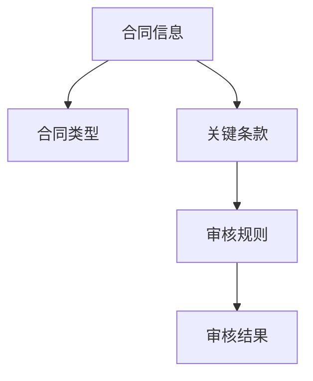
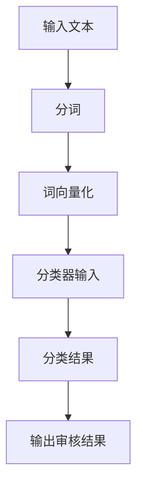
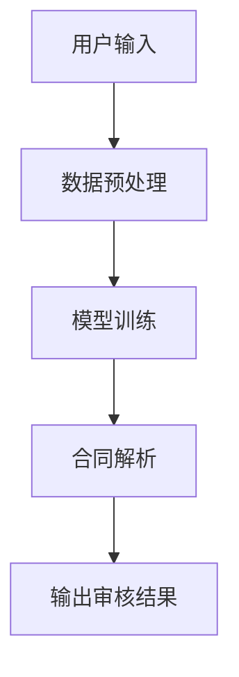
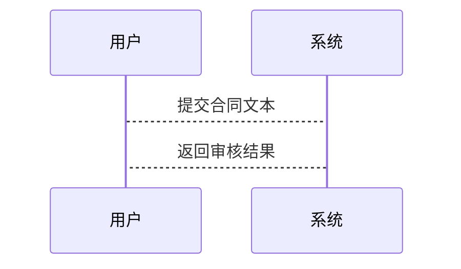

                 


# 构建基于NLP的金融合同自动化审核系统

> 关键词：NLP，金融合同，自动化审核，文本挖掘，机器学习

> 摘要：本文详细探讨了基于自然语言处理（NLP）构建金融合同自动化审核系统的全过程，从问题背景到系统实现，涵盖核心概念、算法原理、系统架构设计以及实际案例分析，旨在为读者提供一套完整的解决方案和实践指导。

---

# 第一部分: 背景介绍与核心概念

## 第1章: 问题背景与需求分析

### 1.1 问题背景
#### 1.1.1 金融合同审核的现状与挑战
金融合同审核是一项复杂且耗时的任务，传统的人工审核方式存在以下问题：
- **效率低下**：合同数量庞大，人工审核耗时长。
- **误差风险**：人为疏忽可能导致关键条款被遗漏。
- **成本高昂**：需要大量专业人员参与，增加了企业运营成本。

#### 1.1.2 传统合同审核的痛点
- **信息不对称**：合同中的专业术语和复杂条款难以快速理解。
- **审核标准不统一**：不同审核人员对合同条款的理解可能存在差异。
- **数据孤岛**：合同数据分散，难以进行统一管理和分析。

#### 1.1.3 自动化审核的必要性
随着人工智能技术的快速发展，利用NLP技术实现金融合同的自动化审核成为可能。自动化审核可以显著提高效率、降低错误率并降低成本。

### 1.2 问题描述
#### 1.2.1 金融合同的核心要素
- 合同类型（如贷款合同、保险合同等）。
- 核心条款（如金额、期限、利率等）。
- 风险提示和法律声明。

#### 1.2.2 合同审核的关键点
- 合同条款的完整性检查。
- 关键字段的识别与提取。
- 风险评估和合规性检查。

#### 1.2.3 NLP技术在合同审核中的应用潜力
- 文本分类：识别合同类型。
- 信息抽取：提取关键字段。
- 命令句识别：识别合同中的法律声明。

### 1.3 问题解决与边界
#### 1.3.1 基于NLP的合同审核解决方案
- 使用NLP技术进行合同分类和信息提取。
- 利用机器学习模型进行风险评估和合规性检查。

#### 1.3.2 系统的边界与外延
- 仅处理合同文本，不涉及其他纸质文件。
- 不覆盖合同签署和生效的法律程序。

#### 1.3.3 核心要素与组成分析
- 输入：合同文本。
- 输出：审核结果（合规/不合规）。
- 中间处理：文本预处理、信息抽取、模型训练。

## 第2章: 核心概念与联系

### 2.1 核心概念原理
#### 2.1.1 NLP技术的核心原理
- 文本预处理：分词、去停用词、词干提取。
- 特征提取：词袋模型、TF-IDF、Word2Vec。
- 分类器设计：逻辑回归、支持向量机、神经网络。

#### 2.1.2 金融合同审核的关键特征
- 合同类型。
- 核心条款。
- 文本结构。

#### 2.1.3 系统架构的整体逻辑
- 数据预处理。
- 模型训练。
- 合同解析。
- 结果输出。

### 2.2 概念属性对比表
| 概念 | 传统合同审核 | 自动化审核 |
|------|--------------|------------|
| 效率 | 低            | 高          |
| 误差率 | 高            | 低          |
| 成本 | 高            | 低          |

### 2.3 ER实体关系图


---

# 第二部分: 算法原理与数学模型

## 第3章: 算法原理讲解

### 3.1 模型训练流程
#### 3.1.1 数据预处理
- 分词：将合同文本分割成词语。
- 去停用词：去除无意义的词汇（如“的”、“是”）。
- 词向量化：将词语转换为向量表示。

#### 3.1.2 特征提取
- 词袋模型：统计每个词语的出现频率。
- TF-IDF：计算词语的重要性。
- Word2Vec：生成词语的分布式向量表示。

#### 3.1.3 分类器设计
- 逻辑回归：用于二分类任务。
- 支持向量机：适用于高维数据。
- 神经网络：处理复杂非线性关系。

### 3.2 算法流程图


### 3.3 数学模型与公式
#### 3.3.1 概率论基础
条件概率公式：
$$P(A|B) = \frac{P(B|A)P(A)}{P(B)}$$

#### 3.3.2 优化目标函数
损失函数：
$$\text{损失函数} = \sum_{i=1}^{n} \text{损失}(i)$$
优化目标：
$$\text{优化目标} = \min_{\theta} \text{损失函数} + \lambda \text{正则化项}$$

#### 3.3.3 示例说明
例如，假设我们有一个简单的二分类问题，使用逻辑回归模型：
$$y = \sigma(wx + b)$$
其中，$\sigma$ 是sigmoid函数，$w$ 是权重，$x$ 是输入特征，$b$ 是偏置项。

---

## 第4章: 系统分析与架构设计

### 4.1 问题场景介绍
#### 4.1.1 系统目标
- 实现金融合同的自动化审核。
- 提供高效的审核流程和准确的结果。

#### 4.1.2 项目介绍
- 开发一个基于NLP的金融合同审核系统。
- 使用Python和深度学习框架（如TensorFlow）实现。

#### 4.1.3 项目范围与约束
- 仅支持特定类型的金融合同。
- 需要大量的标注数据进行模型训练。

### 4.2 系统功能设计
#### 4.2.1 领域模型


### 4.3 系统架构设计


### 4.4 系统接口设计
- 用户接口：接收合同文本。
- 模型接口：处理文本并返回审核结果。

### 4.5 系统交互


---

# 第三部分: 项目实战

## 第5章: 项目实现

### 5.1 环境配置
- 安装Python和必要的库（如numpy、pandas、scikit-learn、TensorFlow）。

### 5.2 系统核心实现
```python
import numpy as np
from sklearn.feature_extraction.text import TfidfVectorizer
from sklearn.linear_model import LogisticRegression

# 数据预处理
def preprocess(text):
    return text.lower().split()

# 特征提取
vectorizer = TfidfVectorizer(max_features=5000)
X = vectorizer.fit_transform(corpus)

# 模型训练
model = LogisticRegression()
model.fit(X, labels)

# 合同解析
def analyze_contract(text):
    processed_text = preprocess(text)
    vectorized = vectorizer.transform([processed_text])
    prediction = model.predict(vectorized)
    return prediction[0]
```

### 5.3 案例分析
- 输入：贷款合同文本。
- 输出：合规性结果（0或1）。

### 5.4 代码应用解读与分析
- 数据预处理：将文本转换为小写并分词。
- 特征提取：使用TF-IDF提取关键词。
- 模型训练：使用逻辑回归进行分类。
- 合同解析：对输入的合同文本进行处理并返回结果。

---

# 第四部分: 总结与展望

## 第6章: 最佳实践与总结

### 6.1 最佳实践
- 确保数据质量，提供足够的标注数据。
- 定期更新模型，适应新的合同类型和条款变化。
- 使用高效的计算资源，优化训练时间。

### 6.2 小结
本文详细介绍了基于NLP构建金融合同自动化审核系统的全过程，从问题背景到系统实现，涵盖了核心概念、算法原理和实际案例分析。

### 6.3 注意事项
- 合同审核的准确性依赖于模型的训练数据和算法选择。
- 系统需要定期维护和更新，以应对新的合同类型和条款变化。

### 6.4 拓展阅读
- 《自然语言处理实战》。
- 《机器学习实战》。

---

通过本文的讲解，读者可以掌握如何利用NLP技术构建金融合同自动化审核系统，并在实际应用中进行优化和改进。

