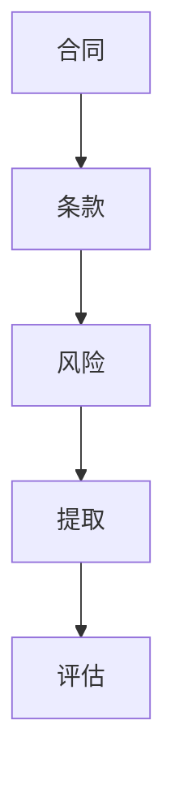
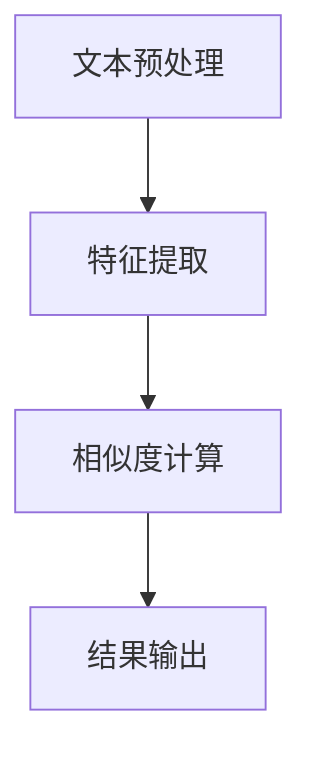
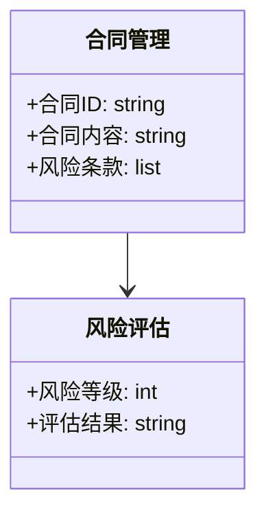
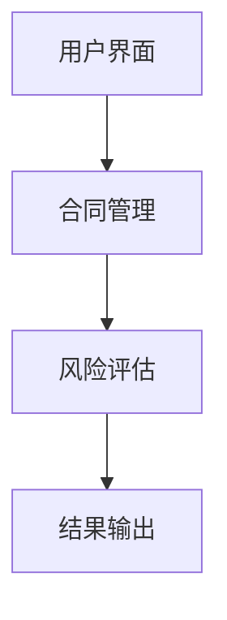
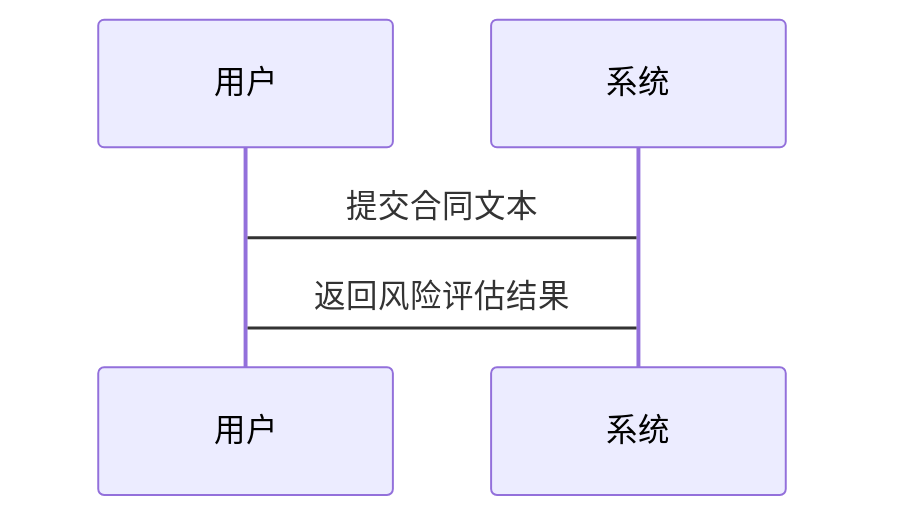

                 


# 构建基于NLP的金融合同风险条款自动化提取与评估系统

**关键词**：自然语言处理（NLP）、金融合同、风险条款、文本挖掘、机器学习

**摘要**：本文详细探讨了如何利用自然语言处理技术构建一个自动化提取和评估金融合同风险条款的系统。通过分析合同文本，系统能够识别和评估潜在风险，提高金融交易的安全性和效率。文章从背景、概念、算法原理到系统设计和实现，全面阐述了系统的构建过程，为金融行业提供了有效的解决方案。

---

# 第1章：背景介绍

## 1.1 问题背景与描述

### 1.1.1 金融合同风险的重要性
金融合同是金融交易的核心文件，其内容复杂且法律性强。合同中的风险条款直接关系到交易的安全性和合规性。传统的人工审核方式效率低下，容易遗漏重要风险点。

### 1.1.2 传统合同处理的痛点
- **效率问题**：人工审核耗时长，成本高。
- **准确性问题**：人为疏忽可能导致风险遗漏。
- **复杂性问题**：合同条款多样，难以统一标准。

### 1.1.3 自动化提取的必要性
通过自动化技术提取和评估风险条款，可以显著提高效率和准确性，降低人为错误，提升金融交易的安全性。

---

## 1.2 问题描述

### 1.2.1 合同条款的复杂性
金融合同通常包含多种条款，如担保、违约责任、利息计算等，这些条款内容复杂且表述多样。

### 1.2.2 风险条款的多样性
风险条款可能涉及不同法律领域，表述方式多样，增加了识别的难度。

### 1.2.3 现有技术的局限性
传统基于规则的系统难以应对条款多样性和表述差异性的问题，且难以扩展。

---

## 1.3 问题解决

### 1.3.1 NLP技术的应用
自然语言处理技术能够自动解析合同文本，提取关键信息，识别风险点。

### 1.3.2 系统的目标与功能
- 提取合同中的风险条款。
- 评估风险条款的合规性和潜在问题。
- 提供风险报告和建议。

### 1.3.3 边界与外延
系统专注于风险条款的提取和评估，不涉及合同内容的生成或修改。

---

## 1.4 核心概念与联系

### 1.4.1 NLP的基本概念
- **分词**：将文本分割成词语或短语。
- **实体识别**：识别文本中的关键实体，如人名、地名、组织名等。
- **文本相似度**：衡量两段文本的相似程度。

### 1.4.2 金融合同的特点
- 法律性：合同具有法律约束力。
- 专业性：使用专业术语和复杂结构。
- 多样性：合同类型和条款多样。

### 1.4.3 风险条款的定义
风险条款是指可能引发法律纠纷或财务损失的条款，如违约责任、担保条款等。

---

### 1.4.4 核心概念对比表

| 对比项 | NLP技术 | 传统方法 |
|--------|----------|-----------|
| 效率   | 高       | 低         |
| 准确性 | 较高     | 较低       |
| 可扩展性 | 高       | 低         |

---

### 1.4.5 ER实体关系图



---

# 第2章：算法原理讲解

## 2.1 分词与实体识别

### 2.1.1 分词原理
分词是将文本分割成词语的过程，常用基于聚类和统计的方法。

#### 2.1.1.1 聚类算法
- **聚类中心**：计算词语的平均值，作为聚类中心。
  $$ \text{聚类中心} = \frac{1}{n} \sum_{i=1}^{n} x_i $$
- **词性标注**：通过马尔可夫模型预测词语的词性。

#### 2.1.1.2 统计方法
- **基于频率的分词**：统计词语出现的频率，确定词语边界。

### 2.1.2 实体识别
实体识别是识别文本中的关键实体，常用条件随机场（CRF）和深度学习模型。

#### 2.1.2.1 条件随机场
- **条件随机场公式**
  $$ P(y|x) = \frac{\exp(\sum_{i=1}^{n} \lambda y_i x_i)}{\sum_{y} \exp(\sum_{i=1}^{n} \lambda y_i x_i)} $$
- **深度学习模型**：使用卷积神经网络（CNN）或循环神经网络（RNN）进行训练。

---

## 2.2 文本相似度计算

### 2.2.1 相似度计算方法
- **余弦相似度**：衡量两个向量的夹角。
  $$ \text{相似度} = \frac{\mathbf{u} \cdot \mathbf{v}}{\|\mathbf{u}\| \|\mathbf{v}\|} $$
- **编辑距离**：计算将一个字符串转换为另一个字符串所需的最少编辑操作次数。
- **深度学习模型**：使用预训练的词嵌入模型（如BERT）计算相似度。

### 2.2.2 算法流程图



---

## 2.3 数学模型与公式

### 2.3.1 分词模型
- **聚类中心公式**
  $$ \text{聚类中心} = \frac{1}{n} \sum_{i=1}^{n} x_i $$
- **词性标注的马尔可夫模型**
  $$ P(y|x) = P(y|x_1, x_2, ..., x_n) $$

### 2.3.2 实体识别模型
- **条件随机场公式**
  $$ P(y|x) = \frac{\exp(\sum_{i=1}^{n} \lambda y_i x_i)}{\sum_{y} \exp(\sum_{i=1}^{n} \lambda y_i x_i)} $$
- **深度学习模型的损失函数**
  $$ \mathcal{L} = -\sum_{i=1}^{n} \log P(y|x) $$

---

# 第3章：系统分析与架构设计

## 3.1 项目介绍

### 3.1.1 系统目标
- 自动化提取金融合同中的风险条款。
- 评估风险条款的合规性和潜在问题。
- 提供风险报告和建议。

### 3.1.2 项目范围
- 支持多种金融合同类型。
- 提供高精度的风险条款提取和评估。

### 3.1.3 关键需求
- 快速提取风险条款。
- 准确评估风险。
- �易用的用户界面。

---

## 3.2 系统架构设计

### 3.2.1 领域模型



### 3.2.2 系统架构图



### 3.2.3 接口设计
- **输入接口**：接收合同文本。
- **输出接口**：返回风险评估结果。

### 3.2.4 交互流程图



---

## 3.3 项目实现

### 3.3.1 环境配置
- **Python版本**：3.8及以上
- **依赖库**：jieba（分词）、spaCy（实体识别）、scikit-learn（机器学习）

### 3.3.2 核心代码实现

#### 2.1 分词代码
```python
import jieba

def segment(text):
    return jieba.lcut(text)
```

#### 2.2 实体识别代码
```python
import spacy

nlp = spacy.load("en_core_web_sm")

def extract_entities(text):
    doc = nlp(text)
    entities = [ent.text for ent in doc.ents]
    return entities
```

#### 2.3 相似度计算代码
```python
from sklearn.metrics.pairwise import cosine_similarity

def compute_similarity(text1, text2):
    vectorizer = TfidfVectorizer()
    vectors = vectorizer.fit_transform([text1, text2])
    return cosine_similarity(vectors)[0,1]
```

### 3.3.3 案例分析
- **输入合同文本**：包含担保条款、违约责任等。
- **分词**：将文本分割成词语。
- **实体识别**：识别出担保方、债务方等实体。
- **风险评估**：计算相似度，评估风险等级。

---

## 3.3.4 项目小结
通过NLP技术，系统能够高效地提取和评估金融合同中的风险条款，显著提高了金融交易的安全性和效率。系统具有良好的扩展性和可定制性，可应用于多种金融场景。

---

# 第4章：最佳实践与注意事项

## 4.1 最佳实践
- **数据清洗**：确保输入数据的干净和准确。
- **模型调优**：通过交叉验证优化模型参数。
- **持续学习**：定期更新模型，适应新的合同条款和法律变化。

## 4.2 小结
本文详细介绍了构建基于NLP的金融合同风险条款自动化提取与评估系统的过程，从背景分析到系统实现，为金融行业提供了有效的解决方案。

## 4.3 注意事项
- 数据隐私：确保合同数据的安全和隐私。
- 模型解释性：选择可解释性高的模型，便于分析和调整。
- 边缘案例：考虑合同中的特殊条款和极端情况。

## 4.4 拓展阅读
- 《自然语言处理入门》
- 《金融合同分析与风险评估》
- 《机器学习在金融领域的应用》

---

通过本文的详细讲解，读者可以全面理解如何利用NLP技术构建一个高效、准确的金融合同风险评估系统，为金融行业提供强有力的支持。

