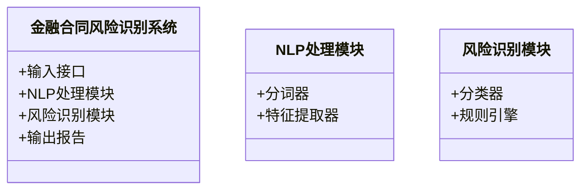

                 


# 构建基于NLP的金融合同风险识别系统

> 关键词：金融合同，NLP，风险识别，文本挖掘，自然语言处理

> 摘要：本文将详细探讨如何利用自然语言处理（NLP）技术构建一个高效的金融合同风险识别系统。通过分析金融合同中的文本信息，结合先进的NLP算法和机器学习模型，我们可以实现对合同风险的自动化识别与分类。本文将从背景介绍、核心概念、算法原理、系统架构设计到项目实战等多方面展开讨论，帮助读者全面理解基于NLP的金融合同风险识别系统的构建过程。

---

## 第一部分：背景介绍

### 第1章：问题背景

#### 1.1 问题背景

随着金融行业的快速发展，各类金融合同的数量急剧增加。这些合同包含丰富的法律条款和风险提示，但传统的合同审查方式依赖人工阅读和分析，效率低且容易出错。因此，如何利用技术手段提高合同审查的效率和准确性成为亟待解决的问题。

#### 1.2 问题描述

金融合同中的风险点通常隐藏在复杂的法律术语和条款中。传统的方法依赖于人工审查，存在以下痛点：
- **效率低下**：人工审查需要逐字逐句分析，耗时长且成本高。
- **容易遗漏**：人工审查难以覆盖所有可能的风险点。
- **一致性差**：不同审查人员对合同的理解可能存在偏差。

#### 1.3 问题解决思路

基于NLP技术的金融合同风险识别系统可以通过以下方式解决上述问题：
1. **文本预处理**：对合同文本进行分词、去停用词等处理。
2. **特征提取**：利用NLP技术提取合同中的关键信息，如风险关键词、条款类型等。
3. **模型训练**：基于机器学习或深度学习模型，训练分类器识别合同中的风险点。
4. **自动化审查**：将合同文本输入模型，自动生成风险报告。

#### 1.4 核心概念与联系

在金融合同风险识别系统中，以下核心概念需要重点关注：
1. **合同文本**：金融合同的正文内容，包含法律条款和风险提示。
2. **风险关键词**：与合同风险相关的特定词汇或短语。
3. **风险分类**：将合同中的风险点分类，如违约风险、合规风险等。
4. **NLP模型**：用于文本分析和分类的算法，如TF-IDF、词嵌入、序列标注等。

### 第2章：核心概念与联系

#### 2.1 NLP与金融合同的实体关系图


#### 2.2 NLP与传统规则识别的对比分析

| 对比维度 | NLP方法 | 传统规则识别 |
|----------|----------|--------------|
| 灵活性   | 高       | 低           |
| 扩展性   | 高       | 低           |
| 精准度   | 中       | 高（特定场景）|

---

## 第二部分：算法原理与实现

### 第3章：算法原理

#### 3.1 基于NLP的文本处理流程


#### 3.2 TF-IDF特征提取

- **TF（Term Frequency）**：词频，表示某个词在文本中的出现频率。
- **IDF（Inverse Document Frequency）**：逆文档频率，衡量一个词的重要性。

#### 3.3 词嵌入模型

- **Word2Vec**：通过上下文预测词义，生成词向量表示。
- **GloVe**：基于全局词频统计的词向量模型。

#### 3.4 文本分类

- **朴素贝叶斯分类器**：
  ```python
  from sklearn.naive_bayes import MultinomialNB
  model = MultinomialNB()
  model.fit(X_train, y_train)
  ```

---

## 第三部分：系统分析与架构设计

### 第4章：系统架构设计

#### 4.1 系统功能模块



#### 4.2 接口设计

- **输入接口**：接收金融合同文本。
- **输出接口**：生成风险识别报告。

---

## 第四部分：项目实战

### 第5章：环境安装与核心代码实现

#### 5.1 环境安装

- **Python 3.8+**
- **库依赖**：
  ```bash
  pip install numpy scikit-learn spacy
  ```

#### 5.2 核心代码实现

```python
import spacy
from sklearn.feature_extraction.text import TfidfVectorizer
from sklearn.naive_bayes import MultinomialNB

# 加载预训练的NLP模型
nlp = spacy.load("en_core_web_sm")

# 定义分词函数
def tokenize(text):
    return [token.text for token in nlp(text)]

# 初始化TF-IDF向量化
vectorizer = TfidfVectorizer(tokenizer=tokenize)

# 训练分类器
model = MultinomialNB()
model.fit(vectorizer.fit_transform(X_train), y_train)
```

#### 5.3 案例分析

- **案例输入**：
  ```text
  "违约责任：如甲方未能按时支付款项，乙方有权采取法律手段追偿。"
  ```
- **模型处理**：
  - 分词：["违约责任", "如", "甲方", "未能", "按时", "支付", "款项", "乙方", "有权", "采取", "法律", "手段", "追偿"]
  - 特征提取：生成TF-IDF向量
  - 分类：识别出"违约责任"为高风险条款

---

## 第五部分：总结与展望

### 第6章：总结

通过本文的详细讲解，我们了解了如何利用NLP技术构建金融合同风险识别系统。从文本预处理到模型训练，再到系统实现，每一步都需要精心设计和优化。未来，随着NLP技术的不断进步，金融合同风险识别系统将更加智能化和高效化。

### 6.2 展望

1. **模型优化**：引入更先进的深度学习模型，如BERT，提高分类精度。
2. **多模态分析**：结合合同中的表格、图表等信息，实现更全面的风险识别。
3. **实时监控**：构建实时风险监控系统，动态更新合同风险识别结果。

---

**本文通过系统化的分析和实践，为构建基于NLP的金融合同风险识别系统提供了理论支持和实践指导。希望读者能够通过本文的学习，掌握NLP技术在金融领域的应用方法，并在此基础上进行创新和优化。**

