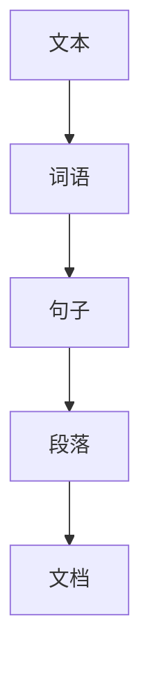
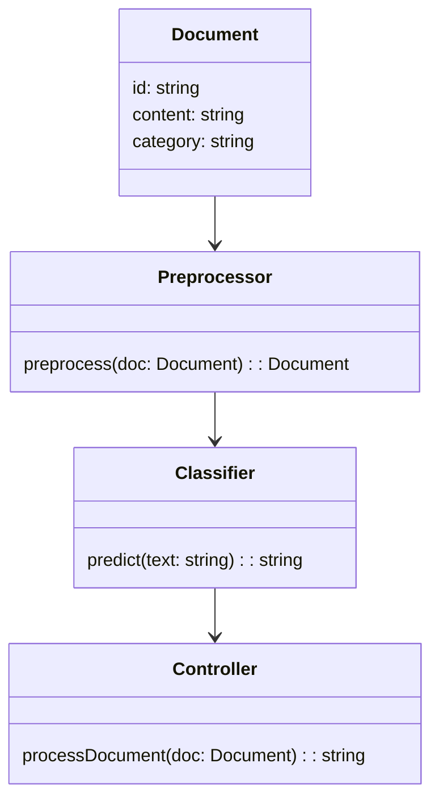
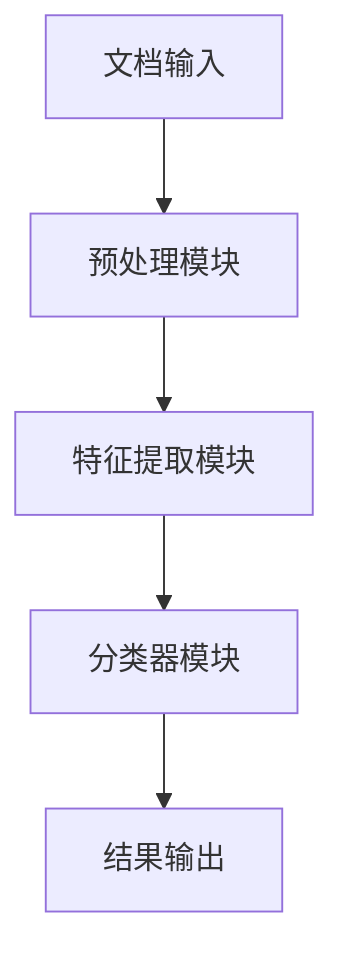
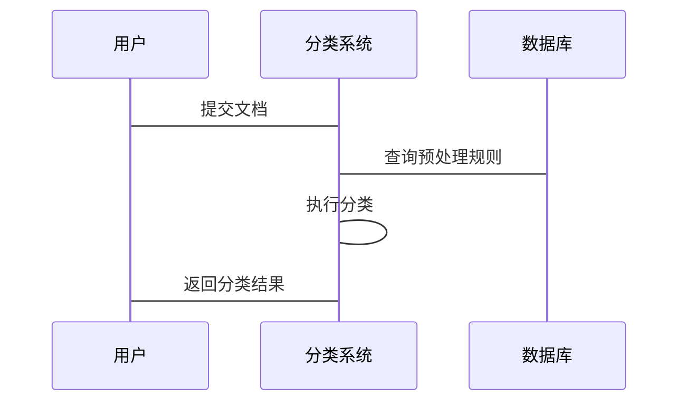

                 


# 构建基于NLP的金融文档自动分类系统

## 关键词：自然语言处理、文本分类、金融文档、机器学习、深度学习

## 摘要：  
本文详细探讨了基于自然语言处理（NLP）的金融文档自动分类系统的构建过程，从问题背景到系统设计，再到算法实现和项目实战，全面解析了如何利用NLP技术解决金融文档分类的挑战。文章通过分析金融文档的特点，结合文本分类算法的选择与优化，提出了一个高效的分类系统，并通过实际案例展示了系统的实现与应用效果。

---

# 目录大纲

## 第一部分: 背景介绍与核心概念

### 第1章: 问题背景与系统目标

#### 1.1 问题背景介绍

- 1.1.1 金融文档分类的背景与意义
- 1.1.2 传统金融文档分类的痛点与挑战
- 1.1.3 基于NLP的自动分类系统的价值

#### 1.2 问题描述与目标设定

- 1.2.1 金融文档分类的核心问题
- 1.2.2 系统目标与功能定位
- 1.2.3 边界与外延分析

#### 1.3 系统构建的核心要素

- 1.3.1 数据来源与处理流程
- 1.3.2 NLP技术在金融领域的应用
- 1.3.3 系统架构与实现方式

#### 1.4 本章小结

---

## 第二部分: 核心概念与技术原理

### 第2章: 基于NLP的文本分类原理

#### 2.1 NLP基础概念

- 2.1.1 自然语言处理的核心概念
- 2.1.2 文本分类的基本原理
- 2.1.3 金融文档的特殊性与处理方法

#### 2.2 金融文档分类的特征分析

- 2.2.1 文本特征提取方法对比
- 2.2.2 金融术语与领域知识的处理
- 2.2.3 文本分类的性能评估指标

#### 2.3 基于NLP的分类算法选择

- 2.3.1 传统机器学习算法分析
- 2.3.2 深度学习模型的优势
- 2.3.3 模型选择的依据与策略

#### 2.4 核心概念与技术联系

- 2.4.1 NLP与文本分类的ER实体关系图



#### 2.5 本章小结

---

## 第三部分: 算法原理与数学模型

### 第3章: 文本分类算法的原理与实现

#### 3.1 传统机器学习算法

- 3.1.1 朴素贝叶斯分类器
- 3.1.2 支持向量机（SVM）
- 3.1.3 随机森林与集成学习

#### 3.2 深度学习模型

- 3.2.1 卷积神经网络（CNN）
- 3.2.2 循环神经网络（RNN）
- 3.2.3 变换器架构（Transformer）

#### 3.3 算法实现的数学模型

- 3.3.1 朴素贝叶斯的数学公式
  $$ P(y|X) = \frac{P(X|y)P(y)}{P(X)} $$
- 3.3.2 SVM的优化目标
  $$ \text{min} \frac{1}{2} \||w\||^2 + C \sum_{i=1}^{n} \xi_i $$
- 3.3.3 Transformer的注意力机制
  $$ \text{Attention}(Q, K, V) = \text{softmax}\left( \frac{QK^T}{\sqrt{d_k}} \right)V $$

#### 3.4 算法实现的代码示例

```python
from sklearn.naive_bayes import MultinomialNB
from sklearn.svm import SVC
from sklearn.ensemble import RandomForestClassifier

# 朴素贝叶斯分类器
nb_model = MultinomialNB().fit(X_train, y_train)
# 支持向量机
svm_model = SVC().fit(X_train, y_train)
# 随机森林
rf_model = RandomForestClassifier().fit(X_train, y_train)
```

#### 3.5 本章小结

---

## 第四部分: 系统分析与架构设计

### 第4章: 金融文档分类系统的架构设计

#### 4.1 问题场景介绍

- 4.1.1 金融文档分类的典型场景
- 4.1.2 系统的需求分析与功能定位

#### 4.2 系统功能设计

- 4.2.1 领域模型设计（领域模型类图）



#### 4.3 系统架构设计

- 4.3.1 系统架构图



#### 4.4 系统接口设计

- 4.4.1 API接口定义
- 4.4.2 接口调用流程

#### 4.5 系统交互设计

- 4.5.1 交互流程图



#### 4.6 本章小结

---

## 第五部分: 项目实战与系统实现

### 第5章: 金融文档分类系统的实现

#### 5.1 环境搭建与数据准备

- 5.1.1 开发环境搭建
- 5.1.2 数据集获取与预处理

#### 5.2 系统核心实现

- 5.2.1 数据预处理代码

```python
import pandas as pd
from sklearn.model_selection import train_test_split

# 数据加载与分割
df = pd.read_csv('financial_docs.csv')
X = df['content']
y = df['label']
X_train, X_test, y_train, y_test = train_test_split(X, y, test_size=0.2, random_state=42)
```

- 5.2.2 特征工程代码

```python
from sklearn.feature_extraction.text import TfidfVectorizer

vectorizer = TfidfVectorizer(max_features=5000)
X_train_vec = vectorizer.fit_transform(X_train)
X_test_vec = vectorizer.transform(X_test)
```

- 5.2.3 模型训练与优化代码

```python
from sklearn.model_selection import GridSearchCV
from sklearn.pipeline import Pipeline

# 管道构建与超参数优化
pipe = Pipeline([
    ('tfidf', TfidfVectorizer()),
    ('clf', SVC())
])
params = {
    'tfidf__max_features': [1000, 2000],
    'clf__C': [1, 10],
}
grid = GridSearchCV(pipe, params, cv=5)
grid.fit(X_train, y_train)
print("Best score: %0.3f" % grid.best_score_)
```

#### 5.3 实际案例分析

- 5.3.1 案例背景介绍
- 5.3.2 数据处理与模型训练
- 5.3.3 模型评估与结果分析

#### 5.4 项目小结

---

## 第六部分: 总结与展望

### 第6章: 总结与未来方向

#### 6.1 系统构建总结

- 6.1.1 核心技术总结
- 6.1.2 系统实现的关键点

#### 6.2 系统优缺点分析

- 6.2.1 系统优势
- 6.2.2 系统局限性

#### 6.3 未来改进方向

- 6.3.1 技术优化点
- 6.3.2 领域扩展性

#### 6.4 展望与建议

---

## 参考文献

- 列出相关的技术文档、书籍和论文。

---

## 致谢

- 感谢参与项目的团队成员和提供数据支持的机构。

---

通过以上目录大纲，我们可以清晰地看到构建基于NLP的金融文档自动分类系统的完整过程，从背景分析到系统设计，再到算法实现和项目实战，每一步都进行了详细的讲解和分析。

