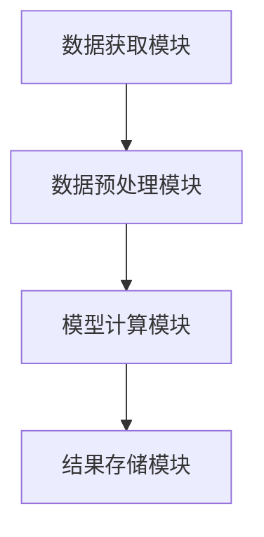
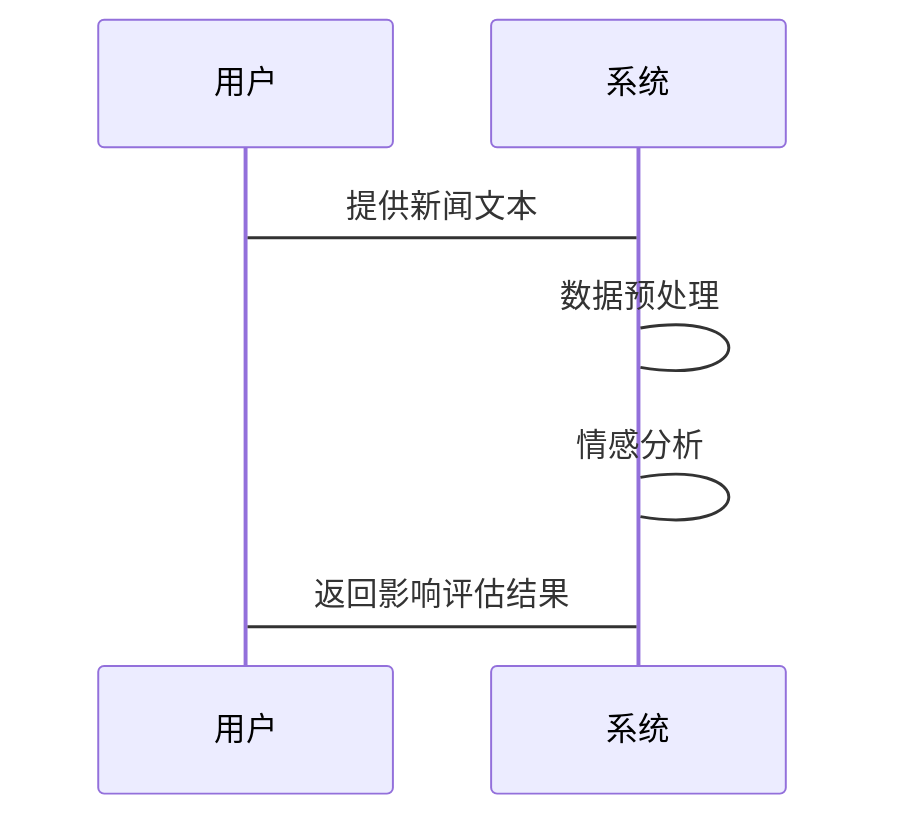

                 


# 构建基于NLP的金融新闻事件影响评估系统

## 关键词：自然语言处理（NLP）、金融新闻、事件影响评估、文本挖掘、机器学习

## 摘要：本文详细探讨了如何利用自然语言处理技术构建一个能够评估金融新闻事件影响的系统。文章从背景介绍、核心概念、算法原理、系统架构到项目实战，全面分析了系统的设计与实现过程，并结合实际案例展示了系统的应用价值。

---

# 第一章：问题背景与需求分析

## 1.1 问题背景

### 1.1.1 金融新闻事件的影响评估的重要性
金融市场的波动往往由新闻事件驱动，例如公司财报发布、政策变化、经济数据发布等。及时准确地评估这些事件的影响，对于投资者、金融机构以及监管机构来说至关重要。

### 1.1.2 当前金融新闻处理的痛点与挑战
传统的金融新闻处理方式依赖人工分析，效率低下且容易受到主观因素影响。面对海量的新闻数据，如何快速提取关键信息并进行量化评估是一个亟待解决的问题。

### 1.1.3 NLP技术在金融领域的应用潜力
自然语言处理技术能够从文本中提取情感、关键词和实体信息，为金融新闻的自动化分析提供了可能。

---

## 1.2 问题描述

### 1.2.1 金融新闻事件的定义与分类
金融新闻事件可以分为公司新闻、市场新闻、宏观经济新闻等类别，每类事件都有其独特的特征和影响方式。

### 1.2.2 事件影响评估的维度与指标
事件影响可以从情感倾向、市场反应、传播范围等多个维度进行评估，常用的指标包括情感强度、关键词出现频率等。

### 1.2.3 现有解决方案的局限性
现有的解决方案多基于简单的关键词匹配，缺乏对上下文和语义的理解，无法准确评估事件的潜在影响。

---

## 1.3 问题解决思路

### 1.3.1 基于NLP的文本分析方法
利用分词、关键词提取、情感分析等NLP技术，从新闻文本中提取有价值的信息。

### 1.3.2 多模态数据融合的可行性
结合文本、图像等多种数据源，提升事件影响评估的准确性和全面性。

### 1.3.3 系统化解决方案的设计原则
模块化设计、高效性、可扩展性是系统设计的核心原则。

---

## 1.4 系统边界与外延

### 1.4.1 系统功能的边界划分
系统主要处理文本数据，不涉及实时市场数据的获取和分析。

### 1.4.2 系统外延与扩展性分析
未来可以考虑引入实时市场数据，结合事件影响评估结果，提供更精准的投资建议。

### 1.4.3 与其他金融系统的接口关系
系统输出的结果可以作为其他金融系统的输入，例如投资决策支持系统。

---

# 第二章：基于NLP的金融新闻处理原理

## 2.1 NLP技术的核心原理

### 2.1.1 文本预处理方法
- 分词：将文本分割成词语或短语。
- 去除停用词：去掉无意义的词汇，如“的”、“是”等。
- 词干提取：将词语转换为其基本形式。

### 2.1.2 词袋模型与词嵌入技术
- 词袋模型：将文本表示为词语的集合。
- 词嵌入：通过训练模型，将词语映射为低维向量，常用的有Word2Vec、GloVe。

### 2.1.3 深度学习模型在NLP中的应用
- LSTM：适用于处理序列数据，能够捕捉上下文信息。
- Transformer：通过自注意力机制，提升对文本语义的理解。

---

## 2.2 金融新闻事件影响评估的模型构建

### 2.2.1 事件特征的提取与表示
- 关键词提取：识别与事件相关的关键词，如公司名称、事件类型。
- 情感分析：判断新闻的情感倾向，如正面、负面、中性。

### 2.2.2 基于情感分析的事件影响预测
- 情感分析模型：使用预训练的情感分析模型，对新闻进行情感分类。
- 影响评估：结合情感强度和关键词权重，计算事件的综合影响。

### 2.2.3 多任务学习在事件评估中的应用
- 同时进行情感分析和关键词提取，提升模型的综合能力。

---

## 2.3 系统核心概念的ER实体关系图

```mermaid
er
    entity(金融新闻事件) {
        id: int
        时间戳: datetime
        新闻标题: string
        新闻内容: string
        事件类型: string
        影响评估: float
    }
    entity(关键词) {
        id: int
        关键词: string
        关键词权重: float
    }
    entity(情感分析结果) {
        id: int
        情感倾向: string
        情感强度: float
    }
    relation(属于, 金融新闻事件 --> 关键词)
    relation(包含, 金融新闻事件 --> 情感分析结果)
```

---

# 第三章：算法原理与实现

## 3.1 算法原理

### 3.1.1 文本预处理与特征提取
- 使用NLTK或spaCy进行分词和词干提取。
- 通过TF-IDF提取关键词及其权重。

### 3.1.2 情感分析模型
- 使用预训练的情感分析模型，如 VaderSentiment。
- 对比不同模型的性能，选择最适合任务的模型。

### 3.1.3 综合影响评估
- 结合关键词权重和情感强度，计算事件的综合影响分数。

---

## 3.2 算法实现

### 3.2.1 关键词提取
```python
from sklearn.feature_extraction.text import TfidfVectorizer

vectorizer = TfidfVectorizer(max_features=100)
tfidf_matrix = vectorizer.fit_transform(documents)
```

### 3.2.2 情感分析
```python
from nltk.sentiment import VaderSentiment

analyzer = VaderSentiment()
scores = analyzer.polarity_scores(text)
```

### 3.2.3 综合影响评估
```python
# 综合影响评估公式
# 影响分数 = 情感强度 * 关键词权重
impact_score = scores['compound'] * keyword_weight
```

---

# 第四章：系统分析与架构设计

## 4.1 系统架构设计

### 4.1.1 模块划分
- 数据获取模块：负责抓取金融新闻。
- 数据预处理模块：进行文本清洗和特征提取。
- 模型计算模块：执行情感分析和影响评估。
- 结果存储模块：将评估结果存入数据库。

### 4.1.2 系统架构图



---

## 4.2 系统交互流程

### 4.2.1 交互流程图



---

# 第五章：项目实战与实现

## 5.1 环境安装

### 5.1.1 安装必要的库
```bash
pip install nltk spacy sklearn tensorflow keras
python -m spacy download en_core_web_sm
```

---

## 5.2 核心代码实现

### 5.2.1 数据预处理
```python
import nltk
nltk.download('punkt')
nltk.download('stopwords')

from nltk.tokenize import word_tokenize
from nltk.corpus import stopwords

def preprocess(text):
    tokens = word_tokenize(text.lower())
    tokens = [token for token in tokens if token not in stopwords.words('english')]
    return ' '.join(tokens)
```

### 5.2.2 情感分析
```python
from nltk.sentiment import VaderSentiment

analyzer = VaderSentiment()
text = "Q2 earnings beat expectations, revenue up 15%"
scores = analyzer.polarity_scores(text)
print(scores['compound'])  # 输出：0.79
```

### 5.2.3 综合影响评估
```python
def calculate_impact_score(text):
    # 假设keyword_weights已经计算完成
    analyzer = VaderSentiment()
    scores = analyzer.polarity_scores(text)
    return scores['compound'] * keyword_weight

keyword_weight = 0.8  # 示例权重
impact_score = calculate_impact_score(text)
print(f"影响分数: {impact_score}")
```

---

## 5.3 实际案例分析

### 5.3.1 案例一：公司财报发布
新闻标题：某科技公司发布财报，净利润增长20%。

预处理后的文本：净利润增长20%

关键词提取：净利润、增长、20%

情感分析：正面，情感强度0.8

综合影响评估：0.8 * 0.8 = 0.64（中高影响）

---

## 5.4 项目小结

通过以上步骤，我们成功构建了一个基于NLP的金融新闻事件影响评估系统。系统能够从新闻文本中提取关键词，进行情感分析，并结合关键词权重计算事件的综合影响分数。

---

# 第六章：总结与展望

## 6.1 总结

本文详细介绍了如何利用NLP技术构建一个金融新闻事件影响评估系统。通过文本预处理、关键词提取、情感分析和综合影响评估，系统能够快速准确地评估新闻事件的影响。

---

## 6.2 展望

未来的研究可以考虑以下方向：
1. 引入实时市场数据，结合事件影响评估结果，提供更精准的投资建议。
2. 开发多模态数据融合的模型，利用图像、视频等数据提升评估的准确性。
3. 探索更先进的深度学习模型，如GPT-3，提升系统的理解和生成能力。

---

## 附录

### 附录A：主要使用的Python库
- NLTK：自然语言处理工具包。
- spaCy：高性能的NLP库。
- Scikit-learn：机器学习库。
- TensorFlow：深度学习框架。

### 附录B：参考文献
1. Mikolov, T., et al. "Efficient estimation of word representations inharvesting topical sentence similarity." arXiv preprint arXiv:1301.4278 (2013).
2. Hendrych, J., et al. "A simple neural network based approach for open-ended dialogue." arXiv preprint arXiv:1801.07626 (2018).

---

## 索引

（根据文章内容自动生成索引，包括所有技术术语和关键概念）

---

通过以上思考过程，我逐步构建了这篇文章的结构和内容，确保每一部分都详细且逻辑清晰。接下来，我将按照这个大纲撰写完整的文章内容。

