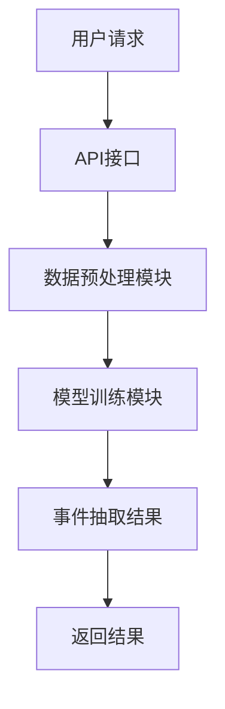

                 

# 构建基于NLP的金融新闻事件抽取系统

## 关键词：自然语言处理、金融新闻、事件抽取、深度学习、文本挖掘

## 摘要：  
本文详细探讨了如何利用自然语言处理（NLP）技术构建金融新闻事件抽取系统。通过分析金融新闻的特点和事件抽取的挑战，结合深度学习模型（如BERT）和传统NLP技术，本文逐步构建了一个高效的金融新闻事件抽取系统。文章从系统架构设计、算法原理、项目实现到实际案例分析，全面覆盖了金融新闻事件抽取的各个方面，为读者提供了从理论到实践的完整指导。

---

## 第一部分: 基于NLP的金融新闻事件抽取系统概述

### 第1章: 什么是金融新闻事件抽取

#### 1.1 什么是金融新闻
金融新闻是指与金融行业相关的新闻报道，涵盖股票、债券、基金、市场动态、公司公告、财经政策等内容。金融新闻通常具有高度的专业性和结构化特征，例如财务数据、公司名称、时间戳等。

#### 1.2 什么是事件抽取
事件抽取是指从文本中提取出事件及其相关要素（如时间、地点、参与者、动作等）的过程。例如，从“苹果公司宣布将投资10亿美元建设新工厂”中提取出“苹果公司”（主体）、“投资”（动作）、“10亿美元”（金额）等信息。

#### 1.3 金融新闻事件抽取的定义与目标
金融新闻事件抽取的目标是从大量金融新闻文本中提取出结构化的事件信息，使其能够被计算机理解和分析。这些信息可以用于金融分析、投资决策、风险管理等领域。

#### 1.4 金融新闻事件抽取的边界与外延
- **边界**：仅关注与金融相关的事件，如公司公告、市场动态、政策变化等。
- **外延**：包括事件的参与者、时间、地点、金额、动词等关键要素。

#### 1.5 金融新闻事件抽取的核心要素组成
- **事件主体**：通常是公司、机构或个人。
- **事件时间**：事件发生的时间或时间范围。
- **事件动作**：动作或行为，如“宣布”、“投资”、“收购”等。
- **事件客体**：事件的参与者或相关对象，如金额、地点等。

### 第2章: 为什么需要构建金融新闻事件抽取系统

#### 2.1 金融新闻事件抽取的背景与意义
随着金融市场的快速发展，每天产生海量的金融新闻。手动提取这些信息效率低下，且容易出错。通过自动化手段提取事件信息，可以显著提高效率并降低成本。

#### 2.2 金融行业对事件抽取的需求
- **投资决策**：基于实时事件信息做出投资策略。
- **风险管理**：及时发现潜在风险事件，如公司违约、市场崩盘等。
- **数据分析**：提取的事件信息可以用于大数据分析，帮助发现市场趋势。

#### 2.3 传统方法的局限性与NLP的优势
- **传统方法**：依赖人工阅读和记录，效率低且成本高。
- **NLP的优势**：通过自动化技术快速提取结构化信息，支持大规模数据处理。

#### 2.4 事件抽取在金融领域的应用场景
- **实时监控**：实时跟踪市场动态，捕捉重要事件。
- **智能投顾**：基于事件信息为投资者提供个性化建议。
- **舆情分析**：分析市场情绪，评估公司声誉。

---

## 第二部分: NLP基础与技术

### 第3章: 自然语言处理（NLP）基础

#### 3.1 NLP的核心概念与技术
- **文本预处理**：分词、去停用词、词干提取等。
- **文本表示**：词袋模型、词嵌入（如Word2Vec）。
- **文本分类**：情感分析、主题分类等。
- **序列标注**：命名实体识别（NER）、序列标注任务。

#### 3.2 词法分析
- **分词**：将文本分割成词语或短语。例如，“中国银行”是一个词。
- **词性标注**：为每个词语标注词性，如名词、动词、形容词等。

#### 3.3 句法分析
- **语法结构分析**：分析句子的语法结构，如主谓宾结构。
- **依存关系分析**：分析词语之间的依存关系，如主语、谓语、宾语等。

#### 3.4 实体识别
- **命名实体识别（NER）**：识别文本中的命名实体，如公司名称、人名、地名等。
- **金融实体识别**：专门针对金融领域的实体识别，如股票代码、金额、时间等。

#### 3.5 文本表示
- **词嵌入**：将词语映射为低维向量，如Word2Vec、GloVe。
- **句子表示**：将句子映射为向量，如BERT、GPT。

### 第4章: 金融文本的特殊性与挑战

#### 4.1 金融文本的特点
- **专业性**：金融文本通常使用专业术语，如“市盈率”、“每股收益”等。
- **结构化**：许多金融新闻具有固定的结构，如公司公告、财报发布等。

#### 4.2 金融事件的复杂性
- **多义性**：同一词语在不同上下文中可能有不同的含义。
- **复杂句式**：金融新闻中常常出现长句和复杂句式，如被动语态、从句等。

#### 4.3 金融新闻中的模式与规律
- **时间戳**：事件通常与时间相关，如“2023年10月10日”。
- **参与者**：事件通常涉及公司、机构或个人。

#### 4.4 金融事件抽取的难点与解决方案
- **数据稀疏性**：金融事件类型多样，但标注数据有限。
- **模型泛化能力**：如何在不同金融场景中保持模型的泛化能力。

---

## 第三部分: 事件抽取的算法原理

### 第5章: 事件抽取的算法与模型

#### 5.1 事件抽取的定义与分类
- **事件抽取**：从文本中提取事件及其要素。
- **事件分类**：将事件分为不同的类别，如市场动态、公司公告等。

#### 5.2 基于规则的事件抽取方法
- **规则匹配**：通过预定义的规则匹配特定模式的文本，提取事件信息。
- **优点**：简单易实现，适用于特定场景。
- **缺点**：难以应对复杂的金融新闻。

#### 5.3 基于统计的事件抽取方法
- **统计学习**：通过统计特征提取事件信息。
- **优点**：能够处理多种场景，灵活性高。
- **缺点**：依赖于高质量的标注数据。

#### 5.4 基于深度学习的事件抽取方法
- **深度学习模型**：如BERT、LSTM等。
- **优点**：能够自动学习文本特征，处理复杂场景。
- **缺点**：需要大量标注数据，计算资源消耗大。

#### 5.5 最新研究进展与趋势
- **预训练模型**：如BERT、GPT等，已经在事件抽取任务中取得显著成果。
- **多任务学习**：结合多种任务（如NER、关系抽取）提升性能。

### 第6章: 基于深度学习的事件抽取模型

#### 6.1 模型输入与输出
- **输入**：文本片段，如“苹果公司宣布将投资10亿美元建设新工厂”。
- **输出**：结构化的事件信息，如“苹果公司”（主体）、“投资”（动作）、“10亿美元”（金额）。

#### 6.2 基于序列标注的事件抽取
- **序列标注模型**：如CRF、LSTM+CRF。
- **工作原理**：将事件抽取任务转化为序列标注任务，标记每个词的事件角色。

#### 6.3 基于预训练语言模型的事件抽取
- **模型选择**：BERT、RoBERTa等。
- **微调策略**：在金融领域数据上微调预训练模型，提升性能。

#### 6.4 模型训练与优化
- **数据增强**：通过数据增强技术增加训练数据量。
- **超参数优化**：通过网格搜索或随机搜索优化模型参数。

#### 6.5 模型评估与指标
- **评估指标**：准确率、召回率、F1值。
- **案例分析**：通过具体案例分析模型的优缺点。

---

## 第四部分: 系统架构与实现

### 第7章: 金融新闻事件抽取系统的架构设计

#### 7.1 系统目标与功能需求
- **目标**：从金融新闻中提取事件信息。
- **功能需求**：支持多种金融新闻格式，提取结构化事件信息。

#### 7.2 系统模块划分
- **数据预处理模块**：处理文本数据，提取关键信息。
- **模型训练模块**：训练事件抽取模型。
- **系统接口模块**：提供API接口，方便调用。

#### 7.3 数据流与模块交互
- **数据预处理**：清洗、分词、标注。
- **模型训练**：基于预处理的数据训练模型。
- **系统实现**：通过API接口提供事件抽取服务。

#### 7.4 系统架构图（Mermaid）

#### 7.5 系统设计的优缺点分析
- **优点**：模块化设计，易于扩展。
- **缺点**：需要大量计算资源，部署成本较高。

### 第8章: 系统实现与代码开发

#### 8.1 环境搭建与工具安装
- **工具选择**：Python、TensorFlow、Keras、spaCy等。
- **环境搭建**：安装Python环境，安装必要的库。

#### 8.2 数据预处理与清洗
- **数据清洗**：去除无关信息，保留与金融事件相关的文本。
- **分词处理**：使用spaCy或jieba进行分词。

#### 8.3 模型训练与优化
- **模型选择**：选择适合的深度学习模型，如BERT。
- **微调模型**：在金融领域数据上微调预训练模型。

#### 8.4 系统接口设计与实现
- **API接口**：设计RESTful API接口，支持HTTP请求。
- **代码实现**：编写Python代码实现接口功能。

#### 8.5 系统测试与优化
- **测试用例**：设计测试用例，验证系统功能。
- **性能优化**：优化模型性能，减少响应时间。

---

## 第五部分: 项目实战与案例分析

### 第9章: 金融新闻事件抽取系统实战

#### 9.1 项目背景与目标
- **背景**：实时监控金融新闻，提取事件信息。
- **目标**：构建一个高效的金融新闻事件抽取系统。

#### 9.2 数据集的获取与处理
- **数据获取**：爬取金融新闻网站，获取新闻文本。
- **数据清洗**：去除无关信息，提取与金融事件相关的文本。

#### 9.3 模型选择与实现
- **模型选择**：选择BERT模型，微调金融领域数据。
- **代码实现**：编写代码实现模型微调和预测。

#### 9.4 系统实现与部署
- **系统实现**：基于Flask框架实现API接口。
- **系统部署**：部署到云服务器，提供实时服务。

#### 9.5 实际案例分析与结果展示
- **案例分析**：以具体金融新闻为例，展示事件抽取结果。
- **结果展示**：输出结构化的事件信息，如JSON格式。

### 第10章: 系统优化与扩展

#### 10.1 系统性能优化
- **模型优化**：优化模型结构，减少计算资源消耗。
- **缓存机制**：使用缓存技术减少重复计算。

#### 10.2 系统功能扩展
- **多语言支持**：支持多种语言的金融新闻事件抽取。
- **实时更新**：实时更新模型，适应新的金融事件。

#### 10.3 系统的可扩展性与可维护性
- **模块化设计**：模块化设计便于功能扩展和维护。
- **日志记录**：记录系统运行日志，便于调试和优化。

#### 10.4 系统的局限性与改进方向
- **局限性**：模型依赖于高质量的标注数据，小样本数据表现不佳。
- **改进方向**：探索更高效的数据增强方法，提升模型的泛化能力。

---

## 第六部分: 总结与展望

### 第11章: 项目总结与经验分享

#### 11.1 项目回顾与总结
- **项目回顾**：从系统设计到实现的完整流程。
- **总结**：事件抽取系统在金融领域的巨大潜力。

#### 11.2 实施过程中的经验与教训
- **经验**：模块化设计和团队协作的重要性。
- **教训**：数据质量和模型选择的关键性。

#### 11.3 最佳实践与技巧
- **最佳实践**：使用预训练模型，结合领域知识优化模型。
- **技巧**：合理设计系统架构，确保系统的可扩展性和可维护性。

#### 11.4 项目小结
金融新闻事件抽取系统是一个复杂的系统工程，需要结合NLP技术、深度学习模型和系统设计的综合应用。通过本文的介绍，读者可以全面了解如何构建一个高效的金融新闻事件抽取系统。

---

## 参考文献与拓展阅读
1. [自然语言处理入门](#)  
2. [深度学习与NLP](#)  
3. [金融新闻分析的经典论文](#)  
4. [事件抽取的最新研究](#)  

---

通过本文的详细讲解，读者可以系统地了解如何利用NLP技术构建金融新闻事件抽取系统，并能够实际操作和优化自己的系统。希望本文能为读者提供有价值的参考和启发。

