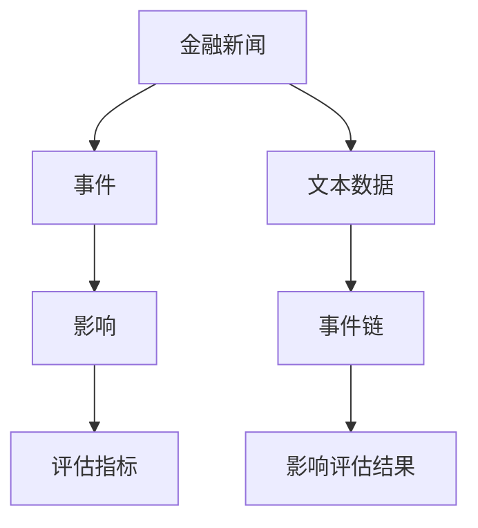
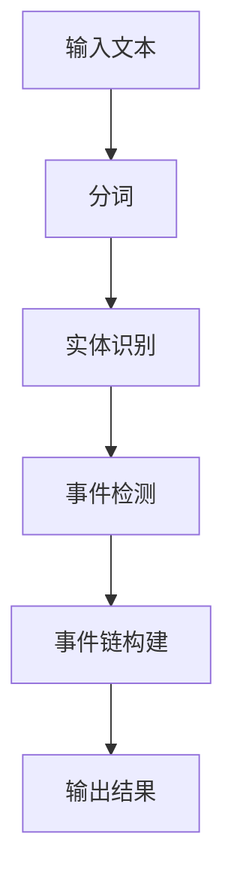
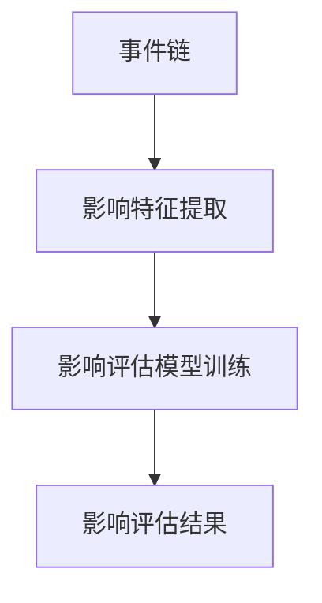
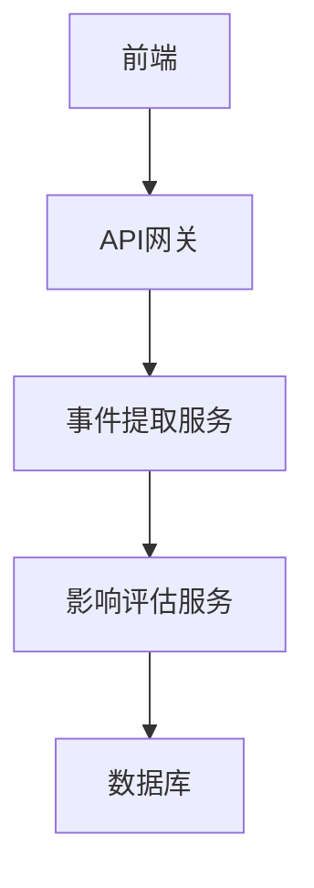
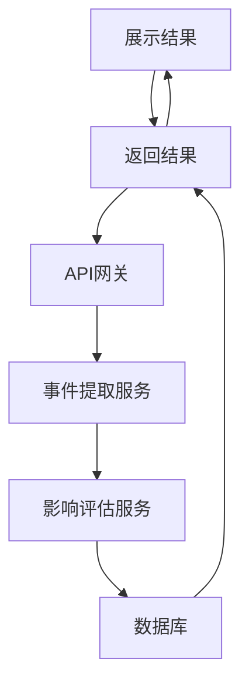

                 


# 构建基于NLP的金融新闻事件链提取与影响评估系统

## 关键词
- 金融新闻
- 事件链提取
- 影响评估
- 自然语言处理(NLP)
- 机器学习
- 事件关系分析

## 摘要
随着金融市场的日益复杂化，及时准确地分析金融新闻中的事件链及其对市场的影响变得至关重要。本文提出了一种基于自然语言处理（NLP）的金融新闻事件链提取与影响评估系统，旨在通过先进的文本挖掘技术，自动识别和提取金融新闻中的关键事件，并评估这些事件对市场的影响程度。文章首先介绍了系统的背景和目标，详细阐述了事件链提取和影响评估的核心概念与算法原理，接着从系统架构设计、项目实战等角度进行了深入分析，并通过实际案例展示了系统的应用效果。最后，总结了系统的优点和未来的发展方向，为金融市场的智能化分析提供了新的思路。

---

# 第一部分: 金融新闻事件链提取与影响评估系统背景介绍

## 第1章: 问题背景与目标

### 1.1 问题背景
#### 1.1.1 金融新闻分析的重要性
金融市场的波动往往与新闻事件密切相关。例如，一家公司发布财报、政府出台经济政策或国际局势的变化都可能引发市场波动。及时准确地分析这些新闻事件，可以帮助投资者做出更明智的决策，机构也能更好地进行风险管理和投资策略调整。

#### 1.1.2 事件链提取的必要性
金融新闻中包含大量分散的事件信息，这些事件之间可能存在因果关系或相关性。例如，一家公司发布亏损财报后，可能引发股价下跌，进一步导致投资者信心下降。将这些事件串联起来，形成事件链，可以更好地理解市场波动的根源。

#### 1.1.3 影响评估的现实意义
金融市场的参与者需要了解每个事件对市场的影响程度。例如，某次地缘政治事件可能对原油价格产生重大影响，而一次公司并购可能对股价产生短期波动。通过量化这些影响，可以帮助投资者制定更精准的投资策略。

### 1.2 问题描述
#### 1.2.1 金融新闻数据的特点
金融新闻数据具有以下特点：
- 数据量大：金融市场每天产生大量新闻。
- 信息复杂：新闻内容涉及多个领域，信息点分散。
- 时间敏感性：事件的时间顺序对分析结果至关重要。

#### 1.2.2 事件链提取的挑战
事件链提取面临以下挑战：
- 事件识别的准确性：如何准确识别新闻中的事件。
- 事件之间的关系：如何建立事件之间的因果或时间顺序关系。
- 数据稀疏性：某些事件可能只在少量新闻中出现，影响模型的泛化能力。

#### 1.2.3 影响评估的复杂性
影响评估的复杂性主要体现在以下方面：
- 事件的多级影响：某些事件可能通过多级传导影响市场。
- 市场的多样性：不同市场对同一事件的反应可能不同。
- 数据的动态性：市场环境和事件的影响可能随时间变化。

### 1.3 问题解决
#### 1.3.1 NLP技术在金融领域的应用
NLP技术可以帮助自动处理和分析大量金融新闻数据，提取关键信息。例如，使用分词、实体识别和情感分析等技术，可以快速定位新闻中的关键事件和相关实体。

#### 1.3.2 事件链提取的解决方案
通过构建事件链模型，可以将分散的事件信息串联起来，形成一个完整的事件序列。例如，可以使用图结构表示事件之间的关系，帮助分析事件的传播路径。

#### 1.3.3 影响评估的方法
影响评估可以通过量化每个事件对市场的影响程度来实现。例如，可以结合事件的关键词、情感倾向和市场数据，计算事件对股价或指数的影响权重。

### 1.4 边界与外延
#### 1.4.1 事件链提取的边界条件
事件链提取需要明确以下边界条件：
- 事件的定义范围：例如，只关注公司层面的事件，还是包括宏观政策事件。
- 数据的时间范围：例如，只分析最近一年的新闻数据。

#### 1.4.2 影响评估的适用范围
影响评估主要适用于以下场景：
- 投资决策支持：帮助投资者评估事件对投资标的的影响。
- 风险管理：帮助机构识别潜在风险事件。

#### 1.4.3 系统的可扩展性
系统设计应具备良好的可扩展性，例如：
- 支持多语言处理：应对国际化市场的需求。
- 支持多种数据源：整合不同渠道的新闻数据。

### 1.5 核心要素与组成
#### 1.5.1 事件链的构成要素
事件链由以下要素构成：
- 事件主体：例如，公司、政府等。
- 事件类型：例如，财务报告、政策变化等。
- 事件时间：事件发生的时间点。

#### 1.5.2 影响评估的关键指标
影响评估的关键指标包括：
- 影响范围：事件影响的市场范围。
- 影响强度：事件对市场的冲击程度。
- 影响持续时间：事件影响的持续时间。

#### 1.5.3 系统的核心组件
系统的组成包括：
- 数据采集模块：负责收集金融新闻数据。
- 事件提取模块：负责识别和提取事件信息。
- 影响评估模块：负责计算事件的影响程度。

---

## 第2章: 核心概念与联系

### 2.1 核心概念原理
#### 2.1.1 事件链的定义与特征
事件链是指一系列相互关联的事件，这些事件按照时间顺序或因果关系排列。例如，一家公司发布盈利预警，导致股价下跌，进而引发投资者恐慌性抛售。

#### 2.1.2 影响评估的指标体系
影响评估的指标体系包括：
- 事件的相关性：事件与市场的相关性。
- 事件的情感倾向：事件的积极或消极程度。
- 事件的影响力：事件对市场的实际影响程度。

#### 2.1.3 系统的整体架构
系统整体架构分为以下三个层次：
- 数据层：包括新闻数据和市场数据。
- 处理层：包括事件提取和影响评估。
- 应用层：包括结果展示和决策支持。

### 2.2 概念属性对比表
以下是事件链与传统文本分析的对比：

| 对比维度       | 事件链提取             | 传统文本分析           |
|----------------|----------------------|-----------------------|
| 分析目标       | 识别事件及其关系       | 提取文本关键词、主题   |
| 数据要求       | 高，需要事件的时间和因果关系 | 较低，主要基于关键词匹配 |
| 复杂度         | 高，涉及事件关联分析   | 较低，主要基于文本匹配 |
| 应用场景       | 金融市场的风险预警、投资决策支持 | 新闻分类、主题挖掘等 |

### 2.3 ER实体关系图
以下是事件链的实体关系图：



---

# 第二部分: 算法原理讲解

## 第3章: 事件链提取算法

### 3.1 算法概述
#### 3.1.1 基于NLP的事件识别
事件识别是事件链提取的第一步。常用的技术包括关键词匹配、实体识别和基于深度学习的事件检测模型。

#### 3.1.2 事件链构建的流程
事件链构建的流程包括：
1. 数据预处理：清洗和标注数据。
2. 事件识别：识别文本中的事件。
3. 事件关联：建立事件之间的关联关系。
4. 事件链生成：生成完整的事件链。

#### 3.1.3 算法的优缺点
- 优点：能够自动处理大量数据，提取出有意义的事件链。
- 缺点：事件关联的准确性依赖于模型的训练数据和算法的复杂度。

### 3.2 算法流程图
以下是事件链提取的流程图：



### 3.3 算法实现代码
以下是事件链提取的Python代码示例：

```python
def extract_events(text):
    tokens = tokenize(text)  # 分词
    entities = recognize_entities(tokens)  # 实体识别
    events = detect_events(tokens, entities)  # 事件检测
    return events
```

### 3.4 数学模型与公式
#### 3.4.1 事件相似度计算
事件相似度可以通过以下公式计算：

$$ sim(e1, e2) = \frac{e1 \cap e2}{|e1| + |e2| - e1 \cap e2} $$

其中，$sim(e1, e2)$表示事件$e1$和$e2$的相似度，$e1 \cap e2$表示事件$e1$和$e2$的交集部分。

#### 3.4.2 事件链权重计算
事件链的权重可以通过以下公式计算：

$$ weight(e) = \sum_{i=1}^{n} sim(e_i, e_{i+1}) $$

其中，$weight(e)$表示事件链$e$的权重，$sim(e_i, e_{i+1})$表示事件$e_i$和$e_{i+1}$的相似度。

---

## 第4章: 影响评估算法

### 4.1 算法概述
#### 4.1.1 影响评估的原理
影响评估通过量化事件对市场的影响程度，帮助投资者和机构做出决策。

#### 4.1.2 影响评估的步骤
影响评估的步骤包括：
1. 数据预处理：清洗和标注数据。
2. 事件影响特征提取：提取事件的影响特征。
3. 影响评估模型训练：训练影响评估模型。
4. 影响评估结果输出：输出事件的影响评估结果。

### 4.2 算法流程图
以下是影响评估的流程图：



### 4.3 算法实现代码
以下是影响评估的Python代码示例：

```python
def assess_impact(events):
    features = extract_features(events)  # 提取影响特征
    model = train_model(features)  # 训练影响评估模型
    result = predict(model, features)  # 预测影响结果
    return result
```

### 4.4 数学模型与公式
#### 4.4.1 影响评估模型
影响评估模型可以通过以下公式表示：

$$ impact(e) = \alpha \cdot sim(e) + \beta \cdot context(e) $$

其中，$impact(e)$表示事件$e$的影响程度，$sim(e)$表示事件$e$的相似度，$context(e)$表示事件$e$的上下文信息，$\alpha$和$\beta$是权重系数。

---

# 第三部分: 系统分析与架构设计方案

## 第5章: 系统功能设计

### 5.1 系统功能模块
系统功能模块包括：
- 数据采集模块：负责采集金融新闻数据。
- 事件提取模块：负责提取金融新闻中的事件。
- 影响评估模块：负责评估事件对市场的影响。
- 结果展示模块：负责展示事件链和影响评估结果。

### 5.2 领域模型设计
以下是系统的领域模型：


### 5.3 系统架构设计
以下是系统的架构设计：



### 5.4 系统接口设计
系统接口设计包括：
- 数据接口：负责与数据源对接。
- 事件提取接口：负责事件提取模块的调用。
- 影响评估接口：负责影响评估模块的调用。

### 5.5 系统交互设计
以下是系统的交互流程图：



---

## 第6章: 项目实战

### 6.1 环境安装
项目实战需要以下环境：
- Python 3.8+
- NLP工具：spaCy、NLTK
- 深度学习框架：TensorFlow、PyTorch
- 数据库：MySQL、MongoDB

### 6.2 核心实现
以下是事件提取和影响评估的核心实现代码：

```python
# 事件提取模块
def extract_events(text):
    tokens = tokenize(text)  # 分词
    entities = recognize_entities(tokens)  # 实体识别
    events = detect_events(tokens, entities)  # 事件检测
    return events

# 影响评估模块
def assess_impact(events):
    features = extract_features(events)  # 提取影响特征
    model = train_model(features)  # 训练影响评估模型
    result = predict(model, features)  # 预测影响结果
    return result
```

### 6.3 应用案例
以下是应用案例的详细分析：
1. 数据预处理：清洗和标注金融新闻数据。
2. 事件提取：识别新闻中的关键事件。
3. 影响评估：评估事件对市场的实际影响。
4. 结果展示：展示事件链和影响评估结果。

### 6.4 代码解读
以下是代码的详细解读：
- 数据预处理：对新闻文本进行清洗和标注，提取有用的信息。
- 事件提取：使用NLP技术识别新闻中的事件。
- 影响评估：结合事件特征和市场数据，评估事件的影响程度。

### 6.5 项目总结
项目总结包括：
- 项目的优点：能够高效提取事件链，评估事件影响。
- 项目的不足：需要更多的训练数据和优化算法。
- 未来的改进方向：引入更多的数据源，优化模型性能。

---

# 第四部分: 总结与展望

## 第7章: 总结

### 7.1 系统总结
本文提出了一种基于NLP的金融新闻事件链提取与影响评估系统，通过先进的文本挖掘技术，能够高效地提取金融新闻中的事件链，并评估这些事件对市场的影响程度。

### 7.2 系统优点
系统的优点包括：
- 高效性：能够快速处理大量金融新闻数据。
- 准确性：通过深度学习模型，提高了事件提取和影响评估的准确性。
- 可扩展性：系统设计具备良好的可扩展性，支持多语言和多数据源。

### 7.3 系统应用
系统的应用包括：
- 投资决策支持：帮助投资者制定更明智的投资策略。
- 风险管理：帮助机构识别和管理潜在风险。
- 市场研究：帮助研究人员分析市场趋势和事件影响。

---

## 第8章: 未来展望

### 8.1 系统改进方向
系统的改进方向包括：
- 引入更多的数据源，提高系统的数据丰富性。
- 优化事件提取和影响评估算法，提高系统的准确性和效率。
- 增强系统的可解释性，方便用户理解和使用。

### 8.2 技术发展趋势
技术发展趋势包括：
- 多模态数据处理：结合图像、语音等多模态数据，提高系统的分析能力。
- 自适应学习：通过自适应学习算法，提高系统的灵活性和适应性。
- 智能化决策：通过智能化决策支持，帮助用户做出更精准的决策。

### 8.3 个人见解
个人认为，随着人工智能技术的不断发展，基于NLP的金融新闻分析系统将越来越智能化和精准化。未来，系统可以通过引入更多的数据源和优化算法，进一步提高事件提取和影响评估的准确性和效率。

---

# 结语

本文详细介绍了基于NLP的金融新闻事件链提取与影响评估系统的构建过程，从背景介绍到算法原理，再到系统架构设计和项目实战，为读者提供了一个全面的技术视角。希望本文能够为金融市场的智能化分析提供新的思路和参考。

