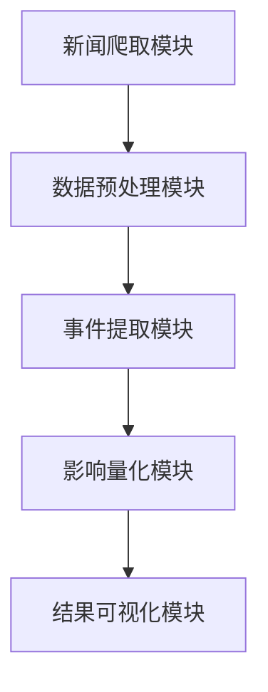
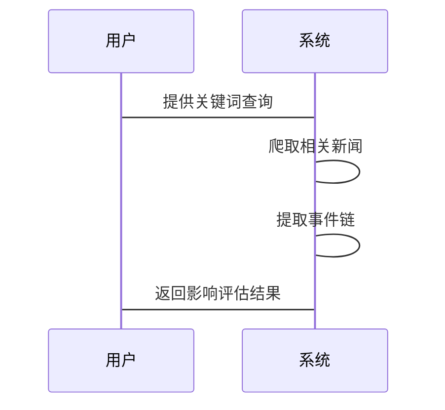

                 

<think>
好的，我将按照您的要求逐步构建《构建基于NLP的金融新闻事件链提取与影响量化评估系统》的详细目录大纲。首先，我会从引言开始，逐步展开各个章节的内容，确保每个部分都详细且逻辑清晰。

# 《构建基于NLP的金融新闻事件链提取与影响量化评估系统》

> **关键词：** 金融新闻、事件链提取、影响量化、自然语言处理、文本挖掘、金融数据分析  
> **摘要：**  
> 本文将详细探讨如何利用自然语言处理（NLP）技术构建一个金融新闻事件链提取与影响量化评估系统。通过对金融新闻的文本挖掘和分析，我们能够提取关键事件并量化其对市场的潜在影响。本文从问题背景与目标出发，逐步分析事件链提取和影响量化的核心概念，深入探讨基于NLP的实现方法，包括关键词提取、主题建模和事件传播网络构建。同时，我们将提供系统架构设计、项目实战代码和实际案例分析，帮助读者全面理解该系统的构建过程和应用场景。最终，我们将总结系统的优缺点，并展望未来的研究方向。

---

## 目录大纲

### **第一部分: 引言**

#### 1.1 问题背景与目标
- 1.1.1 金融新闻事件的重要性
  - 市场波动的驱动因素
  - 新闻事件对投资者决策的影响
- 1.1.2 事件链提取的必要性
  - 传统方法的局限性
  - NLP技术的优势
- 1.1.3 影响量化评估的意义
  - 帮助投资者提前预判风险
  - 提供数据支持政策制定

#### 1.2 核心概念与技术基础
- 1.2.1 自然语言处理（NLP）技术
  - 文本预处理、分词、实体识别
  - 情感分析与主题建模
- 1.2.2 事件链的定义与特征
  - 事件的类型、时间跨度和关联性
- 1.2.3 影响量化的方法
  - 传播网络构建与关键节点识别

### **第二部分: 技术基础**

#### 2.1 自然语言处理（NLP）技术详解
- 2.1.1 文本预处理
  - 分词、去停用词、实体识别
  - 示例：对新闻标题进行分词处理
- 2.1.2 关键词提取
  - TF-IDF方法
  - 示例：使用TF-IDF提取新闻标题中的关键词
- 2.1.3 主题建模
  - LDA主题模型
  - 示例：分析多篇新闻的主题分布

#### 2.2 事件链提取算法
- 2.2.1 基于规则的事件提取
  - 利用关键词和句法结构识别事件
  - 示例：识别“公司发布财报”这一事件
- 2.2.2 基于统计的事件提取
  - 使用机器学习模型训练事件分类器
  - 示例：训练一个二分类模型区分“利好”和“利空”事件

### **第三部分: 算法实现**

#### 3.1 事件链提取实现
- 3.1.1 关键词提取
  - 使用Python的`jieba`库进行分词
  - 示例代码：
    ```python
    import jieba
    text = "央行今日宣布降息政策"
    words = jieba.lcut(text)
    print(words)
    ```
- 3.1.2 主题建模
  - 使用`Gensim`库进行LDA主题建模
  - 示例代码：
    ```python
    from gensim.models import LdaModel
    from gensim.corpora import Dictionary
    dictionary = Dictionary(texts)
    corpus = [dictionary.doc2bow(text) for text in texts]
    lda_model = LdaModel(corpus, num_topics=5, random_state=42)
    ```
- 3.1.3 事件分类
  - 使用`scikit-learn`训练随机森林分类器
  - 示例代码：
    ```python
    from sklearn.ensemble import RandomForestClassifier
    X = processed_texts
    y = labels
    clf = RandomForestClassifier().fit(X, y)
    ```

#### 3.2 影响量化实现
- 3.2.1 构建传播网络
  - 事件之间的关联权重计算
  - 示例：计算事件A对事件B的影响权重
- 3.2.2 关键节点识别
  - 使用PageRank算法评估事件影响力
  - 示例代码：
    ```python
    import networkx as nx
    G = nx.DiGraph()
    G.add_edge('事件A', '事件B', weight=0.8)
    pr = nx.pagerank(G)
    print(pr)
    ```
- 3.2.3 影响力评分
  - 基于传播网络的影响力排序
  - 示例：对事件进行影响力排序并输出结果

### **第四部分: 系统架构设计**

#### 4.1 系统功能模块划分
- 新闻爬取模块
  - 从新闻网站爬取实时金融新闻
  - 示例：使用`BeautifulSoup`和`requests`库进行网页抓取
- 数据预处理模块
  - 文本清洗、分词和实体识别
  - 示例：处理爬取的新闻文本并提取关键词
- 事件提取模块
  - 基于NLP技术识别事件链
  - 示例：从多篇新闻中提取相关事件并构建事件链
- 影响量化模块
  - 计算事件对市场的潜在影响
  - 示例：评估某个重大事件对股票价格的可能影响

#### 4.2 系统架构图


#### 4.3 接口设计与交互流程
- 系统接口
  - 新闻爬取接口：`get_financial_news()`
  - 事件提取接口：`extract_events()`
  - 影响力评估接口：`calculate_impact()`
- 交互流程图


### **第五部分: 项目实战与案例分析**

#### 5.1 环境搭建
- 安装Python和必要的库
  - `pip install jieba gensim scikit-learn networkx`
- 数据源准备
  - 确定新闻爬取的网站和接口

#### 5.2 核心代码实现
- 新闻爬取示例
  ```python
  import requests
  from bs4 import BeautifulSoup

  def get_financial_news(url):
      response = requests.get(url)
      soup = BeautifulSoup(response.text, 'html.parser')
      articles = soup.find_all('article')
      return [article.text for article in articles]
  ```
- 事件提取示例
  ```python
  from sklearn.feature_extraction.text import TfidfVectorizer

  vectorizer = TfidfVectorizer()
  tfidf = vectorizer.fit_transform(documents)
  ```

#### 5.3 实际案例分析
- 案例：分析某次重大金融事件
  - 事件链提取过程
  - 影响力评估结果
  - 可视化展示

### **第六部分: 总结与展望**

#### 6.1 总结
- 系统实现的关键点回顾
- 技术优势与局限性
- 实际应用中的注意事项

#### 6.2 未来展望
- 结合多模态数据（如图像、视频）进行更精准的事件分析
- 实现实时监控与预警系统
- 拓展到更多金融领域的应用

---

以上是《构建基于NLP的金融新闻事件链提取与影响量化评估系统》的详细目录大纲，涵盖了从理论到实践的各个方面，确保读者能够系统地理解和实现该系统。

