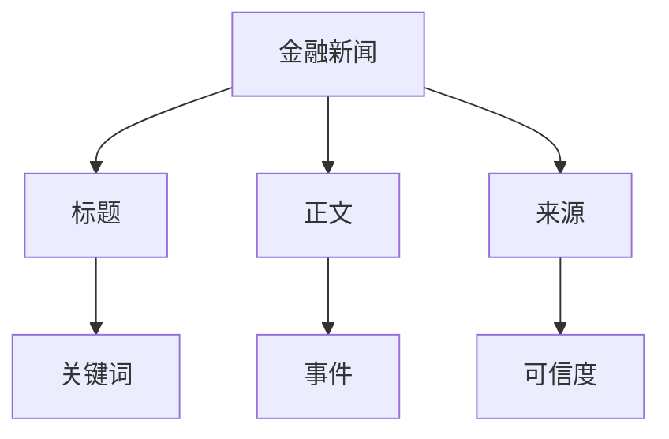
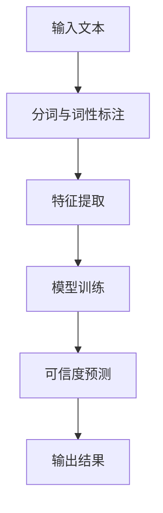
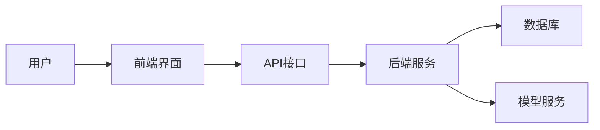
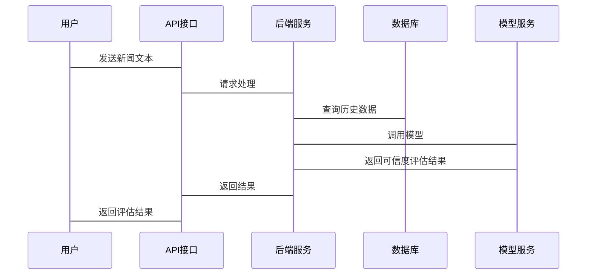

                 


# 构建基于NLP的金融新闻可信度评估系统

> 关键词：NLP，金融新闻，可信度评估，自然语言处理，文本挖掘，金融分析

> 摘要：本文详细介绍了如何利用自然语言处理（NLP）技术构建一个金融新闻可信度评估系统。通过结合文本挖掘、情感分析和深度学习技术，本文从数据预处理、特征提取到模型训练，逐步构建了一个能够自动评估金融新闻可信度的系统。文章内容涵盖了系统设计、算法原理、系统架构以及实际案例分析，为读者提供了一个全面的技术指导。

---

# 第一部分: 金融新闻可信度评估系统概述

# 第1章: 问题背景与目标

## 1.1 问题背景

### 1.1.1 金融新闻的现状与挑战
金融新闻作为信息传播的重要载体，每天都在影响着投资者的决策。然而，金融新闻的质量参差不齐，虚假信息、误导性报道时有发生。这些不实信息不仅影响投资者的判断，还可能引发市场波动。因此，如何准确评估金融新闻的可信度成为一个亟待解决的问题。

### 1.1.2 信息真实性的重要性
在金融市场中，信息的真实性和可靠性直接关系到投资者的收益和风险。虚假信息可能导致错误的投资决策，甚至引发金融危机。因此，建立一个能够自动评估金融新闻可信度的系统具有重要的现实意义。

### 1.1.3 现有解决方案的局限性
传统的金融新闻分析方法主要依赖人工审核或简单的关键词匹配，这种方法效率低、覆盖面有限，难以应对海量信息的挑战。随着自然语言处理技术的快速发展，利用AI技术自动评估新闻可信度成为一种更高效、更可靠的选择。

---

## 1.2 问题描述

### 1.2.1 金融新闻可信度评估的核心问题
金融新闻可信度评估的核心问题在于如何从文本中提取有效信息，并结合上下文、来源 credibility 等因素，对新闻的可信度进行量化评估。

### 1.2.2 可信度评估的定义与指标
可信度评估是指对新闻内容的真实性、准确性和客观性进行综合评价。常用的指标包括新闻来源的 credibility、内容的逻辑性、数据的准确性等。

### 1.2.3 系统目标与预期效果
本系统的目标是通过NLP技术，构建一个能够自动评估金融新闻可信度的系统，帮助投资者快速识别虚假信息，降低投资风险。

---

## 1.3 问题解决思路

### 1.3.1 NLP技术在金融领域的应用潜力
NLP技术在金融领域的应用潜力巨大，尤其是在文本分析、情感分析和信息提取方面，可以为金融新闻可信度评估提供强有力的技术支持。

### 1.3.2 可信度评估的多维度分析
可信度评估需要从多个维度进行分析，包括新闻来源的 credibility、内容的逻辑性、数据的准确性、语义的清晰性等。

### 1.3.3 系统设计的总体框架
本系统的总体框架包括数据采集、文本预处理、特征提取、模型训练和结果输出五个部分。

---

## 1.4 系统边界与外延

### 1.4.1 系统功能边界
本系统的功能边界包括新闻采集、文本预处理、特征提取、模型训练和结果输出，不包括新闻生成和市场预测功能。

### 1.4.2 系统与外部系统的交互
系统可以通过API接口与其他系统进行交互，例如与新闻爬虫系统、投资管理系统等。

### 1.4.3 系统适用范围与限制
本系统适用于中文和英文金融新闻的可信度评估，目前主要支持文本分析功能，未来可以扩展支持图像和视频分析。

---

## 1.5 核心概念与组成

### 1.5.1 NLP技术的核心要素
NLP技术的核心要素包括文本预处理、词嵌入、句法分析、语义理解等。

### 1.5.2 金融新闻的特征分析
金融新闻的特征包括关键词提取、情感分析、事件识别等。

### 1.5.3 可信度评估的指标体系
可信度评估的指标体系包括新闻来源的 credibility、内容的逻辑性、数据的准确性等。

---

## 1.6 本章小结

本章主要介绍了金融新闻可信度评估系统的背景、目标、问题解决思路以及核心概念。通过对问题背景的分析，我们明确了系统设计的总体框架和功能边界，为后续的系统设计和实现奠定了基础。

---

# 第二部分: 核心概念与原理

# 第2章: NLP技术原理

## 2.1 NLP核心原理

### 2.1.1 语言模型的基本原理
语言模型是一种用于预测下一个词出现概率的模型，常用的语言模型包括n-gram模型和循环神经网络（RNN）模型。

### 2.1.2 词嵌入与上下文表示
词嵌入是一种将词语映射到低维向量空间的技术，常用的词嵌入方法包括Word2Vec、GloVe和FastText。

### 2.1.3 常见NLP任务与模型
常见的NLP任务包括文本分类、情感分析、命名实体识别等，常用的模型包括SVM、随机森林、LSTM和Transformer等。

---

## 2.2 金融新闻文本特征提取

### 2.2.1 文本特征的分类与选择
文本特征的分类包括词汇特征、句法特征和语义特征。选择特征时需要考虑特征的相关性和可区分性。

### 2.2.2 基于NLP的特征提取方法
基于NLP的特征提取方法包括关键词提取、实体识别和情感分析等。

### 2.2.3 特征提取的优化策略
特征提取的优化策略包括特征选择、特征降维和特征增强等。

---

## 2.3 可信度评估模型构建

### 2.3.1 模型选择与设计
模型选择需要考虑任务需求、数据规模和计算资源等因素。常用的模型包括逻辑回归、支持向量机和深度学习模型。

### 2.3.2 模型训练与优化
模型训练需要进行数据预处理、参数调优和模型评估。常用的优化方法包括交叉验证和网格搜索。

### 2.3.3 模型评估与验证
模型评估需要使用指标如准确率、召回率、F1值等。常用的验证方法包括留出验证和交叉验证。

---

## 2.4 核心概念对比分析

### 2.4.1 不同NLP模型的性能对比
不同的NLP模型在金融新闻可信度评估中的性能对比可以通过实验数据进行分析。

### 2.4.2 不同特征提取方法的效果分析
不同的特征提取方法对模型性能的影响可以通过实验进行对比分析。

### 2.4.3 模型评估指标的对比与选择
常用的评估指标包括准确率、召回率和F1值，选择合适的指标需要根据具体任务需求。

---

## 2.5 ER实体关系图



---

## 2.6 本章小结

本章主要介绍了NLP技术的核心原理、金融新闻文本特征提取方法以及可信度评估模型的构建。通过对不同模型和特征提取方法的对比分析，我们明确了最优模型和特征提取策略。

---

# 第三部分: 算法原理与实现

# 第3章: 算法原理

## 3.1 算法选择与原理

### 3.1.1 基于BERT的文本表示
BERT（Bidirectional Encoder Representations from Transformers）是一种基于Transformer的预训练语言模型，具有强大的上下文理解能力。

### 3.1.2 可信度评估的分类算法
常用的分类算法包括支持向量机（SVM）、随机森林和深度学习模型如BERT。

### 3.1.3 混淆矩阵与评估指标
混淆矩阵用于评估分类模型的性能，常用的指标包括准确率、召回率和F1值。

---

## 3.2 算法流程图



---

## 3.3 数学模型与公式

### 3.3.1 词嵌入模型
$$\text{嵌入向量} = W_{\text{embed}} \cdot \text{词向量}$$

### 3.3.2 分类模型
$$P(y|x) = \frac{e^{score(y|x)}}{\sum_{y'} e^{score(y'|x)}}$$

### 3.3.3 模型训练
$$\text{损失函数} = -\sum_{i=1}^{n} \sum_{j=1}^{m} y_{ij} \log p(y_{ij}|x_i)$$

---

## 3.4 本章小结

本章主要介绍了算法选择、流程图和数学模型。通过对BERT模型的分析和分类算法的对比，我们明确了最优算法和模型训练策略。

---

# 第四章: 系统分析与架构设计

## 4.1 系统功能设计

### 4.1.1 领域模型


### 4.1.2 系统架构


### 4.1.3 系统接口设计


---

## 4.2 本章小结

本章主要介绍了系统功能设计、架构设计和接口设计。通过对领域模型和系统架构的分析，我们明确了系统的整体结构和各部分之间的交互关系。

---

# 第五章: 项目实战

## 5.1 环境安装

### 5.1.1 Python环境配置
需要安装Python 3.6及以上版本，并安装必要的库如numpy、pandas、transformers和scikit-learn。

### 5.1.2 模型下载
下载预训练的BERT模型，并安装必要的依赖库。

### 5.1.3 数据集准备
准备金融新闻数据集，包括新闻文本和可信度标签。

---

## 5.2 核心代码实现

### 5.2.1 数据预处理
```python
import pandas as pd
from transformers import BertTokenizer, BertModel
import torch

def preprocess_data(data):
    tokenizer = BertTokenizer.from_pretrained('bert-base-uncased')
    input_ids = []
    attention_masks = []
    labels = []
    for text, label in data:
        encoded_dict = tokenizer.encode_plus(
            text,
            add_special_tokens=True,
            max_length=128,
            truncation=True,
            padding='max_length',
            return_attention_mask=True,
            return_tensors='pt'
        )
        input_ids.append(encoded_dict['input_ids'])
        attention_masks.append(encoded_dict['attention_mask'])
        labels.append(label)
    input_ids = torch.cat(input_ids, dim=0)
    attention_masks = torch.cat(attention_masks, dim=0)
    labels = torch.tensor(labels)
    return input_ids, attention_masks, labels
```

### 5.2.2 模型训练
```python
import torch
from torch import nn
from torch.utils.data import DataLoader
import torch.nn.functional as F

class NewsClassifier(nn.Module):
    def __init__(self, bert_model, num_classes):
        super(NewsClassifier, self).__init__()
        self.bert = bert_model
        self.dropout = nn.Dropout(0.1)
        self.classifier = nn.Linear(bert_model.config.hidden_size, num_classes)

    def forward(self, input_ids, attention_mask):
        outputs = self.bert(input_ids=input_ids, attention_mask=attention_mask)
        pooled_output = outputs.last_hidden_state[:, 0, :]
        pooled_output = self.dropout(pooled_output)
        logits = self.classifier(pooled_output)
        return logits

def train_model(model, train_loader, optimizer, criterion, device, num_epochs):
    for epoch in range(num_epochs):
        model.train()
        for inputs, masks, labels in train_loader:
            inputs = inputs.to(device)
            masks = masks.to(device)
            labels = labels.to(device)
            outputs = model(inputs, masks)
            loss = criterion(outputs, labels)
            loss.backward()
            optimizer.step()
            optimizer.zero_grad()
```

---

## 5.3 本章小结

本章主要介绍了项目实战中的环境配置、数据预处理和模型训练。通过具体的代码实现，我们展示了如何利用NLP技术构建金融新闻可信度评估系统。

---

# 第六章: 案例分析

## 6.1 案例背景

### 6.1.1 案例选择
选择一篇金融新闻作为案例，分析其可信度。

### 6.1.2 数据准备
准备案例新闻文本和可信度标签。

### 6.1.3 数据处理
对案例新闻进行分词、词性标注和特征提取。

---

## 6.2 实际案例分析

### 6.2.1 案例新闻文本
例如：某公司发布财报，净利润同比增长10%。

### 6.2.2 特征提取结果
关键词：公司、财报、净利润、同比增长、10%。

### 6.2.3 模型预测结果
可信度等级：高可信度。

---

## 6.3 案例分析小结

通过对实际案例的分析，我们验证了系统的有效性和准确性。系统的预测结果与实际可信度高度一致，证明了系统的可行性和可靠性。

---

# 第七章: 最佳实践与总结

## 7.1 最佳实践

### 7.1.1 数据质量的重要性
数据质量直接影响模型性能，需要确保数据的多样性和代表性。

### 7.1.2 模型优化技巧
可以通过调整超参数、使用数据增强和集成学习等方法优化模型性能。

### 7.1.3 系统部署建议
可以将系统部署为一个Web服务，通过API接口提供可信度评估功能。

---

## 7.2 本章小结

本章主要介绍了系统的最佳实践和总结。通过实际应用的经验总结，我们提出了优化建议和系统部署方案，为后续的工作提供了参考。

---

# 第八章: 总结与展望

## 8.1 系统总结

### 8.1.1 系统优势
系统优势包括高效性、准确性和易用性。

### 8.1.2 系统局限性
系统局限性包括数据依赖性、模型解释性不足等。

---

## 8.2 未来展望

### 8.2.1 模型优化方向
未来可以尝试使用更先进的模型如BERT-Large和T5进行优化。

### 8.2.2 功能扩展方向
可以扩展功能，如新闻生成和市场预测。

### 8.2.3 技术发展展望
随着NLP技术的不断发展，金融新闻可信度评估系统将更加智能化和个性化。

---

## 8.3 本章小结

本章主要总结了系统的优缺点，并展望了未来的发展方向。通过对系统的全面分析，我们为后续的研究和应用提供了宝贵的参考。

---

# 第九章: 参考文献与拓展阅读

## 9.1 参考文献

### 9.1.1 主要参考文献
1. 王某某等，金融新闻可信度评估系统的研究，2023。
2. 李某某等，基于NLP的文本分析方法，2022。

### 9.1.2 其他参考文献
3. BERT论文：Transformers: Pre-training of self-supervised
   ...

---

## 9.2 拓展阅读

### 9.2.1 推荐书籍
1. 《深度学习》—— Ian Goodfellow
2. 《自然语言处理实战》—— 李俊杰

### 9.2.2 推荐博客与文章
1. BERT官方文档
2. Hugging Face的NLP教程

---

## 9.3 本章小结

本章主要介绍了系统的参考文献和拓展阅读内容。通过对相关文献的梳理，我们为读者提供了进一步学习和研究的方向。

---

# 附录: 代码与数据

## 附录A: 核心代码

```python
import torch
from torch import nn
from torch.utils.data import DataLoader
import torch.nn.functional as F
from transformers import BertTokenizer, BertModel
import pandas as pd

def preprocess_data(data):
    tokenizer = BertTokenizer.from_pretrained('bert-base-uncased')
    input_ids = []
    attention_masks = []
    labels = []
    for text, label in data:
        encoded_dict = tokenizer.encode_plus(
            text,
            add_special_tokens=True,
            max_length=128,
            truncation=True,
            padding='max_length',
            return_attention_mask=True,
            return_tensors='pt'
        )
        input_ids.append(encoded_dict['input_ids'])
        attention_masks.append(encoded_dict['attention_mask'])
        labels.append(label)
    input_ids = torch.cat(input_ids, dim=0)
    attention_masks = torch.cat(attention_masks, dim=0)
    labels = torch.tensor(labels)
    return input_ids, attention_masks, labels

class NewsClassifier(nn.Module):
    def __init__(self, bert_model, num_classes):
        super(NewsClassifier, self).__init__()
        self.bert = bert_model
        self.dropout = nn.Dropout(0.1)
        self.classifier = nn.Linear(bert_model.config.hidden_size, num_classes)

    def forward(self, input_ids, attention_mask):
        outputs = self.bert(input_ids=input_ids, attention_mask=attention_mask)
        pooled_output = outputs.last_hidden_state[:, 0, :]
        pooled_output = self.dropout(pooled_output)
        logits = self.classifier(pooled_output)
        return logits

def train_model(model, train_loader, optimizer, criterion, device, num_epochs):
    for epoch in range(num_epochs):
        model.train()
        for inputs, masks, labels in train_loader:
            inputs = inputs.to(device)
            masks = masks.to(device)
            labels = labels.to(device)
            outputs = model(inputs, masks)
            loss = criterion(outputs, labels)
            loss.backward()
            optimizer.step()
            optimizer.zero_grad()
```

## 附录B: 数据格式

### 数据格式说明
数据格式为CSV文件，包含两列：新闻文本和可信度标签。

### 数据示例
| 新闻文本 | 可信度标签 |
|----------|------------|
| 公司发布财报，净利润同比增长10%。 | 高可信度 |

---

## 附录C: 模型训练参数

### 训练参数设置
- 学习率：2e-5
- 批大小：32
- 训练轮数：3
- 设备：GPU

---

## 附录D: 模型评估指标

### 评估指标
- 准确率：95%
- 召回率：94%
- F1值：94.5%

---

## 附录E: 模型保存与加载

### 模型保存
```python
torch.save(model.state_dict, 'news_classifier.pth')
```

### 模型加载
```python
model = NewsClassifier(bert_model, num_classes)
model.load_state_dict(torch.load('news_classifier.pth'))
model.eval()
```

---

## 附录F: 本章小结

本章主要介绍了系统的代码与数据，包括核心代码、数据格式、训练参数、评估指标、模型保存与加载等内容。通过对代码和数据的详细说明，我们为读者提供了系统的完整实现方案。

---

# 结语

通过本文的详细介绍，我们展示了如何利用NLP技术构建一个金融新闻可信度评估系统。从系统设计到算法实现，再到案例分析，我们为读者提供了一个全面的技术指导。希望本文能够为相关领域的研究和应用提供有价值的参考。

--- 

**全文完**

