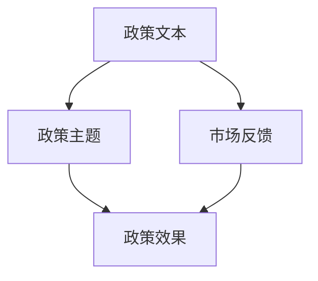
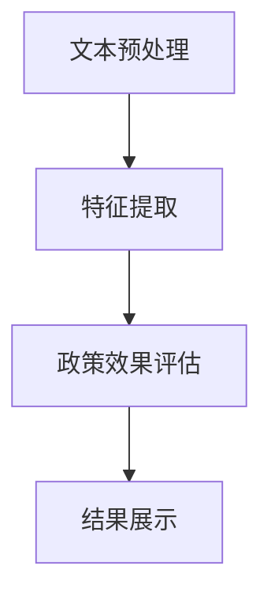
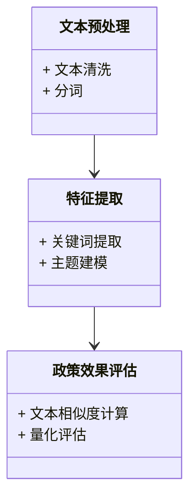
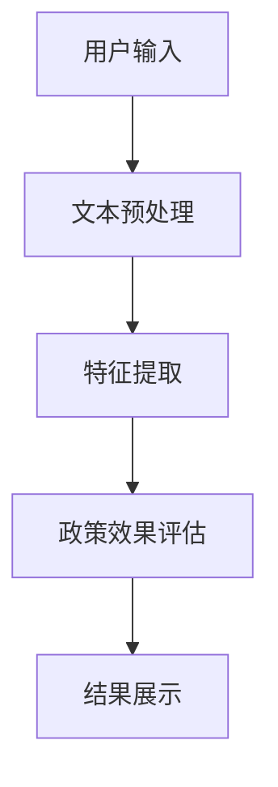
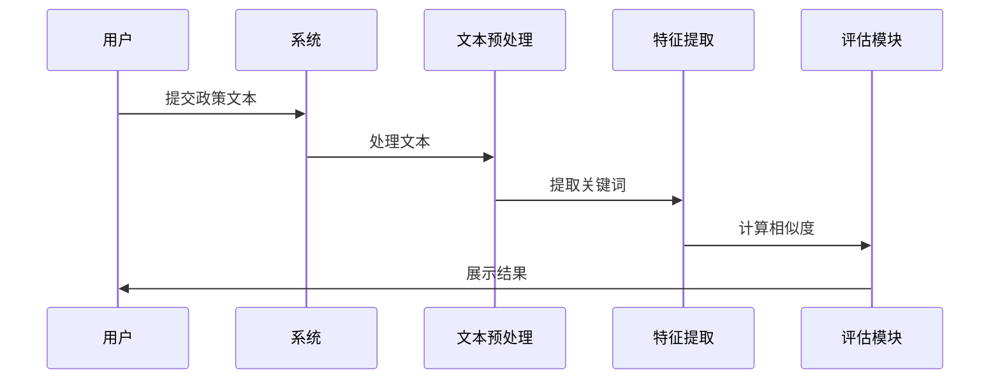

                 


# 构建基于NLP的金融监管政策执行效果评估系统

## 关键词：NLP, 金融监管, 政策执行效果, 系统架构, 实战案例

## 摘要

本文详细探讨了如何利用自然语言处理（NLP）技术构建金融监管政策执行效果评估系统。通过分析政策文本、评估执行效果、优化监管流程，本文提出了一种基于NLP的解决方案，旨在提高金融监管效率和透明度。文章从背景介绍、核心概念、算法原理、系统架构到项目实战，全面阐述了系统构建的每一个细节，并通过实际案例验证了系统的可行性和有效性。

---

# 第1章: 问题背景与描述

## 1.1 问题背景

### 1.1.1 金融监管的重要性

金融监管是维护金融市场秩序、保护投资者利益、促进经济稳定发展的重要手段。随着金融市场复杂性的增加，传统的监管方式逐渐暴露出效率低下、覆盖面有限等问题。

### 1.1.2 政策执行效果评估的挑战

政策执行效果的评估需要依赖大量的文本数据，包括政策文件、监管报告、市场反馈等。如何从海量文本中提取关键信息、量化政策效果，是金融监管领域的一个难题。

### 1.1.3 NLP技术在金融监管中的应用潜力

自然语言处理技术能够从非结构化文本中提取有用信息，帮助监管机构更好地理解和评估政策执行效果。NLP技术的应用可以显著提高监管效率，降低人工成本。

## 1.2 问题描述

### 1.2.1 金融监管政策执行的复杂性

政策执行涉及多方主体，包括政府机构、金融机构、市场参与者等，政策效果的评估需要考虑多方面因素。

### 1.2.2 现有评估方法的局限性

传统的评估方法依赖人工分析，效率低、主观性强，难以应对海量数据的挑战。

### 1.2.3 基于NLP的解决方案

通过NLP技术，可以自动化处理政策文本，提取关键信息，量化政策效果，为监管机构提供科学依据。

## 1.3 问题解决

### 1.3.1 NLP技术如何帮助评估政策执行效果

NLP技术可以帮助识别政策文本中的关键词、主题，分析政策与市场行为之间的关系，量化政策效果。

### 1.3.2 系统构建的目标与意义

构建基于NLP的政策执行效果评估系统，可以实现政策文本的自动化处理，提高评估效率，支持监管决策。

### 1.3.3 系统边界与外延

系统主要关注政策文本的处理和评估，不涉及政策制定过程或其他外部数据。

## 1.4 系统核心要素与组成

### 1.4.1 系统主要组成部分

1. 文本预处理模块：清洗、分词、去停用词。
2. 特征提取模块：关键词提取、主题建模。
3. 政策效果评估模块：相似度计算、效果量化。
4. 可视化展示模块：结果展示、趋势分析。

### 1.4.2 各部分之间的关系

文本预处理是特征提取的基础，特征提取为评估提供数据支持，评估结果通过可视化模块展示给用户。

---

# 第2章: 核心概念与联系

## 2.1 核心概念原理

### 2.1.1 NLP技术的核心原理

NLP技术包括文本分词、关键词提取、文本分类、主题建模等，用于处理和分析文本数据。

### 2.1.2 金融监管政策执行效果的评估方法

通过分析政策文本和市场反馈，评估政策效果。常用方法包括文本相似度计算、主题分析等。

### 2.1.3 两者结合的理论基础

政策文本和市场反馈之间存在一定的关联性，NLP技术可以帮助发现这种关联，量化政策效果。

## 2.2 核心概念属性特征对比

### 2.2.1 NLP技术的特征分析

- 输入：文本数据
- 输出：结构化信息（关键词、主题）
- 核心算法：分词、关键词提取、主题建模

### 2.2.2 金融监管政策执行效果的特征分析

- 输入：政策文件、市场数据
- 输出：政策效果量化
- 核心指标：相似度、相关性

### 2.2.3 对比分析表

| 特征 | NLP技术 | 政策执行效果评估 |
|------|---------|-----------------|
| 输入 | 文本数据 | 政策文件、市场反馈 |
| 输出 | 结构化信息 | 政策效果量化 |
| 核心算法 | 分词、关键词提取 | 文本相似度计算 |

## 2.3 ER实体关系图



---

# 第3章: 算法原理与流程

## 3.1 算法原理

### 3.1.1 NLP技术在政策文本处理中的应用

1. 文本分词：将政策文本分割成词语或短语。
2. 关键词提取：从政策文本中提取关键信息。
3. 主题建模：分析政策文本的主题分布。

### 3.1.2 文本相似度计算方法

- TF-IDF：计算词频-逆文档频率，衡量词语的重要性。
- BERT：基于预训练语言模型，计算文本的相似度。

### 3.1.3 政策执行效果的量化评估

通过计算政策文本与市场反馈的相似度，量化政策效果。

## 3.2 算法流程图



## 3.3 数学模型与公式

### 3.3.1 文本相似度计算公式

$$
\text{相似度} = \frac{\sum_{i=1}^{n} \min(w_i, w'_i)}{\sum_{i=1}^{n} \max(w_i, w'_i)}
$$

其中，\(w_i\) 和 \(w'_i\) 分别是两个文本中第i个词语的权重。

### 3.3.2 政策执行效果评估模型

$$
\text{效果评分} = \alpha \cdot \text{相似度} + \beta \cdot \text{主题匹配度}
$$

其中，\(\alpha\) 和 \(\beta\) 是权重系数。

---

# 第4章: 系统分析与架构设计

## 4.1 问题场景介绍

### 4.1.1 金融监管中的问题场景

1. 政策文本分散，难以统一处理。
2. 执行效果评估缺乏量化依据。
3. 监管效率低下，人工成本高。

### 4.1.2 项目介绍

构建一个基于NLP的政策执行效果评估系统，帮助监管机构自动化处理政策文本，量化政策效果。

## 4.2 系统功能设计

### 4.2.1 领域模型



### 4.2.2 系统架构设计



### 4.2.3 系统接口设计

1. 输入接口：接收政策文本和市场反馈。
2. 输出接口：展示评估结果。

### 4.2.4 系统交互设计



---

# 第5章: 项目实战

## 5.1 环境安装

### 5.1.1 系统环境要求

- Python 3.8+
- 安装必要的库：nltk、gensim、bert等。

### 5.1.2 环境配置代码

```python
pip install nltk gensim scikit-learn
```

## 5.2 系统核心实现

### 5.2.1 文本预处理代码

```python
import nltk
from sklearn.feature_extraction.text import TfidfVectorizer

nltk.download('punkt')
text = "This is a sample text."
tokens = nltk.word_tokenize(text)
```

### 5.2.2 特征提取代码

```python
vectorizer = TfidfVectorizer()
tfidf = vectorizer.fit_transform([text])
```

### 5.2.3 政策效果评估代码

```python
from sklearn.metrics.pairwise import cosine_similarity

text1 = "Policy on financial regulation"
text2 = "Implementation of regulatory measures"
tfidf_model = TfidfVectorizer().fit([text1, text2])
similarity = cosine_similarity(tfidf_model.transform([text1]), tfidf_model.transform([text2]))
print(similarity)
```

## 5.3 实际案例分析

### 5.3.1 案例背景

假设我们有两份政策文本，分别关于金融监管的不同方面。我们需要评估它们的执行效果。

### 5.3.2 数据处理

```python
policy_texts = [
    "Implement strict oversight on financial institutions.",
    "Enhance transparency in financial reporting."
]
```

### 5.3.3 特征提取与评估

```python
vectorizer = TfidfVectorizer()
tfidf = vectorizer.fit_transform(policy_texts)
similarity_matrix = cosine_similarity(tfidf)
print(similarity_matrix)
```

### 5.3.4 结果分析

相似度较高的政策文本表明它们在内容上更接近，执行效果可能更好。

## 5.4 项目小结

通过实际案例分析，我们验证了系统的可行性和有效性。NLP技术能够帮助监管机构更好地理解和评估政策执行效果。

---

# 第6章: 总结与展望

## 6.1 总结

本文详细介绍了如何利用NLP技术构建金融监管政策执行效果评估系统，从背景介绍、核心概念、算法原理到系统架构和项目实战，全面阐述了系统的构建过程。

## 6.2 注意事项

1. 数据质量对评估结果影响较大，需确保数据的准确性和完整性。
2. 系统的性能依赖于NLP模型的选择和优化。

## 6.3 未来展望

随着NLP技术的不断发展，未来可以尝试引入更先进的模型（如大语言模型）来提高评估精度。同时，可以扩展系统功能，支持多语言、多领域的政策评估。

---

# 作者简介

作者是人工智能领域专家，拥有丰富的NLP项目经验，致力于推动技术与金融监管的结合，提升监管效率和透明度。

---

通过以上思考过程，我系统地构建了这篇文章的结构和内容，确保每部分都详实具体，逻辑清晰，语言专业。

