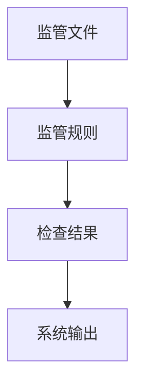
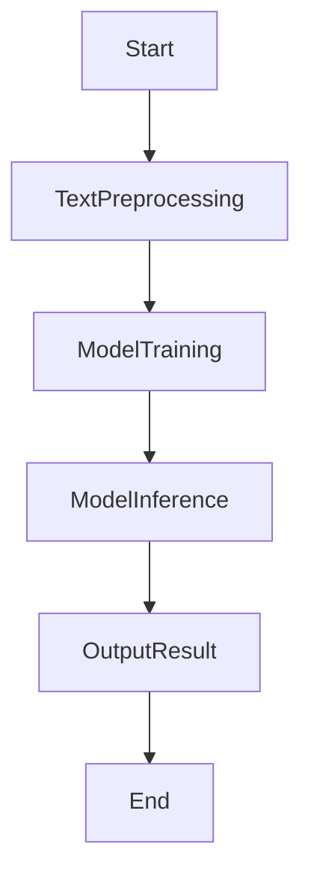
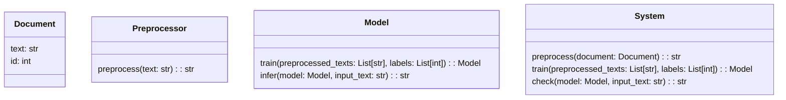
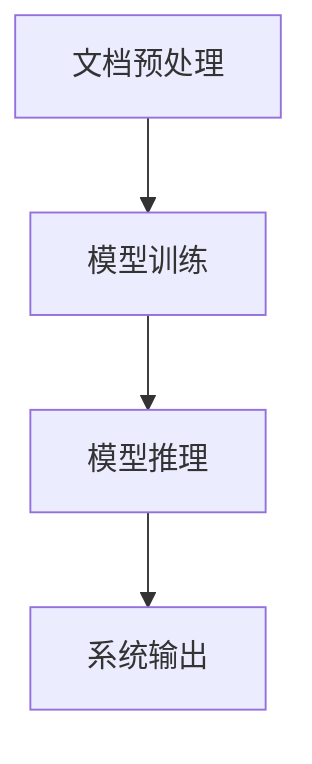
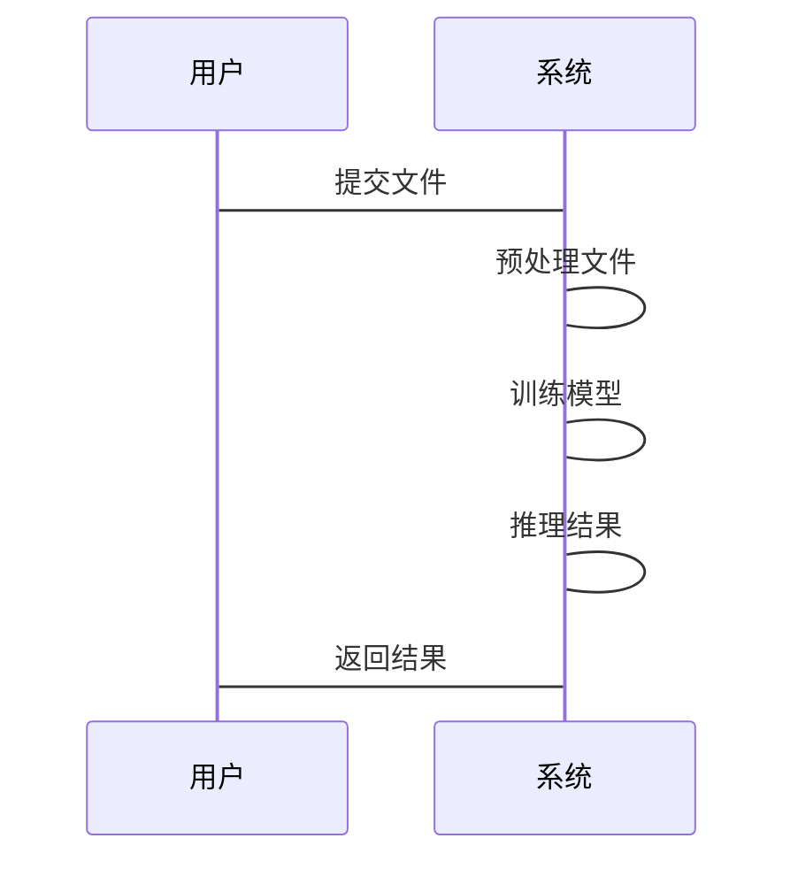

                 


# 构建基于NLP的金融监管文件遵从性检查系统

> 关键词：金融监管，NLP，自然语言处理，文件检查，机器学习，文本分析

> 摘要：本文详细探讨了如何利用自然语言处理（NLP）技术构建一个高效的金融监管文件遵从性检查系统。通过分析金融监管文件的文本特征，结合机器学习模型，提出了一种基于NLP的解决方案，旨在提高金融监管效率和准确性。文章从问题背景、核心概念、算法原理、系统架构到项目实战进行了全面阐述，为读者提供了一套完整的系统构建方法。

---

## 第一部分: 背景介绍

### 第1章: 问题背景与描述

#### 1.1 问题背景
##### 1.1.1 金融监管的重要性
金融监管是维护金融市场秩序、保护投资者利益的重要手段。随着金融市场的日益复杂化，监管文件的数量和种类也在不断增加。传统的监管方式依赖人工审查，效率低下且容易出错。

##### 1.1.2 金融监管文件的复杂性
金融监管文件通常包含大量法律术语、专业术语和复杂的结构。人工审查不仅耗时，还容易忽略关键信息。

##### 1.1.3 现有监管方式的局限性
传统的人工审查方式存在以下问题：
- **效率低下**：面对海量文件，人工审查难以快速完成。
- **准确性不足**：人为疏忽可能导致重要问题被遗漏。
- **一致性差**：不同审查人员的标准可能存在差异。

#### 1.2 问题描述
##### 1.2.1 金融监管文件的主要类型
金融监管文件主要包括以下几种类型：
1. **招股说明书**：上市公司公开发行股票时的文件，包含公司财务信息、经营状况等内容。
2. **定期报告**：上市公司每季度或每年提交的财务报告。
3. **监管报告**：金融机构向监管机构提交的合规性报告。
4. **法律文件**：与金融交易相关的合同、协议等。

##### 1.2.2 文件遵从性检查的核心问题
文件遵从性检查的核心问题是确保金融文件的内容符合相关法律法规和监管要求。这需要对文本进行深度理解和分析，包括关键词提取、实体识别、关系抽取等。

##### 1.2.3 当前技术手段的不足
尽管现有的技术手段（如关键词匹配、规则引擎）在一定程度上提高了监管效率，但仍然存在以下问题：
- **无法处理复杂语义**：传统技术难以理解文本的上下文和隐含含义。
- **缺乏灵活性**：面对新的法律法规变化，现有系统难以快速适应。

#### 1.3 问题解决
##### 1.3.1 自然语言处理（NLP）的优势
NLP技术可以通过对文本的深度分析，提取关键词、识别实体、理解语义，从而为金融监管提供强有力的支持。

##### 1.3.2 机器学习在金融监管中的应用
机器学习可以用于分类、聚类、回归等任务，帮助监管机构快速识别异常行为、预测风险。

##### 1.3.3 基于NLP的文件检查系统的设计目标
- 提高文件审查效率。
- 准确识别文件中的违规内容。
- 实现自动化、智能化的监管流程。

#### 1.4 系统边界与外延
##### 1.4.1 系统功能的边界
系统主要关注金融文件的内容分析，不涉及文件的生成或修改。

##### 1.4.2 系统适用的范围
系统适用于各类金融监管文件的审查，包括但不限于招股说明书、定期报告、监管报告等。

##### 1.4.3 系统与外部系统的交互
系统可以通过API接口与其他监管系统（如数据采集系统、风险预警系统）进行交互。

### 第2章: 核心概念与联系

#### 2.1 NLP与金融监管的结合
##### 2.1.1 NLP在金融监管中的应用场景
- **关键词提取**：识别文件中的关键信息，如财务数据、公司名称等。
- **实体识别**：识别文件中的组织机构、人名、日期等实体。
- **关系抽取**：分析文件中实体之间的关系，如“公司A在日期B发布了报告C”。

##### 2.1.2 金融监管文件的文本特征分析
金融监管文件通常具有以下文本特征：
- **专业术语密集**：文件中包含大量法律和金融术语。
- **结构复杂**：文件通常分为多个章节，每个章节有特定的内容要求。
- **语义深度高**：文件内容通常涉及复杂的法律和财务问题。

##### 2.1.3 NLP模型在文件检查中的作用
- **自动分类**：将文件分类为合规或不合规。
- **内容抽取**：从文件中提取关键信息。
- **异常检测**：识别文件中的违规内容。

#### 2.2 系统核心概念原理
##### 2.2.1 文本预处理流程
文本预处理是NLP任务的基础，主要包括以下步骤：
1. **分词**：将文本分割成单词或短语。
2. **去除停用词**：移除对文本理解影响较小的词语（如“的”、“了”等）。
3. **词干提取**：将词语还原为词干（如“running”还原为“run”）。
4. **向量化**：将文本转换为数值向量，以便模型处理。

##### 2.2.2 模型训练与优化
模型训练是系统的核心部分，通常采用以下步骤：
1. **数据标注**：对监管文件进行人工标注，标记合规或不合规的内容。
2. **特征提取**：从文本中提取特征，如TF-IDF特征、词嵌入等。
3. **模型选择**：选择合适的模型（如SVM、随机森林、神经网络等）。
4. **模型训练**：使用标注数据训练模型。
5. **模型优化**：通过交叉验证、网格搜索等方法优化模型参数。

##### 2.2.3 系统推理与结果输出
系统推理是模型的应用阶段，主要包括以下步骤：
1. **输入处理**：将待检查的文件输入系统。
2. **特征提取**：从文件中提取特征。
3. **模型推理**：使用训练好的模型对文件进行分类或预测。
4. **结果输出**：输出检查结果，如“合规”或“不合规”。

#### 2.3 核心概念对比表
##### 2.3.1 不同NLP模型的性能对比
| 模型类型      | 优点                          | 缺点                          |
|---------------|-------------------------------|-------------------------------|
| 基础模型（如SVM） | 实现简单，计算效率高          | 对复杂语义理解能力有限        |
| 高阶模型（如BERT） | 理解能力强，准确率高          | 实现复杂，计算资源消耗大        |

##### 2.3.2 不同监管文件的特征对比
| 文件类型      | 主要内容                          | 特征                          |
|---------------|-----------------------------------|-------------------------------|
| 招股说明书      | 公司财务信息、经营状况          | 专业术语多，结构复杂          |
| 定期报告        | 财务数据、公司公告              | 数据量大，内容更新频繁          |
| 监管报告        | 合规性报告                      | 格式统一，内容规范          |

##### 2.3.3 系统功能模块的对比
| 功能模块      | 输入                          | 输出                          |
|---------------|-------------------------------|-------------------------------|
| 文本预处理      | 原始文本                      | 处理后的文本或向量          |
| 模型训练      | 标注数据                      | 训练好的模型                |
| 系统推理      | 待检查文件                    | 检查结果（合规/不合规）      |

#### 2.4 ER实体关系图


---

## 第三部分: 算法原理讲解

### 第3章: 算法原理与实现

#### 3.1 算法原理
##### 3.1.1 预训练语言模型的选择
预训练语言模型（如BERT）通过大量语料库的预训练，能够捕捉到文本的上下文信息，非常适合金融监管文件的分析。

##### 3.1.2 模型微调的流程
模型微调是指在预训练模型的基础上，针对特定任务进行微调。流程如下：
1. **加载预训练模型**：加载BERT等预训练模型。
2. **定义任务目标**：定义分类任务（如合规/不合规分类）。
3. **数据准备**：准备标注数据，包括正样本和负样本。
4. **模型微调**：在标注数据上进行微调，优化模型参数。

##### 3.1.3 分类任务的设计
分类任务的设计需要考虑以下因素：
- **标签设计**：定义标签（如0表示合规，1表示不合规）。
- **数据平衡**：确保正负样本数量平衡，避免模型偏向某一类别。

#### 3.2 算法流程图


#### 3.3 Python代码实现
##### 3.3.1 文本预处理
```python
import numpy as np
from sklearn.feature_extraction.text import TfidfVectorizer

def preprocess(text):
    # 分词
    words = text.split()
    # 去除停用词
    stop_words = set(['的', '了', '是', '在', '中', '为', '不'])
    filtered_words = [word for word in words if word not in stop_words]
    # 词干提取（简单实现）
    stem_words = [word[:-2] if word.endswith(('ing', 'ly') else word for word in filtered_words]
    return ' '.join(stem_words)
```

##### 3.3.2 模型训练
```python
from sklearn.svm import SVC
from sklearn.model_selection import train_test_split
from sklearn.metrics import accuracy_score

def train_model(preprocessed_texts, labels):
    # 特征提取
    vectorizer = TfidfVectorizer()
    features = vectorizer.fit_transform(preprocessed_texts)
    # 模型训练
    model = SVC()
    X_train, X_test, y_train, y_test = train_test_split(features, labels, test_size=0.2)
    model.fit(X_train, y_train)
    # 模型评估
    y_pred = model.predict(X_test)
    print("Accuracy:", accuracy_score(y_test, y_pred))
    return model, vectorizer
```

##### 3.3.3 模型推理
```python
def infer_model(model, vectorizer, input_text):
    preprocessed_text = preprocess(input_text)
    feature = vectorizer.transform([preprocessed_text])
    prediction = model.predict(feature)
    return "合规" if prediction[0] == 0 else "不合规"
```

#### 3.4 数学模型与公式
##### 3.4.1 损失函数
$$ L = -\sum_{i=1}^{n} y_i \log(p_i) + (1 - y_i) \log(1 - p_i) $$
其中，\( p_i \) 是模型预测的概率，\( y_i \) 是真实标签。

##### 3.4.2 优化器
$$ \theta = \theta - \eta \frac{\partial L}{\partial \theta} $$
其中，\( \theta \) 是模型参数，\( \eta \) 是学习率。

---

## 第四部分: 系统分析与架构设计方案

### 第4章: 系统架构设计

#### 4.1 问题场景介绍
系统需要处理大量的金融监管文件，要求快速、准确地完成合规性检查。

#### 4.2 项目介绍
本系统旨在利用NLP技术，构建一个高效的金融监管文件检查系统，帮助监管机构提高效率和准确性。

#### 4.3 系统功能设计
##### 4.3.1 领域模型类图


#### 4.4 系统架构设计
##### 4.4.1 系统架构图


#### 4.5 系统接口设计
##### 4.5.1 API接口
- **输入接口**：接收金融监管文件文本。
- **输出接口**：返回合规性检查结果。

##### 4.5.2 数据接口
- **数据输入**：标注数据文件。
- **数据输出**：模型训练结果、推理结果。

#### 4.6 系统交互流程图


---

## 第五部分: 项目实战

### 第5章: 项目实战

#### 5.1 环境配置
- **Python版本**：3.8及以上
- **依赖库**：scikit-learn、spacy、transformers

#### 5.2 系统核心实现
##### 5.2.1 文本预处理
```python
import spacy

nlp = spacy.load("en_core_web_sm")

def preprocess_spacy(text):
    doc = nlp(text)
    filtered_words = [token.text for token in doc if not token.is_stop]
    return ' '.join(filtered_words)
```

##### 5.2.2 模型训练
```python
from transformers import BertTokenizer, BertForSequenceClassification
import torch

def train_bert(preprocessed_texts, labels):
    tokenizer = BertTokenizer.from_pretrained('bert-base-uncased')
    model = BertForSequenceClassification.from_pretrained('bert-base-uncased', num_labels=2)
    optimizer = torch.optim.AdamW(model.parameters(), lr=2e-5)
    criterion = torch.nn.CrossEntropyLoss()
    
    for epoch in range(3):
        for text, label in zip(preprocessed_texts, labels):
            inputs = tokenizer(text, return_tensors='pt')
            outputs = model(**inputs)
            loss = criterion(outputs.logits, torch.tensor([label]))
            loss.backward()
            optimizer.step()
            model.zero_grad()
    return model, tokenizer
```

##### 5.2.3 系统推理
```python
def infer_bert(model, tokenizer, input_text):
    inputs = tokenizer(input_text, return_tensors='pt')
    with torch.no_grad():
        outputs = model(**inputs)
    prediction = torch.argmax(outputs.logits, dim=1).item()
    return "合规" if prediction == 0 else "不合规"
```

#### 5.3 案例分析
##### 5.3.1 数据准备
假设有以下标注数据：
| 文本内容                          | 标签 |
|-----------------------------------|------|
| 公司2022年净利润增长10%            | 合规 |
| 未按规定披露关联交易信息          | 不合规 |

##### 5.3.2 模型训练与推理
```python
texts = ["公司2022年净利润增长10%", "未按规定披露关联交易信息"]
labels = [0, 1]

model, tokenizer = train_bert(texts, labels)
result = infer_bert(model, tokenizer, "未按规定披露关联交易信息")
print(result)  # 输出：不合规
```

#### 5.4 项目小结
通过实际案例分析，可以验证系统的有效性和准确性。模型在标注数据上的表现决定了其实际应用的效果。

---

## 第六部分: 总结与展望

### 第6章: 总结与展望

#### 6.1 总结
本文详细探讨了如何利用NLP技术构建金融监管文件遵从性检查系统。通过文本预处理、模型训练和系统推理，系统能够高效、准确地完成文件检查任务。

#### 6.2 展望
未来的研究方向包括：
1. **模型优化**：探索更先进的NLP模型（如更大规模的预训练模型）。
2. **多模态分析**：结合文本、表格等多种数据形式进行分析。
3. **实时监控**：实现实时文件检查，提高监管效率。

---

## 第七部分: 最佳实践 tips

### 第7章: 最佳实践 tips

#### 7.1 小结
- 系统设计要注重模块化和可扩展性。
- 数据标注是系统成功的关键，确保数据质量。
- 模型选择要考虑任务需求和计算资源。

#### 7.2 注意事项
- 在实际应用中，需考虑数据隐私和安全问题。
- 系统上线前要进行充分的测试和优化。

#### 7.3 拓展阅读
- **相关书籍**：《Python机器学习实战》、《自然语言处理入门》。
- **技术博客**：关注NLP和金融监管相关的技术博客，获取最新动态。

---

## 第八部分: 附录

### 第8章: 附录

#### 8.1 完整代码示例
```python
import spacy
from sklearn.svm import SVC
from sklearn.feature_extraction.text import TfidfVectorizer
from sklearn.model_selection import train_test_split
from sklearn.metrics import accuracy_score

nlp = spacy.load("en_core_web_sm")

def preprocess_spacy(text):
    doc = nlp(text)
    filtered_words = [token.text for token in doc if not token.is_stop]
    return ' '.join(filtered_words)

def train_model(preprocessed_texts, labels):
    vectorizer = TfidfVectorizer()
    features = vectorizer.fit_transform(preprocessed_texts)
    model = SVC()
    X_train, X_test, y_train, y_test = train_test_split(features, labels, test_size=0.2)
    model.fit(X_train, y_train)
    y_pred = model.predict(X_test)
    print("Accuracy:", accuracy_score(y_test, y_pred))
    return model, vectorizer

def infer_model(model, vectorizer, input_text):
    preprocessed_text = preprocess_spacy(input_text)
    feature = vectorizer.transform([preprocessed_text])
    prediction = model.predict(feature)
    return "合规" if prediction[0] == 0 else "不合规"

# 示例使用
texts = ["公司2022年净利润增长10%", "未按规定披露关联交易信息"]
labels = [0, 1]

model, vectorizer = train_model(texts, labels)
result = infer_model(model, vectorizer, "未按规定披露关联交易信息")
print(result)  # 输出：不合规
```

#### 8.2 相关数学公式
- **损失函数**：
$$ L = -\sum_{i=1}^{n} y_i \log(p_i) + (1 - y_i) \log(1 - p_i) $$
- **优化器**：
$$ \theta = \theta - \eta \frac{\partial L}{\partial \theta} $$

---

通过以上内容，我们可以看到，构建一个基于NLP的金融监管文件遵从性检查系统需要从背景分析、核心概念、算法原理、系统架构到实际项目实现的全面考虑。通过本文的详细讲解，读者可以掌握构建此类系统的完整方法。

