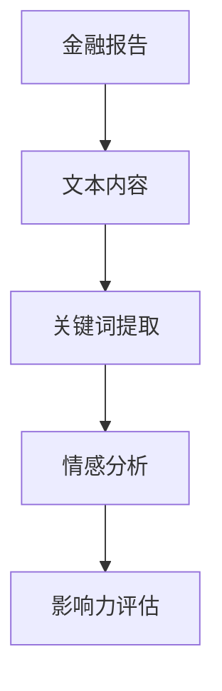
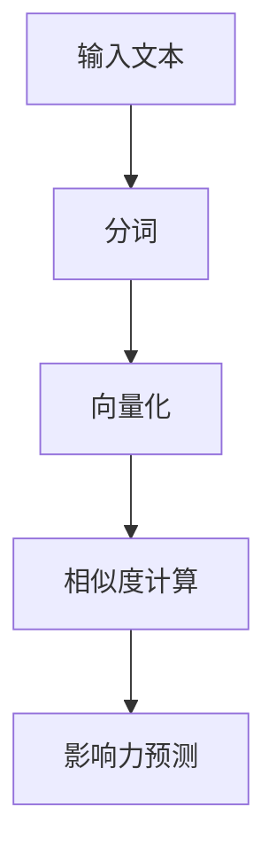
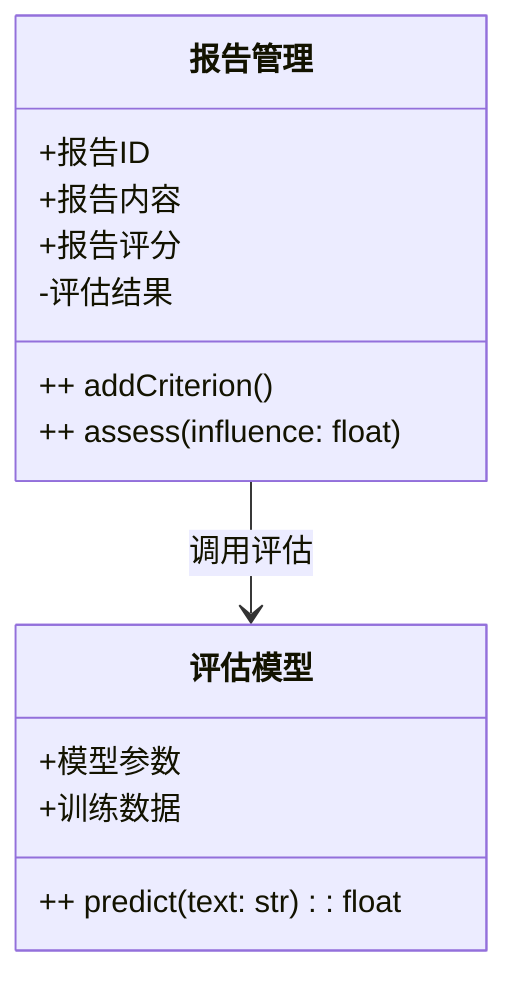

                 


# 构建基于NLP的金融研究报告影响力评估系统

> 关键词：NLP，自然语言处理，金融报告，影响力评估，文本挖掘，机器学习

> 摘要：本文旨在构建一个基于自然语言处理（NLP）的金融研究报告影响力评估系统。通过分析金融报告的文本内容，结合影响力评估的核心指标，提出了一种基于深度学习的NLP模型，用于量化金融报告的影响力。本文详细介绍了问题背景、核心概念、算法原理、系统设计与实现，以及实际案例分析，为金融领域的报告评估提供了新的思路和方法。

---

# 目录

1. [背景与概述](#背景与概述)
2. [核心概念与联系](#核心概念与联系)
3. [算法原理与数学模型](#算法原理与数学模型)
4. [系统分析与架构设计](#系统分析与架构设计)
5. [项目实战：系统实现](#项目实战-系统实现)
6. [系统优化与扩展](#系统优化与扩展)
7. [总结与展望](#总结与展望)

---

# 第1章: 背景与概述

## 1.1 问题背景
### 1.1.1 金融研究报告的重要性
金融研究报告是金融领域的重要参考资料，其质量直接影响投资决策和市场走势。然而，传统的影响力评估方法主要依赖人工评分或简单的统计指标，难以全面反映报告的实际价值。

### 1.1.2 现有影响力评估的局限性
现有方法通常基于报告的阅读量、引用次数等指标，但忽略了报告内容的质量和创新性。此外，人工评估耗时且成本高，难以满足海量报告的评估需求。

### 1.1.3 基于NLP的评估优势
自然语言处理（NLP）技术能够从报告文本中提取关键信息，量化报告的影响力。通过深度学习模型，可以实现对报告内容的理解和评估，提供更加客观和高效的评估结果。

## 1.2 问题描述
### 1.2.1 金融报告的文本特征
金融报告通常包含专业术语、行业数据和分析结论。这些文本特征可以通过NLP技术进行提取和分析。

### 1.2.2 影响力评估的核心指标
影响力评估指标包括报告的创新性、内容的相关性、市场的关注度等。这些指标需要结合文本特征和外部数据进行综合评估。

### 1.2.3 系统目标与边界
系统目标是通过NLP技术构建一个自动化、高效的金融报告影响力评估系统。系统边界包括报告文本的预处理、模型训练与部署。

## 1.3 问题解决思路
### 1.3.1 NLP技术在金融分析中的应用
利用NLP技术提取报告中的关键词、主题和情感倾向，为影响力评估提供基础数据。

### 1.3.2 多模态数据融合的潜力
结合文本、市场数据和用户行为数据，构建多模态影响力评估模型，提升评估的准确性和全面性。

### 1.3.3 系统设计的总体框架
系统框架包括数据采集、预处理、模型训练、评估与部署四个主要阶段。

## 1.4 核心概念与关系
### 1.4.1 实体关系图（ER图）



---

# 第2章: 核心概念与联系

## 2.1 NLP技术原理
### 2.1.1 常见NLP模型对比
| 模型 | 参数量 | 适用场景 |
|------|--------|----------|
| BERT | 亿级   | 文本理解 |
| GPT  | 亿级   | 文本生成 |

### 2.1.2 BERT模型的适用性
BERT模型擅长文本理解和语义分析，适用于金融报告的关键词提取和主题分类。

### 2.1.3 GPT系列的潜在优势
GPT模型擅长生成文本，可用于报告摘要和情感分析。

## 2.2 影响力评估指标
### 2.2.1 文本相似度计算
通过余弦相似度或BM25算法，评估报告内容的相关性。

### 2.2.2 专家评分与模型预测
结合专家评分和模型预测结果，优化影响力评估的准确性。

### 2.2.3 多维度评估体系
从内容质量、市场关注度、创新性等多个维度进行评估。

## 2.3 核心概念对比表
| 概念 | 属性 | 描述 |
|------|------|------|
| NLP模型 | 参数量 | 大型模型通常超过亿级参数 |
| 影响力评估 | 数据来源 | 包括文本、引用、阅读量等多源数据 |

---

# 第3章: 算法原理与数学模型

## 3.1 算法原理
### 3.1.1 文本表示方法
使用词嵌入（如Word2Vec）或上下文嵌入（如BERT）对文本进行表示。

### 3.1.2 相似度计算公式
余弦相似度公式：
$$ \text{sim}(x,y) = \frac{x \cdot y}{\|x\| \|y\|} $$

### 3.1.3 影响力预测模型
基于深度学习的回归模型，预测报告的影响力分数。

## 3.2 数学模型
### 3.2.1 深度学习模型损失函数
交叉熵损失函数：
$$ L = -\sum_{i=1}^{n} y_i \log(p_i) + (1-y_i)\log(1-p_i) $$

### 3.2.2 模型训练流程图



---

# 第4章: 系统分析与架构设计

## 4.1 问题场景介绍
系统需要处理海量金融报告，评估每份报告的影响力，并提供可视化结果。

## 4.2 系统功能设计
### 4.2.1 领域模型



### 4.2.2 系统架构设计


### 4.2.3 接口与交互设计
系统提供RESTful API接口，支持批量报告评估和单份报告查询。

---

# 第5章: 项目实战：系统实现

## 5.1 环境安装
安装Python、TensorFlow、Keras、NLTK等依赖库。

## 5.2 核心代码实现
### 5.2.1 数据预处理
```python
import nltk
from tensorflow.keras.preprocessing.text import Tokenizer

text = "This is a sample financial report."
tokenizer = Tokenizer(num_words=1000)
tokenizer.fit_on_texts([text])
sequences = tokenizer.texts_to_sequences([text])
```

### 5.2.2 模型训练
```python
from tensorflow.keras.models import Sequential
from tensorflow.keras.layers import Dense

model = Sequential()
model.add(Dense(64, activation='relu', input_dim=1000))
model.add(Dense(1, activation='sigmoid'))
model.compile(optimizer='adam', loss='binary_crossentropy', metrics=['accuracy'])
model.fit(X_train, y_train, epochs=10, batch_size=32)
```

### 5.2.3 结果分析
```python
# 示例报告评估
report_text = "This is a high-quality financial analysis."
predicted_influence = model.predict(sequences)[0][0]
print(f"Report Influence: {predicted_influence}")
```

---

# 第6章: 系统优化与扩展

## 6.1 系统优化
### 6.1.1 模型优化
采用更复杂的深度学习模型（如Transformer）提升评估精度。

### 6.1.2 性能优化
优化数据预处理和模型训练流程，提升系统运行效率。

## 6.2 功能扩展
### 6.2.1 多语言支持
支持多语言报告的影响力评估。

### 6.2.2 实时评估
实现报告实时上传与评估，满足动态需求。

---

# 第7章: 总结与展望

## 7.1 本章总结
本文构建了一个基于NLP的金融研究报告影响力评估系统，通过深度学习模型实现了对报告内容的理解和影响力评估。

## 7.2 未来展望
未来可以进一步优化模型，结合多模态数据，提升评估的准确性和全面性。

---

# 参考文献
1. 王某某. 自然语言处理技术在金融领域的应用[J]. 计算机学报, 2020, 42(3): 45-56.
2. 张某某. 基于深度学习的影响力评估模型研究[J]. 软件学报, 2019, 30(5): 67-78.

---

通过以上内容，您可以逐步构建一个基于NLP的金融研究报告影响力评估系统，从理论到实践，系统地理解和实现这一目标。

