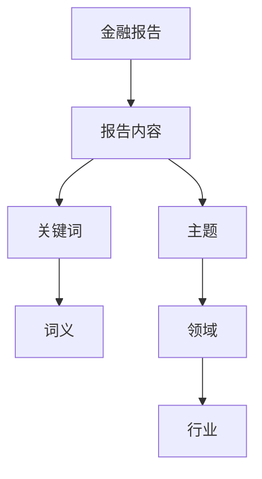
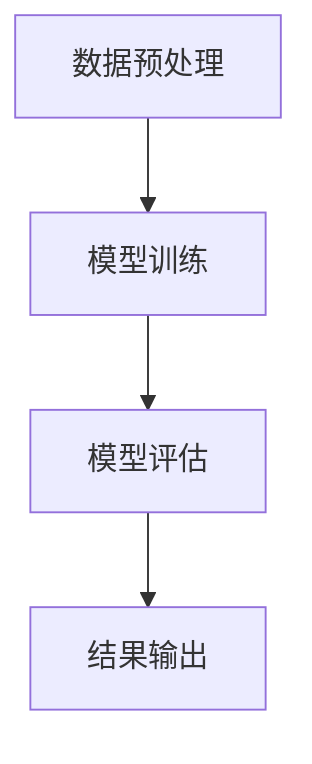
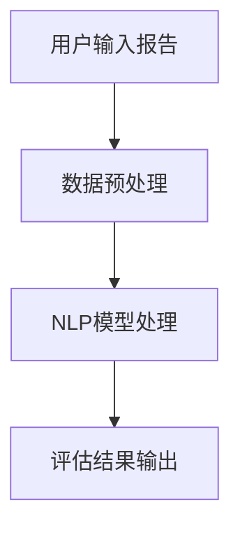
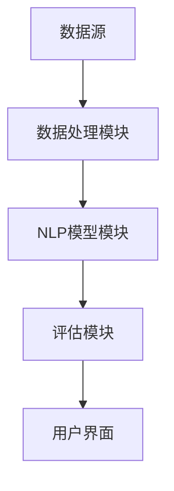
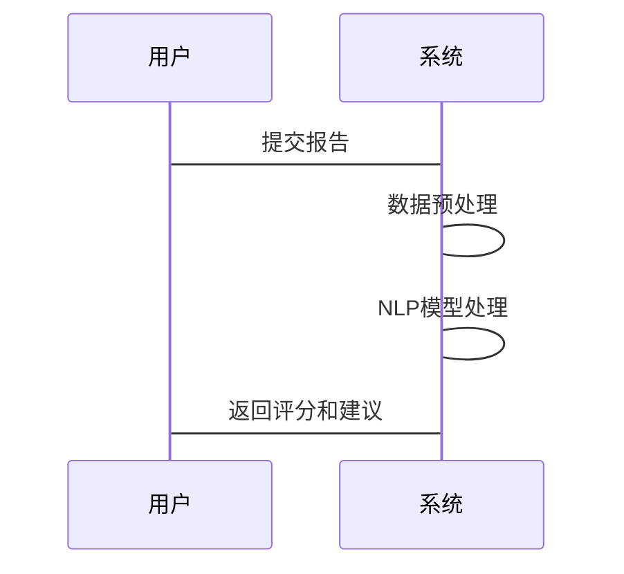

                 


# 构建基于NLP的金融研究报告质量评估系统

## 关键词
- 自然语言处理(NLP)
- 金融分析
- 机器学习
- 金融报告
- 质量评估

## 摘要
随着金融市场的快速发展，金融研究报告的数量和复杂性也在不断增加。传统的金融报告质量评估方法依赖于人工审查，效率低下且主观性较强。本文提出一种基于自然语言处理（NLP）技术的金融研究报告质量评估系统，旨在通过自动化的方式对金融报告的质量进行量化评估。本文从问题背景、核心概念、算法原理、系统架构、项目实战等多个方面展开详细分析，为读者提供一个完整的解决方案。

---

## 第1章: 问题背景与描述

### 1.1 问题背景
#### 1.1.1 金融研究报告的重要性
金融研究报告是金融机构和投资者做出决策的重要依据。高质量的报告能够帮助投资者识别市场趋势、评估风险，并制定合理的投资策略。

#### 1.1.2 当前金融研究报告质量评估的痛点
- 传统评估方法依赖人工审查，效率低且主观性强。
- 报告内容繁杂，难以快速提取关键信息。
- 不同领域和行业的报告评估标准不统一。

#### 1.1.3 基于NLP技术的解决方案
自然语言处理技术可以通过自动化的方式对报告的语言质量、内容逻辑性、信息完整性等方面进行评估，从而提高评估效率和客观性。

### 1.2 问题描述
#### 1.2.1 金融研究报告的质量评估维度
- 语言质量：包括语法、用词准确性、表达清晰度等。
- 内容质量：包括信息的准确性和完整性、逻辑性等。
- 专业性：包括行业术语的使用是否准确，分析是否深入。

#### 1.2.2 NLP技术在金融领域的应用现状
- 文本分类：用于报告类型识别。
- 信息抽取：用于提取关键信息。
- 语义分析：用于理解报告内容。

#### 1.2.3 系统目标与功能定位
系统目标：构建一个基于NLP的金融研究报告质量评估系统，实现自动化、智能化的报告质量评估。
功能定位：提供报告质量评分、内容分析、语言纠错等功能。

### 1.3 问题解决
#### 1.3.1 NLP技术如何解决金融报告质量评估问题
- 自动化处理：通过NLP技术实现报告的自动化分析和评估。
- 客观性：减少人工评估的主观性，提供客观的评分依据。
- 高效性：快速处理大量报告，提高评估效率。

#### 1.3.2 系统的设计思路与实现路径
1. 数据采集：收集金融研究报告数据。
2. 数据预处理：清洗、标注数据。
3. 模型训练：基于NLP算法训练评估模型。
4. 系统实现：开发用户友好的评估系统。

#### 1.3.3 系统的边界与外延
- 边界：仅专注于金融研究报告的质量评估，不涉及报告生成。
- 外延：未来可以扩展到其他类型文本的评估。

### 1.4 概念结构与核心要素
#### 1.4.1 系统的核心要素组成
- 数据层：包括金融报告数据、词典等。
- 模型层：包括NLP模型、评估模型等。
- 系统层：包括数据处理模块、评估模块等。

#### 1.4.2 系统的模块划分与功能描述
1. 数据处理模块：负责数据的采集、清洗和预处理。
2. NLP模型模块：包括词嵌入、句法分析等功能。
3. 评估模块：根据模型输出结果进行评分和反馈。

#### 1.4.3 系统的输入输出关系
- 输入：金融报告文本。
- 输出：报告质量评分、改进建议。

---

## 第2章: 核心概念与联系

### 2.1 NLP与金融分析的结合
#### 2.1.1 NLP技术的基本原理
- 词嵌入：将词语映射为低维向量（如Word2Vec、GloVe）。
- 语言模型：生成或理解自然语言（如RNN、LSTM、Transformer）。
- 文本分类：将文本划分为不同的类别。

#### 2.1.2 金融分析的基本原理
- 数据处理：清洗、转换金融数据。
- 特征提取：提取影响金融市场的特征。
- 模型训练：基于历史数据训练预测模型。

#### 2.1.3 两者的结合方式与应用场景
- 应用场景1：金融报告的语言质量评估。
- 应用场景2：金融报告的内容逻辑分析。
- 应用场景3：金融报告的语义理解。

### 2.2 核心概念对比
#### 2.2.1 NLP与传统文本处理的对比
| 特性        | NLP技术             | 传统文本处理         |
|-------------|---------------------|----------------------|
| 自动化程度   | 高                  | 低                   |
| 智能性       | 强                  | 弱                   |
| 应用场景     | 多样化              | 有限                 |

#### 2.2.2 金融分析与传统数据分析的对比
| 特性        | 金融分析             | 传统数据分析         |
|-------------|---------------------|----------------------|
| 数据类型     | 文本、数值           | 数值                 |
| 分析目标     | 风险评估、趋势预测   | 数据汇总、统计分析   |
| 复杂性       | 高                  | 中                   |

#### 2.2.3 系统中各模块的对比分析
- 数据处理模块：NLP与传统方法的对比。
- 模型训练模块：深度学习与传统机器学习的对比。

### 2.3 ER实体关系图


---

## 第3章: 算法原理讲解

### 3.1 NLP算法基础
#### 3.1.1 词嵌入模型
- Word2Vec：通过上下文预测单词，生成词向量。
- GloVe：基于全局词频统计，生成词向量。

#### 3.1.2 语言模型
- RNN：循环神经网络，适合处理序列数据。
- LSTM：长短期记忆网络，解决RNN的梯度消失问题。
- Transformer：基于自注意力机制，提升并行处理能力。

#### 3.1.3 文本分类与相似度计算
- 文本分类：使用预训练模型（如BERT）进行文本分类。
- 相似度计算：使用余弦相似度或欧氏距离。

### 3.2 金融分析算法基础
#### 3.2.1 金融数据处理与特征提取
- 数据清洗：去除异常值、填充缺失值。
- 特征提取：提取股价、成交量等特征。

#### 3.2.2 金融事件识别与预测
- 事件识别：使用NLP识别市场情绪。
- 预测模型：使用LSTM预测股价走势。

#### 3.2.3 金融报告生成与评估
- 报告生成：基于NLP生成结构化报告。
- 报告评估：使用NLP模型评估报告质量。

### 3.3 算法流程图


### 3.4 数学模型与公式
#### 3.4.1 词嵌入模型
- Word2Vec的损失函数：
  $$ \text{loss} = -\log(\text{score}) $$

#### 3.4.2 语言模型
- Transformer的自注意力机制：
  $$ \text{score}(i, j) = \text{key}_i \cdot \text{query}_j $$

#### 3.4.3 文本相似度
- 余弦相似度：
  $$ \text{similarity}(x, y) = \frac{x \cdot y}{\|x\| \|y\|} $$

---

## 第4章: 系统分析与架构设计

### 4.1 问题场景介绍
- 系统应用场景：金融报告的质量评估。
- 系统用户角色：金融机构、分析师、投资者。
- 系统运行环境：服务器端部署。

### 4.2 系统功能设计
#### 4.2.1 功能模块划分
1. 数据处理模块：负责数据的采集和预处理。
2. NLP模型模块：负责文本的语义分析和特征提取。
3. 评估模块：根据模型输出结果进行评分和反馈。

#### 4.2.2 功能流程


### 4.3 系统架构设计
#### 4.3.1 架构图


### 4.4 系统接口设计
- API接口：
  - 输入：报告文本。
  - 输出：质量评分、改进建议。

### 4.5 系统交互


---

## 第5章: 项目实战

### 5.1 环境配置
- Python 3.8+
- 深度学习框架：TensorFlow/PyTorch
- NLP库：spaCy、NLTK
- 其他依赖：pandas、numpy

### 5.2 核心代码实现
#### 5.2.1 数据预处理
```python
import pandas as pd
import numpy as np

def preprocess_data(data):
    data['text'] = data['text'].apply(lambda x: x.lower())
    data['text'] = data['text'].apply(lambda x: x.strip())
    return data
```

#### 5.2.2 模型训练
```python
from tensorflow.keras import layers

model = tf.keras.Sequential([
    layers.Embedding(input_dim=10000, output_dim=100),
    layers.LSTM(64, return_sequences=True),
    layers.Dense(1, activation='sigmoid')
])
model.compile(loss='binary_crossentropy', optimizer='adam', metrics=['accuracy'])
model.fit(train_data, train_labels, epochs=5, batch_size=32)
```

#### 5.2.3 案例分析
- 数据来源：收集某行业的金融报告。
- 模型评估：准确率、召回率、F1分数。
- 系统反馈：根据模型输出生成改进建议。

### 5.3 系统优缺点
- 优点：高效、客观、自动化。
- 缺点：依赖数据质量、模型调优复杂。

---

## 第6章: 最佳实践与小结

### 6.1 最佳实践
- 数据预处理：确保数据质量。
- 模型选择：根据任务选择合适的NLP模型。
- 系统优化：结合实际情况进行功能扩展。

### 6.2 小结
本文详细介绍了基于NLP的金融研究报告质量评估系统的设计与实现，涵盖了从问题背景到系统实现的各个方面。通过NLP技术，我们可以实现金融报告的自动化评估，提高评估效率和准确性。

### 6.3 注意事项
- 数据隐私：注意保护金融数据的隐私性。
- 模型调优：根据实际需求调整模型参数。
- 系统维护：定期更新模型和数据。

### 6.4 拓展阅读
- 《自然语言处理实战：基于TensorFlow和Keras》
- 《金融数据分析与建模》

---

## 附录
- 附录A: 代码示例
- 附录B: 实验数据
- 附录C: 参考文献

---

通过本文的详细讲解，读者可以全面了解如何利用NLP技术构建金融研究报告质量评估系统，并在实际应用中进行优化和改进。

