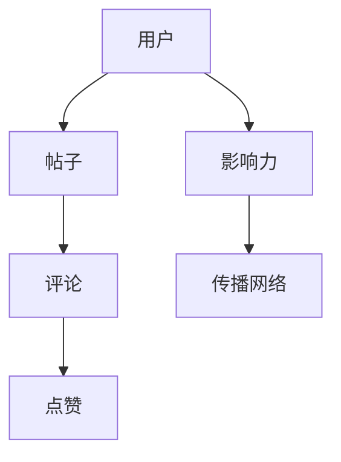
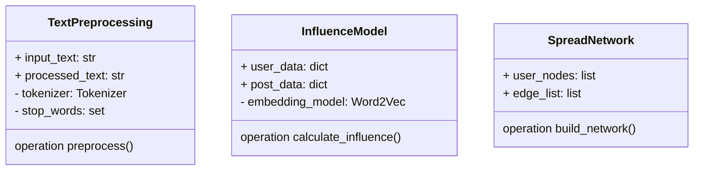
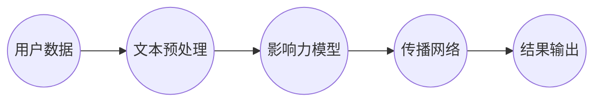
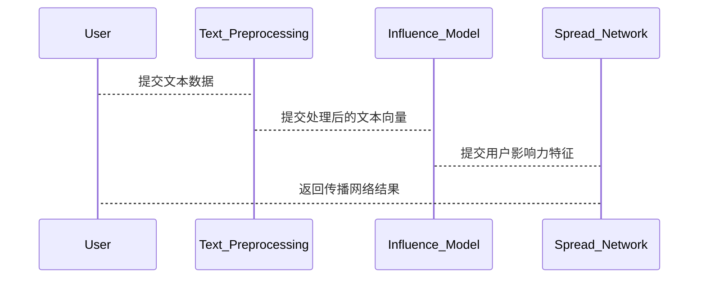

                 


# 构建基于NLP的金融社交媒体影响力传播模型

> 关键词：自然语言处理（NLP）、金融社交媒体、影响力传播模型、文本挖掘、用户行为分析

> 摘要：本文将详细探讨如何基于自然语言处理技术构建金融社交媒体上的影响力传播模型。通过分析社交媒体上的文本数据，结合用户行为数据，构建传播网络，并评估用户的影响力。本文从问题背景、核心概念、算法原理、系统架构到项目实战，全面深入地解析这一模型的构建过程，并提供实际案例和代码实现。

---

# 第一部分: 问题背景与核心概念

# 第1章: 问题背景介绍

## 1.1 金融社交媒体的兴起

- 1.1.1 互联网时代下金融信息传播的演变
- 1.1.2 社交媒体在金融领域的广泛应用
- 1.1.3 金融社交媒体的特点与挑战

## 1.2 社会影响力传播的重要性

- 1.2.1 什么是影响力传播
- 1.2.2 金融领域中影响力传播的独特性
- 1.2.3 影响力传播对金融市场的潜在影响

## 1.3 NLP技术在金融分析中的应用

- 1.3.1 NLP技术的基本原理
- 1.3.2 金融文本分析中的NLP应用
- 1.3.3 从文本到影响力的转化过程

## 1.4 问题描述与解决思路

- 1.4.1 问题的提出：如何量化用户影响力
- 1.4.2 问题解决的思路：基于NLP构建传播模型
- 1.4.3 模型的边界与适用范围

## 1.5 核心要素与概念结构

- 1.5.1 核心要素：文本数据、用户行为数据、传播网络
- 1.5.2 概念结构：从文本到影响力的关系链

---

# 第二部分: 核心概念与原理

# 第2章: NLP与影响力传播模型的核心原理

## 2.1 NLP技术的核心原理

### 2.1.1 文本预处理方法

- 分词处理：如何将文本分割成词语或短语
- 去除停用词：剔除对情感分析无意义的词汇
- 词干提取与词形还原：统一词的基干形式

### 2.1.2 词嵌入模型（Word2Vec、BERT）

- Word2Vec：通过上下文预测词义
- BERT：基于Transformer的双向编码器
- 词嵌入的优势：降维与语义保留

### 2.1.3 文本分类与情感分析

- 文本分类：将文本分为不同类别（如新闻类别）
- 情感分析：判断文本情感倾向（如 bullish 或 bearish）
- 实用场景：分析用户对金融市场的看法

## 2.2 社会影响力传播模型的构建原理

### 2.2.1 传播路径的定义

- 用户与内容的关系：用户发布的内容如何影响其他用户
- 内容传播的路径：从发布到被转发、评论、点赞
- 传播网络的构建：如何将用户行为转化为网络结构

### 2.2.2 用户影响力评估指标

- 用户的基本属性：活跃度、关注数、粉丝数
- 内容影响力：转发量、评论量、点赞量
- 用户行为的传播力：内容被传播的广度与深度

### 2.2.3 传播模型的构建方法

- 基于文本的情感分析：判断内容的影响力
- 基于行为的传播网络：构建用户间的传播关系
- 综合模型：将文本影响力与传播行为相结合

## 2.3 核心概念的对比分析

### 2.3.1 概念属性特征对比表

| 概念 | 特征 | 描述 |
|------|------|------|
| NLP技术 | 输入 | 文本数据 |
| 传播模型 | 输入 | 用户行为数据 |
| 综合模型 | 输入 | 文本数据 + 用户行为数据 |

### 2.3.2 ER实体关系图（Mermaid流程图）



---

# 第三部分: 算法原理与数学模型

# 第3章: 文本预处理与特征提取

## 3.1 文本预处理算法

### 3.1.1 分词与停用词处理

- 分词工具的选择：如jieba、spaCy
- 停用词列表的构建：去除无意义词汇

### 3.1.2 词干提取与词形还原

- 词干提取算法：如Porter Stemmer
- 词形还原算法：如Lemmatization

### 3.1.3 向量空间模型（VSM）

- 文本向量化：将文本转换为向量表示
- 向量空间的构建：基于词袋模型或词序模型

## 3.2 特征提取方法

### 3.2.1 TF-IDF特征提取

- TF-IDF的计算公式：
  $$ TF-IDF(t, d) = TF(t, d) \times \log\left(\frac{N}{DF(t)}\right) $$
  其中，$TF(t, d)$ 是词 $t$ 在文档 $d$ 中的词频，$DF(t)$ 是词 $t$ 在所有文档中的文档频次，$N$ 是文档总数。

### 3.2.2 词嵌入模型（Word2Vec）

- Word2Vec的训练过程：
  $$ \text{目标函数} = \sum_{i=1}^{n} \log P(w_i | w_{i+1}) $$
- 预训练模型的应用：使用公开的金融文本数据进行微调

### 3.2.3 文本表示的对比分析

- 向量空间模型的优缺点
- 词嵌入模型的适用场景

---

# 第四部分: 系统分析与架构设计方案

# 第4章: 系统架构设计

## 4.1 项目背景与目标

- 项目背景：金融社交媒体影响力传播模型的构建目标
- 项目目标：量化用户影响力，预测传播效果

## 4.2 系统功能设计

### 4.2.1 领域模型类图



## 4.3 系统架构设计

### 4.3.1 系统架构图



## 4.4 接口设计与交互

### 4.4.1 接口设计

- 输入接口：用户行为数据、文本数据
- 输出接口：用户影响力评分、传播网络图

### 4.4.2 交互序列图



---

# 第五部分: 项目实战与代码实现

# 第5章: 项目实战

## 5.1 环境安装与配置

- Python环境搭建
- 安装必要的库：numpy、pandas、spacy、pytorch、transformers

## 5.2 核心代码实现

### 5.2.1 文本预处理代码

```python
import spacy

nlp = spacy.load("en_core_web_sm")

def preprocess(text):
    doc = nlp(text)
    tokens = [token.text for token in doc if not token.is_stop]
    return " ".join(tokens)
```

### 5.2.2 情感分析代码

```python
from transformers import pipeline

sentiment_pipeline = pipeline("sentiment-analysis")

def analyze_sentiment(text):
    result = sentiment_pipeline(text)
    return result[0]['label']
```

### 5.2.3 传播网络构建代码

```python
import networkx as nx

def build_spread_network(edges):
    G = nx.Graph()
    G.add_edges_from(edges)
    return G
```

## 5.3 实际案例分析

### 5.3.1 案例一：新闻传播

- 数据来源：社交媒体上的新闻转发数据
- 分析结果：新闻的传播路径与用户影响力

### 5.3.2 案例二：用户互动

- 数据来源：用户的评论、点赞数据
- 分析结果：用户间的传播影响力

## 5.4 项目小结

- 代码实现的关键点
- 案例分析的启示
- 模型的优缺点与改进方向

---

# 第六部分: 总结与展望

## 6.1 总结

- 本文的核心内容回顾
- 构建模型的关键步骤总结

## 6.2 展望

- 技术的未来发展方向
- 模型的潜在应用场景
- 持续优化的方向与建议

---

**本文通过系统的分析与实践，深入探讨了如何基于NLP技术构建金融社交媒体上的影响力传播模型。从文本预处理到传播网络构建，再到实际案例分析，为读者提供了一套完整的解决方案。希望本文能为金融领域的影响力分析提供新的思路与方法。**

