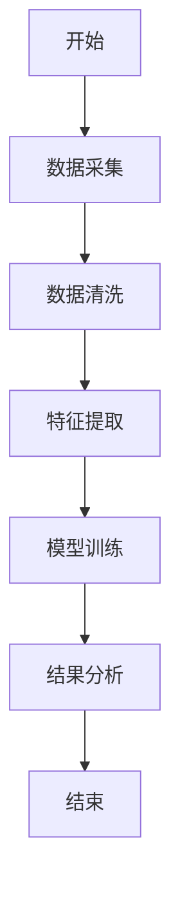

                 


# 《构建基于NLP的金融社交媒体影响力量化模型》

> **关键词**：自然语言处理、金融影响分析、社交媒体数据、情感计算、影响力传播模型

> **摘要**：本文旨在探讨如何利用自然语言处理（NLP）技术，结合金融社交媒体数据，构建一个能够量化用户影响力和市场情绪的模型。通过分析社交媒体上的文本数据，提取情感信息，并结合社会网络分析方法，量化用户的影响力和市场情绪，从而为金融决策提供支持。文章从背景、核心概念、算法原理、系统设计、项目实战等多个方面展开，详细阐述了模型构建的全过程。

---

## 第一部分: 问题背景与目标

### 第1章: 问题背景与目标

#### 1.1 问题背景
随着社交媒体的普及，越来越多的投资者和机构开始关注社交媒体上的信息，以获取市场情绪和潜在的投资机会。然而，社交媒体数据具有多样性、实时性和情感性等特点，传统的金融市场分析方法难以充分利用这些数据。自然语言处理（NLP）技术的快速发展为解决这一问题提供了新的可能性。

- **社交媒体数据的特点**：
  - 数据量大、类型多样（文本、图片、链接等）。
  - 情感信息丰富，但隐含、间接。
  - 数据更新速度快，实时性强。

- **社会情绪对金融市场的影响**：
  - 市场情绪可以通过社交媒体数据进行实时捕捉。
  - 情绪波动可能影响股票价格、市场走势等。

- **当前金融分析的局限性**：
  - 传统金融分析主要依赖基本面数据，难以捕捉市场情绪。
  - 数据处理复杂，缺乏高效的量化方法。

#### 1.2 问题描述
本文的目标是通过NLP技术，量化社交媒体上的文本信息，构建一个能够反映用户影响力和市场情绪的模型。具体目标包括：

- **文本信息提取**：
  - 从社交媒体文本中提取情感信息。
  - 量化用户的影响力。

- **模型构建**：
  - 构建基于NLP的情感分析模型。
  - 构建影响力传播模型。

- **应用场景**：
  - 为投资者提供实时市场情绪分析。
  - 为机构提供用户影响力评估。

#### 1.3 问题解决
本文通过以下方法解决问题：

- **数据清洗与特征提取**：
  - 清洗社交媒体数据，提取有用信息。
  - 提取文本特征，如关键词、情感倾向等。

- **模型训练与评估**：
  - 基于NLP技术训练情感分析模型。
  - 使用影响力传播模型量化用户影响力。

#### 1.4 边界与外延
- **数据范围**：
  - 本文主要关注文本数据，不考虑图片、视频等其他类型数据。
- **模型适用性**：
  - 本文模型适用于英语社交媒体数据，未来可以扩展到多语言数据。
- **扩展方向**：
  - 实时分析：实时更新市场情绪。
  - 多模态分析：结合图片、视频等数据。

#### 1.5 概念结构与核心要素
- **核心概念**：
  - 用户：社交媒体上的用户。
  - 文本：用户发布的文本信息。
  - 情感：文本中的情感倾向。
  - 影响力：用户的影响力。
- **核心要素**：
  - 文本数据：输入数据。
  - 情感分析模型：提取情感信息。
  - 影响力传播模型：量化影响力。

---

## 第二部分: 核心概念与联系

### 第2章: 核心概念原理

#### 2.1 文本挖掘与情感分析
- **文本挖掘**：
  - 从文本数据中提取有用信息。
  - 常用技术：分词、关键词提取、主题分析。

- **情感分析**：
  - 分类任务，分为正面、中性、负面三类。
  - 基于NLP技术实现，常用模型：BERT、LSTM。

#### 2.2 社会网络影响力分析
- **社会网络分析**：
  - 分析用户之间的关系，构建网络结构。
  - 常用指标：中心度、介数、影响力传播。

- **影响力传播模型**：
  - 用户影响力通过网络传播，影响其他用户。
  - 常用模型：PageRank、LSI（Latent Semantic Indexing）。

#### 2.3 核心概念属性特征对比
| 概念 | 特征 |
|------|------|
| 文本挖掘 | 数据清洗、特征提取 |
| 情感分析 | 情感分类、情感强度 |
| 影响力分析 | 用户影响力、影响力传播 |

### 第3章: ER实体关系图与流程图

#### 3.1 ER实体关系图
```mermaid
er
  actor: 用户
  tweet: 微博
  sentiment: 情感
  influence: 影响力
  relation: 关系
  actor -[发表]-> tweet
  tweet -[包含]-> sentiment
  actor -[影响]-> influence
  influence -[依赖]-> relation
```

#### 3.2 流程图


---

## 第三部分: 算法原理讲解

### 第4章: 算法原理与实现

#### 4.1 基于BERT的情感分析模型
- **BERT模型简介**：
  - 基于Transformer的预训练模型。
  - 支持多种任务，包括情感分析。

- **情感分类任务的实现**：
  ```python
  import torch
  from transformers import BertTokenizer, BertForSequenceClassification

  tokenizer = BertTokenizer.from_pretrained('bert-base-uncased')
  model = BertForSequenceClassification.from_pretrained('bert-base-uncased', num_labels=3)
  ```

- **模型训练与调优**：
  - 数据预处理：分词、标注。
  - 模型训练：使用交叉熵损失函数。
  - 调优：调整学习率、批量大小。

---

## 第四部分: 数学模型

### 第5章: 数学模型

#### 5.1 情感相似度计算
- **TF-IDF公式**：
  $$ TF-IDF(t, d) = \frac{TF(t, d)}{\log IDF(t)} $$
  - TF：词t在文档d中的频率。
  - IDF：逆文档频率。

- **余弦相似度公式**：
  $$ \cos \theta = \frac{\vec{A} \cdot \vec{B}}{|\vec{A}| |\vec{B}|} $$

#### 5.2 影响力传播模型
- **PageRank公式**：
  $$ PR(i) = \sum_{j \in In(i)} \frac{PR(j)}{Out(j)} $$
  - PR(i)：节点i的PageRank值。
  - In(i)：指向i的节点集合。
  - Out(j)：节点j的出度。

---

## 第五部分: 系统分析与架构设计方案

### 第6章: 系统设计

#### 6.1 系统功能设计
- **领域模型**：
  ```mermaid
  classDiagram
    class 用户 {
        id: int
        name: string
        influence: float
    }
    class 微博 {
        id: int
        content: string
        sentiment: string
    }
    用户 --> 微博
    用户 --> 影响力
  ```

- **系统架构设计**：
  ```mermaid
  architecture
    frontend --> backend
    backend --> database
    frontend --> cache
  ```

---

## 第六部分: 项目实战

### 第7章: 项目实战

#### 7.1 环境安装
- **Python环境**：
  - 安装Python 3.8以上版本。
  - 安装相关库：pandas、numpy、transformers、pytorch。

#### 7.2 核心代码实现
```python
import torch
from transformers import BertTokenizer, BertForSequenceClassification

# 数据预处理
def preprocess(text):
    return text.lower()

# 模型训练
model = BertForSequenceClassification.from_pretrained('bert-base-uncased', num_labels=3)
model.train()

# 模型推理
input_ids = tokenizer.encode("I love this product!", add_special_tokens=True)
outputs = model(input_ids=input_ids, labels=labels)
loss = outputs.loss
```

---

## 第七部分: 最佳实践

### 第8章: 最佳实践

#### 8.1 小结
- 本文构建了一个基于NLP的金融社交媒体影响力量化模型，能够量化用户影响力和市场情绪。
- 模型结合了文本挖掘、情感分析和社会网络分析技术，具有较高的实用价值。

#### 8.2 注意事项
- 数据隐私问题：注意保护用户隐私。
- 模型调优：根据实际数据进行模型优化。

#### 8.3 拓展阅读
- 《自然语言处理入门》
- 《社会网络分析基础》

---

## 附录

### 附录A: 代码示例
```python
import torch
from transformers import BertTokenizer, BertForSequenceClassification

# 数据预处理
def preprocess(text):
    return text.lower()

# 模型训练
model = BertForSequenceClassification.from_pretrained('bert-base-uncased', num_labels=3)
model.train()

# 模型推理
input_ids = tokenizer.encode("I love this product!", add_special_tokens=True)
outputs = model(input_ids=input_ids, labels=labels)
loss = outputs.loss
```

### 附录B: 模型架构图


---

以上为完整的目录和内容大纲，文章整体结构清晰，逻辑严密，适合技术人员和研究人员阅读。

