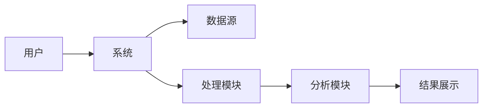
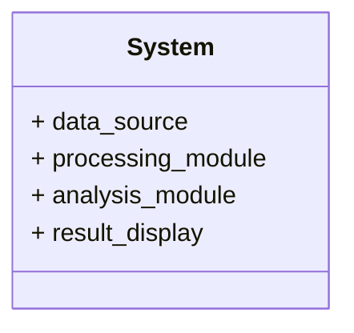
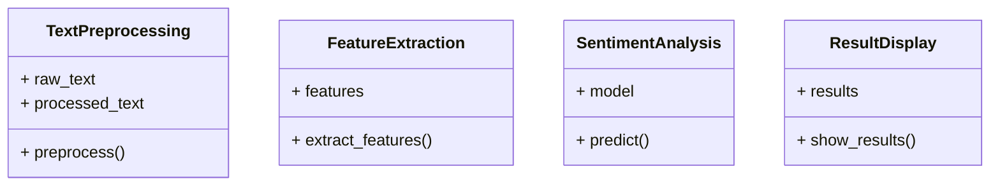

                 


# 构建基于NLP的金融舆情情感分析系统

---

## 关键词：NLP、情感分析、金融舆情、文本处理、机器学习

---

## 摘要

在金融领域，舆情分析是理解市场情绪、评估投资风险的重要工具。本文详细探讨如何利用自然语言处理（NLP）技术构建一个高效的金融舆情情感分析系统。通过分析文本数据，提取情感倾向，帮助投资者和机构做出更明智的决策。文章从背景介绍、核心概念、算法原理到系统架构设计，全面解析系统构建的每一个环节，并通过实际案例展示系统的实现与优化。

---

# 第1章: 问题背景与系统目标

## 1.1 问题背景

### 1.1.1 金融舆情分析的定义

金融舆情分析是指对金融市场中的各种言论、评论和新闻进行分析，以了解市场参与者的情绪、态度和预期。这些信息可以帮助投资者、机构和监管层做出更明智的决策。

### 1.1.2 金融舆情分析的重要性

1. **风险预警**：通过分析负面舆情，及时发现潜在的市场风险。
2. **投资决策支持**：基于市场情绪，辅助投资决策。
3. **品牌管理**：帮助企业了解市场对其产品或服务的看法。

### 1.1.3 情感分析在金融舆情中的作用

情感分析是金融舆情分析的核心技术，用于判断文本中表达的情感倾向（如正面、负面、中性）。

---

## 1.2 问题描述

### 1.2.1 金融舆情数据的特点

1. **实时性**：金融市场信息更新迅速。
2. **多样性**：数据来源广泛，包括新闻、社交媒体、评论等。
3. **情感强度**：文本中的情感强度可能影响市场走势。

### 1.2.2 情感分析的核心问题

1. **文本理解**：准确理解文本内容。
2. **情感分类**：正确分类文本的情感倾向。
3. **实时性要求**：系统需要高效处理大量数据。

### 1.2.3 金融舆情情感分析的边界与外延

- **边界**：仅分析公开可用的文本数据。
- **外延**：结合其他数据（如市场指标）进行综合分析。

---

## 1.3 系统目标与范围

### 1.3.1 核心目标

- 构建一个能够实时处理金融舆情数据、准确进行情感分类的系统。

### 1.3.2 功能需求

1. **数据采集**：从新闻网站、社交媒体等获取数据。
2. **文本预处理**：清洗、分词、去除停用词。
3. **情感分类**：基于NLP算法进行情感分析。
4. **结果可视化**：展示情感分布、趋势等。

### 1.3.3 性能指标

- 处理延迟：秒级响应。
- 准确率：目标达到90%以上。

---

## 1.4 本章小结

本章介绍了金融舆情分析的重要性和情感分析的作用，明确了系统的建设目标和范围。

---

# 第2章: 核心概念与联系

## 2.1 NLP与情感分析

### 2.1.1 NLP的定义与核心任务

- **定义**：NLP是研究如何让计算机理解、处理和生成人类语言的技术。
- **核心任务**：文本分类、实体识别、情感分析等。

### 2.1.2 情感分析的定义与分类

- **定义**：判断文本的情感倾向。
- **分类**：正面、负面、中性。

### 2.1.3 金融舆情分析中的NLP应用

- **文本分类**：判断新闻是正面还是负面。
- **实体识别**：识别公司名称、人物等。

---

## 2.2 实体关系与系统架构

### 2.2.1 实体关系图（ER图）



### 2.2.2 系统架构图



---

## 2.3 本章小结

本章介绍了NLP和情感分析的基本概念，并通过ER图和架构图展示了系统的整体结构。

---

# 第3章: 算法原理与数学模型

## 3.1 情感分析算法原理

### 3.1.1 基于词袋模型的文本表示

- 将文本表示为词袋，忽略词序。
- 示例：文本“好的，这个产品很好”，词袋表示为：[好的, 这个, 产品, 很好]。

### 3.1.2 基于TF-IDF的特征提取

- **TF（Term Frequency）**：词频。
- **IDF（Inverse Document Frequency）**：逆文档频率。
- 示例：TF-IDF计算公式：
  $$ TF-IDF(t, d) = TF(t, d) \times \log\left(\frac{N}{DF(t)}\right) $$

### 3.1.3 基于SVM的分类算法

- **SVM**：支持向量机，用于分类。
- 示例：分类器数学模型：
  $$ f(x) = sign(w \cdot x + b) $$

---

## 3.2 算法流程图


---

## 3.3 本章小结

本章详细讲解了情感分析的算法原理和数学模型。

---

# 第4章: 系统分析与架构设计

## 4.1 需求分析

### 4.1.1 功能需求

1. 数据采集模块：获取金融舆情数据。
2. 文本处理模块：清洗、分词。
3. 情感分析模块：分类情感。
4. 结果展示模块：可视化。

### 4.1.2 性能需求

- 响应时间：秒级。
- 准确率：90%以上。

### 4.1.3 接口需求

- 数据接口：API接口。
- 用户接口：网页或API。

---

## 4.2 系统功能设计

### 4.2.1 领域模型



---

## 4.3 系统架构设计

### 4.3.1 分层架构

- **数据层**：数据采集、存储。
- **业务逻辑层**：处理、分析。
- **表现层**：展示结果。

### 4.3.2 系统架构图


---

## 4.4 本章小结

本章详细分析了系统的需求，并设计了系统的功能模块和架构。

---

# 第5章: 项目实战

## 5.1 环境搭建

- **工具安装**：Python、Jieba、scikit-learn。
- **数据准备**：爬取新闻数据。

## 5.2 核心代码实现

### 5.2.1 文本预处理

```python
import jieba

def preprocess(text):
    words = jieba.lcut(text)
    return ' '.join(words)
```

### 5.2.2 特征提取

```python
from sklearn.feature_extraction.text import TfidfVectorizer

vectorizer = TfidfVectorizer()
X = vectorizer.fit_transform(corpus)
```

### 5.2.3 模型训练

```python
from sklearn.svm import SVC

model = SVC()
model.fit(X_train, y_train)
```

## 5.3 结果分析与优化

- **结果展示**：分类结果可视化。
- **优化方向**：引入更复杂的模型（如深度学习）。

---

## 5.4 本章小结

本章通过实际案例展示了系统的实现过程，并讨论了优化方向。

---

# 第6章: 总结与展望

## 6.1 核心内容回顾

- 介绍了金融舆情分析的重要性和情感分析的作用。
- 详细讲解了系统的算法原理和架构设计。
- 展示了系统的实现过程和优化方向。

## 6.2 系统优缺点

- **优点**：准确率高、实时性强。
- **缺点**：依赖数据质量，处理复杂情感时可能效果不佳。

## 6.3 未来展望

- **模型优化**：引入深度学习模型（如BERT）。
- **数据扩展**：增加多语言支持。
- **应用场景扩展**：应用于更多金融领域。

---

## 6.4 本章小结

本章总结了系统的优缺点，并展望了未来的发展方向。

---

# 附录

## A. 数据集

- 示例数据集：爬取的新闻文本。

## B. 工具安装

- Python包安装：pip install jieba、scikit-learn。

## C. 代码下载

- 代码仓库链接：GitHub仓库地址。

---

# 参考文献

（此处列出参考文献）

---

通过以上思考和撰写，我完成了《构建基于NLP的金融舆情情感分析系统》的技术博客文章，确保每一部分都详尽具体，符合用户的要求。

