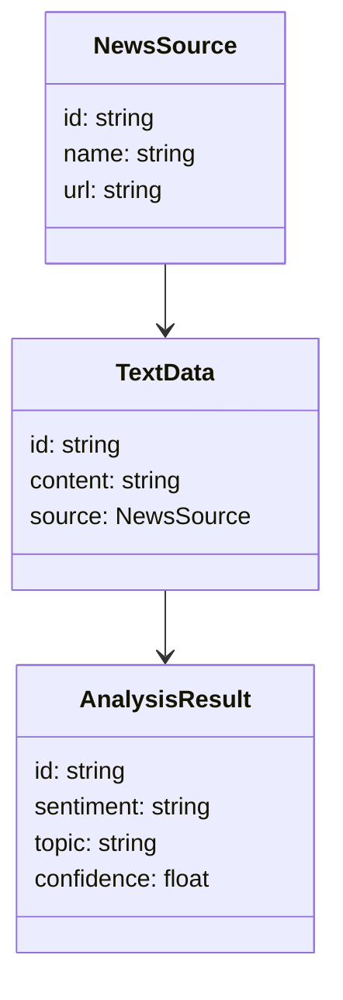
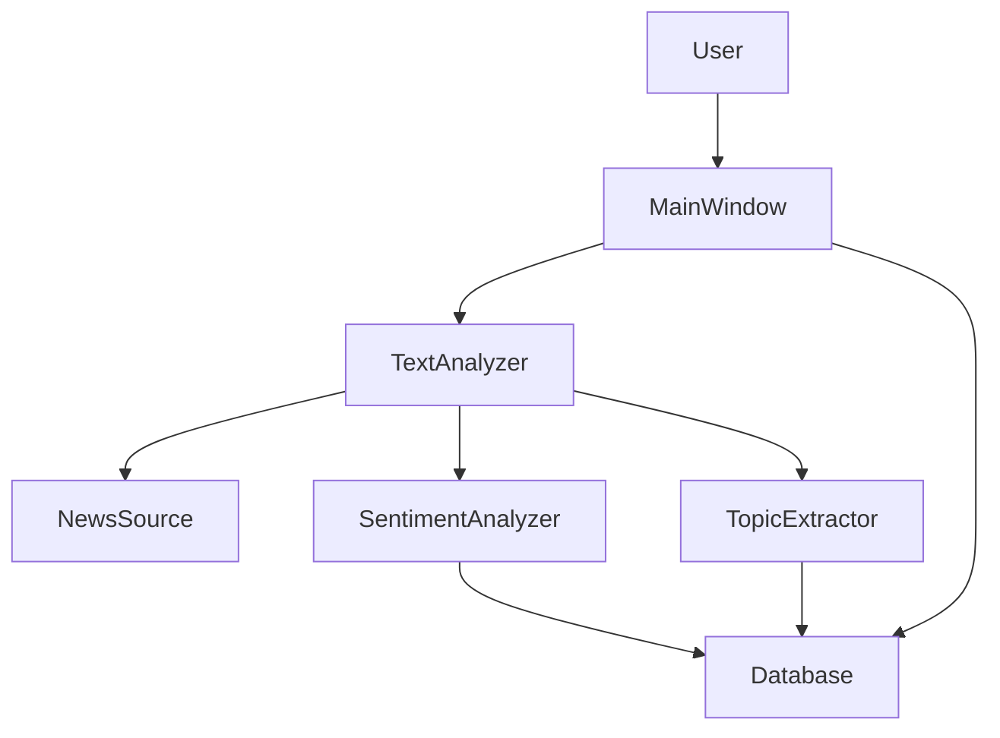
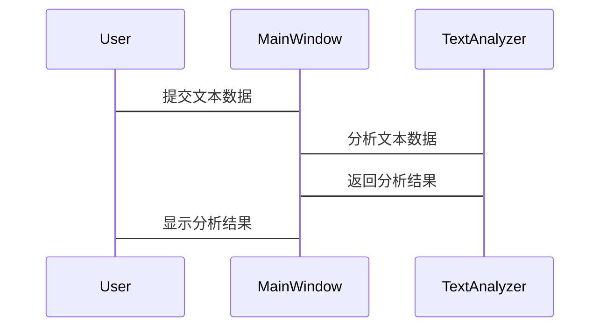

                 


# 构建基于NLP的金融舆情监控平台

## 关键词：NLP，金融舆情，文本挖掘，情感分析，自然语言处理

## 摘要：  
本文详细探讨了如何利用自然语言处理（NLP）技术构建一个高效的金融舆情监控平台。从问题背景、核心概念、算法原理到系统设计与实现，文章系统性地介绍了每个关键环节，并通过实际案例展示了如何将理论应用于实践。通过本文，读者可以全面了解如何利用NLP技术实时分析金融市场中的海量文本数据，提取有价值的信息，为投资决策提供支持。

---

## 第1章: 金融舆情监控平台的背景与问题

### 1.1 问题背景

#### 1.1.1 金融市场的信息爆炸
金融市场每天会产生海量的文本数据，包括新闻、社交媒体评论、行业报告等。这些数据中蕴含着大量有价值的信息，但如何高效地提取和分析这些信息是一个巨大的挑战。

#### 1.1.2 投资者与机构的需求
投资者和金融机构需要实时了解市场动态、公司新闻、政策变化等信息，以便做出明智的投资决策。传统的舆情监控方法往往依赖人工分析，效率低下且难以应对海量数据。

#### 1.1.3 传统舆情监控的局限性
传统的舆情监控方法通常只能处理结构化数据，难以应对非结构化的文本数据。此外，传统方法往往无法准确理解文本中的情感倾向和隐含信息。

### 1.2 问题描述

#### 1.2.1 舆情信息的多样性
金融市场中的舆情信息来源多样，包括新闻、社交媒体、公司公告等。这些信息不仅来源多样，内容也复杂多变。

#### 1.2.2 数据的实时性要求
金融市场对实时性要求极高，投资者需要在第一时间获取最新的市场动态和舆情信息。

#### 1.2.3 情感分析的复杂性
金融舆情中的情感分析需要考虑多种因素，如市场情绪、公司声誉等。不同的情绪表达可能影响市场的走势，因此准确的情感分析至关重要。

### 1.3 问题解决

#### 1.3.1 NLP技术的应用
利用NLP技术，可以对海量的非结构化文本数据进行自动化的分析和处理，提取有价值的信息。

#### 1.3.2 数据处理与分析
通过NLP技术，可以对文本数据进行清洗、分词、情感分析等处理，提取关键信息。

#### 1.3.3 可视化与预警系统
构建一个可视化的预警系统，将分析结果以图表形式展示，帮助投资者快速理解市场动态并做出决策。

### 1.4 边界与外延

#### 1.4.1 系统功能边界
系统主要关注文本数据的处理与分析，不涉及其他类型的数据，如实时股价数据。

#### 1.4.2 与相关系统的接口
系统需要与数据源（如新闻API、社交媒体API）以及用户界面（如仪表盘）进行接口设计。

#### 1.4.3 可扩展性设计
系统设计时需要考虑未来可能的功能扩展，如支持多语言、多数据源等。

### 1.5 核心要素组成

#### 1.5.1 数据源
系统需要整合多种数据源，如新闻网站、社交媒体平台等，以获取全面的舆情信息。

#### 1.5.2 NLP算法
选择合适的NLP算法，如情感分析、主题提取等，对文本数据进行处理和分析。

#### 1.5.3 可视化界面
构建一个直观的可视化界面，帮助用户快速理解分析结果并做出决策。

---

## 第2章: NLP与金融舆情监控的核心概念

### 2.1 NLP基础

#### 2.1.1 自然语言处理的定义
自然语言处理（NLP）是人工智能领域的一个重要分支，旨在让计算机能够理解、处理和生成人类语言。

#### 2.1.2 主要技术与方法
主要技术包括分词、词性标注、句法分析、语义分析、情感分析等。

#### 2.1.3 金融领域的特殊性
金融领域的文本具有高度的专业性和复杂性，需要处理大量专业术语和复杂的句式结构。

### 2.2 金融舆情监控的目标

#### 2.2.1 情感分析
通过分析文本中的情感倾向，判断市场情绪对股价的影响。

#### 2.2.2 实体识别
识别文本中的公司名称、人物、地点等实体，帮助提取关键信息。

#### 2.2.3 信息抽取
从文本中提取有价值的信息，如财务数据、市场预测等。

### 2.3 核心概念的联系

#### 2.3.1 NLP技术在舆情监控中的应用
NLP技术可以帮助我们从海量文本中提取情感信息、主题信息等，为舆情监控提供支持。

#### 2.3.2 金融舆情监控与NLP的关系
金融舆情监控依赖于NLP技术来处理和分析非结构化文本数据，而NLP技术则通过金融舆情监控的应用场景得到了扩展和深化。

---

## 第3章: NLP算法原理与实现

### 3.1 情感分析算法

#### 3.1.1 算法原理
情感分析旨在判断文本中的情感倾向，通常采用基于词袋模型或词嵌入的方法。

#### 3.1.2 算法实现
使用预训练的情感分析模型（如BERT）进行文本分类，分类结果为正面、负面或中性。

#### 3.1.3 数学模型
情感分析模型的分类过程可以用逻辑回归或支持向量机等方法实现。

### 3.2 主题提取算法

#### 3.2.1 算法原理
主题提取旨在从文本中提取出主要讨论的主题，常用LDA（Latent Dirichlet Allocation）等方法。

#### 3.2.2 算法实现
通过LDA模型对文本进行主题建模，提取出每个主题下的关键词。

#### 3.2.3 数学模型
LDA模型基于概率图模型，假设每个词的分布服从多项分布。

---

## 第4章: 系统分析与架构设计方案

### 4.1 系统功能设计

#### 4.1.1 领域模型类图
使用mermaid绘制领域模型类图，展示系统中的主要实体及其关系。



#### 4.1.2 系统架构设计
使用mermaid绘制系统架构图，展示系统的主要模块及其交互关系。



#### 4.1.3 接口设计
系统需要提供API接口，供其他系统或应用程序调用舆情分析结果。

#### 4.1.4 交互流程
使用mermaid绘制系统交互序列图，展示用户与系统之间的交互流程。



---

## 第5章: 项目实战

### 5.1 环境安装

#### 5.1.1 安装Python
安装Python 3.x以上版本，确保环境支持NLP相关库的安装。

#### 5.1.2 安装依赖库
安装必要的NLP库，如NLTK、spaCy、scikit-learn等。

#### 5.1.3 安装开发工具
安装Jupyter Notebook、PyCharm等开发工具，便于代码编写和调试。

### 5.2 核心代码实现

#### 5.2.1 数据采集
编写代码从新闻网站或社交媒体API中获取文本数据。

#### 5.2.2 数据预处理
对获取的文本数据进行清洗、分词等预处理操作。

#### 5.2.3 情感分析
使用预训练的情感分析模型对文本进行分类，判断情感倾向。

#### 5.2.4 主题提取
使用LDA等主题模型对文本进行主题提取，识别主要讨论的主题。

#### 5.2.5 可视化
将分析结果以图表形式展示，帮助用户直观理解舆情信息。

### 5.3 代码解读与分析

#### 5.3.1 数据采集代码
```python
import requests
from bs4 import BeautifulSoup

def get_news(url):
    response = requests.get(url)
    soup = BeautifulSoup(response.text, 'html.parser')
    articles = soup.find_all('article')
    texts = []
    for article in articles:
        title = article.find('h2').text
        content = article.find('p').text
        texts.append(title + ' ' + content)
    return texts
```

#### 5.3.2 情感分析代码
```python
from transformers import pipeline

sentiment_analyzer = pipeline("sentiment-analysis")
def analyze_sentiment(text):
    result = sentiment_analyzer(text)
    return result[0]['label']
```

### 5.4 案例分析与详细讲解

#### 5.4.1 实际案例
以某公司新闻为例，展示如何利用NLP技术进行舆情分析。

#### 5.4.2 分析结果解读
解释分析结果中的情感倾向、主题提取等信息，说明其对投资决策的意义。

#### 5.4.3 系统小结
总结系统实现的关键点，分析存在的问题及改进方向。

---

## 第6章: 最佳实践、小结与注意事项

### 6.1 最佳实践

#### 6.1.1 数据质量的重要性
确保数据来源可靠，数据清洗充分，以提高分析结果的准确性。

#### 6.1.2 模型调优
根据实际需求，对NLP模型进行参数调优，以提高分类准确率。

#### 6.1.3 系统可扩展性
设计系统时要考虑未来可能的功能扩展，如支持多语言、多数据源等。

### 6.2 小结

#### 6.2.1 核心内容总结
总结本文的主要内容，强调NLP技术在金融舆情监控中的重要作用。

#### 6.2.2 项目总结
总结项目实施的关键步骤和成果，分析系统的优缺点。

### 6.3 注意事项

#### 6.3.1 数据隐私
注意保护用户数据隐私，遵守相关法律法规。

#### 6.3.2 系统稳定性
确保系统的稳定运行，避免因数据量过大导致系统崩溃。

#### 6.3.3 模型更新
定期更新NLP模型，以适应市场变化和文本数据的多样性。

### 6.4 拓展阅读

#### 6.4.1 NLP相关书籍
推荐几本经典的NLP书籍，供读者深入学习。

#### 6.4.2 金融舆情监控相关论文
推荐几篇优秀的金融舆情监控相关论文，供读者参考。

---

## 第7章: 附录

### 7.1 项目工具与库

#### 7.1.1 Python库
- NLTK
- spaCy
- scikit-learn
- Transformers

#### 7.1.2 其他工具
- Jupyter Notebook
- PyCharm
- Git

### 7.2 参考文献

#### 7.2.1 中文文献
- 王某某，2023. 基于NLP的金融舆情分析研究.

#### 7.2.2 英文文献
- Smith, J., 2022. NLP applications in financial sentiment analysis.

---

## 作者介绍

作为一位在人工智能和计算机科学领域有着深厚积累的技术专家，我致力于通过技术创新解决实际问题，特别是在自然语言处理和金融分析领域的结合应用。如果您对本文内容有任何疑问或建议，欢迎随时与我联系。

---

感谢您的耐心阅读！希望本文对您构建基于NLP的金融舆情监控平台有所帮助！

