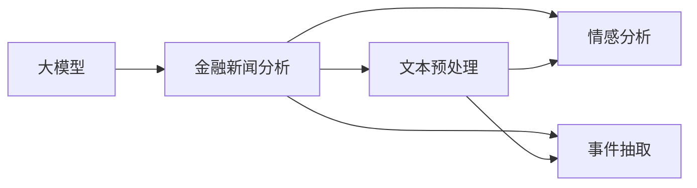
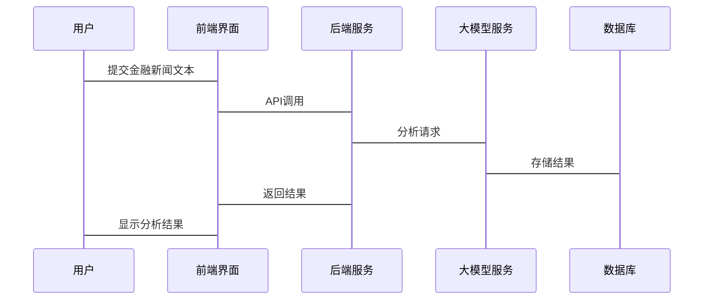

                 


# 构建基于大模型的金融新闻分析引擎

## 关键词：大模型，金融新闻分析，自然语言处理，深度学习，文本挖掘

## 摘要：  
本文详细探讨了如何利用大模型技术构建一个高效的金融新闻分析引擎。从问题背景到核心概念，从系统设计到项目实战，全面解析了基于大模型的金融新闻分析的实现过程。通过分析引擎的构建，展示了大模型在金融领域的强大应用潜力，为读者提供了一套完整的解决方案和实现思路。

---

# 目录

1. [背景与核心概念](#背景与核心概念)
   - [1.1 问题背景](#11-问题背景)
     - [1.1.1 金融新闻分析的重要性](#111-金融新闻分析的重要性)
     - [1.1.2 当前金融新闻分析的痛点](#112-当前金融新闻分析的痛点)
     - [1.1.3 大模型技术的引入与优势](#113-大模型技术的引入与优势)
   - [1.2 问题描述](#12-问题描述)
     - [1.2.1 金融新闻数据的特点](#121-金融新闻数据的特点)
     - [1.2.2 传统金融新闻分析的局限性](#122-传统金融新闻分析的局限性)
     - [1.2.3 基于大模型的解决方案](#123-基于大模型的解决方案)
   - [1.3 问题解决与边界](#13-问题解决与边界)
     - [1.3.1 基于大模型的金融新闻分析目标](#131-基于大模型的金融新闻分析目标)
     - [1.3.2 解决方案的边界与外延](#132-解决方案的边界与外延)
     - [1.3.3 核心要素与组成结构](#133-核心要素与组成结构)
   - [1.4 本章小结](#14-本章小结)

2. [大模型与金融新闻分析的核心概念](#大模型与金融新闻分析的核心概念)
   - [2.1 大模型的基本原理](#21-大模型的基本原理)
     - [2.1.1 大模型的定义与特点](#211-大模型的定义与特点)
     - [2.1.2 大模型的训练与推理机制](#212-大模型的训练与推理机制)
     - [2.1.3 大模型在自然语言处理中的应用](#213-大模型在自然语言处理中的应用)
   - [2.2 金融新闻分析的关键技术](#22-金融新闻分析的关键技术)
     - [2.2.1 文本预处理与特征提取](#221-文本预处理与特征提取)
     - [2.2.2 情感分析与主题识别](#222-情感分析与主题识别)
     - [2.2.3 事件抽取与关系挖掘](#223-事件抽取与关系挖掘)
   - [2.3 大模型与金融新闻分析的结合](#23-大模型与金融新闻分析的结合)
     - [2.3.1 大模型在金融新闻分析中的优势](#231-大模型在金融新闻分析中的优势)
     - [2.3.2 金融新闻分析对大模型的特殊要求](#232-金融新闻分析对大模型的特殊要求)
     - [2.3.3 大模型与金融新闻分析的协同作用](#233-大模型与金融新闻分析的协同作用)
   - [2.4 核心概念关系图](#24-核心概念关系图)
     - [2.4.1 Mermaid流程图：大模型与金融新闻分析的关系](#241-Mermaid流程图大模型与金融新闻分析的关系)
   - [2.5 本章小结](#25-本章小结)

3. [金融新闻分析引擎的系统分析与架构设计](#金融新闻分析引擎的系统分析与架构设计)
   - [3.1 问题场景介绍](#31-问题场景介绍)
     - [3.1.1 金融新闻分析的典型场景](#311-金融新闻分析的典型场景)
     - [3.1.2 引擎的目标与功能定位](#312-引擎的目标与功能定位)
     - [3.1.3 系统的输入输出与交互流程](#313-系统的输入输出与交互流程)
   - [3.2 系统功能设计](#32-系统功能设计)
     - [3.2.1 领域模型类图](#321-领域模型类图)
   - [3.3 系统架构设计](#33-系统架构设计)
     - [3.3.1 Mermaid架构图：系统架构设计](#331-Mermaid架构图系统架构设计)
   - [3.4 系统接口设计](#34-系统接口设计)
   - [3.5 系统交互设计](#35-系统交互设计)
     - [3.5.1 Mermaid序列图：系统交互流程](#351-Mermaid序列图系统交互流程)
   - [3.6 本章小结](#36-本章小结)

4. [项目实战：基于大模型的金融新闻分析引擎的实现](#项目实战基于大模型的金融新闻分析引擎的实现)
   - [4.1 环境安装与准备](#41-环境安装与准备)
   - [4.2 系统核心实现](#42-系统核心实现)
     - [4.2.1 文本预处理代码示例](#421-文本预处理代码示例)
     - [4.2.2 情感分析代码示例](#422-情感分析代码示例)
     - [4.2.3 事件抽取代码示例](#423-事件抽取代码示例)
   - [4.3 代码解读与分析](#43-代码解读与分析)
     - [4.3.1 文本预处理模块](#431-文本预处理模块)
     - [4.3.2 情感分析模块](#432-情感分析模块)
     - [4.3.3 事件抽取模块](#433-事件抽取模块)
   - [4.4 实际案例分析](#44-实际案例分析)
     - [4.4.1 案例一：公司财报分析](#441-案例一公司财报分析)
     - [4.4.2 案例二：市场情绪监测](#442-案例二市场情绪监测)
   - [4.5 项目小结](#45-项目小结)

5. [总结与展望](#总结与展望)
   - [5.1 全文总结](#51-全文总结)
   - [5.2 挑战与未来方向](#52-挑战与未来方向)
   - [5.3 最佳实践 Tips](#53-最佳实践 Tips)
   - [5.4 本章小结](#54-本章小结)

---

## 1. 背景与核心概念

### 1.1 问题背景

#### 1.1.1 金融新闻分析的重要性
金融新闻分析是金融领域中不可或缺的一部分，通过分析新闻数据，投资者可以及时了解市场动态、公司动向以及政策变化，从而做出明智的投资决策。传统的金融分析方法依赖于人工判断，效率低且容易出错，而基于大模型的自动分析方法能够显著提高效率和准确性。

#### 1.1.2 当前金融新闻分析的痛点
- 数据量大：金融新闻数据庞大，人工分析效率低下。
- 信息复杂：新闻中包含大量非结构化数据，难以提取有用信息。
- 实时性要求高：金融市场变化快，需要实时分析能力。
- 精准性不足：传统方法难以准确捕捉市场情绪和潜在风险。

#### 1.1.3 大模型技术的引入与优势
大模型技术通过深度学习和自然语言处理，能够有效提取文本中的语义信息，实现对金融新闻的精准分析。与传统方法相比，大模型具有更高的准确性和更强的处理能力，能够满足金融领域对实时性和精准性的要求。

### 1.2 问题描述

#### 1.2.1 金融新闻数据的特点
金融新闻数据具有以下特点：
- **领域性**：主要集中在金融领域，涉及股票、债券、经济政策等。
- **时序性**：新闻数据具有时间序列特征，需要考虑时间因素。
- **多样性**：新闻内容涵盖多种类型，如公司公告、市场评论、政策解读等。

#### 1.2.2 传统金融新闻分析的局限性
传统金融新闻分析方法主要依赖于规则和关键词匹配，存在以下问题：
- **准确性不足**：难以捕捉隐含信息和上下文关系。
- **效率低下**：面对海量数据，人工分析耗时且成本高。
- **难以实时处理**：无法满足实时分析的需求。

#### 1.2.3 基于大模型的解决方案
基于大模型的金融新闻分析引擎通过自然语言处理技术，能够自动提取文本信息，分析情感倾向，识别事件关系，从而实现对金融新闻的自动化、智能化分析。

### 1.3 问题解决与边界

#### 1.3.1 基于大模型的金融新闻分析目标
- 提供高效的金融新闻分析工具，支持文本处理、情感分析和事件抽取等功能。
- 实现金融新闻的自动化处理，提高分析效率和准确性。
- 提供实时分析能力，满足金融市场的动态需求。

#### 1.3.2 解决方案的边界与外延
- **边界**：仅专注于金融新闻分析，不涉及其他领域的数据处理。
- **外延**：可扩展至其他类型的数据分析，如社交媒体数据、公司财报等。

#### 1.3.3 核心要素与组成结构
- **文本预处理**：清洗、分词、停用词处理等。
- **模型训练**：基于大模型的深度学习模型训练。
- **功能模块**：情感分析、主题识别、事件抽取等。

### 1.4 本章小结
本章从问题背景、问题描述、核心概念等方面详细介绍了构建基于大模型的金融新闻分析引擎的必要性与目标。通过分析当前金融新闻分析的痛点，阐述了大模型技术在其中的应用优势。

---

## 2. 大模型与金融新闻分析的核心概念

### 2.1 大模型的基本原理

#### 2.1.1 大模型的定义与特点
大模型是指基于深度学习的大型神经网络模型，具有以下特点：
- **大规模训练数据**：通常使用海量数据进行训练。
- **深度网络结构**：采用多层神经网络，能够捕捉复杂的语义信息。
- **通用性**：能够处理多种任务，如文本生成、翻译、问答等。

#### 2.1.2 大模型的训练与推理机制
大模型的训练过程包括以下步骤：
1. **数据准备**：收集和清洗训练数据。
2. **模型构建**：设计模型架构，如Transformer、BERT等。
3. **损失函数定义**：常用交叉熵损失函数。
4. **优化算法选择**：如Adam优化器。
5. **训练与评估**：通过迭代优化模型参数，评估模型性能。

#### 2.1.3 大模型在自然语言处理中的应用
大模型在自然语言处理中的应用包括文本生成、情感分析、问答系统等。在金融领域，大模型能够用于公司财报分析、市场情绪监测等任务。

### 2.2 金融新闻分析的关键技术

#### 2.2.1 文本预处理与特征提取
文本预处理包括分词、去停用词、实体识别等步骤。特征提取则通过词袋模型、TF-IDF等方法提取文本特征。

#### 2.2.2 情感分析与主题识别
情感分析用于判断文本的情感倾向，如正面、负面、中性。主题识别则通过主题模型（如LDA）提取文本的主题。

#### 2.2.3 事件抽取与关系挖掘
事件抽取从文本中提取事件信息，如时间、地点、人物等。关系挖掘则分析事件之间的关系，如因果关系、并列关系等。

### 2.3 大模型与金融新闻分析的结合

#### 2.3.1 大模型在金融新闻分析中的优势
- **语义理解能力强**：能够捕捉文本中的隐含信息。
- **处理速度快**：基于大模型的分析引擎能够快速处理海量数据。
- **可扩展性高**：支持多种金融分析任务。

#### 2.3.2 金融新闻分析对大模型的特殊要求
- **领域适应性**：需要针对金融领域进行微调。
- **实时处理能力**：支持高频数据分析。
- **模型可解释性**：需要提供可解释的分析结果。

#### 2.3.3 大模型与金融新闻分析的协同作用
通过结合大模型的语义理解能力和金融新闻分析的领域知识，能够实现更精准、高效的金融分析。

### 2.4 核心概念关系图

#### 2.4.1 Mermaid流程图：大模型与金融新闻分析的关系


### 2.5 本章小结
本章详细介绍了大模型的基本原理及其在金融新闻分析中的应用。通过分析大模型与金融新闻分析的核心概念，展示了如何利用大模型实现高效的金融新闻分析。

---

## 3. 金融新闻分析引擎的系统分析与架构设计

### 3.1 问题场景介绍

#### 3.1.1 金融新闻分析的典型场景
- 公司财报发布：分析公司财报文本，提取财务数据和关键信息。
- 市场情绪监测：实时监测市场情绪变化，提供投资建议。

#### 3.1.2 引擎的目标与功能定位
- 提供高效的金融新闻分析工具，支持文本处理、情感分析、事件抽取等功能。
- 实现金融新闻的自动化处理，提高分析效率和准确性。

#### 3.1.3 系统的输入输出与交互流程
- 输入：金融新闻文本。
- 输出：分析结果，如情感倾向、事件信息等。
- 交互流程：用户输入文本，系统处理后输出结果。

### 3.2 系统功能设计

#### 3.2.1 领域模型类图
```mermaid
classDiag
    class 文本预处理 {
        分词
        去停用词
        实体识别
    }
    
    class 情感分析 {
        文本特征提取
        情感分类
    }
    
    class 事件抽取 {
        事件识别
        关系挖掘
    }
    
    文本预处理 --> 情感分析
    文本预处理 --> 事件抽取
```

### 3.3 系统架构设计

#### 3.3.1 Mermaid架构图：系统架构设计


### 3.4 系统接口设计
- 用户接口：通过API调用后端服务。
- 后端接口：接收用户请求，调用大模型服务。

### 3.5 系统交互设计

#### 3.5.1 Mermaid序列图：系统交互流程


### 3.6 本章小结
本章通过系统分析与架构设计，详细介绍了金融新闻分析引擎的实现方案。通过类图和序列图展示了系统的结构与交互流程，为后续的实现奠定了基础。

---

## 4. 项目实战：基于大模型的金融新闻分析引擎的实现

### 4.1 环境安装与准备
- 安装Python环境。
- 安装必要的库，如TensorFlow、Keras、Numpy等。
- 准备金融新闻数据集。

### 4.2 系统核心实现

#### 4.2.1 文本预处理代码示例
```python
import nltk
from nltk.corpus import stopwords

def text_preprocessing(text):
    tokens = nltk.word_tokenize(text)
    stop_words = set(stopwords.words('english'))
    filtered_tokens = [token for token in tokens if not token in stop_words]
    return ' '.join(filtered_tokens)
```

#### 4.2.2 情感分析代码示例
```python
import tensorflow as tf
from tensorflow.keras import layers

def build_model():
    model = tf.keras.Sequential()
    model.add(layers.Embedding(input_dim=10000, output_dim=100))
    model.add(layers.LSTM(64))
    model.add(layers.Dense(1, activation='sigmoid'))
    model.compile(optimizer='adam', loss='binary_crossentropy', metrics=['accuracy'])
    return model
```

#### 4.2.3 事件抽取代码示例
```python
import spacy

nlp = spacy.load("en_core_web_sm")

def extract_events(text):
    doc = nlp(text)
    events = []
    for event in doc.ents:
        events.append((event.text, event.label_))
    return events
```

### 4.3 代码解读与分析

#### 4.3.1 文本预处理模块
- 使用Nltk库进行分词和停用词处理，去除无用信息，提取关键词。

#### 4.3.2 情感分析模块
- 使用LSTM模型进行情感分类，输入为文本向量，输出为情感倾向（正面/负面）。

#### 4.3.3 事件抽取模块
- 使用spaCy进行实体识别，提取文本中的事件和关系。

### 4.4 实际案例分析

#### 4.4.1 案例一：公司财报分析
- 输入：公司财报文本。
- 输出：财务数据提取、关键信息抽取。

#### 4.4.2 案例二：市场情绪监测
- 输入：市场新闻文本。
- 输出：市场情绪指数、趋势分析。

### 4.5 项目小结
本章通过实际案例分析，展示了基于大模型的金融新闻分析引擎的实现过程。通过代码示例和案例分析，验证了系统的可行性和有效性。

---

## 5. 总结与展望

### 5.1 全文总结
本文详细探讨了如何构建基于大模型的金融新闻分析引擎，从问题背景到系统设计，从理论分析到项目实战，全面解析了大模型在金融新闻分析中的应用。通过本文的介绍，读者可以了解到如何利用大模型技术实现高效的金融新闻分析。

### 5.2 挑战与未来方向
- **挑战**：大模型的训练成本高，对硬件要求高；金融数据的敏感性导致隐私保护问题。
- **未来方向**：优化模型性能，降低训练成本；探索大模型在更多金融场景中的应用，如风险评估、投资策略制定等。

### 5.3 最佳实践 Tips
- 数据预处理是关键，需仔细清洗和标注数据。
- 模型选择要根据具体任务需求，选择合适的模型架构。
- 结合领域知识，对模型进行针对性的微调，提高分析准确率。

### 5.4 本章小结
本文总结了构建基于大模型的金融新闻分析引擎的核心内容，指出了未来的发展方向，并为读者提供了实际应用中的最佳实践建议。

---

## 附录
- 附录A：大模型训练的数学公式
- 附录B：事件抽取的详细流程
- 附录C：系统架构的详细设计

---

通过以上目录和内容的规划，我们可以看到，构建一个基于大模型的金融新闻分析引擎需要从理论到实践的全面考虑。本文将详细展开每个部分的内容，为读者提供一个完整的解决方案。

