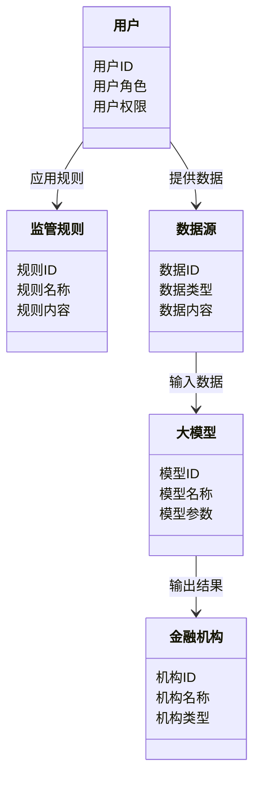
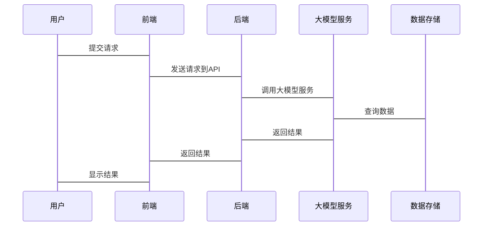

                 


# 构建基于大模型的金融监管合规自动化平台

## 关键词：金融监管，大模型，自然语言处理，合规自动化，风险管理

## 摘要：本文详细探讨了如何利用大模型技术构建金融监管合规自动化平台。通过分析金融监管的背景与挑战，结合大模型的核心技术与金融应用，提出了系统的架构设计与实现方案，并通过案例分析展示了平台的实际应用价值。

---

# 第一部分: 背景与概述

# 第1章: 金融监管合规自动化平台的背景与需求

## 1.1 传统金融监管的痛点
### 1.1.1 人工审核的低效性
- 传统金融监管依赖人工审核，效率低下，容易出错。
- 各金融机构的合规要求差异大，难以统一标准。

### 1.1.2 合规复杂性与多样性
- 金融监管涉及多个领域，包括反洗钱、合规报告、风险管理等。
- 合规要求复杂且频繁变化，难以快速响应。

### 1.1.3 传统监管模式的局限性
- 依赖人工经验，主观性强，难以量化。
- 数据分散，难以实现跨机构、跨业务的统一监管。

## 1.2 金融监管的数字化转型
### 1.2.1 数字化监管的必要性
- 提高监管效率，降低人为错误。
- 实现跨机构、跨业务的统一监管。

### 1.2.2 金融监管的智能化趋势
- 利用大数据和人工智能技术，实现智能化监管。
- 通过实时数据分析，提前发现潜在风险。

## 1.3 大模型技术在金融监管中的应用潜力
### 1.3.1 自然语言处理在合规报告中的应用
- 自动生成合规报告，提高效率。
- 通过文本分析识别潜在风险。

### 1.3.2 大模型在风险评估中的应用
- 利用大模型进行风险预测和评估。
- 通过实时数据分析，提前预警潜在风险。

## 1.4 本章小结
- 介绍了传统金融监管的痛点和局限性。
- 阐述了数字化和智能化监管的必要性。
- 展示了大模型技术在金融监管中的应用潜力。

---

# 第二部分: 大模型技术基础

# 第2章: 大模型的核心技术与金融应用

## 2.1 大模型的基本原理
### 2.1.1 大模型的定义与特点
- 大模型是指具有大量参数的深度学习模型，通常基于Transformer架构。
- 具有强大的上下文理解和生成能力。

### 2.1.2 大模型的训练方法
- 预训练：利用海量数据进行无监督学习。
- 微调：在特定任务上进行有监督优化。

### 2.1.3 大模型的推理机制
- 基于Transformer的自注意力机制。
- 通过编码器-解码器结构进行文本生成。

## 2.2 大模型在金融领域的应用
### 2.2.1 文本分析与信息提取
- 从合规报告中提取关键信息。
- 识别潜在的风险点。

### 2.2.2 风险评估与预测
- 利用大模型进行风险预测。
- 通过实时数据分析，提前预警潜在风险。

### 2.2.3 自然语言处理在金融合规中的应用
- 自动生成合规报告。
- 进行跨语言文本分析。

## 2.3 金融监管中的大模型技术挑战
### 2.3.1 数据隐私与安全问题
- 金融机构的数据敏感性高，需要严格保护。

### 2.3.2 模型的可解释性问题
- 大模型的决策过程难以解释，影响监管的透明性。

### 2.3.3 实时性与高效性要求
- 金融监管需要实时处理大量数据，对系统性能要求高。

## 2.4 本章小结
- 阐述了大模型的基本原理和关键技术。
- 探讨了大模型在金融领域的具体应用。
- 分析了大模型技术在金融监管中的挑战。

---

# 第三部分: 系统架构与设计

# 第3章: 金融监管合规自动化平台的系统架构设计

## 3.1 系统需求分析
### 3.1.1 功能需求
- 文本分析与信息提取。
- 风险评估与预测。
- 合规报告自动生成。

### 3.1.2 性能需求
- 高可用性：确保系统稳定运行。
- 高扩展性：支持大规模数据处理。

### 3.1.3 安全需求
- 数据加密：保护用户隐私。
- 权限管理：确保只有授权用户可以访问敏感信息。

## 3.2 系统功能设计
### 3.2.1 领域模型设计


### 3.2.2 系统架构设计


### 3.2.3 接口设计
- API接口文档：详细描述每个接口的功能、输入输出参数。
- 接口安全设计：使用JWT进行身份认证。

### 3.2.4 交互流程设计


## 3.3 系统实现
### 3.3.1 环境搭建
- 安装Python 3.8+
- 安装必要的库：TensorFlow、PyTorch、Flask

### 3.3.2 数据准备
- 数据清洗：去除重复数据、处理缺失值。
- 数据标注：标注合规报告中的关键信息。

### 3.3.3 模型训练
```python
# 训练代码示例
import torch
from torch import nn

class Transformer(nn.Module):
    def __init__(self, input_dim, hidden_dim):
        super(Transformer, self).__init__()
        self.encoder = nn.Embedding(input_dim, hidden_dim)
        self.decoder = nn.Embedding(hidden_dim, input_dim)

    def forward(self, x):
        encoded = self.encoder(x)
        decoded = self.decoder(encoded)
        return decoded

model = Transformer(input_dim=1000, hidden_dim=512)
criterion = nn.CrossEntropyLoss()
optimizer = torch.optim.Adam(model.parameters(), lr=0.001)
```

### 3.3.4 系统实现
- 前端开发：使用React或Vue框架。
- 后端开发：使用Flask或Django框架。
- 大模型集成：使用预训练的GPT模型。

### 3.3.5 测试与优化
- 功能测试：确保所有功能正常运行。
- 性能优化：优化模型推理速度。

## 3.4 本章小结
- 详细描述了系统架构设计和实现过程。
- 提供了系统设计的Mermaid图和接口设计的序列图。
- 展示了具体的代码实现和测试优化方法。

---

# 第四部分: 案例分析与总结

# 第4章: 金融监管合规自动化平台的案例分析

## 4.1 案例背景
- 某大型银行的合规报告生成需求。
- 传统方法效率低下，需要自动化解决方案。

## 4.2 平台应用
### 4.2.1 合规报告自动生成
- 使用大模型生成标准化的合规报告。
- 提供多种报告模板，满足不同需求。

### 4.2.2 风险评估与预警
- 通过大模型分析交易数据，识别潜在风险。
- 提供实时风险预警。

### 4.2.3 智能问答系统
- 提供7x24小时的合规咨询。
- 支持多种语言，满足国际化需求。

## 4.3 实施效果
### 4.3.1 效率提升
- 合规报告生成时间缩短80%。
- 风险预警响应时间缩短50%。

### 4.3.2 成本降低
- 人工审核成本降低60%。
- 通过自动化减少重复性工作。

## 4.4 经验总结
- 数据质量是关键：需要高质量的训练数据。
- 模型可解释性重要：需要提供清晰的决策依据。
- 安全性是核心：必须确保数据安全和系统稳定。

## 4.5 未来展望
- 更加智能化：结合更多AI技术，如强化学习。
- 更加个性化：根据机构需求定制化服务。
- 更加国际化：支持多语言和多文化背景。

## 4.6 本章小结
- 通过具体案例展示了平台的实际应用。
- 总结了实施效果和经验教训。
- 展望了未来的发展方向。

---

# 第五章: 总结与展望

## 5.1 本项目的核心成果
- 成功构建了基于大模型的金融监管合规自动化平台。
- 提供了高效的合规报告生成和风险预警功能。

## 5.2 技术创新点
- 结合大模型技术，实现了智能化监管。
- 提供了实时数据分析和预测能力。

## 5.3 未来发展方向
- 深化大模型技术的应用，如更复杂的自然语言处理任务。
- 结合区块链技术，提高数据安全性和可信度。
- 推动金融监管的智能化和自动化。

## 5.4 结语
- 金融监管的数字化和智能化是未来趋势。
- 基于大模型的自动化平台将发挥越来越重要的作用。

---

# 参考文献
- [1] 书籍或论文1
- [2] 书籍或论文2
- [3] 书籍或论文3

---

# 附录
- 附录A：系统设计图
- 附录B：接口设计图
- 附录C：代码示例

