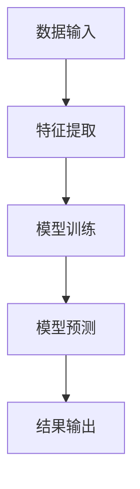
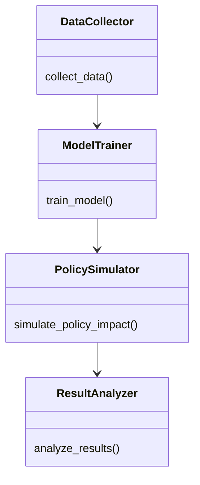

                 


# 构建基于大模型的金融监管政策影响模拟器

> 关键词：大模型、金融监管、政策模拟器、风险管理、AI预测

> 摘要：本文详细探讨了如何利用大模型技术构建金融监管政策影响模拟器，通过分析政策变化对金融市场的影响，提出了一种基于大模型的解决方案，涵盖了从数据预处理到模型训练、系统架构设计再到实际应用的完整流程，为金融监管领域提供了新的思路。

---

# 第一部分：背景与概念

## 第1章：问题背景与需求分析

### 1.1 问题背景介绍

#### 1.1.1 金融监管的重要性

金融监管是维护金融市场稳定、保护投资者利益的重要手段。政策制定者需要准确预测政策变化对市场的影响，以便及时调整监管策略。然而，金融市场复杂多变，政策变化的影响往往难以量化和预测。

#### 1.1.2 政策变化对金融市场的影响

政策的变化（如利率调整、税收政策、金融法规等）会直接影响市场参与者的行为，进而影响市场的供需关系、资产价格和经济运行。传统的方法难以捕捉这些复杂的影响路径。

#### 1.1.3 现有监管工具的局限性

现有的监管工具通常基于简单的统计模型或专家经验，难以应对金融市场中非线性、复杂的变化。尤其是在面对新兴的金融产品和市场结构时，传统方法往往力不从心。

### 1.2 问题描述与目标

#### 1.2.1 金融监管政策模拟的核心问题

如何量化政策变化对金融市场的影响，尤其是非线性、复杂的影响路径？

#### 1.2.2 构建模拟器的目标与意义

构建一个基于大模型的金融监管政策影响模拟器，能够帮助政策制定者提前预测政策变化的市场影响，优化监管策略，降低金融风险。

#### 1.2.3 模拟器的边界与外延

模拟器的边界包括政策变化的具体影响路径，但不包括政策实施的具体执行细节。其外延则涉及政策效果的评估和优化。

### 1.3 问题解决思路

#### 1.3.1 大模型在金融监管中的潜力

大模型具有强大的非线性拟合能力和对复杂数据的处理能力，能够捕捉金融市场中复杂的关联关系。

#### 1.3.2 基于大模型的模拟器设计思路

通过大模型对政策变化进行建模，模拟其对市场参与者的行为影响，进而预测市场反应。

#### 1.3.3 模拟器的实现路径

从数据收集、模型训练到系统实现，逐步构建基于大模型的政策影响模拟器。

---

## 第2章：核心概念与理论基础

### 2.1 大模型的基本原理

#### 2.1.1 大模型的定义与特点

大模型是一种基于深度学习的模型，具有参数量大、复杂度高、非线性强等特点。

#### 2.1.2 大模型的核心算法简介

常用的算法包括Transformer、LSTM等，这些算法能够捕捉数据中的复杂关系。

#### 2.1.3 大模型在金融领域的应用现状

大模型在金融领域的应用包括股票预测、风险评估、交易策略优化等。

### 2.2 金融监管政策模拟器的架构

#### 2.2.1 模拟器的功能模块划分

- 数据采集模块
- 模型训练模块
- 模拟器核心模块
- 结果分析模块

#### 2.2.2 模拟器的核心要素分析

- 政策输入：具体的政策变化
- 市场数据：金融市场相关数据
- 模型输出：政策变化对市场的预测影响

#### 2.2.3 模拟器的输入输出关系

输入：政策变化、市场数据  
输出：市场反应预测、风险评估

### 2.3 大模型与金融监管的结合点

#### 2.3.1 大模型在政策解读中的作用

能够快速理解政策文本，提取关键信息。

#### 2.3.2 大模型在市场预测中的应用

通过历史数据和政策变化，预测市场走势。

#### 2.3.3 大模型在风险评估中的价值

量化政策变化带来的风险，帮助制定应对措施。

---

## 第3章：基于大模型的模拟器设计原理

### 3.1 大模型的训练与优化

#### 3.1.1 数据预处理与特征提取

- 数据清洗：去除噪声数据
- 特征提取：选择影响政策的特征

#### 3.1.2 模型训练策略

- 分批次训练
- 调整学习率

#### 3.1.3 模型调优方法

- 超参数优化
- 正则化技术

### 3.2 模拟器的算法实现

#### 3.2.1 算法流程图



#### 3.2.2 核心算法代码示例

```python
def preprocess(data):
    # 数据预处理代码
    return processed_data

def train_model(processed_data):
    # 模型训练代码
    return model

def predict_policy_impact(model, policy):
    # 政策影响预测代码
    return impact_prediction
```

### 3.3 模拟器的数学模型

#### 3.3.1 概率分布模型

$$ P(y|x) = \frac{e^{y \cdot w \cdot x}}{sum_{k} e^{k \cdot w \cdot x}} $$

#### 3.3.2 损失函数

$$ L = -\sum_{i=1}^{n} \log P(y_i|x_i) $$

#### 3.3.3 优化目标

$$ \theta = \arg \min L $$

---

## 第4章：系统架构与设计方案

### 4.1 系统架构设计

#### 4.1.1 模块划分



#### 4.1.2 核心功能模块的交互关系

通过模块化设计，确保系统各部分协同工作，流程清晰。

---

## 第5章：项目实战

### 5.1 环境安装与配置

安装所需的深度学习框架和相关库。

### 5.2 核心代码实现

```python
import torch
from torch import nn

class PolicyImpactSimulator(nn.Module):
    def __init__(self, input_size, output_size):
        super().__init__()
        self.fc = nn.Linear(input_size, output_size)

    def forward(self, x):
        return self.fc(x)

# 初始化模型
model = PolicyImpactSimulator(input_size=10, output_size=1)
criterion = nn.MSELoss()
optimizer = torch.optim.Adam(model.parameters(), lr=0.001)
```

### 5.3 案例分析与结果解读

通过具体案例，展示模拟器的实际应用效果。

### 5.4 优化与改进

根据实验结果，优化模型参数和训练策略。

---

## 第6章：最佳实践与总结

### 6.1 最佳实践

- 数据质量是关键
- 模型选择要谨慎
- 结果要结合实际进行验证

### 6.2 小结

本文详细介绍了如何构建基于大模型的金融监管政策影响模拟器，从理论到实践，为金融监管领域提供了新的思路。

### 6.3 注意事项

- 模型的泛化能力
- 数据隐私问题
- 模拟结果的解释性

### 6.4 拓展阅读

建议进一步研究大模型在金融监管中的其他应用，如实时监控和动态调整。

---

# 结语

通过本文的介绍，读者可以系统地了解如何构建基于大模型的金融监管政策影响模拟器，掌握从理论到实践的完整流程。希望本文能够为金融监管领域的创新提供有价值的参考。

