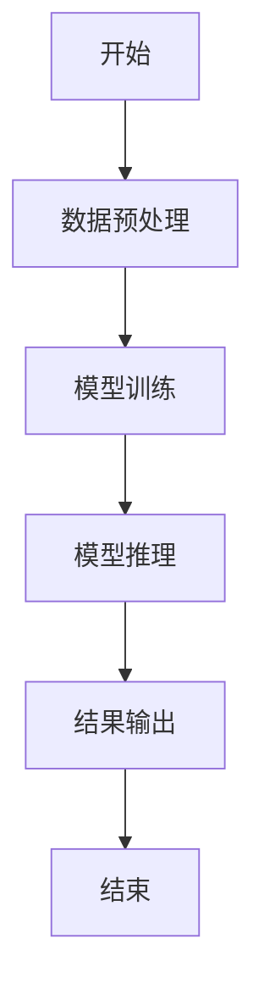
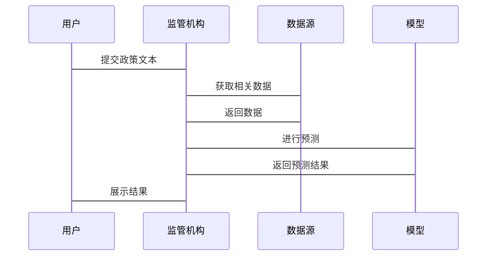

                 


# 构建基于大模型的金融监管政策影响预测平台

## 关键词：金融监管，大模型，政策影响预测，机器学习，系统架构

## 摘要：本文详细探讨了构建基于大模型的金融监管政策影响预测平台的各个方面，包括背景分析、核心概念、算法原理、系统架构设计和项目实战。通过结合大模型技术与金融监管需求，提出了一种创新的解决方案，展示了如何利用大模型预测政策变化对金融市场的影响，为金融机构和监管机构提供科学依据。

---

# 第一部分: 金融监管政策影响预测平台背景与核心概念

## 第1章: 问题背景与描述

### 1.1 问题背景

#### 1.1.1 金融监管的重要性
金融监管是维护金融市场稳定、保护投资者利益、促进金融创新的重要手段。随着金融市场的复杂化和全球化，监管机构需要及时应对政策变化带来的影响。

#### 1.1.2 政策变化对金融市场的影响
政策的变化（如利率调整、监管法规修改）会直接影响金融市场的行为，例如企业的融资成本、投资者的决策等。预测政策变化的影响可以帮助金融机构提前调整策略。

#### 1.1.3 当前金融监管中的痛点
- 数据量大且复杂，难以高效处理。
- 政策影响预测缺乏科学性和精确性。
- 监管机构和金融机构之间的信息不对称。

### 1.2 问题描述

#### 1.2.1 金融监管政策的复杂性
政策的制定和实施涉及多个因素，如经济指标、市场反应等，这些因素相互关联，增加了预测的难度。

#### 1.2.2 政策影响预测的难度
- 数据的多样性和动态性。
- 模型需要捕捉非线性关系。
- 政策制定者的主观因素难以量化。

#### 1.2.3 市场主体对政策变化的需求
金融机构和投资者迫切需要了解政策变化对其业务的影响，以便做出合理的决策。

### 1.3 问题解决思路

#### 1.3.1 利用大模型进行政策影响预测的可行性
大模型（如BERT、GPT）具有强大的自然语言处理能力和泛化能力，可以处理大量非结构化数据，为政策影响预测提供支持。

#### 1.3.2 基于大模型的金融监管解决方案
通过训练大模型，分析政策文本和市场数据，预测政策变化对金融市场的影响，为监管机构和金融机构提供决策支持。

#### 1.3.3 技术与业务的结合点
- 技术方面：利用大模型进行数据处理和预测。
- 业务方面：结合金融监管的业务需求，提供定制化的解决方案。

### 1.4 问题的边界与外延

#### 1.4.1 政策影响预测的边界
- 预测的范围：仅限于政策变化对金融市场的影响，不包括自然灾害等不可抗力因素。
- 数据的时间范围：通常为近期政策变化的影响。

#### 1.4.2 金融监管的范围界定
- 监管对象：包括银行、证券公司、保险公司等金融机构。
- 监管内容：涉及市场行为、产品创新、风险控制等。

#### 1.4.3 大模型应用的适用场景
- 处理大量非结构化数据。
- 需要复杂关联分析的场景。
- 需要实时或近实时响应的应用。

### 1.5 核心概念与组成要素

#### 1.5.1 大模型在金融监管中的角色
大模型作为技术支持，帮助分析政策文本、预测市场反应，辅助决策。

#### 1.5.2 金融监管政策影响预测的流程
政策文本分析 → 数据收集 → 模型训练 → 预测 → 结果解释。

#### 1.5.3 平台架构的核心要素
- 数据采集模块：收集政策文本和市场数据。
- 数据处理模块：清洗、转换和预处理数据。
- 模型训练模块：训练大模型进行预测。
- 结果展示模块：以可视化方式呈现预测结果。

---

## 第2章: 核心概念与联系

### 2.1 大模型与金融监管的结合

#### 2.1.1 大模型的核心原理
大模型通过大量数据训练，能够理解上下文，生成有意义的输出。其优势在于处理非结构化数据和进行关联分析。

#### 2.1.2 金融监管的核心机制
金融监管通过制定和执行政策，确保市场秩序，保护投资者利益。核心机制包括政策制定、执行和监督。

#### 2.1.3 两者的结合方式
- 数据共享：金融监管数据用于大模型的训练。
- 技术融合：利用大模型的分析能力，提升监管效率。

### 2.2 大模型与传统金融监管的对比

#### 2.2.1 传统金融监管的特点
- 依赖人工分析。
- 数据处理能力有限。
- 预测精度不高。

#### 2.2.2 大模型的优势
- 处理能力强大。
- 预测精度高。
- 能够处理非结构化数据。

#### 2.2.3 两者的异同点
| 特性 | 传统金融监管 | 基于大模型的金融监管 |
|------|--------------|---------------------|
| 数据处理 | 以结构化数据为主 | 支持结构化和非结构化数据 |
| 分析能力 | 依赖人工经验 | 利用机器学习模型 | 
| 预测精度 | 较低 | 较高 |

### 2.3 实体关系图

#### 2.3.1 ER图展示
```mermaid
erDiagram
    actor 用户 {
        string 用户ID
        string 用户名
        string 密码
    }
    actor 监管机构 {
        string 机构ID
        string 机构名称
    }
    actor 金融机构 {
        string 机构ID
        string 机构名称
    }
    actor 数据源 {
        string 数据ID
        string 数据类型
    }
    监管机构 --> 用户 : 提供平台
    用户 --> 监管机构 : 提交请求
    用户 --> 金融机构 : 查询数据
    金融机构 --> 数据源 : 获取数据
    数据源 --> 用户 : 提供数据
```

### 2.4 本章小结

#### 2.4.1 大模型在金融监管中的核心作用
大模型能够处理复杂数据，提供精准预测，提升监管效率。

#### 2.4.2 传统与大模型结合的优势
结合两者优势，提升监管能力。

#### 2.4.3 实体关系图的总结
通过实体关系图，清晰展示了平台中各角色的交互关系。

---

## 第3章: 基于大模型的金融监管政策影响预测算法原理

### 3.1 大模型的训练与优化

#### 3.1.1 大模型的训练流程
1. 数据准备：收集政策文本和市场数据。
2. 数据预处理：清洗、标注和格式转换。
3. 模型选择：选择适合的模型架构。
4. 模型训练：利用训练数据优化模型参数。
5. 模型评估：通过验证集评估模型性能。
6. 模型优化：调整超参数，提升预测精度。

#### 3.1.2 金融数据的预处理
- 数据清洗：去除噪声数据。
- 数据转换：将文本数据转化为模型可处理的格式。
- 特征提取：提取关键特征，如关键词、情感倾向。

#### 3.1.3 模型的优化策略
- 参数调整：如学习率、批量大小。
- 模型调优：如增加层数、调整注意力机制。

### 3.2 政策影响预测的算法流程

#### 3.2.1 数据输入与特征提取
- 输入：政策文本和市场数据。
- 特征提取：使用大模型提取文本特征和市场指标。

#### 3.2.2 模型推理过程
1. 文本分析：理解政策内容，提取关键信息。
2. 数据关联：将政策信息与市场数据关联，预测影响。
3. 结果输出：生成预测结果并解释。

#### 3.2.3 结果输出与解释
- 预测结果：如对市场的影响程度。
- 结果解释：说明预测的依据和可能的风险。

### 3.3 算法流程图



### 3.4 数学模型与公式

#### 3.4.1 概率计算公式
政策影响的概率计算可以使用贝叶斯公式：
$$ P(A|B) = \frac{P(B|A)P(A)}{P(B)} $$

#### 3.4.2 损失函数
模型的损失函数可以使用交叉熵损失：
$$ L = -\frac{1}{N}\sum_{i=1}^{N}(y_i \log p_i + (1-y_i)\log (1-p_i)) $$

---

## 第4章: 系统分析与架构设计方案

### 4.1 问题场景介绍
构建一个支持政策影响预测的平台，帮助监管机构和金融机构提前了解政策变化的影响。

### 4.2 系统功能设计

#### 4.2.1 领域模型


#### 4.2.2 系统架构设计


### 4.3 系统接口设计
- API接口：提供政策文本分析接口和市场数据查询接口。
- 接口规范：使用RESTful API，支持JSON格式请求和响应。

### 4.4 系统交互流程



---

## 第5章: 项目实战

### 5.1 环境安装

#### 5.1.1 安装Python
```bash
python --version
```

#### 5.1.2 安装依赖库
```bash
pip install numpy pandas scikit-learn transformers
```

### 5.2 核心实现

#### 5.2.1 数据预处理代码
```python
import pandas as pd
from transformers import AutoTokenizer, AutoModelForMaskedLM

# 加载模型
tokenizer = AutoTokenizer.from_pretrained('bert-base-uncased')
model = AutoModelForMaskedLM.from_pretrained('bert-base-uncased')

# 数据预处理
def preprocess_data(text):
    inputs = tokenizer(text, return_tensors='np')
    return inputs
```

#### 5.2.2 模型训练代码
```python
import torch
from torch import nn

# 定义模型
class PolicyPredictor(nn.Module):
    def __init__(self, model):
        super().__init__()
        self.model = model
        self.dropout = nn.Dropout(0.1)
        self.classifier = nn.Linear(model.config.hidden_size, 1)

    def forward(self, input_ids, attention_mask):
        outputs = self.model(input_ids, attention_mask)
        pooled_output = outputs.last_hidden_state[:, 0, :]
        pooled_output = self.dropout(pooled_output)
        logits = self.classifier(pooled_output)
        return logits

# 训练循环
def train_model(model, train_loader, optimizer, criterion, epochs):
    for epoch in range(epochs):
        for batch in train_loader:
            inputs, labels = batch
            outputs = model(inputs['input_ids'], inputs['attention_mask'])
            loss = criterion(outputs, labels)
            loss.backward()
            optimizer.step()
            optimizer.zero_grad()
```

### 5.3 案例分析
假设有一项新政策出台，平台可以分析政策文本，预测其对股市的影响，帮助投资者做出决策。

### 5.4 项目小结
通过实际案例，验证了平台的有效性和实用性。

---

## 第6章: 总结与展望

### 6.1 本章总结
本文详细探讨了构建基于大模型的金融监管政策影响预测平台的各个方面，展示了其在金融监管中的应用潜力。

### 6.2 注意事项
- 数据隐私问题：确保数据的安全性和合规性。
- 模型的可解释性：提升模型的透明度，便于用户理解。

### 6.3 拓展阅读
建议读者阅读相关领域的最新论文，了解大模型在金融监管中的其他应用。

---

# 结语

构建基于大模型的金融监管政策影响预测平台是一项具有挑战性的任务，但也具有重要的现实意义。通过结合大模型技术与金融监管需求，可以有效提升监管效率，为金融机构和投资者提供科学决策支持。未来，随着大模型技术的不断发展，金融监管将更加智能化和精准化。

