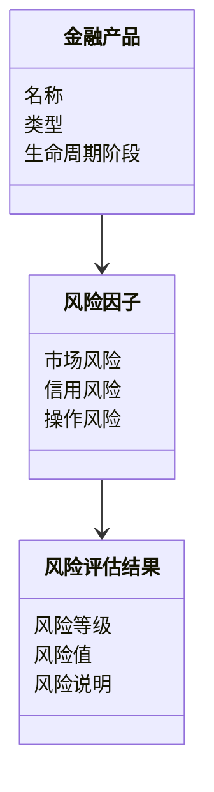
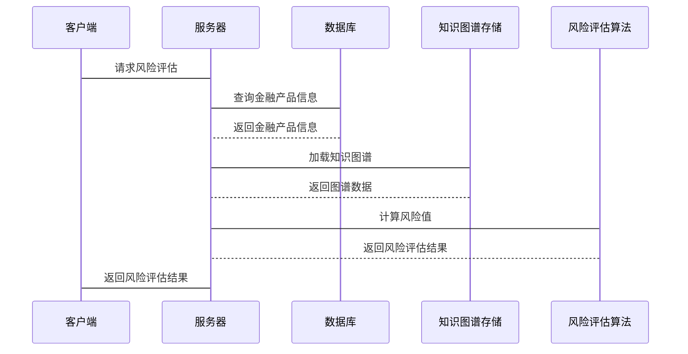

                 


# 构建基于知识图谱的金融产品全生命周期风险动态评估系统

## 关键词：知识图谱、金融产品、风险评估、动态评估、全生命周期

## 摘要：本文系统地介绍了如何利用知识图谱构建金融产品全生命周期风险动态评估系统。首先分析了当前金融风险管理的挑战，详细阐述了知识图谱在金融领域的应用潜力。接着，从核心概念、算法原理、系统架构等多个维度展开，详细讲解了该系统的构建过程。通过实际案例分析和项目实战，展示了系统的实际应用价值和效果。

---

# 第1章 问题背景与概念结构

## 1.1 问题背景

### 1.1.1 金融产品风险管理的现状与挑战

随着金融市场的发展，金融产品的复杂性不断提高，风险管理变得日益重要。传统的风险管理方法往往依赖静态的数据分析，难以捕捉到金融产品全生命周期中的动态风险变化。此外，金融产品的关联性也在增强，单一产品的问题可能迅速蔓延至整个金融体系，因此，如何实时、动态地评估金融产品的风险成为亟待解决的问题。

### 1.1.2 知识图谱在金融领域的应用潜力

知识图谱是一种以图结构表示知识的技术，能够将金融领域的实体、关系和属性以结构化的方式表示出来。通过知识图谱，可以将分散的金融数据整合起来，挖掘出隐藏在数据中的关联性，从而为风险评估提供更全面的支持。

### 1.1.3 构建动态风险评估系统的重要性

动态风险评估系统能够实时跟踪金融产品的风险变化，并根据最新的市场信息进行调整。这不仅可以提高风险管理的准确性，还能帮助金融机构在风险发生前采取预防措施，从而降低潜在的损失。

## 1.2 核心概念与问题描述

### 1.2.1 知识图谱的定义与特点

知识图谱是一种图结构的数据模型，由节点（实体）和边（关系）组成。每个节点代表一个实体（如公司、金融产品），边表示实体之间的关系（如持有、投资）。知识图谱的特点包括可扩展性、语义丰富性和结构化。

### 1.2.2 金融产品全生命周期的概念

金融产品的全生命周期包括发行、流通、终止等多个阶段。在每个阶段，产品可能会面临不同的风险，例如市场风险、信用风险等。动态风险评估系统需要能够覆盖这些阶段，实时捕捉风险变化。

### 1.2.3 风险动态评估的定义与目标

风险动态评估是指在金融产品的生命周期中，根据实时数据和市场变化，动态调整风险评估结果的过程。其目标是通过持续监测和分析，提供准确的风险评估结果，帮助金融机构做出及时的决策。

## 1.3 问题解决与边界定义

### 1.3.1 知识图谱如何解决金融风险问题

知识图谱可以将分散的金融数据整合起来，发现数据之间的关联性。通过知识图谱，可以识别出潜在的风险点，并预测风险的传播路径，从而帮助金融机构制定有效的风险管理策略。

### 1.3.2 系统的边界与外延

知识图谱的风险评估系统需要与金融产品的全生命周期相结合，覆盖从产品设计到终止的各个阶段。系统的核心功能包括数据采集、知识建模、风险计算和结果展示。

### 1.3.3 核心要素与组成结构

系统的核心要素包括金融产品实体、关联关系、风险因子、动态评估算法和用户界面。这些要素共同构成了一个完整的风险动态评估系统。

---

# 第2章 核心概念与联系

## 2.1 知识图谱的原理与实现

### 2.1.1 知识图谱的构建流程

知识图谱的构建通常包括数据采集、数据清洗、实体识别、关系抽取和知识融合等步骤。每个步骤都需要精确处理，以确保图谱的质量。

### 2.1.2 实体与关系的定义

在金融领域，实体可以是公司、金融产品、市场等。关系则是这些实体之间的关联，例如“公司A发行了金融产品B”。

### 2.1.3 知识图谱的存储与查询

知识图谱通常存储在图数据库中，如Neo4j。查询语言如SPARQL可以用来检索图谱中的信息。

## 2.2 风险评估的核心原理

### 2.2.1 风险因子的提取与分析

风险因子包括市场波动率、信用评级、产品复杂性等。这些因子需要从金融产品的生命周期中提取出来，并进行分析。

### 2.2.2 风险传播机制

风险传播机制描述了风险如何从一个实体传递到另一个实体。例如，如果公司A发行的金融产品出现问题，可能会导致投资者损失，从而影响整个市场的稳定性。

### 2.2.3 动态评估的数学模型

动态评估模型通常包括时间序列分析、回归分析等方法。这些方法可以帮助我们预测未来的风险变化。

## 2.3 知识图谱与风险评估的结合

### 2.3.1 知识图谱在风险识别中的应用

通过知识图谱，可以识别出潜在的风险源，并预测风险的传播路径。

### 2.3.2 风险传播的图结构建模

使用图结构建模，可以清晰地展示风险的传播路径和影响范围。

### 2.3.3 动态评估的系统架构

动态评估系统需要实时更新图谱中的信息，并根据最新的数据进行评估。

## 2.4 核心概念关系图

### 2.4.1 实体关系表格

| 实体 | 关系 | 目标实体 |
|------|------|----------|
| 公司A | 发行 | 金融产品B |
| 金融产品B | 投资 | 公司C |

### 2.4.2 ER实体关系图（使用 Mermaid）

```
graph TD
    A[公司A] --> B[金融产品B]
    B --> C[公司C]
    C --> D[市场]
```

---

# 第3章 算法原理与实现

## 3.1 图嵌入算法

### 3.1.1 图嵌入的定义与作用

图嵌入是一种将图结构数据转换为低维向量的方法。这些向量可以用于后续的机器学习任务，如分类和聚类。

### 3.1.2 常见图嵌入算法

常用的图嵌入算法包括Word2Vec、Node2Vec和GraphSAGE。

### 3.1.3 图嵌入的实现流程

图嵌入的实现通常包括数据预处理、嵌入生成和模型训练三个步骤。

## 3.2 注意力机制在风险评估中的应用

### 3.2.1 注意力机制的原理

注意力机制是一种序列建模方法，能够关注序列中的重要部分。

### 3.2.2 图注意力网络的构建

图注意力网络结合了图结构和注意力机制，能够更好地捕捉图中的重要信息。

### 3.2.3 注意力权重的计算与解释

注意力权重反映了节点之间的重要性，可以通过权重的大小来解释节点的影响力。

## 3.3 风险传播模型

### 3.3.1 风险传播的数学模型

风险传播模型通常使用差分方程或概率模型来描述风险的传播过程。

### 3.3.2 基于知识图谱的风险传播算法

基于知识图谱的风险传播算法需要考虑图中的节点和边的关系，动态计算风险的传播路径。

### 3.3.3 风险传播的可视化与分析

通过可视化工具，可以直观地展示风险的传播路径和影响范围。

## 3.4 算法实现代码示例

### 3.4.1 图嵌入算法的实现

```python
import numpy as np
from sklearn.manifold import TSNE

def compute_embeddings(nodes, edges):
    # 实现图嵌入算法，返回节点嵌入向量
    pass
```

### 3.4.2 图注意力网络的实现

```python
import tensorflow as tf
from tensorflow.keras.layers import Dense, Dropout, GlobalAveragePoolingNodes

def graph_attention_model(input_shape):
    model = tf.keras.Sequential()
    model.add(Dense(64, activation='relu', input_shape=input_shape))
    model.add(Dense(1, activation='sigmoid'))
    return model
```

### 3.4.3 风险传播模型的实现

```python
def risk_spread_model(nodes, edges):
    # 实现风险传播模型，返回每个节点的风险值
    pass
```

## 3.5 数学公式

### 3.5.1 图嵌入公式

$$
X_{emb} = f(X)
$$

其中，\( X \) 是图的邻接矩阵，\( X_{emb} \) 是节点的嵌入向量，\( f \) 是嵌入函数。

### 3.5.2 注意力机制公式

$$
\alpha_i = \frac{\exp(e_i)}{\sum_{j} \exp(e_j)}
$$

其中，\( \alpha_i \) 是节点 \( i \) 的注意力权重，\( e_i \) 是节点 \( i \) 的嵌入向量。

### 3.5.3 风险传播公式

$$
r_i^{t+1} = \sum_{j} a_{ij} r_j^{t}
$$

其中，\( r_i^{t} \) 是节点 \( i \) 在时间 \( t \) 的风险值，\( a_{ij} \) 是节点 \( i \) 和 \( j \) 之间的注意力权重。

---

# 第4章 系统分析与架构设计

## 4.1 问题场景介绍

金融产品的全生命周期风险管理需要一个能够实时更新和分析的系统，以应对市场的快速变化。

## 4.2 系统功能设计

### 4.2.1 领域模型设计



### 4.2.2 系统架构设计


### 4.2.3 系统接口设计

系统需要提供API接口，供客户端调用风险评估结果。

### 4.2.4 系统交互设计



## 4.3 项目介绍

本项目旨在构建一个基于知识图谱的金融产品风险动态评估系统，帮助金融机构更好地管理风险。

---

# 第5章 项目实战

## 5.1 环境安装

需要安装的知识图谱库和机器学习库，如Neo4j、TensorFlow、Keras等。

## 5.2 核心代码实现

### 5.2.1 数据预处理

```python
import pandas as pd
import numpy as np

# 加载数据
data = pd.read_csv('financial_products.csv')

# 数据清洗
data = data.dropna()
```

### 5.2.2 知识图谱构建

```python
from neo4j import GraphDatabase

# 连接数据库
driver = GraphDatabase.driver('bolt://localhost:7687', auth=('user', 'password'))

# 创建节点和关系
def create_knowledge_graph(driver, data):
    with driver.session() as session:
        for _, row in data.iterrows():
            # 创建金融产品节点
            session.run('CREATE (p:Product {name: $name, type: $type})', name=row['name'], type=row['type'])
            # 创建公司节点
            session.run('CREATE (c:Company {name: $name})', name=row['company'])
            # 创建关系
            session.run('MATCH (p:Product {name: $p_name}), (c:Company {name: $c_name}) CREATE (p)-[r:issued_by]->(c)', 
                        p_name=row['name'], c_name=row['company'])

create_knowledge_graph(driver, data)
```

### 5.2.3 风险评估算法实现

```python
def calculate-risk():
    # 实现风险评估算法
    pass
```

## 5.3 案例分析与结果展示

通过实际案例分析，展示系统在不同场景下的风险评估结果。

## 5.4 系统优化与改进

根据实际运行情况，优化系统的性能和准确性。

---

# 第6章 最佳实践与小结

## 6.1 项目经验总结

项目中的一些经验和教训，例如数据清洗的重要性、知识图谱构建的复杂性等。

## 6.2 系统可扩展性分析

系统具有良好的可扩展性，能够适应未来更多的金融产品和风险因子。

## 6.3 未来研究方向

未来可以研究更先进的图嵌入算法、更复杂的注意力机制，以及更高效的计算方法。

## 6.4 注意事项

在实际应用中，需要注意数据隐私和安全问题，确保系统的稳定性。

## 6.5 拓展阅读

推荐一些相关的书籍和论文，供读者深入学习。

---

# 附录

## 附录1: 工具安装指南

如何安装和配置知识图谱数据库和相关工具。

## 附录2: 术语表

对文章中的一些专业术语进行解释。

## 附录3: 参考文献

列出文章中引用的文献和资料。

---

通过以上步骤，我们可以系统地构建一个基于知识图谱的金融产品全生命周期风险动态评估系统。这一系统能够帮助金融机构更好地管理风险，提高决策的准确性和及时性。

