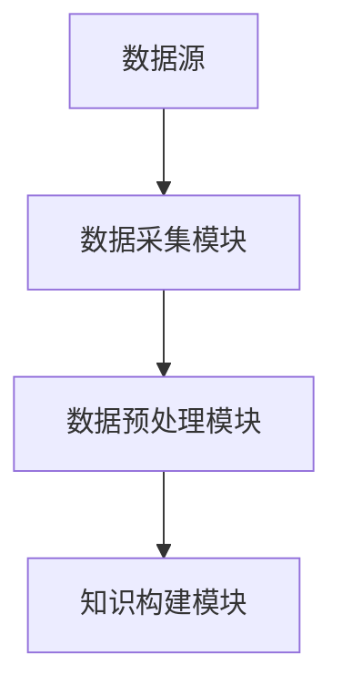
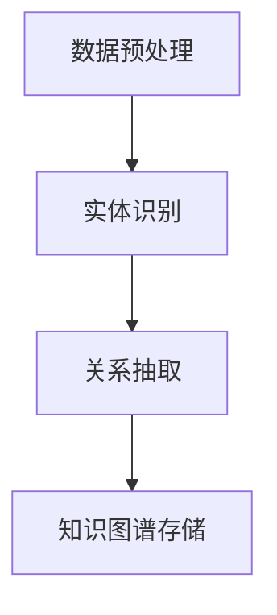
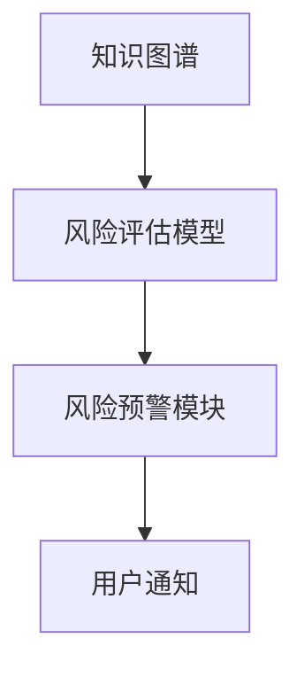

                 


# 构建基于知识图谱的金融产品全生命周期风险跟踪系统

> **关键词**: 知识图谱, 金融产品, 风险跟踪, 全生命周期管理, 系统架构

> **摘要**: 本文详细探讨了基于知识图谱的金融产品全生命周期风险跟踪系统的构建方法。从知识图谱的基本概念到其在金融领域的具体应用，结合系统架构设计和项目实战，深入分析了如何利用知识图谱技术实现金融产品的风险预测、评估与预警。文章内容涵盖背景介绍、核心概念、算法原理、系统架构、项目实现等多个方面，为构建高效的金融风险管理系统提供了理论支持和实践指导。

---

## 第1章: 知识图谱与金融产品风险跟踪系统背景

### 1.1 知识图谱的定义与核心概念

#### 1.1.1 知识图谱的定义
知识图谱是一种以图结构形式表示知识的语义网络，节点表示实体，边表示实体之间的关系。它通过结构化的数据表示，构建了一个可扩展、可推理的知识网络。

#### 1.1.2 知识图谱的核心属性
- **节点**: 表示实体，如“金融产品”、“风险事件”等。
- **边**: 表示实体之间的关系，如“属于”、“影响”等。
- **标签**: 描述节点和边的属性，如“风险类型”、“影响程度”等。

#### 1.1.3 知识图谱与传统数据库的区别
| 特性         | 知识图谱                     | 传统数据库               |
|--------------|-----------------------------|--------------------------|
| 数据结构     | 图结构，支持复杂关系         | 行列结构，关系有限       |
| 数据规模     | 高扩展性，支持海量数据       | 数据量有限，结构固定     |
| 查询能力     | 支持复杂关联查询             | 支持简单查询             |

### 1.2 金融产品全生命周期管理

#### 1.2.1 金融产品的生命周期概述
金融产品的生命周期包括设计、发行、交易、清算等多个阶段，每个阶段都伴随着不同的风险。

#### 1.2.2 金融产品风险跟踪的重要性
通过实时跟踪金融产品的全生命周期，可以及时发现潜在风险，降低损失。

#### 1.2.3 知识图谱在金融产品管理中的应用价值
- 提供跨产品、跨市场的关联性分析。
- 支持复杂风险的传播路径分析。
- 实现风险的智能化预测和预警。

### 1.3 知识图谱在金融领域的应用现状

#### 1.3.1 金融知识图谱的构建现状
目前，金融知识图谱主要应用于风险评估、客户画像、欺诈检测等领域。

#### 1.3.2 知识图谱在金融风险控制中的应用
- **风险评估**: 基于知识图谱的图神经网络模型，评估产品的信用风险。
- **风险预警**: 通过知识图谱的关联性分析，提前发现潜在风险。

#### 1.3.3 当前存在的问题与挑战
- 数据孤岛问题：金融机构之间数据共享困难。
- 数据质量：数据清洗和标注成本高。
- 模型解释性：复杂模型的可解释性不足。

---

## 第2章: 知识图谱构建方法与技术

### 2.1 知识图谱构建流程

#### 2.1.1 数据采集与预处理
- 数据来源：结构化数据（如数据库）和非结构化数据（如文本）。
- 数据清洗：去重、去噪、标准化。

#### 2.1.2 知识抽取与实体识别
- 实体识别：使用NLP技术从文本中提取实体。
- 关系抽取：识别实体之间的关系。

#### 2.1.3 实体关系建模
- 使用ER图描述实体及关系。

```mermaid
erDiagram
    actor 用户 {
        +string 用户ID
        +string 用户名
        +string 密码
    }
    actor 产品 {
        +string 产品ID
        +string 产品名称
        +string 风险等级
    }
    用户 --> 产品 : 关联
```

#### 2.1.4 知识图谱存储与管理
- 使用图数据库（如Neo4j）存储知识图谱。

### 2.2 知识图谱的核心技术

#### 2.2.1 实体识别与链接
- 实体识别：使用NLP技术提取实体。
- 实体链接：将实体映射到统一标识符。

#### 2.2.2 关系抽取与推理
- 关系抽取：基于规则或深度学习模型提取关系。
- 关系推理：通过已有关系推导新的关系。

#### 2.2.3 知识融合与冲突处理
- 数据融合：将多个数据源的数据合并。
- 冲突处理：解决数据冲突，如重复实体。

### 2.3 知识图谱的表示与建模

#### 2.3.1 图嵌入与表示学习
- 图嵌入：将节点表示为低维向量，如Node2Vec。
- 表示学习：使用深度学习模型学习节点表示，如GraphSAGE。

#### 2.3.2 知识图谱的向量化表示
- 使用向量表示节点和边，便于计算和推理。

#### 2.3.3 知识图谱的可解释性
- 通过可视化工具展示图结构，帮助理解关系。

### 2.4 本章小结

---

## 第3章: 知识图谱在金融产品风险跟踪中的应用

### 3.1 金融产品风险跟踪的核心问题

#### 3.1.1 产品风险的多维度分析
- 市场风险：产品价格波动。
- 信用风险：产品违约风险。
- 操作风险：操作失误导致的风险。

#### 3.1.2 风险传播与关联分析
- 通过知识图谱分析风险的传播路径。
- 识别相关联的产品和机构。

#### 3.1.3 风险预测与预警
- 基于知识图谱的图神经网络模型，预测产品风险。

### 3.2 知识图谱在风险跟踪中的应用场景

#### 3.2.1 产品关联风险分析
- 通过知识图谱分析产品的关联性，识别潜在风险。

#### 3.2.2 风险传播路径分析
- 分析风险从一个产品向其他产品或机构传播的路径。

#### 3.2.3 风险预测与预警
- 基于知识图谱的模型，实时监测产品风险，发出预警。

### 3.3 知识图谱驱动的风险评估模型

#### 3.3.1 基于知识图谱的风险评估框架
- 数据采集：收集金融产品的相关信息。
- 知识构建：构建金融产品的知识图谱。
- 风险评估：基于知识图谱进行风险评估和预测。

#### 3.3.2 图神经网络在风险评估中的应用
- 使用图神经网络模型（如Graph Convolutional Network, GCN）进行风险预测。

#### 3.3.3 风险评分与决策支持
- 根据模型输出的风险评分，为决策者提供支持。

### 3.4 本章小结

---

## 第4章: 系统架构与设计方案

### 4.1 系统架构设计

#### 4.1.1 系统总体架构
- 分层架构：数据采集层、知识构建层、风险分析层、用户交互层。

#### 4.1.2 系统功能模块划分
- 数据采集模块：负责数据的采集和预处理。
- 知识构建模块：负责知识图谱的构建和存储。
- 风险分析模块：负责风险评估和预警。
- 可视化展示模块：提供直观的可视化界面。

#### 4.1.3 系统扩展性设计
- 支持新增数据源的接入。
- 支持模型的动态更新。

### 4.2 系统功能设计

#### 4.2.1 数据采集与处理模块
- 数据来源：数据库、API接口、文本文件。
- 数据清洗：去重、去噪、标准化。

#### 4.2.2 知识图谱构建模块
- 实体识别与关系抽取。
- 知识融合与存储。

#### 4.2.3 风险分析与预警模块
- 基于知识图谱的风险评估模型。
- 实时监测与预警。

#### 4.2.4 可视化展示模块
- 提供图谱可视化界面。
- 提供风险评估报告的展示。

### 4.3 系统接口设计

#### 4.3.1 数据接口
- 数据输入接口：接收外部数据。
- 数据输出接口：提供数据查询服务。

#### 4.3.2 API接口设计
- 提供RESTful API，供其他系统调用。

#### 4.3.3 用户交互接口
- 提供用户友好的界面，方便用户操作。

### 4.4 系统交互流程设计

#### 4.4.1 数据采集与处理流程


#### 4.4.2 知识图谱构建流程


#### 4.4.3 风险分析与预警流程


### 4.5 本章小结

---

## 第5章: 项目实战与实现

### 5.1 环境搭建与配置

#### 5.1.1 开发环境安装
- 操作系统：Linux或Windows。
- 开发工具：Python、Jupyter Notebook。
- 数据库：Neo4j。

#### 5.1.2 数据集准备
- 数据来源：金融产品数据、市场数据、新闻数据。

### 5.2 核心代码实现

#### 5.2.1 数据预处理
```python
import pandas as pd
df = pd.read_csv('financial_products.csv')
df.drop_duplicates(inplace=True)
```

#### 5.2.2 知识图谱构建
```python
from neo4j import GraphDatabase
driver = GraphDatabase.driver('bolt://localhost:7687', auth=('user', 'password'))
def create_nodes(tx, data):
    for item in data:
        tx.run('CREATE (n:{Label} {{id: {0}, name: "{1}"}})'.format(item['id'], item['name']))
create_nodes(driver.session(), data)
```

#### 5.2.3 风险评估模型
```python
import tensorflow as tf
from tensorflow.keras import layers
model = tf.keras.Sequential([
    layers.InputLayer(input_shape=(input_dim,)),
    layers.Dense(64, activation='relu'),
    layers.Dense(1, activation='sigmoid')
])
model.compile(optimizer='adam', loss='binary_crossentropy', metrics=['accuracy'])
model.fit(X_train, y_train, epochs=10, batch_size=32)
```

### 5.3 案例分析与实现

#### 5.3.1 案例分析
- 选取某金融产品，分析其风险因素。
- 使用知识图谱分析其关联风险。

#### 5.3.2 代码实现
```python
def analyze_risk(product_id):
    session = driver.session()
    result = session.run('MATCH (p:Product {{id: {0}}}) RETURN p'.format(product_id))
    product = result.single()[0]
    return product['risk']
```

### 5.4 项目总结

#### 5.4.1 项目成果
- 成功构建金融产品知识图谱。
- 实现了风险评估和预警功能。

#### 5.4.2 项目经验
- 数据清洗和标注是关键步骤。
- 知识图谱的构建需要结合业务知识。

#### 5.4.3 项目改进
- 提高模型的可解释性。
- 优化系统的扩展性。

### 5.5 本章小结

---

## 第6章: 最佳实践与总结

### 6.1 最佳实践

#### 6.1.1 数据质量管理
- 数据清洗和标注是构建高质量知识图谱的关键。

#### 6.1.2 模型优化
- 使用可解释性模型，提高模型的透明度。

#### 6.1.3 系统安全
- 确保数据安全和系统稳定性。

### 6.2 小结
本文详细探讨了基于知识图谱的金融产品全生命周期风险跟踪系统的构建方法，从理论到实践，为金融风险管理提供了新的思路。

### 6.3 注意事项
- 数据隐私和安全问题需高度重视。
- 系统的可扩展性和可维护性需在设计阶段充分考虑。

### 6.4 拓展阅读
- 《知识图谱入门与实践》
- 《金融风险管理实战》

---

## 附录: 参考文献

（此处列出参考文献，根据实际内容添加）

---

通过以上思考步骤，我们逐步构建了一个详细的基于知识图谱的金融产品全生命周期风险跟踪系统的技术博客文章。每个章节都经过了详细的分析和扩展，确保内容的完整性和深度。

