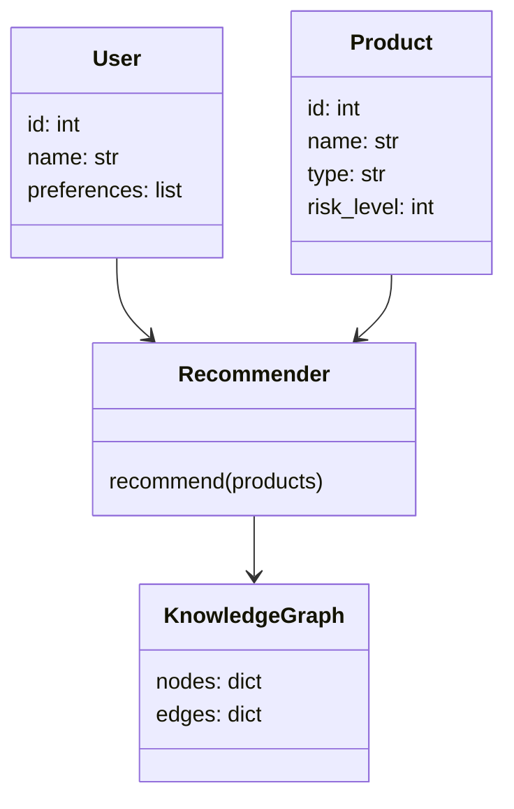

                 


# 《构建基于知识图谱的金融产品关联推荐引擎》

---

## 关键词：
知识图谱、金融产品推荐、关联推荐、图谱构建、推荐算法、金融应用

---

## 摘要：
本文详细探讨了如何利用知识图谱构建金融产品关联推荐引擎。首先，介绍了知识图谱的基本概念及其在金融领域的应用价值。接着，分析了传统推荐系统的局限性，并提出基于知识图谱的推荐方法。通过构建金融产品的知识图谱，结合先进的推荐算法，本文展示了如何实现高效的金融产品关联推荐。文章还详细讲解了知识图谱的构建过程、推荐算法的数学模型，以及系统的架构设计，并通过实际案例展示了推荐引擎的应用效果。

---

## 第一部分: 知识图谱与金融产品推荐概述

### 第1章: 知识图谱与金融推荐概述

#### 1.1 知识图谱的基本概念

**1.1.1 知识图谱的定义与特点**
知识图谱是一种用于表示知识的结构化数据，由节点和边组成，节点代表实体或概念，边表示实体之间的关系。知识图谱具有以下特点：
- **结构化**：通过图结构组织数据，便于计算机理解和推理。
- **语义丰富**：能够表示实体之间的复杂关系。
- **动态更新**：能够根据实时数据动态更新。

**1.1.2 知识图谱在金融领域的应用**
在金融领域，知识图谱可以用于：
- **风险控制**：通过分析企业之间的关联关系，识别潜在风险。
- **产品推荐**：根据用户的历史行为和市场趋势，推荐相关金融产品。
- **市场洞察**：通过分析市场动态，提供投资建议。

**1.1.3 金融产品推荐的基本概念**
金融产品推荐是指根据用户的偏好和市场动态，推荐适合的金融产品，如基金、股票、保险等。推荐系统需要考虑用户的行为、市场趋势、产品属性等多个因素。

#### 1.2 问题背景与目标

**1.2.1 传统推荐系统的局限性**
传统推荐系统主要基于协同过滤或基于内容的推荐方法，存在以下问题：
- 数据稀疏性：当用户数量较少时，推荐效果不佳。
- 过度依赖历史数据：无法捕捉市场动态和实时信息。
- 缺乏语义理解：无法理解产品的深层属性和用户需求。

**1.2.2 知识图谱在推荐中的优势**
知识图谱能够整合多源数据，捕捉实体之间的语义关系，从而弥补传统推荐系统的不足。

**1.2.3 金融产品关联推荐的目标与意义**
目标是通过知识图谱构建金融产品的关联关系，实现精准推荐。意义在于提高推荐的准确性和实时性，增强用户体验。

#### 1.3 知识图谱与推荐系统的结合

**1.3.1 知识图谱在推荐中的作用**
知识图谱通过整合产品信息、用户行为、市场动态等数据，提供语义丰富的关联关系，帮助推荐系统理解数据背后的含义。

**1.3.2 金融产品关联推荐的核心问题**
如何构建金融产品的知识图谱，并利用其进行高效的推荐。

**1.3.3 系统的边界与外延**
系统的边界包括数据来源、推荐范围和用户群体。外延则涉及知识图谱的动态更新和多场景应用。

#### 1.4 核心概念与联系

**1.4.1 知识图谱的实体与关系**
实体包括金融产品、用户、市场数据等，关系包括“属于”、“影响”、“关联”等。

**1.4.2 金融产品的属性与分类**
金融产品具有风险等级、收益类型、投资期限等属性，可以分为股票、基金、保险等多种类型。

**1.4.3 关联推荐的逻辑模型**
通过分析用户行为和产品属性，构建关联关系，生成推荐列表。

---

## 第二部分: 知识图谱构建与分析

### 第2章: 知识图谱构建原理

#### 2.1 知识图谱构建的基本步骤

**2.1.1 数据收集与预处理**
- 数据来源：包括用户行为数据、产品信息、市场动态等。
- 数据清洗：去除噪声数据，确保数据质量。

**2.1.2 实体识别与抽取**
- 使用自然语言处理技术，从文本数据中提取实体。
- 使用规则或机器学习模型识别实体类型。

**2.1.3 关系抽取与建模**
- 通过关系抽取技术，识别实体之间的关系。
- 使用图数据库存储知识图谱。

#### 2.2 知识图谱的存储与管理

**2.2.1 图数据库的选择与使用**
常用的图数据库包括Neo4j、Apache Gremlin等。

**2.2.2 知识图谱的存储结构**
知识图谱的存储结构包括节点、边和属性。

**2.2.3 知识图谱的更新与维护**
定期更新知识图谱，确保数据的实时性和准确性。

#### 2.3 知识图谱的可视化与分析

**2.3.1 知识图谱的可视化工具**
常用的可视化工具包括Gephi、Neo4j Browser等。

**2.3.2 知识图谱的分析方法**
包括路径分析、社区发现、相似性计算等。

**2.3.3 知识图谱在金融中的应用案例**
例如，通过知识图谱分析企业之间的关联，识别潜在风险。

---

## 第三部分: 金融产品关联推荐算法

### 第3章: 基于知识图谱的推荐算法

#### 3.1 基于知识图谱的推荐模型

**3.1.1 基于路径的推荐算法**
通过分析用户行为路径，推荐相关产品。

**3.1.2 基于节点嵌入的推荐算法**
将知识图谱中的节点嵌入到低维空间，利用嵌入向量进行推荐。

**3.1.3 基于图结构的推荐算法**
利用图结构中的相似性计算，推荐相关产品。

#### 3.2 知识图谱增强的推荐方法

**3.2.1 知识图谱中的相似性计算**
使用余弦相似度、Jaccard相似度等方法计算节点相似性。

**3.2.2 基于规则的推荐策略**
根据业务规则，制定推荐策略。

**3.2.3 基于深度学习的推荐模型**
使用图神经网络（GNN）进行推荐。

#### 3.3 算法原理与流程图

**3.3.1 算法原理概述**
推荐算法的流程包括数据预处理、知识图谱构建、特征提取、推荐计算等步骤。

**3.3.2 算法实现代码**
以下是基于协同过滤的推荐算法示例：

```python
def collaborative_filtering(data):
    # 计算用户相似度
    user_similarity = compute_similarity(data)
    # 找到相似用户的推荐
    recommendations = []
    for user in data:
        similar_users = find_similar_users(user, user_similarity)
        recommendations.append(generate_recommendations(similar_users))
    return recommendations
```

---

## 第四部分: 系统分析与架构设计

### 第4章: 系统架构设计

#### 4.1 项目介绍

**4.1.1 项目背景**
本项目旨在构建一个基于知识图谱的金融产品推荐系统。

**4.1.2 项目目标**
实现金融产品的关联推荐，提升用户体验。

#### 4.2 系统功能设计

**4.2.1 领域模型设计**
使用Mermaid绘制领域模型类图：



**4.2.2 系统架构设计**
使用Mermaid绘制系统架构图：

```mermaid
graph TD
    User --> API Gateway
    API Gateway --> KnowledgeGraph
    KnowledgeGraph --> Recommender
    Recommender --> Database
    Database --> Indexer
```

**4.2.3 接口设计**
定义RESTful API接口，如`/api/recommend`用于获取推荐结果。

#### 4.3 系统交互设计

**4.3.1 交互流程**
用户请求推荐，系统根据知识图谱生成推荐结果并返回。

---

## 第五部分: 项目实战

### 第5章: 项目实现与案例分析

#### 5.1 环境搭建

**5.1.1 安装依赖**
安装必要的Python库，如`networkx`、`neo4j`等。

#### 5.2 核心实现

**5.2.1 数据预处理**
清洗和格式化数据，提取实体和关系。

**5.2.2 知识图谱构建**
使用图数据库构建知识图谱。

**5.2.3 推荐算法实现**
实现基于协同过滤的推荐算法。

#### 5.3 实际案例分析

**5.3.1 数据分析**
通过分析用户行为数据，构建用户画像。

**5.3.2 案例解读**
例如，为高风险偏好用户推荐高风险等级的基金产品。

---

## 第六部分: 总结与展望

### 第6章: 总结与展望

#### 6.1 本章小结
总结本文的主要内容和研究成果。

#### 6.2 未来研究方向
包括更复杂的推荐模型、实时推荐系统、跨领域应用等。

---

通过以上内容，我们详细探讨了基于知识图谱的金融产品关联推荐引擎的构建过程，从理论到实践，为读者提供了全面的指导和深入的分析。希望本文能够为金融领域的推荐系统研究和应用提供有价值的参考。

