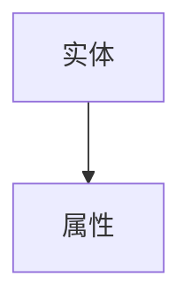
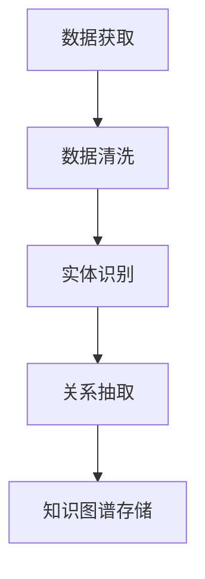
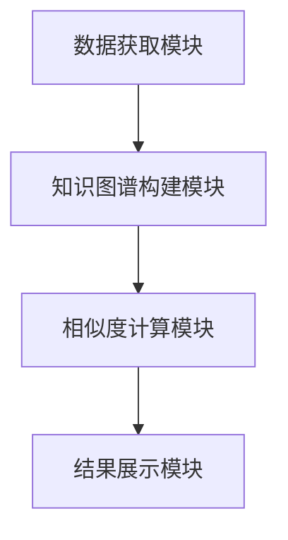

                 


# 构建基于知识图谱的金融产品相似度计算引擎

> 关键词：知识图谱、金融产品、相似度计算、图嵌入、机器学习、NLP

> 摘要：本文深入探讨了如何利用知识图谱构建金融产品相似度计算引擎，详细分析了从数据获取到系统实现的全过程，结合了知识图谱构建、图嵌入算法和相似度计算的多维度方法，为金融产品的智能化推荐和风险评估提供了理论和技术支持。

---

# 第一部分: 背景介绍与核心概念

## 第1章: 金融产品相似度计算的背景与需求

### 1.1 问题背景

#### 1.1.1 金融产品多样性与复杂性

金融产品种类繁多，包括股票、债券、基金、保险、理财产品等。每类金融产品都有其独特的属性和风险特征，例如基金的收益波动性、债券的信用评级、保险的保障范围等。随着金融市场的不断发展，新的金融产品层出不穷，传统的基于单一属性的相似度计算方法难以全面捕捉产品的复杂性。

#### 1.1.2 相似度计算的业务价值

在金融领域，相似度计算具有重要的业务价值。例如：
- **产品推荐**：通过相似度计算，可以为用户提供个性化的产品推荐，提升用户体验。
- **风险评估**：相似的产品可能具有相似的风险特征，有助于快速评估新产品的风险。
- **市场分析**：通过分析相似产品的市场表现，可以为投资决策提供数据支持。

#### 1.1.3 知识图谱在金融领域的应用潜力

知识图谱是一种以图结构形式表示知识的工具，能够将分散的知识点连接起来，形成一个完整的知识网络。在金融领域，知识图谱可以用于：
- **产品关联分析**：通过构建金融产品的知识图谱，可以发现产品之间的隐含关系。
- **知识推理**：通过知识图谱的推理能力，可以挖掘出传统方法难以发现的关联性。
- **智能问答**：基于知识图谱，可以实现对金融产品相关问题的智能回答。

### 1.2 问题描述

#### 1.2.1 金融产品的多维度属性

金融产品的相似度计算需要考虑多个维度的属性，包括：
- **产品类型**：如股票、债券、基金等。
- **产品特性**：如风险等级、收益类型、期限等。
- **市场表现**：如历史收益率、波动率等。

#### 1.2.2 相似度计算的核心挑战

- **数据稀疏性**：某些金融产品的数据可能较少，导致相似度计算的准确性下降。
- **语义理解**：金融产品描述可能存在多种表达方式，如何准确理解其语义是挑战。
- **动态变化**：金融市场的动态变化要求相似度计算方法具有一定的实时性和适应性。

#### 1.2.3 知识图谱的优势与局限性

**优势**：
- 能够整合多源异构数据，形成统一的知识表示。
- 通过语义关联，发现产品间的隐含关系。
- 支持动态更新，适应市场变化。

**局限性**：
- 知识图谱的构建需要大量人工干预，尤其是领域知识的抽取和整理。
- 对于复杂关系的推理能力有限，需要结合其他技术进行增强。

### 1.3 问题解决

#### 1.3.1 知识图谱构建的目标

- 建立金融产品的统一知识表示。
- 捕捉产品间的语义关联。
- 提供高效的查询与推理能力。

#### 1.3.2 相似度计算的实现路径

- 基于向量的相似度计算：将产品表示为向量，计算向量间的相似度。
- 基于图的相似度计算：通过图结构分析节点间的相似性。
- 综合方法：结合向量和图的特性，提出混合模型。

#### 1.3.3 引擎架构的设计理念

- **模块化设计**：将引擎划分为数据获取、知识图谱构建、相似度计算和结果展示等模块。
- **可扩展性**：支持不同数据源的接入和多种算法的集成。
- **实时性**：能够快速响应查询请求，适应金融市场的实时需求。

---

## 第2章: 知识图谱与金融产品相似度计算的核心概念

### 2.1 核心概念与定义

#### 2.1.1 知识图谱的定义与特征

知识图谱是一种以图结构形式表示知识的工具，由节点（实体）和边（关系）组成。其主要特征包括：
- **结构化**：节点和边都有明确的语义定义。
- **语义关联**：节点之间通过边连接，表示实体间的关联关系。
- **可扩展性**：支持动态添加新的实体和关系。

#### 2.1.2 金融产品的知识表示

金融产品的知识表示需要考虑以下方面：
- **实体识别**：识别金融产品中的实体，如“基金”、“股票”等。
- **关系抽取**：抽取实体之间的关系，如“基金A与基金B具有相似的风险特征”。
- **属性描述**：描述实体的属性，如“基金A的年化收益率为8%”。

#### 2.1.3 相似度计算的数学模型

相似度计算的数学模型是将两个对象的相似性量化为一个数值。常用的模型包括：
- **余弦相似度**：衡量两个向量在方向上的相似程度。
- **欧氏距离**：衡量两个点在空间中的距离，越近越相似。
- **杰卡德相似度**：基于集合的相似度计算。

### 2.2 核心概念的联系

#### 2.2.1 实体与关系的ER图设计

以下是金融产品知识图谱的ER图设计：

```mermaid
erDiagram
    class 实体 {
        实体ID
        实体类型
        属性1
        属性2
        ...
    }
    class 关系 {
        关系ID
        关系类型
        外键1
        外键2
    }
    实体 --> 关系 : 参与
```

#### 2.2.2 属性与实体的关联关系

以下是实体与属性的关联关系图：



#### 2.2.3 知识图谱的构建流程

以下是知识图谱的构建流程图：



### 2.3 知识图谱构建的步骤

#### 2.3.1 数据获取与清洗

数据获取是知识图谱构建的第一步，需要从多种数据源获取金融产品的数据，包括：
- **结构化数据**：如数据库中的表格数据。
- **半结构化数据**：如JSON格式的文本数据。
- **非结构化数据**：如自由文本描述。

数据清洗的目标是去除噪声数据，确保数据的准确性和一致性。

#### 2.3.2 实体识别与抽取

实体识别是通过自然语言处理技术，从文本中提取出金融产品的实体。常用的技术包括：
- **基于规则的实体识别**：通过正则表达式匹配特定模式。
- **基于机器学习的实体识别**：使用训练好的模型进行实体识别。

#### 2.3.3 关系抽取与构建

关系抽取是通过分析文本，识别出实体之间的关系。常用的技术包括：
- **基于模板的关系抽取**：通过预定义的模板匹配关系。
- **基于机器学习的关系抽取**：使用训练好的模型进行关系分类。

#### 2.3.4 知识图谱的存储与管理

知识图谱的存储与管理需要选择合适的存储方式，包括：
- **图数据库**：如Neo4j，适合存储图结构数据。
- **关系型数据库**：如MySQL，适合存储结构化数据。
- **分布式存储**：如Hadoop，适合大规模数据存储。

---

## 第3章: 知识图谱构建的工具与技术

### 3.1 知识图谱构建工具

#### 3.1.1 基于规则的构建工具

基于规则的构建工具通过预定义的规则进行实体识别和关系抽取。例如：
- **spaCy**：支持多种语言的自然语言处理，适合实体识别。
- **GATE**：基于规则的知识抽取工具，适合领域知识丰富的场景。

#### 3.1.2 基于机器学习的构建工具

基于机器学习的构建工具通过训练好的模型进行实体识别和关系抽取。例如：
- **BERT**：预训练语言模型，适合多种任务的实体识别和关系抽取。
- **LTP**：中文分词和句法分析工具，适合中文金融文本的处理。

#### 3.1.3 开源知识图谱构建框架

开源的知识图谱构建框架提供了从数据获取到知识图谱构建的完整流程。例如：
- **OpenIE**：基于规则的知识抽取框架。
- **KGTK**：开源的知识图谱工具包，支持知识图谱的构建和分析。

### 3.2 数据抽取与清洗技术

#### 3.2.1 正则表达式与规则匹配

正则表达式是一种强大的文本匹配工具，常用于从文本中提取特定模式的实体。例如：
- 提取基金代码：`\d{6}\D{2}\d{4}`
- 提取日期：`\d{4}-\d{2}-\d{2}`

#### 3.2.2 机器学习模型的应用

机器学习模型在数据清洗中的应用包括：
- **去重**：使用聚类算法识别重复数据。
- **分类**：使用分类模型识别数据中的噪声。

#### 3.2.3 数据清洗与预处理方法

数据清洗的常用方法包括：
- **去除重复数据**：通过哈希表或排序去重。
- **处理缺失值**：使用均值、中位数或删除数据填充缺失值。
- **标准化处理**：将数据转换为统一的格式，例如日期格式化。

### 3.3 实体识别与关系抽取

#### 3.3.1 实体识别的常用算法

实体识别的常用算法包括：
- **CRF（条件随机场）**：基于统计的序列标注算法。
- **RNN（循环神经网络）**：适合处理序列数据。
- **BERT**：预训练语言模型，适合多种任务的实体识别。

#### 3.3.2 关系抽取的主流技术

关系抽取的主流技术包括：
- **基于模板的方法**：通过预定义的模板匹配关系。
- **基于统计的方法**：通过统计词语共现频率识别关系。
- **基于深度学习的方法**：使用CNN、RNN等模型进行关系分类。

#### 3.3.3 跨语言与多模态抽取

跨语言抽取是指在不同语言之间进行实体识别和关系抽取。多模态抽取是指同时处理文本、图像等多种数据类型。

---

## 第4章: 知识图谱嵌入与相似度计算

### 4.1 知识图谱嵌入的算法原理

知识图谱嵌入的目标是将图中的节点和边映射到低维向量空间，便于后续的相似度计算。常用算法包括：
- **Word2Vec**：基于上下文的词向量生成方法。
- **Node2Vec**：将节点嵌入表示为向量。
- **GraphSAGE**：通过归纳式学习生成节点表示。

### 4.2 基于向量的相似度计算

#### 4.2.1 余弦相似度

余弦相似度衡量两个向量在方向上的相似程度：

$$ \text{余弦相似度} = \frac{\vec{A} \cdot \vec{B}}{|\vec{A}| \cdot |\vec{B}|} $$

#### 4.2.2 欧氏距离与曼哈顿距离的对比

欧氏距离衡量两个点在空间中的距离：

$$ \text{欧氏距离} = \sqrt{\sum_{i=1}^{n}(A_i - B_i)^2} $$

曼哈顿距离衡量两个点在网格路径上的距离：

$$ \text{曼哈顿距离} = \sum_{i=1}^{n}|A_i - B_i| $$

### 4.3 基于图的相似度计算

#### 4.3.1 图嵌入的算法原理

图嵌入算法将图中的节点表示为低维向量，常用的算法包括：
- **DeepWalk**：基于随机游走的节点表示学习。
- **Node2Vec**：通过调整超参数控制随机游走策略。
- **GAT**：基于图注意力机制的节点表示学习。

#### 4.3.2 节点相似度的传播机制

节点相似度的传播机制通过图中的边传播相似度，最终得到全局相似度。常用的方法包括：
- **标签传播算法**：通过传播标签计算节点相似度。
- **PageRank算法**：基于pagerank思想传播相似度。
- **LDA主题模型**：基于主题模型传播相似度。

#### 4.3.3 图结构对相似度的影响

图结构对相似度的影响主要体现在：
- **节点度数**：度数高的节点通常具有更高的相似度。
- **社区结构**：同一社区内的节点相似度较高。
- **路径长度**：路径越短，节点相似度越高。

---

## 第5章: 金融产品相似度计算的系统架构与实现

### 5.1 系统架构设计

以下是金融产品相似度计算引擎的系统架构图：



#### 5.1.1 数据获取模块

数据获取模块负责从多种数据源获取金融产品的数据，包括：
- **数据库**：如MySQL、MongoDB。
- **API接口**：如金融数据服务提供商的API。
- **文件导入**：如CSV、Excel格式的文件。

#### 5.1.2 知识图谱构建模块

知识图谱构建模块负责将获取的数据转换为知识图谱，包括：
- **数据清洗**：去除噪声数据。
- **实体识别**：识别金融产品的实体。
- **关系抽取**：抽取实体之间的关系。
- **知识图谱存储**：将知识图谱存储到图数据库中。

#### 5.1.3 相似度计算模块

相似度计算模块负责计算金融产品之间的相似度，包括：
- **向量表示**：将金融产品表示为向量。
- **相似度计算**：计算向量之间的相似度。
- **结果排序**：对相似度结果进行排序。

#### 5.1.4 结果展示模块

结果展示模块负责将相似度计算结果展示给用户，包括：
- **可视化展示**：以图表形式展示相似度结果。
- **结果解释**：对相似度结果进行解释，帮助用户理解。

### 5.2 系统实现

以下是金融产品相似度计算引擎的系统实现：

```python
class FinancialProductSimilarityEngine:
    def __init__(self, knowledge_graph):
        self.knowledge_graph = knowledge_graph

    def compute_similarity(self, product_a, product_b):
        vector_a = self.knowledge_graph.embed(product_a)
        vector_b = self.knowledge_graph.embed(product_b)
        similarity = self.cosine_similarity(vector_a, vector_b)
        return similarity

    def cosine_similarity(self, vector_a, vector_b):
        return np.dot(vector_a, vector_b) / (np.linalg.norm(vector_a) * np.linalg.norm(vector_b))
```

### 5.3 项目实战

#### 5.3.1 环境安装

以下是项目实战所需的环境安装命令：

```bash
pip install numpy
pip install networkx
pip install neo4j
pip install spacy
```

#### 5.3.2 数据处理

以下是数据处理的代码示例：

```python
import pandas as pd

# 读取数据
data = pd.read_csv('financial_products.csv')

# 数据清洗
data.dropna(inplace=True)
data = data.drop_duplicates()
```

#### 5.3.3 知识图谱构建

以下是知识图谱构建的代码示例：

```python
from neo4j import GraphDatabase

# 连接知识图谱
driver = GraphDatabase.driver('bolt://localhost:7687', auth=('neo4j', 'password'))

# 创建节点
def create_node(tx, entity):
    tx.run("CREATE (:Entity {name: $entity})", entity=entity)

# 创建关系
def create_relation(tx, entity1, relation, entity2):
    tx.run("MATCH (a {name: $entity1}), (b {name: $entity2}) CREATE (a)-[r:$relation]->(b)", 
            entity1=entity1, relation=relation, entity2=entity2)

# 使用事务创建节点和关系
with driver.session() as session:
    session.write_transaction(create_node, '基金A')
    session.write_transaction(create_node, '基金B')
    session.write_transaction(create_relation, '基金A', 'similar', '基金B')
```

#### 5.3.4 模型训练与相似度计算

以下是模型训练与相似度计算的代码示例：

```python
from sklearn.feature_extraction.text import TfidfVectorizer
from sklearn.metrics.pairwise import cosine_similarity

# 初始化向量机
vectorizer = TfidfVectorizer()

# 训练向量机
vectors = vectorizer.fit_transform(documents)

# 计算余弦相似度
similarity_matrix = cosine_similarity(vectors)
```

#### 5.3.5 结果展示

以下是结果展示的代码示例：

```python
import matplotlib.pyplot as plt

# 绘制相似度矩阵
plt.imshow(similarity_matrix, cmap='hot', interpolation='nearest')
plt.title('相似度矩阵')
plt.xlabel('产品编号')
plt.ylabel('产品编号')
plt.show()
```

---

## 第6章: 总结与展望

### 6.1 总结

本文详细探讨了如何构建基于知识图谱的金融产品相似度计算引擎，从数据获取到系统实现的全过程进行了详细分析。通过知识图谱的构建，我们可以更好地理解金融产品的语义关联，从而提高相似度计算的准确性和效率。

### 6.2 未来展望

未来，随着人工智能技术的不断发展，金融产品相似度计算引擎将朝着以下几个方向发展：
- **实时性增强**：支持实时数据更新和动态相似度计算。
- **多模态融合**：结合文本、图像等多种数据源进行相似度计算。
- **自动化优化**：通过自动化学习优化相似度计算模型。

---

通过本文的分析，我们不仅可以更好地理解金融产品相似度计算的核心技术，还能为金融领域的智能化应用提供重要的理论和技术支持。

