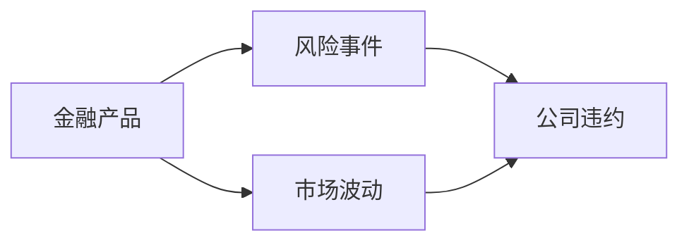

                 


# 构建基于知识图谱的金融产品风险关联评估系统

> 关键词：知识图谱、金融产品、风险关联、系统架构、算法原理

> 摘要：本文详细探讨了构建基于知识图谱的金融产品风险关联评估系统的背景、核心概念、算法原理、系统架构以及项目实战。通过系统化的分析与设计，结合实际案例，展示了如何利用知识图谱技术来有效评估和管理金融产品的风险关联，为金融领域的风险控制提供了新的思路和方法。

---

## 第一部分: 背景介绍与核心概念

### 第1章: 知识图谱与金融风险关联评估概述

#### 1.1 问题背景
##### 1.1.1 金融产品风险评估的重要性
金融产品的风险评估是金融行业的重要组成部分，直接关系到金融机构的稳健运行和投资者的资产安全。随着金融市场的复杂化和多样化，单一产品风险的独立评估已难以满足实际需求，风险之间的关联性成为新的研究重点。

##### 1.1.2 知识图谱在金融领域的应用价值
知识图谱是一种以结构化形式表示知识的技术，能够将分散在不同数据源中的实体及其关系进行整合，形成语义网络。在金融领域，知识图谱可以帮助发现隐藏的关联关系，提升风险评估的准确性。

##### 1.1.3 当前金融风险关联评估的挑战
传统风险评估方法主要依赖统计分析和单一产品的数据，难以捕捉跨产品、跨市场的复杂关联。此外，金融数据的异构性和动态性也增加了风险关联评估的难度。

#### 1.2 问题描述
##### 1.2.1 金融产品风险的复杂性
金融产品的风险不仅来源于产品本身的特性，还可能受到市场环境、宏观经济政策、企业经营状况等多种因素的影响。

##### 1.2.2 知识图谱在风险关联中的作用
知识图谱可以通过语义关联分析，揭示不同金融产品之间的潜在关系，帮助识别系统性风险。

##### 1.2.3 问题解决的目标与范围
目标是构建一个能够实时捕捉和评估金融产品风险关联的系统，范围涵盖数据采集、知识图谱构建、风险评估算法设计和系统实现。

#### 1.3 问题解决思路
##### 1.3.1 知识图谱构建的基本流程
1. 数据采集：从多种数据源获取金融产品信息、市场数据、新闻等。
2. 数据清洗：去除噪声数据，确保数据质量。
3. 实体识别与关系抽取：识别文本中的实体及其关系。
4. 知识图谱构建：将实体及其关系整合到知识图谱中。

##### 1.3.2 金融风险关联评估的逻辑框架
1. 构建金融知识图谱：整合金融产品、市场、政策等实体及其关系。
2. 设计风险关联算法：基于知识图谱进行风险传播和关联分析。
3. 实时监控与预警：根据分析结果进行风险预警。

##### 1.3.3 系统设计的核心要素
1. 高效的数据处理能力：能够处理大规模金融数据。
2. 强大的知识图谱构建与查询能力。
3. 精准的风险关联算法：能够准确捕捉风险关联。

#### 1.4 边界与外延
##### 1.4.1 系统的边界定义
系统仅关注金融产品的风险关联评估，不涉及具体的交易决策。

##### 1.4.2 相关领域的外延
知识图谱技术在金融领域的其他应用，如客户画像、欺诈检测等。

##### 1.4.3 系统与外部环境的交互
系统通过API接口与外部数据源、用户界面进行交互。

#### 1.5 核心概念结构
##### 1.5.1 核心概念的组成
1. 金融产品：如股票、基金、债券等。
2. 风险事件：如市场波动、公司违约等。
3. 关联关系：如因果关系、相关关系等。

##### 1.5.2 概念之间的关系
1. 金融产品与风险事件之间的关联。
2. 风险事件之间的相互影响。

---

接下来，我会按照目录大纲继续完成其他部分的内容。由于篇幅限制，我将分批次完成。以下是第一部分的内容：

---

## 第2章: 核心概念与联系

### 2.1 知识图谱原理
#### 2.1.1 知识图谱的基本概念
知识图谱是一种以图结构表示知识的技术，由实体（节点）和关系（边）组成。

#### 2.1.2 知识图谱的构建流程
1. 数据预处理：清洗、去重、合并。
2. 实体识别与关系抽取：使用NLP技术提取实体及其关系。
3. 知识图谱存储：使用图数据库（如Neo4j）存储。

#### 2.1.3 知识图谱的存储与查询
使用图数据库进行存储，并通过Cypher语言进行查询。



### 2.2 金融风险关联评估
#### 2.2.1 风险关联的基本定义
风险关联是指不同金融产品之间的风险相互影响。

#### 2.2.2 风险关联的评估方法
1. 基于相关性的分析。
2. 基于网络的传播模型。

#### 2.2.3 风险关联的动态变化
风险关联会随着市场环境的变化而变化。

### 2.3 核心概念对比
#### 2.3.1 知识图谱与传统数据库的对比
| 对比维度 | 知识图谱 | 传统数据库 |
|----------|----------|-------------|
| 数据模型 | 图结构    | 行列结构    |
| 查询效率 | 低       | 高           |
| 关联分析 | 强        | 弱           |

#### 2.3.2 风险关联与传统风险评估的对比
| 对比维度 | 风险关联 | 传统风险评估 |
|----------|----------|--------------|
| 方法     | 网络传播 | 单变量分析    |
| 适用性   | 复杂关联 | 简单关系      |

#### 2.3.3 知识图谱在风险关联中的独特优势
1. 能够捕捉非线性关联。
2. 支持动态更新。

### 2.4 ER实体关系图
```mermaid
er
    entity(金融产品) {
        id: string
        name: string
        risk_level: int
    }
    entity(风险事件) {
        id: string
        description: string
        timestamp: datetime
    }
    entity(关联关系) {
        id: string
        source: string
        target: string
        relation_type: string
    }
    relationship(涉及, 1..n) between 金融产品 and 风险事件
    relationship(影响, 1..n) between 风险事件 and 风险事件
```

---

以上是文章的第一部分，接下来我会按照目录继续完成其他部分的内容。

