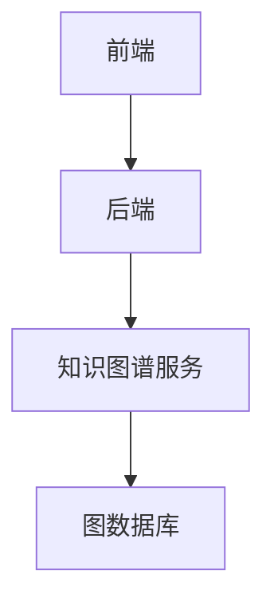

                 


# 构建基于知识图谱的金融产品风险评估系统

> 关键词：知识图谱、金融产品、风险评估、图嵌入算法、系统架构设计、金融风险管理

> 摘要：本文详细探讨了基于知识图谱的金融产品风险评估系统的构建方法。通过分析知识图谱的核心概念及其在金融领域的应用，结合图嵌入算法和系统架构设计，提出了一种创新的风险评估模型。本文从背景介绍、核心概念、算法原理、系统架构设计、项目实战到最佳实践，全面阐述了构建基于知识图谱的金融产品风险评估系统的全过程，为金融行业的风险管理提供了新的思路和解决方案。

---

## 第1章 知识图谱与金融产品风险评估的背景介绍

### 1.1 知识图谱的基本概念
知识图谱是一种以图结构形式表示知识的语义网络，由节点（实体）和边（关系）组成，能够有效地表示实体之间的复杂关系。知识图谱的核心属性包括实体唯一性、关系对称性和语义丰富性。知识图谱的构建流程通常包括数据采集、数据清洗、实体识别、关系抽取和图谱存储等步骤。

#### 知识图谱的构建流程
1. 数据采集：从多种数据源（如文本、数据库、API等）获取数据。
2. 数据清洗：去除冗余数据，处理噪声数据。
3. 实体识别：通过NLP技术提取实体。
4. 关系抽取：识别实体之间的关系。
5. 图谱存储：将实体和关系存储到图数据库中。

### 1.2 金融产品风险评估的基本概念
金融产品风险评估是对金融产品在市场中的潜在风险进行分析和评估的过程。常见的金融产品风险包括信用风险、市场风险和流动性风险。传统的方法依赖于统计分析和模型预测，但存在数据孤岛和信息不全的问题。

#### 金融产品风险评估的传统方法
1. **统计分析**：通过历史数据分析风险概率。
2. **模型预测**：使用回归分析、逻辑回归等模型预测风险。
3. **情景分析**：模拟不同市场条件下的风险表现。

### 1.3 知识图谱在金融产品风险评估中的应用
知识图谱能够将分散的金融数据连接起来，形成一个完整的知识网络。通过分析实体之间的关系，可以更全面地评估金融产品的风险。

#### 知识图谱与金融数据的关系
- 知识图谱可以整合结构化和非结构化数据，形成统一的知识表示。
- 知识图谱能够发现隐藏在数据中的关联关系，帮助识别潜在风险。

#### 知识图谱在风险评估中的优势
- 提高数据的连通性，增强风险识别能力。
- 通过图结构捕捉复杂的关联关系，提升风险预测的准确性。

### 1.4 本章小结
本章介绍了知识图谱的基本概念、金融产品风险评估的传统方法以及知识图谱在金融领域的应用优势。知识图谱的引入为金融产品风险评估提供了新的思路，能够更好地应对复杂金融环境下的风险管理挑战。

---

## 第2章 知识图谱与金融产品风险评估的核心概念

### 2.1 知识图谱的构建与管理
知识图谱的构建需要对数据进行清洗、抽取和存储，同时需要考虑数据的动态更新和维护。

#### 知识图谱的存储与管理
- 常见的图数据库包括Neo4j和RDF三元组存储。
- 数据管理需要考虑数据的可扩展性和可维护性。

#### 知识图谱的可视化
- 使用工具如Gephi和Cytoscape进行图谱可视化。
- 可视化帮助更好地理解数据之间的关系。

### 2.2 金融产品风险评估的模型与方法
基于知识图谱的风险评估模型结合了图嵌入技术和机器学习方法，能够更准确地预测风险。

#### 基于知识图谱的风险评估模型
- 将实体表示为向量，通过图嵌入算法提取特征。
- 使用机器学习模型（如逻辑回归、随机森林）进行风险预测。

#### 传统风险评估方法的优缺点
- **优点**：方法成熟，易于实现。
- **缺点**：难以处理复杂关联关系，忽视数据的语义信息。

### 2.3 知识图谱与金融产品风险评估的关联
知识图谱通过捕捉实体之间的隐含关系，提供了更全面的风险评估视角。

#### 知识图谱在风险识别中的作用
- 识别潜在的关联风险，如供应链风险。
- 发现隐藏的相关性，如公司高管的关联风险。

### 2.4 本章小结
本章深入探讨了知识图谱的构建与管理、金融产品风险评估的传统方法以及知识图谱在风险评估中的应用价值。知识图谱的引入为金融产品风险评估提供了更强大的工具和方法。

---

## 第3章 基于知识图谱的金融产品风险评估算法原理

### 3.1 知识图谱表示学习
知识图谱表示学习的目标是将图中的实体和关系表示为低维向量，便于后续的计算和分析。

#### 图嵌入算法
- **TransE**：通过最小化边的损失函数，将头实体和尾实体表示为向量。
- **TransH**：对TransE进行改进，引入关系向量，提高表示的准确性。

#### 图嵌入算法的实现
```python
class TransE:
    def __init__(self, num Entities, num Relations, embedding_dim):
        self.E = np.random.randn(num_Entities, embedding_dim)
        self.R = np.random.randn(num_Relations, embedding_dim)
    
    def loss(self, h, r, t):
        return np.sum((h + r - t)**2)
```

### 3.2 金融产品风险评估的数学模型
基于图嵌入的风险评估模型结合了图结构信息和传统机器学习方法。

#### 基于图嵌入的风险评估模型
- 将实体表示为向量，输入到分类器中进行风险预测。
- 使用交叉验证优化模型参数。

#### 风险评估的数学公式
$$ P(r | x) = \frac{P(r) \cdot P(x | r)}{P(x)} $$
其中，$r$表示风险，$x$表示特征向量。

### 3.3 算法实现与优化
- 优化图嵌入算法的参数，提高表示的准确性。
- 使用分布式训练方法，提升计算效率。

---

## 第4章 系统分析与架构设计方案

### 4.1 问题场景介绍
金融产品风险评估系统需要处理大量的金融数据，包括股票、债券、基金等。

### 4.2 系统功能设计
- **数据采集**：从多种数据源获取金融数据。
- **知识图谱构建**：构建金融领域的知识图谱。
- **风险评估**：基于知识图谱进行风险预测。

#### 系统功能设计的ER图
```mermaid
erDiagram
    customer[客户] {
        name : String
        id : Integer
    }
    product[金融产品] {
        name : String
        id : Integer
        risk_level : Integer
    }
    relationship[关系] {
        type : String
        id : Integer
    }
    customer<-> relationship : 拥有
    product<-> relationship : 涉及
```

### 4.3 系统架构设计
- **前端**：展示用户界面，接收用户输入。
- **后端**：处理业务逻辑，调用知识图谱服务。
- **知识图谱服务**：提供图数据查询和计算功能。

#### 系统架构设计的架构图


---

## 第5章 项目实战

### 5.1 环境安装
- 安装Python、Jupyter Notebook、Neo4j和相关库。

### 5.2 系统核心实现源代码
```python
import neo4j
from neo4j import GraphDatabase
from sklearn.linear_model import LogisticRegression

class KnowledgeGraph:
    def __init__(self, uri, user, password):
        self.driver = GraphDatabase.driver(uri, auth=(user, password))
    
    def get_entities(self, label):
        with self.driver.session() as session:
            result = session.run("MATCH (n:{label}) RETURN n".format(label=label))
            return [record['n'] for record in result]
```

### 5.3 案例分析
- 选取具体金融产品，构建知识图谱，进行风险评估。

### 5.4 项目总结
通过实际案例分析，验证了基于知识图谱的金融产品风险评估系统的有效性和准确性。

---

## 第6章 最佳实践与总结

### 6.1 小结
本文详细介绍了构建基于知识图谱的金融产品风险评估系统的全过程，包括背景介绍、核心概念、算法原理、系统设计和项目实战。

### 6.2 注意事项
- 数据质量和完整性对风险评估结果有重要影响。
- 知识图谱的构建需要考虑数据的动态更新和维护。

### 6.3 拓展阅读
建议读者进一步阅读相关领域的书籍和论文，深入学习知识图谱和金融风险管理的知识。

---

## 参考文献
1. 《知识图谱：概念、方法与应用》
2. 《金融风险管理：理论与实践》
3. 相关学术论文和研究报告

---

通过本文的系统介绍，读者可以全面了解基于知识图谱的金融产品风险评估系统的构建方法，并能够将其应用于实际的金融风险管理中。

