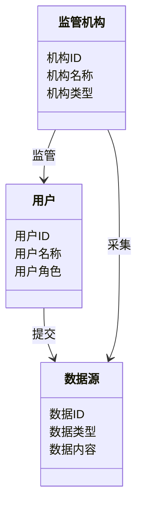
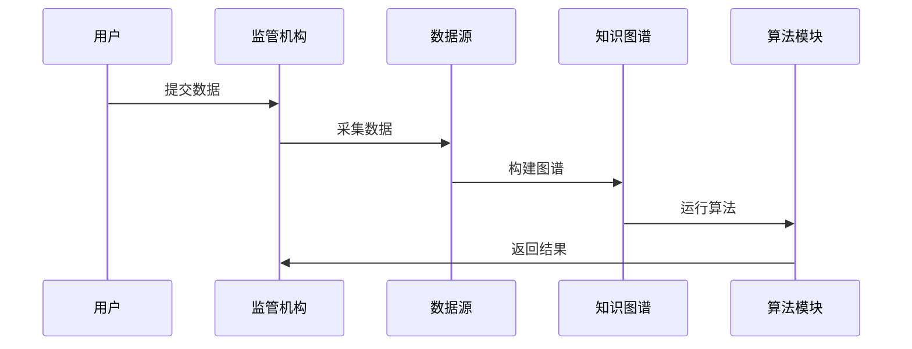

                 


# 构建基于知识图谱的金融监管合规追踪系统

## 关键词：知识图谱，金融监管，合规追踪，系统架构，算法原理

## 摘要：本文将详细探讨如何构建基于知识图谱的金融监管合规追踪系统。通过分析知识图谱在金融监管中的应用，结合具体的算法原理和系统架构设计，提出了一套完整的解决方案，以实现高效的合规追踪和风险控制。

---

# 第1章: 背景介绍

## 1.1 问题背景
### 1.1.1 金融监管的重要性
金融监管是维护金融市场稳定、保护投资者利益的重要手段。随着金融市场的复杂化，传统的监管方式难以应对日益增加的监管需求。

### 1.1.2 合规追踪的必要性
合规追踪是金融监管的核心任务之一，涉及交易数据、资金流向、风险评估等多个方面。传统的监管手段难以高效追踪复杂的金融行为。

### 1.1.3 知识图谱在金融监管中的作用
知识图谱是一种强大的数据组织和表达方式，能够将复杂的金融数据结构化、可视化，为监管提供有力支持。

## 1.2 问题描述
### 1.2.1 传统金融监管的不足
传统监管方式依赖人工审核，效率低，难以应对海量数据和复杂交易。

### 1.2.2 知识图谱技术的优势
知识图谱能够通过语义理解和关联分析，发现隐藏的关联关系，提升监管效率。

### 1.2.3 合规追踪系统的构建目标
构建一个基于知识图谱的合规追踪系统，实现对金融交易的实时监控和风险预警。

## 1.3 问题解决
### 1.3.1 知识图谱构建的核心步骤
数据采集、数据清洗、知识抽取、知识融合、知识存储和知识推理。

### 1.3.2 合规追踪的实现方法
通过知识图谱的关联分析和语义理解，实现对金融交易的合规性评估。

### 1.3.3 系统边界与外延
系统专注于金融监管领域的合规追踪，不涉及其他业务模块。

## 1.4 核心概念与组成
### 1.4.1 知识图谱的基本组成
实体、关系、属性。

### 1.4.2 金融监管的核心要素
交易数据、资金流向、合规规则、风险指标。

### 1.4.3 合规追踪系统的架构
数据采集层、知识构建层、监管分析层、用户交互层。

---

# 第2章: 核心概念与联系

## 2.1 知识图谱的定义与特点
### 2.1.1 知识图谱的定义
知识图谱是一种以图结构形式表示知识的语义网络，包含实体和关系。

### 2.1.2 知识图谱的核心特点
结构化、语义化、关联性、动态更新。

## 2.2 金融监管的核心原理
### 2.2.1 金融监管的目标与手段
维护市场秩序、保护投资者、防范金融风险。

### 2.2.2 合规性评估的关键指标
合规性、风险性、透明度。

### 2.2.3 知识图谱在监管中的应用
实体识别、关系抽取、风险预警。

## 2.3 合规追踪系统的实体关系
### 2.3.1 实体关系图的构建
通过知识图谱构建实体间的关系网络。

### 2.3.2 实体属性与关系属性的对比
实体属性：名称、类型、金额；关系属性：时间、类型、权重。

## 2.4 ER实体关系图
```mermaid
erDiagram
    actor 用户 {
        <属性> 用户ID
        <属性> 用户名称
        <属性> 用户角色
    }
    actor 监管机构 {
        <属性> 机构ID
        <属性> 机构名称
        <属性> 机构类型
    }
    actor 数据源 {
        <属性> 数据ID
        <属性> 数据类型
        <属性> 数据内容
    }
    监管机构 --|> 用户 : "监管"
    用户 --|> 数据源 : "提交"
    监管机构 --|> 数据源 : "采集"
```

---

# 第3章: 算法原理讲解

## 3.1 算法选择与原理
### 3.1.1 算法选择
选择图嵌入算法（如Node2Vec）进行知识图谱的节点表示。

### 3.1.2 算法原理
Node2Vec通过随机游走生成节点的表示，考虑节点的局部结构信息。

## 3.2 算法实现
### 3.2.1 算法流程
1. 数据预处理：构建知识图谱的邻接表。
2. 随机游走：生成节点的上下文序列。
3. 训练模型：学习节点的向量表示。

### 3.2.2 Python代码实现
```python
import numpy as np
from sklearn import preprocessing

def node2vec_model():
    # 数据预处理
    adj = {}  # 邻接表
    nodes = [...]  # 所有节点
    for node in nodes:
        adj[node] = []  # 初始化邻接表
        # 添加边

    # 随机游走
    walks = []
    for _ in range(num_walks):
        current_node = start_node
        walk = [current_node]
        for _ in range(walk_length):
            neighbors = adj[current_node]
            if not neighbors:
                break
            next_node = np.random.choice(neighbors)
            walk.append(next_node)
            current_node = next_node
        walks.append(walk)

    # 训练模型
    model = Word2Vec(...)
    model.build_vocab([walks])
    model.train(...)
    return model
```

### 3.2.3 数学公式
节点表示的更新公式：
$$
v_i^{new} = v_i + \alpha (v_j - v_i)
$$

---

# 第4章: 系统分析与架构设计

## 4.1 系统分析
### 4.1.1 项目背景
构建一个高效的金融监管合规追踪系统，帮助监管机构实时监控金融交易。

## 4.2 系统功能设计
### 4.2.1 领域模型


### 4.2.2 系统架构


## 4.3 系统接口设计
### 4.3.1 接口定义
RESTful API：GET、POST、PUT、DELETE。

### 4.3.2 交互流程


---

# 第5章: 项目实战

## 5.1 环境安装
### 5.1.1 安装Python库
pip install numpy, pandas, word2vec。

## 5.2 核心代码实现
### 5.2.1 数据处理
```python
import pandas as pd

df = pd.read_csv('data.csv')
```

### 5.2.2 知识图谱构建
```python
from node2vec import Node2Vec

model = Node2Vec(graph, dimensions=300, window=10, min_count=1)
```

## 5.3 实际案例分析
### 5.3.1 案例背景
某金融公司交易数据的合规性分析。

### 5.3.2 分析结果
通过知识图谱发现异常交易，生成风险预警报告。

---

# 第6章: 最佳实践与小结

## 6.1 最佳实践
### 6.1.1 系统优化
定期更新知识图谱，优化算法模型。

### 6.1.2 安全注意事项
确保数据隐私和系统安全。

## 6.2 小结
本文详细介绍了基于知识图谱的金融监管合规追踪系统的构建过程，从理论到实践，为监管机构提供了一套高效的解决方案。

---

# 参考文献

1. 知识图谱相关文献
2. 金融监管相关文献
3. 图嵌入算法相关文献

---

# 结束语

通过本文的学习，读者可以深入了解如何利用知识图谱技术构建高效的金融监管合规追踪系统，为实际应用提供有力支持。

