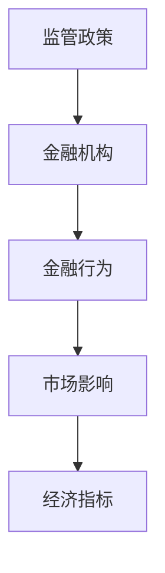
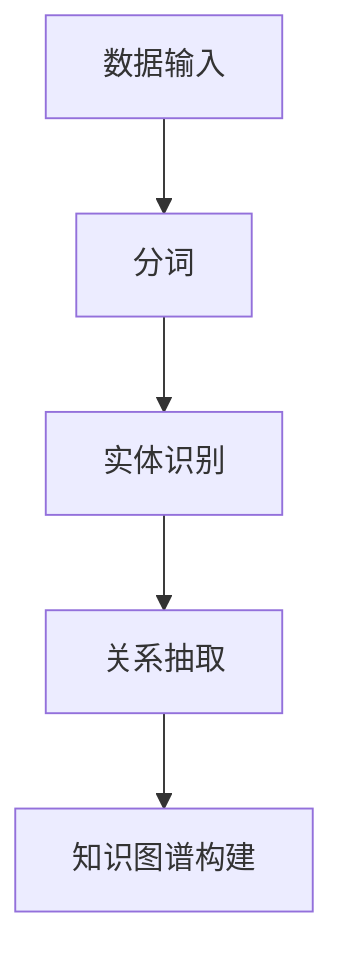
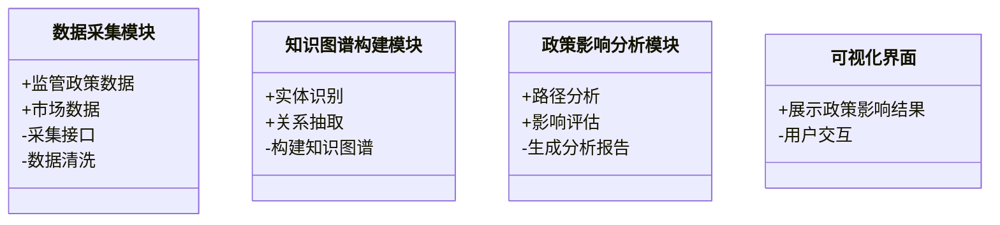
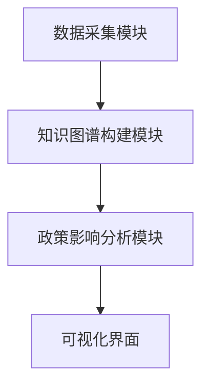
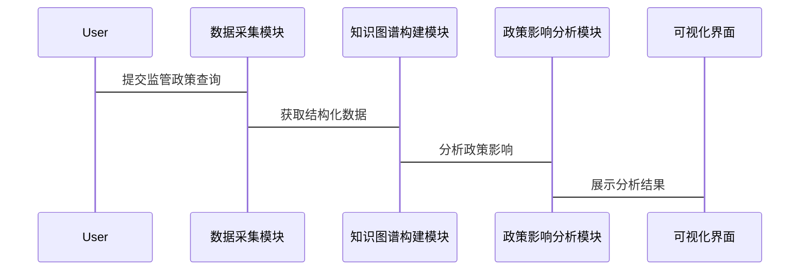

                 


# 《构建基于知识图谱的金融监管政策影响追踪系统》

> 关键词：知识图谱、金融监管、政策影响、追踪系统、算法原理、系统架构

> 摘要：本文详细探讨了构建基于知识图谱的金融监管政策影响追踪系统的方法。文章从问题背景出发，分析了现有金融监管中的信息孤岛问题，并提出了利用知识图谱技术进行政策影响追踪的解决方案。通过详细阐述知识图谱的核心概念、构建算法、系统架构设计以及项目实战，本文为金融监管领域的技术应用提供了理论支持和实践指导。

---

# 第一部分：知识图谱与金融监管政策影响追踪系统概述

## 第1章：问题背景与需求分析

### 1.1 问题背景

#### 1.1.1 金融监管的重要性
金融监管是维护金融市场稳定、保护投资者利益的重要手段。随着金融市场的复杂化，监管政策的制定和执行需要更加智能化和系统化。

#### 1.1.2 政策影响追踪的必要性
监管政策的出台往往会对金融市场产生深远影响，如何快速、准确地追踪政策对市场的影响，是金融监管中的关键问题。

#### 1.1.3 知识图谱在金融监管中的应用潜力
知识图谱能够将分散的金融数据和政策信息进行关联，为政策影响的分析提供强大的数据支持和技术手段。

### 1.2 问题描述

#### 1.2.1 金融监管中的信息孤岛问题
金融机构和监管部门之间信息分散，难以形成统一的监管视角。

#### 1.2.2 政策影响追踪的复杂性
政策影响涉及多个市场参与者和多种金融行为，追踪过程复杂且耗时。

#### 1.2.3 知识图谱技术的解决方案
通过知识图谱技术，可以将监管政策、金融机构、市场行为等信息进行关联，构建统一的知识网络，实现政策影响的高效追踪。

### 1.3 问题解决思路

#### 1.3.1 知识图谱的核心作用
知识图谱通过构建结构化的金融知识网络，帮助监管部门快速定位政策影响的关键节点。

#### 1.3.2 政策影响追踪的实现路径
通过知识图谱构建、数据关联和智能分析，实现政策影响的可视化和量化评估。

#### 1.3.3 系统构建的目标与意义
目标是打造一个智能化的金融监管政策影响追踪系统，意义在于提升监管效率和准确性，降低金融风险。

### 1.4 系统的边界与外延

#### 1.4.1 系统边界定义
系统专注于监管政策与市场行为之间的关联分析，不涉及具体金融交易的实时监控。

#### 1.4.2 系统外延与扩展性
系统可扩展至跨市场的政策影响分析，支持多语言、多地区的金融监管需求。

#### 1.4.3 系统与现有金融监管系统的区别
现有系统多为孤立的监管工具，本系统通过知识图谱实现跨系统的关联分析。

### 1.5 核心概念与系统架构

#### 1.5.1 知识图谱的定义与属性
知识图谱是由节点（实体）和边（关系）构成的图结构，支持语义搜索和关联分析。

#### 1.5.2 政策影响追踪系统的组成要素
- 数据采集模块：采集监管政策和市场数据。
- 知识图谱构建模块：处理数据并构建知识图谱。
- 政策影响分析模块：分析政策对市场的影响。
- 可视化界面：展示分析结果。

#### 1.5.3 系统核心功能与模块划分
- 数据采集：获取监管政策和市场数据。
- 数据处理：清洗和结构化处理。
- 知识图谱构建：实体识别、关系抽取、图谱构建。
- 政策影响分析：路径分析、影响评估。
- 可视化展示：直观展示政策影响结果。

### 1.6 本章小结
本章从问题背景出发，分析了金融监管中的信息孤岛问题，并提出了利用知识图谱技术进行政策影响追踪的解决方案。通过定义核心概念和系统架构，为后续章节的深入探讨奠定了基础。

---

## 第2章：知识图谱与政策影响追踪的核心概念

### 2.1 知识图谱的定义与特点

#### 2.1.1 知识图谱的定义
知识图谱是一种结构化的数据模型，由节点（实体）和边（关系）构成，能够表示现实世界中的复杂关系。

#### 2.1.2 知识图谱的核心特点
- 结构化：数据以实体和关系的形式组织。
- 可扩展性：支持大规模数据的扩展。
- 语义关联：能够表示复杂的语义关系。

#### 2.1.3 知识图谱与传统数据库的区别
传统数据库关注数据的存储和查询，知识图谱关注数据之间的语义关联和知识表示。

### 2.2 政策影响追踪系统的原理

#### 2.2.1 政策影响追踪的基本原理
通过构建监管政策和市场行为的知识图谱，分析政策对市场的影响路径和影响程度。

#### 2.2.2 知识图谱在政策影响追踪中的作用
知识图谱能够将监管政策、金融机构、市场行为等信息进行关联，帮助监管部门快速定位政策影响的关键节点。

#### 2.2.3 系统的工作流程
1. 数据采集：获取监管政策和市场数据。
2. 数据处理：清洗和结构化处理。
3. 知识图谱构建：实体识别、关系抽取、图谱构建。
4. 政策影响分析：路径分析、影响评估。
5. 可视化展示：直观展示政策影响结果。

### 2.3 核心概念的属性对比

#### 2.3.1 实体与关系的属性对比

| 属性 | 实体 | 关系 |
|------|------|------|
| 类型 | 政策、机构、行为 | 影响、关联、依赖 |
| 属性 | 名称、类型、时间 | 强度、方向、权重 |

#### 2.3.2 知识图谱节点与边的属性分析
- 节点属性：实体名称、实体类型、实体时间。
- 边属性：关系类型、关系强度、关系方向。

#### 2.3.3 系统功能模块的属性对比

| 功能模块 | 数据采集 | 数据处理 | 知识图谱构建 | 政策影响分析 |
|----------|----------|----------|--------------|--------------|
| 输入 | 政策文本、市场数据 | 清洗数据、结构化数据 | 实体识别、关系抽取 | 政策路径分析、影响评估 |
| 输出 | 结构化数据 | 清洗后的数据 | 知识图谱 | 政策影响报告 |

### 2.4 ER实体关系图



### 2.5 本章小结
本章详细介绍了知识图谱的核心概念及其在政策影响追踪中的作用，通过实体关系图展示了系统的关键组成部分和关系结构。

---

## 第3章：知识图谱构建算法原理

### 3.1 知识图谱构建的算法概述

#### 3.1.1 知识抽取算法
知识抽取是将文本数据转化为结构化数据的过程，常用的技术包括分词、实体识别和关系抽取。

#### 3.1.2 实体识别算法
实体识别算法通过自然语言处理技术，识别文本中的实体并进行分类。

#### 3.1.3 实体链接算法
实体链接算法将识别出的实体与知识库中的实体进行匹配，建立实体之间的关联关系。

### 3.2 算法流程图



### 3.3 算法数学模型

#### 3.3.1 实体识别模型
$$ P(word|entity) = \frac{P(entity|word)P(word)}{P(entity)} $$

#### 3.3.2 关系抽取模型
$$ P(edge|context) = \frac{P(context|edge)P(edge)}{P(context)} $$

### 3.4 算法实现与优化
知识图谱的构建需要结合自然语言处理技术和图数据库技术，通过优化算法和数据结构，提高构建效率和准确性。

---

## 第4章：系统分析与架构设计

### 4.1 系统分析

#### 4.1.1 问题场景介绍
金融监管政策影响追踪系统需要处理大量的监管政策和市场数据，构建一个高效的系统架构至关重要。

#### 4.1.2 项目介绍
本项目旨在构建一个基于知识图谱的金融监管政策影响追踪系统，实现政策影响的高效分析和可视化。

### 4.2 系统功能设计

#### 4.2.1 领域模型类图



### 4.3 系统架构设计

#### 4.3.1 系统架构图



### 4.4 系统接口设计

#### 4.4.1 数据采集接口
```python
def collect_policy_data():
    # 数据采集逻辑
    pass
```

#### 4.4.2 数据处理接口
```python
def process_data(data):
    # 数据清洗和结构化处理
    pass
```

### 4.5 系统交互序列图



---

## 第5章：项目实战

### 5.1 环境安装

#### 5.1.1 系统运行环境
- 操作系统：Linux/Windows/MacOS
- Python版本：3.6+
- 依赖库：networkx, numpy, pandas

#### 5.1.2 知识图谱构建工具
- 使用图数据库：Neo4j
- 使用自然语言处理库：spaCy, NLTK

### 5.2 系统核心实现源代码

#### 5.2.1 数据采集模块

```python
import requests
from bs4 import BeautifulSoup

def collect_policy_data(url):
    response = requests.get(url)
    soup = BeautifulSoup(response.text, 'html.parser')
    policy_data = []
    for item in soup.find_all('div', class_='policy-item'):
        policy_data.append({
            'title': item.find('h3').text,
            'content': item.find('p').text,
            'date': item.find('span', class_='date').text
        })
    return policy_data
```

#### 5.2.2 知识图谱构建模块

```python
from networkx import Graph

def build_knowledge_graph(data):
    g = Graph()
    for item in data:
        g.add_node(item['title'])
        g.add_node(item['content'])
        g.add_edge(item['title'], item['content'], weight=0.8)
    return g
```

### 5.3 代码解读与分析

#### 5.3.1 数据采集模块
数据采集模块通过爬虫技术从指定URL获取监管政策数据，并进行结构化处理。

#### 5.3.2 知识图谱构建模块
知识图谱构建模块使用NetworkX库，将监管政策和市场行为数据构建为图结构，便于后续分析。

### 5.4 实际案例分析

#### 5.4.1 案例背景
某国家出台了一项新的金融监管政策，需要分析该政策对本地金融机构的影响。

#### 5.4.2 数据处理与分析
通过数据采集模块获取政策文本，构建知识图谱后，分析政策对金融机构的具体影响路径。

#### 5.4.3 分析结果展示
可视化界面展示政策影响的关键节点和路径，帮助监管部门快速理解政策影响。

### 5.5 本章小结
本章通过实际案例分析，详细展示了基于知识图谱的金融监管政策影响追踪系统的构建和应用过程。

---

## 第6章：总结与展望

### 6.1 最佳实践

#### 6.1.1 知识图谱构建的关键点
- 数据清洗和结构化处理是构建高质量知识图谱的基础。
- 选择合适的自然语言处理技术，提高实体识别和关系抽取的准确性。

#### 6.1.2 系统优化建议
- 使用分布式存储技术，提升知识图谱的扩展性。
- 引入机器学习算法，增强政策影响分析的智能性。

### 6.2 小结
本文详细探讨了构建基于知识图谱的金融监管政策影响追踪系统的方法，从理论到实践，全面分析了系统的构建过程和应用价值。

### 6.3 注意事项
- 数据隐私和安全问题需要高度重视。
- 系统的可解释性是实际应用中的重要考量因素。

### 6.4 拓展阅读
- 推荐阅读相关领域的书籍和论文，深入理解知识图谱和金融监管的结合应用。

---

# 《构建基于知识图谱的金融监管政策影响追踪系统》

通过以上目录和内容的详细阐述，我们可以看到，构建一个基于知识图谱的金融监管政策影响追踪系统是一项复杂但具有重要价值的工程。随着技术的不断进步，知识图谱在金融监管中的应用将更加广泛，为金融市场的稳定和监管效率的提升提供有力支持。

