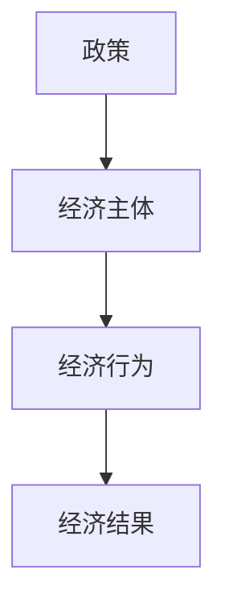
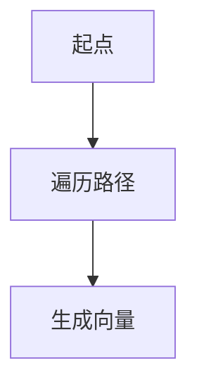
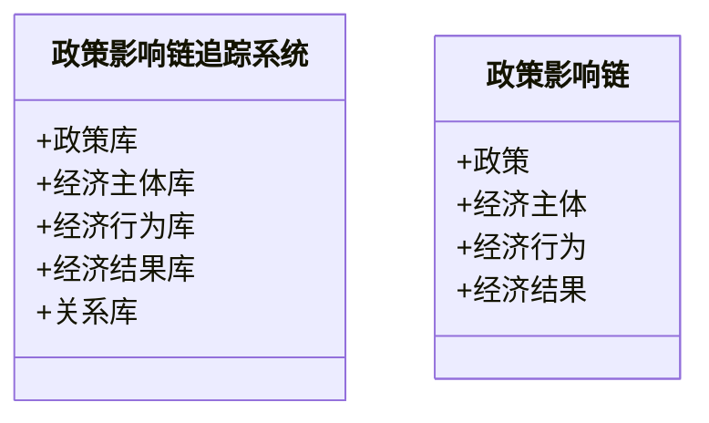
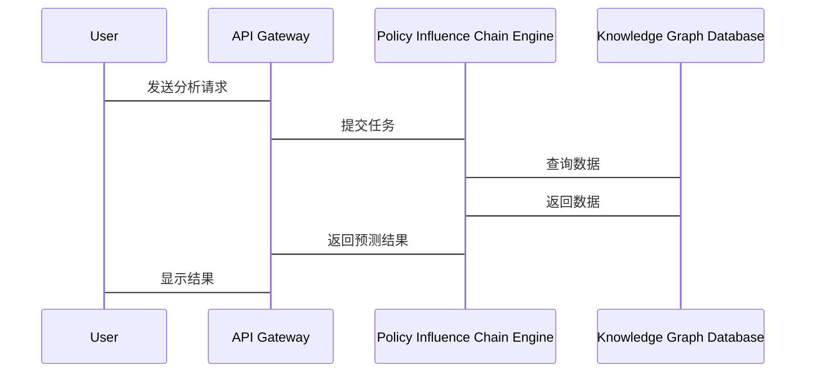

                 


# 构建基于知识图谱的金融监管政策影响链追踪与预测系统

## 关键词：知识图谱，金融监管，政策影响链，AI技术，政策预测

## 摘要：本文将详细介绍如何利用知识图谱技术构建一个能够追踪和预测金融监管政策影响的系统。通过分析政策影响链的结构和特征，结合知识图谱的构建和分析算法，设计并实现一个完整的系统架构，最终达到对金融监管政策的实时追踪和预测。

---

# 第1章: 问题背景与需求分析

## 1.1 问题背景

### 1.1.1 金融监管政策的重要性
金融监管政策是维护金融市场稳定、保护投资者利益的重要手段。随着金融市场的复杂化，政策的制定和执行对经济活动的影响越来越显著。

### 1.1.2 政策影响链的定义与特点
政策影响链是指政策从制定到实施，再到对经济活动产生影响的路径。其特点是多级关联、动态变化和复杂性。

### 1.1.3 知识图谱在政策分析中的优势
知识图谱能够通过结构化的数据表示，帮助我们更好地理解和分析政策与经济活动之间的关系。

## 1.2 问题描述

### 1.2.1 金融监管政策的复杂性
金融监管政策涉及多个领域和参与者，政策之间的相互作用复杂，难以通过传统方法进行分析。

### 1.2.2 政策影响链的多级关联
政策影响链涉及多个层级，从政策制定到具体经济行为，每个环节都可能产生复杂的影响。

### 1.2.3 当前政策分析的局限性
传统政策分析方法缺乏系统性和动态性，难以应对金融市场快速变化的需求。

## 1.3 问题解决思路

### 1.3.1 知识图谱的核心作用
知识图谱能够通过结构化数据和关系分析，帮助我们发现政策与经济活动之间的隐含联系。

### 1.3.2 政策影响链的构建方法
通过知识图谱构建政策影响链，能够实现政策的动态追踪和预测。

### 1.3.3 系统化解决方案的设计
设计一个基于知识图谱的系统，整合政策、经济、市场等多方面的数据，实现政策影响链的系统化分析。

## 1.4 本章小结
本章从金融监管政策的重要性入手，分析了政策影响链的复杂性和当前政策分析的局限性，提出了基于知识图谱的解决方案。

---

# 第2章: 核心概念与联系

## 2.1 知识图谱的定义与特点

### 2.1.1 知识图谱的定义
知识图谱是一种以结构化形式表示知识的网络，通常由实体、关系和属性三部分组成。

### 2.1.2 知识图谱的三元组表示
知识图谱的基本单位是三元组（头实体，关系，尾实体），例如：（中国，首都，北京）。

### 2.1.3 知识图谱的构建流程
知识图谱的构建通常包括数据收集、实体识别、关系抽取和图谱构建等步骤。

## 2.2 政策影响链的构建原理

### 2.2.1 政策影响链的层次结构
政策影响链可以分为政策制定层、政策执行层和政策影响层。

### 2.2.2 政策与经济活动的关联关系
政策通过影响经济主体的行为，进而影响经济结果。

### 2.2.3 政策影响链的动态更新机制
随着政策的调整和经济环境的变化，政策影响链需要实时更新。

## 2.3 知识图谱与政策影响链的结合

### 2.3.1 知识图谱在政策分析中的应用
知识图谱可以帮助我们发现政策之间的关联，以及政策对经济活动的影响路径。

### 2.3.2 政策影响链的图谱表示
将政策影响链表示为知识图谱，可以通过图结构分析其复杂性。

### 2.3.3 知识图谱与影响链的交互关系
知识图谱为政策影响链提供结构化数据支持，政策影响链为知识图谱提供动态更新的机制。

## 2.4 核心概念对比表
| 概念 | 定义 | 属性 | 关系 |
|------|------|------|------|
| 知识图谱 | 表示知识的网络结构 | 三元组、实体、关系 | 实体间的关系 |
| 政策影响链 | 政策对经济活动的影响路径 | 多级关联、动态变化 | 政策-经济活动 |

## 2.5 ER实体关系图


## 2.6 本章小结
本章详细介绍了知识图谱和政策影响链的核心概念，并通过对比表和实体关系图展示了它们的联系。

---

# 第3章: 知识图谱构建与分析算法

## 3.1 知识图谱构建算法

### 3.1.1 基于规则的实体抽取
通过预定义的规则从文本中提取实体，例如使用正则表达式识别人名、地名等。

### 3.1.2 基于机器学习的关系抽取
利用机器学习模型（如卷积神经网络、循环神经网络）从文本中抽取关系。

### 3.1.3 知识图谱的融合与推理
将多个数据源的知识图谱进行融合，并通过推理算法补充新的知识。

## 3.2 政策影响链的图嵌入算法

### 3.2.1 图嵌入的基本原理
图嵌入是将图结构中的节点表示为低维向量，常用算法包括Node2Vec、TransE等。

### 3.2.2 Node2Vec算法流程


### 3.2.3 图嵌入的实现代码
```python
import numpy as np
from sklearn import neighbors

# 示例代码：Node2Vec算法实现
def node2vec(embedding_size, graph):
    model = neighbors.NearestNeighbors(n_neighbors=1, algorithm='ball_tree')
    model.fit(embedding_size)
    return model
```

## 3.3 政策影响链的预测算法

### 3.3.1 基于图神经网络的预测
使用图卷积网络（Graph Convolutional Network, GCN）对政策影响链进行预测。

### 3.3.2 GCN的数学模型
$$
Y = \sigma(A X W + b)
$$
其中，A是邻接矩阵，X是输入特征矩阵，W是权重矩阵，b是偏置，σ是激活函数。

### 3.3.3 GCN的实现代码
```python
import torch
import torch.nn as nn

class GCN(nn.Module):
    def __init__(self, input_dim, hidden_dim, output_dim):
        super(GCN, self).__init__()
        self.W = nn.Parameter(torch.randn(input_dim, hidden_dim))
        self.b = nn.Parameter(torch.randn(hidden_dim))
        self.W2 = nn.Parameter(torch.randn(hidden_dim, output_dim))
        self.b2 = nn.Parameter(torch.randn(output_dim))
    
    def forward(self, A, X):
        # A is adjacency matrix
        # X is input features
        h = torch.mm(X, self.W) + self.b
        h = torch.mm(A, h)
        h = torch.relu(h)
        out = torch.mm(h, self.W2) + self.b2
        return out
```

## 3.4 本章小结
本章介绍了知识图谱的构建算法，特别是图嵌入和图神经网络在政策影响链预测中的应用。

---

# 第4章: 系统分析与架构设计

## 4.1 系统功能设计

### 4.1.1 领域模型设计


### 4.1.2 功能模块划分
系统主要功能包括政策数据采集、知识图谱构建、影响链分析和预测。

## 4.2 系统架构设计

### 4.2.1 总体架构


### 4.2.2 系统组件
- **API Gateway**：接收用户请求，路由到后端服务。
- **Knowledge Graph Database**：存储知识图谱数据。
- **Policy Influence Chain Engine**：负责影响链的分析和预测。
- **Result Display**：展示分析结果。

## 4.3 接口设计

### 4.3.1 RESTful API接口
- GET /policies：获取所有政策
- POST /influence-chain：提交影响链分析任务
- GET /predictions：获取预测结果

## 4.4 系统交互流程

### 4.4.1 用户请求处理流程


## 4.5 本章小结
本章详细设计了系统的功能模块、架构和接口，为后续的开发奠定了基础。

---

# 第5章: 项目实战

## 5.1 环境安装

### 5.1.1 安装Python环境
安装Python 3.8及以上版本，推荐使用Anaconda。

### 5.1.2 安装依赖库
安装必要的Python库，如numpy、pandas、networkx、torch等。

## 5.2 核心代码实现

### 5.2.1 知识图谱构建代码
```python
import networkx as nx

def build_knowledge_graph(data):
    G = nx.Graph()
    for entity in data['entities']:
        G.add_node(entity)
    for relation in data['relations']:
        G.add_edge(relation['head'], relation['tail'], label=relation['type'])
    return G
```

### 5.2.2 政策影响链预测代码
```python
def predict_influence_chain(G, policy):
    # 使用图神经网络模型进行预测
    pass
```

## 5.3 实际案例分析

### 5.3.1 数据来源
使用公开的金融监管政策数据和经济活动数据。

### 5.3.2 数据预处理
对数据进行清洗、标准化处理，构建结构化的知识图谱。

### 5.3.3 案例分析
以某项具体政策为例，展示知识图谱构建和影响链预测的全过程。

## 5.4 本章小结
本章通过实际案例展示了系统的构建和应用过程，验证了系统的可行性和有效性。

---

# 第6章: 应用案例与总结

## 6.1 应用案例分析

### 6.1.1 案例背景
以某项金融监管政策为例，分析其对经济活动的影响。

### 6.1.2 数据准备
收集政策文本、经济主体数据等。

### 6.1.3 知识图谱构建
构建包含政策、经济主体、经济行为的知识图谱。

### 6.1.4 影响链预测
使用图神经网络模型预测政策的影响路径和结果。

## 6.2 系统优势与不足

### 6.2.1 系统优势
- 结构化数据处理能力强
- 可视化分析直观
- 动态更新能力强

### 6.2.2 系统不足
- 数据依赖性高
- 计算资源消耗大
- 需要大量人工标注

## 6.3 未来展望

### 6.3.1 技术改进方向
- 提高模型的预测精度
- 优化系统的计算效率
- 增强系统的可解释性

### 6.3.2 应用场景扩展
- 拓展到更多金融领域
- 应用于其他政策分析领域
- 支持多语言分析

## 6.4 本章小结
本章通过实际案例展示了系统的应用，并总结了系统的优势与不足，提出了未来改进的方向。

---

# 第7章: 最佳实践与注意事项

## 7.1 最佳实践

### 7.1.1 数据质量的重要性
确保数据的准确性和完整性。

### 7.1.2 系统性能优化
合理选择算法和优化代码，提高系统的运行效率。

### 7.1.3 可视化工具的使用
利用可视化工具帮助用户更好地理解和分析数据。

## 7.2 注意事项

### 7.2.1 数据隐私保护
确保数据的安全性和隐私性。

### 7.2.2 系统稳定性
保证系统的稳定运行，避免因故障导致数据丢失。

### 7.2.3 技术团队协作
加强团队协作，确保系统的顺利开发和维护。

## 7.3 本章小结
本章总结了在构建基于知识图谱的金融监管政策影响链追踪与预测系统时的一些最佳实践和注意事项。

---

# 附录: 参考文献

## 附录A: 相关论文
1. 《Knowledge Graphs: Concepts, Methods and Applications》
2. 《Graph Neural Networks: A Review of Recent Advances and Applications》

## 附录B: 开源工具
1. NetworkX：https://networkx.github.io/
2. PyTorch：https://pytorch.org/

---

# 结语
通过本篇文章的详细讲解，我们了解了如何利用知识图谱技术构建一个基于知识图谱的金融监管政策影响链追踪与预测系统。希望本文对读者在相关领域的研究和实践有所帮助。

--- 

# END

