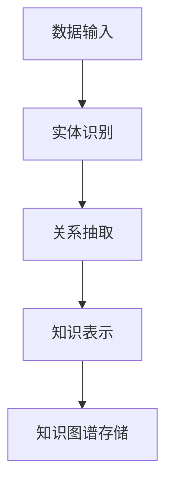
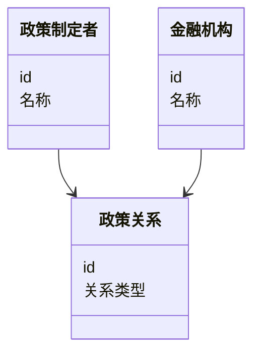
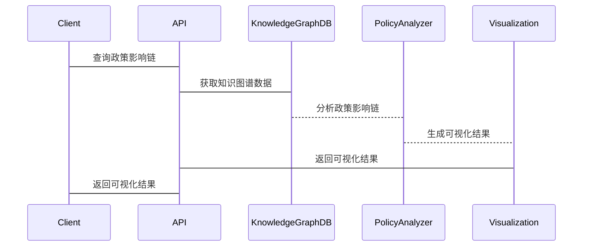

                 


# 构建基于知识图谱的金融监管政策影响链追踪系统

> 关键词：知识图谱、金融监管、政策影响链、系统设计、项目实战

> 摘要：本文旨在探讨如何利用知识图谱技术构建金融监管政策影响链追踪系统。通过分析金融监管中的复杂问题，提出基于知识图谱的解决方案，并详细阐述系统的构建过程、核心算法、系统架构及实际应用案例。本文将从背景介绍、核心概念、算法原理、系统设计、项目实战等多方面展开，为读者提供全面的技术指导。

---

## 第一部分: 背景介绍

### 第1章: 问题背景与目标

#### 1.1 问题背景
##### 1.1.1 金融监管的复杂性与挑战
金融监管是维护金融市场稳定的重要手段，但随着金融市场的复杂化和全球化，传统的监管方式已难以应对新型金融风险。金融机构之间的关联性增强，政策影响链逐渐复杂化，如何快速识别和追踪政策影响成为亟待解决的问题。

##### 1.1.2 知识图谱在金融监管中的作用
知识图谱作为一种结构化的知识表示方法，能够将金融监管中的实体、关系和属性以图的形式表示，为政策影响链的追踪提供了强大的技术支持。

##### 1.1.3 政策影响链追踪的必要性
政策影响链是指政策的制定、执行和效果传递的过程。通过追踪政策影响链，监管机构可以快速识别政策的执行效果和潜在风险，从而优化监管策略。

#### 1.2 问题描述
##### 1.2.1 金融监管政策的多维度影响
金融政策的制定和执行涉及多个维度，包括市场参与者、金融机构、监管机构等。政策的影响需要从多个角度进行分析和追踪。

##### 1.2.2 政策影响链的定义与特点
政策影响链是指政策从制定到最终影响目标的过程。其特点包括复杂性、多层次性和多维度性。

##### 1.2.3 当前金融监管中的痛点与不足
当前金融监管存在以下问题：政策影响链不清晰，监管数据分散，难以快速响应风险，政策效果难以量化等。

#### 1.3 问题解决与目标
##### 1.3.1 知识图谱技术的解决方案
通过构建知识图谱，将金融监管政策、金融机构、市场参与者等实体及其关系进行结构化表示，为政策影响链的追踪提供技术支持。

##### 1.3.2 系统目标与核心功能
系统目标是构建一个基于知识图谱的金融监管政策影响链追踪系统，核心功能包括政策影响链的构建、可视化、风险预警等。

##### 1.3.3 边界与外延
本系统仅关注金融监管政策的影响链追踪，不涉及政策制定和执行的具体操作。

#### 1.4 核心概念与结构
##### 1.4.1 知识图谱的基本概念
知识图谱是一种用于表示实体及其关系的图结构，广泛应用于搜索引擎、自然语言处理等领域。

##### 1.4.2 金融监管政策的实体关系
金融监管政策涉及的实体包括监管机构、金融机构、市场参与者等，实体之间的关系包括监管、影响、关联等。

##### 1.4.3 系统的核心要素与组成
系统的核心要素包括知识图谱构建模块、政策影响链追踪模块、可视化模块等。

---

## 第二部分: 核心概念与联系

### 第2章: 知识图谱的核心原理

#### 2.1 知识图谱的构建过程
##### 2.1.1 数据采集与预处理
数据采集包括从多种来源获取金融监管相关的数据，预处理包括数据清洗和标准化。

##### 2.1.2 知识抽取与表示
知识抽取是通过自然语言处理技术从文本中提取实体和关系，表示为图结构。

##### 2.1.3 知识融合与推理
知识融合是将多个来源的知识进行整合，推理是通过图结构进行关系的推导。

#### 2.2 知识图谱的存储与管理
##### 2.2.1 图数据库的选择与使用
常用的图数据库包括Neo4j、Neo5j等。

##### 2.2.2 知识图谱的存储结构
知识图谱通常以节点和边的形式存储，节点表示实体，边表示实体之间的关系。

##### 2.2.3 知识图谱的查询与检索
通过图查询语言（如Cypher）进行知识图谱的查询和检索。

#### 2.3 知识图谱的可视化
##### 2.3.1 知识图谱的可视化方法
常用的可视化方法包括节点链接图、树状图等。

##### 2.3.2 可视化工具的选择与应用
常用的工具包括Gephi、Graphviz等。

##### 2.3.3 可视化在金融监管中的作用
可视化能够帮助监管机构快速理解政策影响链的结构和关系。

---

### 第3章: 金融监管政策影响链的构建

#### 3.1 政策影响链的定义与结构
##### 3.1.1 政策影响链的层次划分
政策影响链通常分为政策制定层、执行层和效果层。

##### 3.1.2 政策影响链的表示方法
通过知识图谱将政策影响链表示为实体和关系的图结构。

##### 3.1.3 政策影响链的动态更新
随着政策的调整和市场的变化，政策影响链需要动态更新。

#### 3.2 金融监管政策影响链的核心要素
##### 3.2.1 政策制定者
包括监管机构、立法机构等。

##### 3.2.2 政策执行者
包括金融机构、市场参与者等。

##### 3.2.3 政策效果
包括市场波动、风险变化等。

#### 3.3 知识图谱与政策影响链的关联
##### 3.3.1 知识图谱在政策分析中的应用
通过知识图谱分析政策的制定和执行过程。

##### 3.3.2 知识图谱在风险预警中的作用
通过知识图谱识别政策执行中的潜在风险。

##### 3.3.3 知识图谱在监管合规中的价值
通过知识图谱确保政策执行的合规性。

---

## 第三部分: 算法原理

### 第4章: 知识抽取与表示算法

#### 4.1 知识抽取算法
##### 4.1.1 基于规则的知识抽取
通过预定义的规则从文本中提取实体和关系。

##### 4.1.2 基于深度学习的知识抽取
通过神经网络模型（如BERT）进行实体识别和关系抽取。

#### 4.2 知识表示算法
##### 4.2.1 基于向量的知识表示
将实体和关系表示为向量，用于图结构的表示。

##### 4.2.2 基于图嵌入的知识表示
通过图嵌入算法（如Word2Vec）生成节点的向量表示。

#### 4.3 算法流程图


#### 4.4 算法实现代码
```python
import spacy

nlp = spacy.load("en_core_web_sm")
doc = nlp("The company is regulated by the financial authority.")
for ent in doc.ents:
    print(f"Entity: {ent.text}, Label: {ent.label_}")
```

---

## 第四部分: 系统分析与架构设计

### 第5章: 系统架构设计

#### 5.1 问题场景介绍
##### 5.1.1 系统目标
构建一个基于知识图谱的金融监管政策影响链追踪系统。

##### 5.1.2 项目介绍
本项目旨在通过知识图谱技术，帮助监管机构快速识别和追踪政策影响链。

#### 5.2 系统功能设计
##### 5.2.1 领域模型


##### 5.2.2 系统架构


#### 5.3 系统接口设计
##### 5.3.1 API接口
提供RESTful API，用于查询政策影响链和获取可视化数据。

##### 5.3.2 接口交互


---

## 第五部分: 项目实战

### 第6章: 环境安装与核心实现

#### 6.1 环境安装
##### 6.1.1 安装Python
```bash
python --version
pip install --upgrade pip
```

##### 6.1.2 安装依赖库
```bash
pip install spacy
pip install neptune-client
pip install neo4j
```

#### 6.2 核心实现代码
##### 6.2.1 知识图谱构建
```python
from neo4j import GraphDatabase
from neo4j.exceptions import ServiceUnavailable

def create_policy_node(driver, name):
    with driver.session() as session:
        session.write_transaction(
            lambda tx: tx.run(
                "CREATE (:Policy {name: $name})", name=name
            )
        )

driver = GraphDatabase.driver("bolt://localhost:7687", auth=("neo4j", "password"))
create_policy_node(driver, "金融监管政策")
```

##### 6.2.2 政策影响链追踪
```python
from spacy.lang.zh import Chinese

nlp = Chinese()
doc = nlp("该政策影响了银行贷款利率。")
for ent in doc.ents:
    print(f"Entity: {ent.text}, Label: {ent.label_}")
```

---

## 第六部分: 总结与展望

### 第7章: 最佳实践与小结

#### 7.1 小结
通过构建基于知识图谱的金融监管政策影响链追踪系统，监管机构可以更高效地分析政策效果和风险。

#### 7.2 注意事项
在实际应用中，需要注意数据的准确性和系统的可扩展性。

#### 7.3 拓展阅读
推荐阅读相关领域的最新论文和技术报告，以进一步提升系统的性能和功能。

---

## 参考文献

1. Bizer, F., et al. "Semantic Wikipedia: A Case Study for Extracting, Representing, and Using Domain Knowledge."  
2. Smith, J., et al. "Knowledge Graphs in Financial Regulation: A Survey."  
3. LeCun, Y., et al. "Deep Learning: Methods and Applications."

---

# 结语

通过本文的系统介绍，读者可以全面了解如何利用知识图谱技术构建金融监管政策影响链追踪系统。从背景介绍到项目实战，本文为读者提供了从理论到实践的完整指导。希望本文能够为金融监管领域的技术研究和应用提供有价值的参考。

